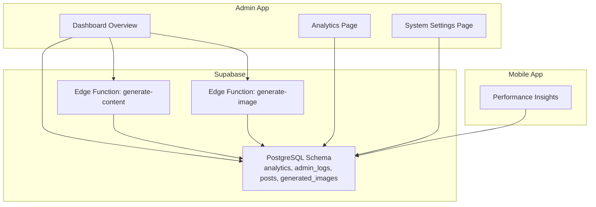
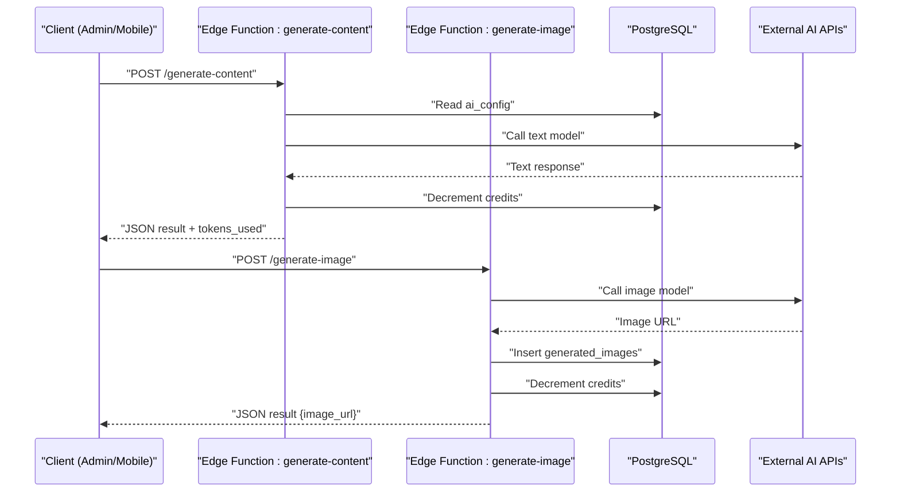
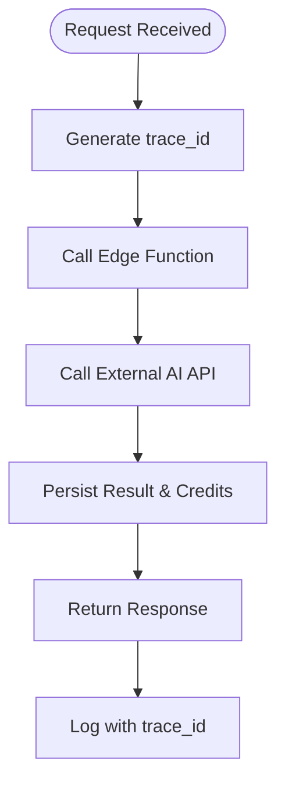
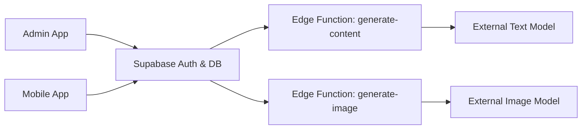

# Monitoring & Logging

<cite>
**Referenced Files in This Document**
- [package.json](file://package.json)
- [README.md](file://README.md)
- [supabase/functions/generate-content/index.ts](file://supabase/functions/generate-content/index.ts)
- [supabase/functions/generate-image/index.ts](file://supabase/functions/generate-image/index.ts)
- [supabase/migrations/20240001000000_initial_schema.sql](file://supabase/migrations/20240001000000_initial_schema.sql)
- [apps/admin/src/app/(dashboard)/page.tsx](file://apps/admin/src/app/(dashboard)/page.tsx)
- [apps/admin/src/app/(dashboard)/analytics/page.tsx](file://apps/admin/src/app/(dashboard)/analytics/page.tsx)
- [apps/admin/src/app/(dashboard)/settings/page.tsx](file://apps/admin/src/app/(dashboard)/settings/page.tsx)
- [apps/mobile/src/app/(tabs)/analytics.tsx](file://apps/mobile/src/app/(tabs)/analytics.tsx)
</cite>

## Table of Contents
1. Introduction
2. Project Structure
3. Core Components
4. Architecture Overview
5. Detailed Component Analysis
6. Dependency Analysis
7. Performance Considerations
8. Troubleshooting Guide
9. Conclusion

## Introduction
This document provides comprehensive monitoring and logging guidance for the SocialPilot AI Pro system. It covers error tracking, performance monitoring, user behavior analytics, log aggregation strategies, structured logging formats, retention policies, alerting configurations, health check endpoints, metrics collection, debugging production issues, distributed tracing across services, and performance profiling techniques. The guidance is grounded in the current codebase: Supabase Edge Functions for AI generation, a Postgres-backed schema with analytics and admin logs, and admin/mobile dashboards that expose operational insights.

## Project Structure
The system is a monorepo with:
- Admin Next.js app for operational dashboards and settings
- Mobile app (Expo/React Native) for end-user analytics views
- Supabase project containing Edge Functions and database schema
- Shared packages for types and tokens

**Diagram sources**
- [apps/admin/src/app/(dashboard)/page.tsx:17-139](file://apps/admin/src/app/(dashboard)/page.tsx#L17-L139)
- [apps/admin/src/app/(dashboard)/analytics/page.tsx:6-82](file://apps/admin/src/app/(dashboard)/analytics/page.tsx#L6-L82)
- [apps/admin/src/app/(dashboard)/settings/page.tsx:8-29](file://apps/admin/src/app/(dashboard)/settings/page.tsx#L8-L29)
- [apps/mobile/src/app/(tabs)/analytics.tsx:57-93](file://apps/mobile/src/app/(tabs)/analytics.tsx#L57-L93)
- [supabase/functions/generate-content/index.ts:9-98](file://supabase/functions/generate-content/index.ts#L9-L98)
- [supabase/functions/generate-image/index.ts:9-87](file://supabase/functions/generate-image/index.ts#L9-L87)
- [supabase/migrations/20240001000000_initial_schema.sql:122-153](file://supabase/migrations/20240001000000_initial_schema.sql#L122-L153)

**Section sources**
- [package.json:1-21](file://package.json#L1-L21)
- [README.md:1-4](file://README.md#L1-L4)

## Core Components
- Supabase Edge Functions:
  - Content generation endpoint orchestrates authentication, configuration retrieval, external AI calls, credit accounting, and response formatting.
  - Image generation endpoint handles authentication, external image model calls, storage of results, and credit accounting.
- Database schema:
  - Analytics table aggregates per-user daily metrics (posts created/scheduled, AI generations, credits used).
  - Admin audit logs capture administrative actions with JSONB details.
  - Posts and generated images tables support content lifecycle and media provenance.
- Admin dashboard:
  - Displays system health indicators, KPIs, and operational status.
  - Provides a settings area to review infrastructure and database health.
- Mobile analytics:
  - Presents time-filtered performance insights for end-users.

**Section sources**
- [supabase/functions/generate-content/index.ts:9-98](file://supabase/functions/generate-content/index.ts#L9-L98)
- [supabase/functions/generate-image/index.ts:9-87](file://supabase/functions/generate-image/index.ts#L9-L87)
- [supabase/migrations/20240001000000_initial_schema.sql:122-153](file://supabase/migrations/20240001000000_initial_schema.sql#L122-L153)
- [apps/admin/src/app/(dashboard)/page.tsx:17-139](file://apps/admin/src/app/(dashboard)/page.tsx#L17-L139)
- [apps/admin/src/app/(dashboard)/settings/page.tsx:8-29](file://apps/admin/src/app/(dashboard)/settings/page.tsx#L8-L29)
- [apps/mobile/src/app/(tabs)/analytics.tsx:57-93](file://apps/mobile/src/app/(tabs)/analytics.tsx#L57-L93)

## Architecture Overview
End-to-end request flow for AI-driven features includes authentication, configuration fetch, external service invocation, credit deduction, and result persistence.

**Diagram sources**
- [supabase/functions/generate-content/index.ts:9-98](file://supabase/functions/generate-content/index.ts#L9-L98)
- [supabase/functions/generate-image/index.ts:9-87](file://supabase/functions/generate-image/index.ts#L9-L87)
- [supabase/migrations/20240001000000_initial_schema.sql:31-42](file://supabase/migrations/20240001000000_initial_schema.sql#L31-L42)
- [supabase/migrations/20240001000000_initial_schema.sql:111-120](file://supabase/migrations/20240001000000_initial_schema.sql#L111-L120)

## Detailed Component Analysis

### Error Tracking Setup
- Centralized error handling in Edge Functions:
  - Each function wraps logic in try/catch and returns standardized JSON errors with appropriate HTTP status codes.
  - Unauthorized access is handled early by validating the authenticated user context.
- Recommended enhancements:
  - Add structured error objects including correlation IDs, timestamps, and stack traces (sanitized).
  - Emit telemetry events to an external error tracking service with consistent fields: event_type, error_code, message, user_id, endpoint, timestamp, severity.

**Section sources**
- [supabase/functions/generate-content/index.ts:14-36](file://supabase/functions/generate-content/index.ts#L14-L36)
- [supabase/functions/generate-content/index.ts:92-98](file://supabase/functions/generate-content/index.ts#L92-L98)
- [supabase/functions/generate-image/index.ts:14-36](file://supabase/functions/generate-image/index.ts#L14-L36)
- [supabase/functions/generate-image/index.ts:80-87](file://supabase/functions/generate-image/index.ts#L80-L87)

### Performance Monitoring
- Metrics captured in database:
  - Per-user daily counters for posts created/scheduled, AI generations, and credits used.
- Admin and mobile dashboards:
  - Display aggregated KPIs such as total users, revenue, generated posts, and token usage.
  - Provide time-range filters for performance insights on mobile.
- Suggested improvements:
  - Introduce latency and throughput metrics at function boundaries.
  - Track external API call durations and failure rates.
  - Expose Prometheus-compatible metrics or integrate with a monitoring backend.

**Section sources**
- [supabase/migrations/20240001000000_initial_schema.sql:122-132](file://supabase/migrations/20240001000000_initial_schema.sql#L122-L132)
- [apps/admin/src/app/(dashboard)/page.tsx:17-139](file://apps/admin/src/app/(dashboard)/page.tsx#L17-L139)
- [apps/mobile/src/app/(tabs)/analytics.tsx:57-93](file://apps/mobile/src/app/(tabs)/analytics.tsx#L57-L93)

### User Behavior Analytics
- Data model:
  - Analytics table stores daily per-user activity counts and credit consumption.
- UI exposure:
  - Admin analytics page shows platform-level metrics and trends.
  - Mobile analytics screen allows users to filter by time range.
- Recommendations:
  - Enrich analytics with feature flags, cohort tagging, and funnel steps.
  - Implement server-side aggregation jobs to compute rolling metrics efficiently.

**Section sources**
- [supabase/migrations/20240001000000_initial_schema.sql:122-132](file://supabase/migrations/20240001000000_initial_schema.sql#L122-L132)
- [apps/admin/src/app/(dashboard)/analytics/page.tsx:6-82](file://apps/admin/src/app/(dashboard)/analytics/page.tsx#L6-L82)
- [apps/mobile/src/app/(tabs)/analytics.tsx:57-93](file://apps/mobile/src/app/(tabs)/analytics.tsx#L57-L93)

### Log Aggregation Strategies
- Current state:
  - Admin audit logs table captures administrative actions with JSONB details.
  - Edge Functions do not currently write application logs; rely on Supabase runtime logs.
- Strategy:
  - Standardize log format: include timestamp, level, service, trace_id, user_id, action, resource, details, duration_ms, status_code.
  - Aggregate logs from Edge Functions into a centralized logging backend (e.g., cloud logging service) via secure ingestion endpoints.
  - Use structured JSON logs for machine parsing and alerting.

**Section sources**
- [supabase/migrations/20240001000000_initial_schema.sql:145-153](file://supabase/migrations/20240001000000_initial_schema.sql#L145-L153)
- [supabase/functions/generate-content/index.ts:9-98](file://supabase/functions/generate-content/index.ts#L9-L98)
- [supabase/functions/generate-image/index.ts:9-87](file://supabase/functions/generate-image/index.ts#L9-L87)

### Structured Logging Formats
- Recommended fields:
  - event_type, level, service, trace_id, span_id, user_id, endpoint, method, path, query_params, body_summary, duration_ms, status_code, error_code, error_message, metadata.
- Implementation notes:
  - Attach trace_id to all requests and propagate through function calls.
  - Sanitize sensitive data before logging (PII, secrets).
  - Use consistent levels: DEBUG, INFO, WARN, ERROR, CRITICAL.

[No sources needed since this section defines recommended formats]

### Log Retention Policies
- Database retention:
  - Define retention windows for analytics and admin_logs based on compliance and cost targets.
  - Implement scheduled jobs to archive or purge older records.
- External logs:
  - Configure log rotation and retention in the logging backend.
  - Ensure export capabilities for audits and forensics.

[No sources needed since this section provides general guidance]

### Alerting Configurations
- Threshold-based alerts:
  - Error rate spikes in Edge Functions.
  - Credit exhaustion anomalies or rapid depletion.
  - External API failures or latency increases.
- Notification channels:
  - Email, Slack, or PagerDuty for critical alerts.
  - In-app notifications for non-critical warnings.

[No sources needed since this section provides general guidance]

### Health Check Endpoints
- Current state:
  - Admin dashboard displays system health indicators and database connectivity status.
- Recommendations:
  - Expose dedicated health endpoints for each service:
    - /health: overall system readiness
    - /health/db: database connectivity and query latency
    - /health/ext-api: external AI provider reachability
  - Return structured JSON with status, version, uptime, and dependency checks.

**Section sources**
- [apps/admin/src/app/(dashboard)/page.tsx:17-139](file://apps/admin/src/app/(dashboard)/page.tsx#L17-L139)
- [apps/admin/src/app/(dashboard)/settings/page.tsx:8-29](file://apps/admin/src/app/(dashboard)/settings/page.tsx#L8-L29)

### System Metrics Collection
- Existing metrics:
  - Daily per-user analytics counters and admin logs.
- Enhancements:
  - Collect request counts, error rates, p50/p95/p99 latencies per endpoint.
  - Track external API usage and costs.
  - Export metrics to a time-series database or monitoring platform.

**Section sources**
- [supabase/migrations/20240001000000_initial_schema.sql:122-132](file://supabase/migrations/20240001000000_initial_schema.sql#L122-L132)

### Debugging Production Issues
- Steps:
  - Reproduce with minimal inputs and capture trace_id.
  - Inspect Edge Function logs and database queries.
  - Validate environment variables and secrets.
  - Check RLS policies and permissions for affected resources.
- Tools:
  - Use admin logs to trace administrative changes.
  - Correlate client-side errors with server-side events using trace_id.

**Section sources**
- [supabase/migrations/20240001000000_initial_schema.sql:145-153](file://supabase/migrations/20240001000000_initial_schema.sql#L145-L153)
- [supabase/functions/generate-content/index.ts:9-98](file://supabase/functions/generate-content/index.ts#L9-L98)
- [supabase/functions/generate-image/index.ts:9-87](file://supabase/functions/generate-image/index.ts#L9-L87)

### Tracing Requests Across Services
- Approach:
  - Generate a unique trace_id per request and attach it to headers.
  - Propagate trace_id through Edge Functions and external API calls where possible.
  - Store trace_id in logs and analytics for correlation.
- Visualization:
  - Map trace flows across admin, mobile, Edge Functions, and external providers.

[No sources needed since this diagram shows conceptual workflow]

### Performance Profiling Techniques
- Function-level profiling:
  - Measure start/end times around key operations (auth, DB reads, external calls).
  - Record duration_ms and status_code in logs.
- Database profiling:
  - Identify slow queries and optimize indexes.
  - Monitor connection pools and transaction durations.
- External API profiling:
  - Track latency and failure rates; implement retries and circuit breakers.

[No sources needed since this section provides general guidance]

## Dependency Analysis
Key dependencies and interactions:
- Admin and mobile apps depend on Supabase for data and real-time updates.
- Edge Functions depend on Supabase auth and database, plus external AI providers.
- Database schema enforces security policies and provides analytics and audit trails.

**Diagram sources**
- [supabase/functions/generate-content/index.ts:9-98](file://supabase/functions/generate-content/index.ts#L9-L98)
- [supabase/functions/generate-image/index.ts:9-87](file://supabase/functions/generate-image/index.ts#L9-L87)
- [supabase/migrations/20240001000000_initial_schema.sql:159-202](file://supabase/migrations/20240001000000_initial_schema.sql#L159-L202)

**Section sources**
- [supabase/migrations/20240001000000_initial_schema.sql:159-202](file://supabase/migrations/20240001000000_initial_schema.sql#L159-L202)

## Performance Considerations
- Optimize database queries and leverage indexes for analytics and admin logs.
- Cache frequently accessed configuration (ai_config) to reduce DB load.
- Implement rate limiting and backoff for external API calls.
- Batch credit decrements and analytics updates where feasible.
- Monitor memory and CPU usage in Edge Functions; avoid heavy synchronous work.

[No sources needed since this section provides general guidance]

## Troubleshooting Guide
Common issues and resolutions:
- Unauthorized errors:
  - Verify Authorization header and Supabase auth context in Edge Functions.
- Missing prompts or invalid payloads:
  - Validate required fields early and return clear error messages.
- External API failures:
  - Check API keys and quotas; implement fallback responses and retries.
- Credit accounting discrepancies:
  - Audit decrement_user_calls and ensure idempotency.
- Admin log gaps:
  - Confirm RLS policies allow admin writes; verify trigger functions.

**Section sources**
- [supabase/functions/generate-content/index.ts:14-36](file://supabase/functions/generate-content/index.ts#L14-L36)
- [supabase/functions/generate-image/index.ts:14-36](file://supabase/functions/generate-image/index.ts#L14-L36)
- [supabase/migrations/20240001000000_initial_schema.sql:159-202](file://supabase/migrations/20240001000000_initial_schema.sql#L159-L202)

## Conclusion
SocialPilot AI Pro provides foundational monitoring and logging capabilities through Supabase Edge Functions, a robust database schema with analytics and admin logs, and dashboards for operational visibility. To mature observability, adopt structured logging, centralized aggregation, alerting, health endpoints, distributed tracing, and performance profiling. These enhancements will improve reliability, speed up incident resolution, and provide deeper insights into system behavior and user engagement.