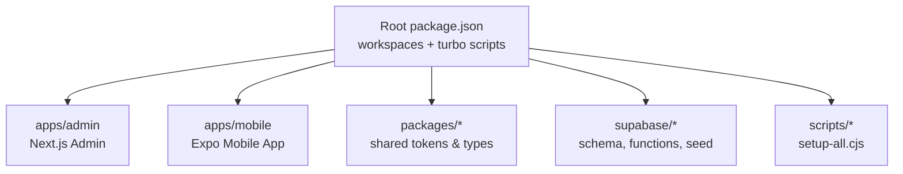
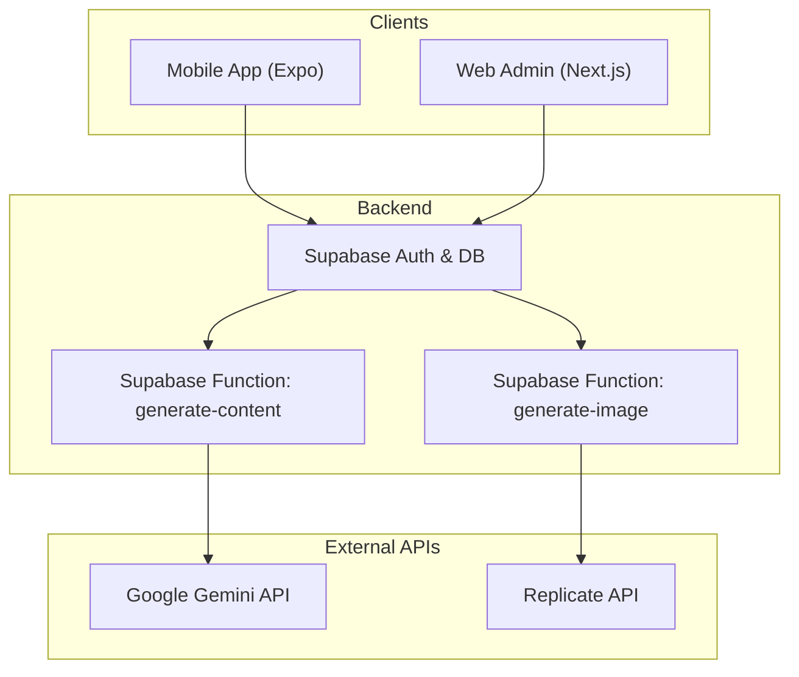
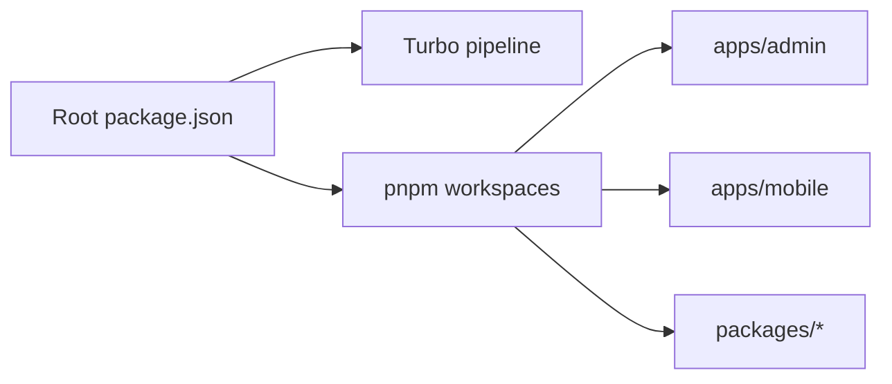

# Getting Started

<cite>
**Referenced Files in This Document**
- [README.md](file://README.md)
- [INSTALLATION.md](file://INSTALLATION.md)
- [package.json](file://package.json)
- [pnpm-workspace.yaml](file://pnpm-workspace.yaml)
- [turbo.json](file://turbo.json)
- [scripts/setup-all.cjs](file://scripts/setup-all.cjs)
- [apps/admin/package.json](file://apps/admin/package.json)
- [apps/mobile/package.json](file://apps/mobile/package.json)
- [apps/admin/.env.example](file://apps/admin/.env.example)
- [apps/mobile/.env.example](file://apps/mobile/.env.example)
- [supabase/migrations/20240001000000_initial_schema.sql](file://supabase/migrations/20240001000000_initial_schema.sql)
- [TROUBLESHOOTING.md](file://TROUBLESHOOTING.md)
- [ADMIN_GUIDE.md](file://ADMIN_GUIDE.md)
</cite>

## Table of Contents
1. Introduction
2. Project Structure
3. Core Components
4. Architecture Overview
5. Detailed Component Analysis
6. Dependency Analysis
7. Performance Considerations
8. Troubleshooting Guide
9. Conclusion
10. Appendices

## Introduction
SocialPilot AI Pro is an AI-powered social media management suite delivered as a monorepo with a mobile app and a web admin dashboard. This guide helps you set up the environment, configure Supabase, run both apps, and verify everything works end-to-end. It also explains how to configure AI providers (Google Gemini and Replicate) via the admin dashboard and database configuration.

## Project Structure
This project uses a pnpm workspace with Turborepo orchestration:
- apps/admin: Next.js-based web admin dashboard
- apps/mobile: Expo-based mobile application
- packages: Shared tokens and types used by both apps
- supabase: Database schema, migrations, and functions for AI integrations
- scripts: Automated setup helper

**Diagram sources**
- [package.json:1-21](file://package.json#L1-L21)
- [pnpm-workspace.yaml:1-4](file://pnpm-workspace.yaml#L1-L4)
- [turbo.json:1-26](file://turbo.json#L1-L26)

**Section sources**
- [package.json:1-21](file://package.json#L1-L21)
- [pnpm-workspace.yaml:1-4](file://pnpm-workspace.yaml#L1-L4)
- [turbo.json:1-26](file://turbo.json#L1-L26)

## Core Components
- Monorepo root: Defines workspaces and shared scripts for build, dev, lint, and clean across apps.
- Admin dashboard: Next.js app running on port 3001; integrates with Supabase and exposes admin features including AI settings and white-labeling.
- Mobile app: Expo app using Supabase client; supports Android/iOS/web development workflows.
- Supabase layer: Provides auth, database, RLS policies, realtime subscriptions, and serverless functions for AI content generation.

Key responsibilities:
- Environment variables connect each app to your Supabase project.
- Database migrations create tables, roles, and security policies.
- Admin dashboard configures AI providers and branding at runtime.

**Section sources**
- [apps/admin/package.json:1-41](file://apps/admin/package.json#L1-L41)
- [apps/mobile/package.json:1-53](file://apps/mobile/package.json#L1-L53)
- [supabase/migrations/20240001000000_initial_schema.sql:1-232](file://supabase/migrations/20240001000000_initial_schema.sql#L1-L232)

## Architecture Overview
High-level flow from clients to backend services:

**Diagram sources**
- [apps/mobile/package.json:1-53](file://apps/mobile/package.json#L1-L53)
- [apps/admin/package.json:1-41](file://apps/admin/package.json#L1-L41)
- [supabase/migrations/20240001000000_initial_schema.sql:31-42](file://supabase/migrations/20240001000000_initial_schema.sql#L31-L42)

## Detailed Component Analysis

### Prerequisites and One-Command Setup
- Install Node.js (v18+ or v20+) and pnpm globally.
- Create a Supabase account and project.
- Run the automated setup script from the repository root to scaffold environment files and install dependencies.

Expected outputs:
- Confirmation that Node.js is detected
- Generated starter .env files for mobile and admin
- Workspace dependencies installed via pnpm

Commands:
- From repository root: node scripts/setup-all.cjs

Verification:
- Confirm apps/mobile/.env and apps/admin/.env.local exist after setup.

**Section sources**
- [INSTALLATION.md:7-18](file://INSTALLATION.md#L7-L18)
- [scripts/setup-all.cjs:11-53](file://scripts/setup-all.cjs#L11-L53)

### Database Setup and Migrations
- In Supabase SQL Editor, run the initial schema migration to create tables, enums, RLS policies, triggers, and realtime publications.
- Optionally run the seed file to populate default data.

What this creates:
- Tables for profiles, posts, folders, templates, analytics, notifications, generated images, app_config, ai_config, admin_logs
- Row Level Security policies for safe access
- Trigger to auto-create user profiles on signup
- Realtime publications for live updates

Commands:
- Open Supabase SQL Editor and execute the migration file.
- Execute the seed file if provided.

**Section sources**
- [INSTALLATION.md:22-30](file://INSTALLATION.md#L22-L30)
- [supabase/migrations/20240001000000_initial_schema.sql:1-232](file://supabase/migrations/20240001000000_initial_schema.sql#L1-L232)

### Environment Configuration
Set environment variables for both apps to connect to your Supabase project.

Mobile app (.env):
- EXPO_PUBLIC_SUPABASE_URL
- EXPO_PUBLIC_SUPABASE_ANON_KEY
- EXPO_PUBLIC_APP_NAME

Admin dashboard (.env.local):
- NEXT_PUBLIC_SUPABASE_URL
- NEXT_PUBLIC_SUPABASE_ANON_KEY

Where to find values:
- Supabase Project Settings → API → copy Project URL and anon/public key.

Notes:
- The setup script will generate starter env files if missing; edit them with your actual values.

**Section sources**
- [INSTALLATION.md:33-46](file://INSTALLATION.md#L33-L46)
- [apps/mobile/.env.example:1-4](file://apps/mobile/.env.example#L1-L4)
- [apps/admin/.env.example:1-3](file://apps/admin/.env.example#L1-L3)
- [scripts/setup-all.cjs:21-44](file://scripts/setup-all.cjs#L21-L44)

### Running the Applications
- Mobile app:
  - Navigate to apps/mobile and run the Android build or start Expo for preview.
  - Use Expo Go on your device for quick previews.

- Web admin:
  - Start the Next.js admin dashboard on port 3001.
  - Open http://localhost:3001/login in your browser.

Commands:
- Mobile: cd apps/mobile and run the appropriate command for your platform.
- Admin: pnpm --filter @socialpilot/admin dev

Expected results:
- Mobile app launches on device/emulator or Expo QR code appears.
- Admin dashboard starts and serves at http://localhost:3001/login.

**Section sources**
- [INSTALLATION.md:50-63](file://INSTALLATION.md#L50-L63)
- [apps/mobile/package.json:5-12](file://apps/mobile/package.json#L5-L12)
- [apps/admin/package.json:5-9](file://apps/admin/package.json#L5-L9)
- [package.json:9-15](file://package.json#L9-L15)

### First-Time Admin Account Creation
- Register a new account via the mobile app or Supabase Auth.
- In Supabase Table Editor under profiles, change your role to super_admin.
- Log in to the admin dashboard with those credentials.

Expected result:
- Access to admin features such as white-labeling, AI settings, users, and notifications.

**Section sources**
- [INSTALLATION.md:67-71](file://INSTALLATION.md#L67-L71)

### Configuring AI Providers (Google Gemini and Replicate)
The admin dashboard includes an AI settings page where you can configure:
- Text provider and model (e.g., Google Gemini)
- Image provider and model (e.g., Replicate)
- System prompts and generation parameters

These settings are stored in the ai_config table and consumed by Supabase functions to call external APIs.

Steps:
- Log in to the admin dashboard.
- Navigate to AI settings and update provider keys and models as needed.
- Save changes; they apply immediately to content/image generation.

Note: Ensure your Supabase functions have the necessary secrets configured in the Supabase dashboard for external API calls.

**Section sources**
- [ADMIN_GUIDE.md:14-18](file://ADMIN_GUIDE.md#L14-L18)
- [supabase/migrations/20240001000000_initial_schema.sql:31-42](file://supabase/migrations/20240001000000_initial_schema.sql#L31-L42)

### Verifying Everything Works
- Mobile app:
  - Sign in and confirm you can view your profile and perform basic actions.
  - If using Expo Go, ensure the QR code loads and the app connects to Supabase.

- Admin dashboard:
  - Log in with your super_admin account.
  - Check AI settings and white-label sections load without errors.
  - Verify realtime updates by changing colors or toggling feature flags.

- Database:
  - Confirm tables exist and RLS policies are active.
  - Ensure realtime publications include required tables.

**Section sources**
- [INSTALLATION.md:50-71](file://INSTALLATION.md#L50-L71)
- [supabase/migrations/20240001000000_initial_schema.sql:155-232](file://supabase/migrations/20240001000000_initial_schema.sql#L155-L232)

## Dependency Analysis
Workspace and tooling relationships:
- Root package.json defines workspaces and Turbo scripts.
- pnpm-workspace.yaml declares apps and packages directories.
- turbo.json configures pipeline tasks like build, lint, and dev.

**Diagram sources**
- [package.json:1-21](file://package.json#L1-L21)
- [pnpm-workspace.yaml:1-4](file://pnpm-workspace.yaml#L1-L4)
- [turbo.json:1-26](file://turbo.json#L1-L26)

**Section sources**
- [package.json:1-21](file://package.json#L1-L21)
- [pnpm-workspace.yaml:1-4](file://pnpm-workspace.yaml#L1-L4)
- [turbo.json:1-26](file://turbo.json#L1-L26)

## Performance Considerations
- Use pnpm from the repository root to leverage workspace hoisting and avoid module resolution issues.
- Keep environment variables minimal and secure; do not commit secrets.
- For faster local development, run only the apps you need (mobile or admin).
- Leverage Supabase realtime for live UI updates instead of polling.

[No sources needed since this section provides general guidance]

## Troubleshooting Guide
Common issues and resolutions:
- Module resolution errors in monorepo:
  - Ensure you run pnpm install from the root folder so workspace linking resolves correctly.

- Supabase queries return empty arrays or permission denied:
  - Confirm the initial schema migration has been executed to apply RLS policies.

- Admin login says “Access Denied”:
  - Update your user’s role to super_admin or admin in the profiles table.

- Realtime theme colors not updating on mobile:
  - Ensure realtime replication is enabled for relevant tables in Supabase.

Additional tips:
- If the mobile app cannot connect to Supabase, double-check environment variables and network connectivity.
- If the admin dashboard fails to start, verify Node version compatibility and that ports are available.

**Section sources**
- [TROUBLESHOOTING.md:3-24](file://TROUBLESHOOTING.md#L3-L24)
- [INSTALLATION.md:22-30](file://INSTALLATION.md#L22-L30)

## Conclusion
You now have the essentials to set up SocialPilot AI Pro, configure Supabase, run both the mobile app and admin dashboard, and manage AI providers through the admin interface. Follow the verification steps to confirm your setup, and refer to troubleshooting if you encounter common issues.

[No sources needed since this section summarizes without analyzing specific files]

## Appendices

### Quick Commands Reference
- Automated setup: node scripts/setup-all.cjs
- Mobile app: cd apps/mobile and run your preferred command (Android, iOS, or web)
- Admin dashboard: pnpm --filter @socialpilot/admin dev
- Open admin login: http://localhost:3001/login

**Section sources**
- [INSTALLATION.md:14-63](file://INSTALLATION.md#L14-L63)
- [apps/mobile/package.json:5-12](file://apps/mobile/package.json#L5-L12)
- [apps/admin/package.json:5-9](file://apps/admin/package.json#L5-L9)