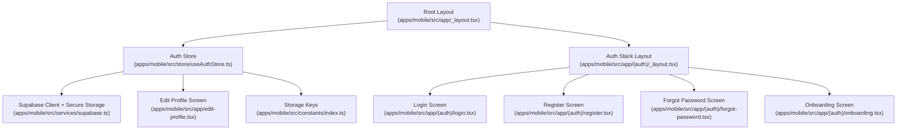
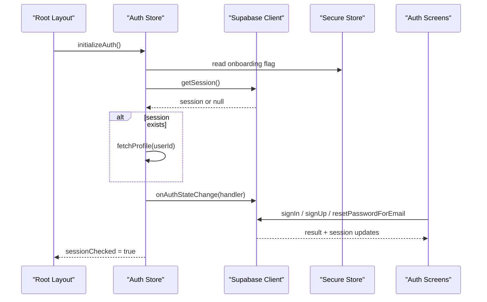
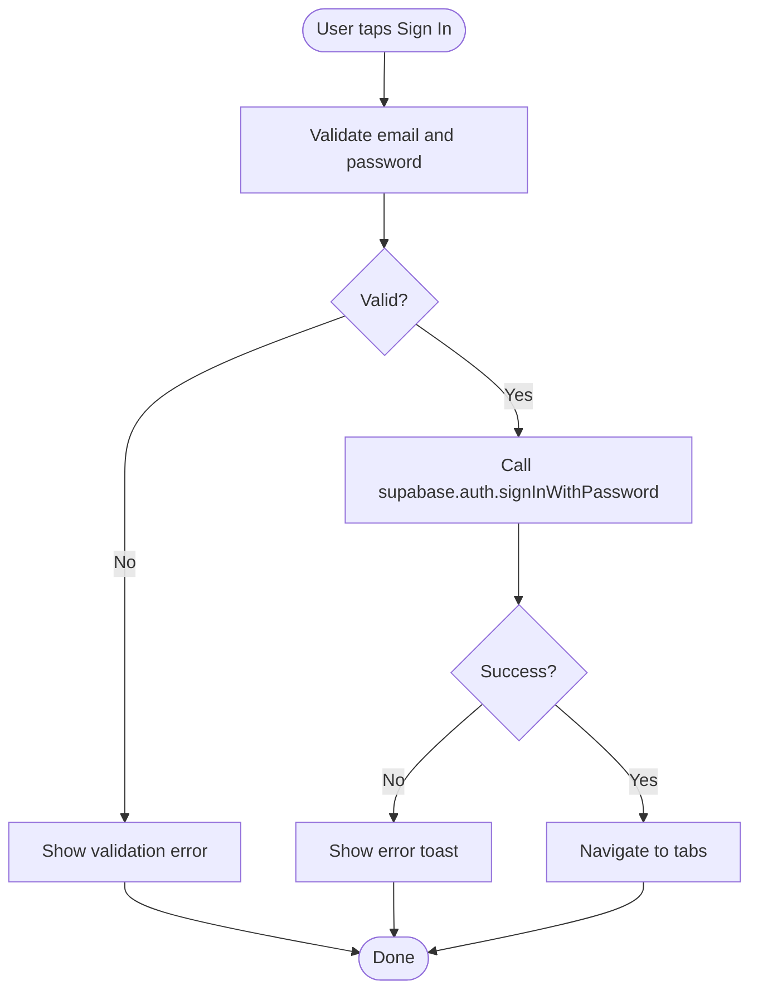
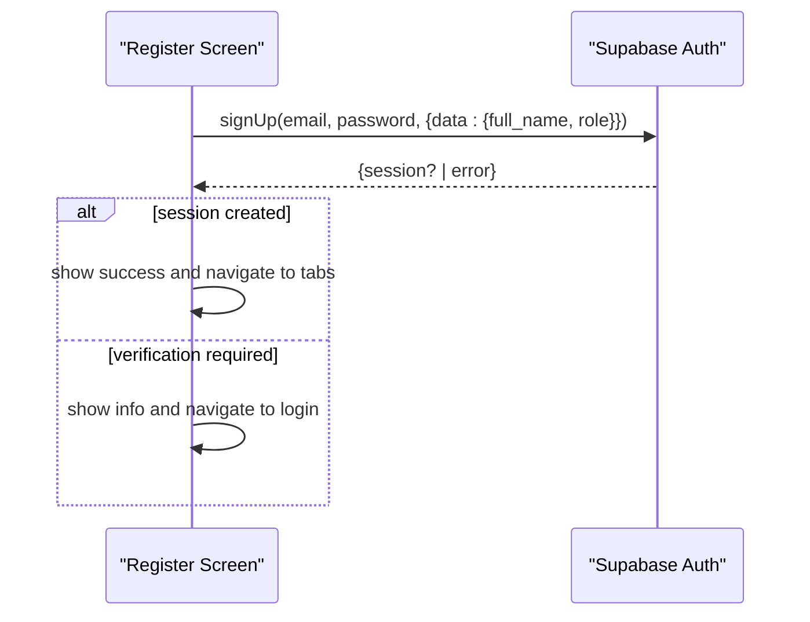
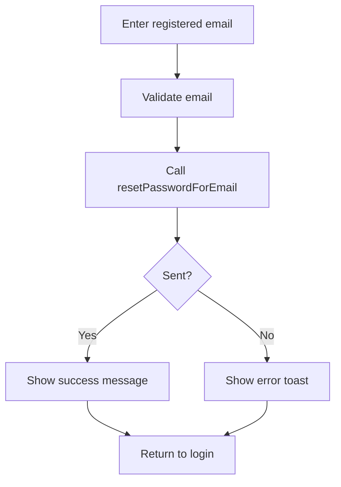
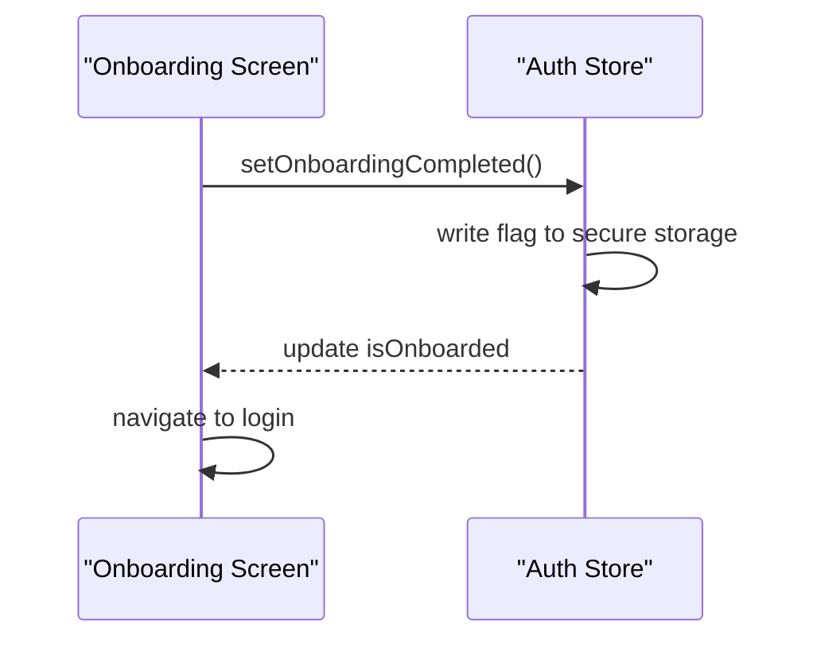
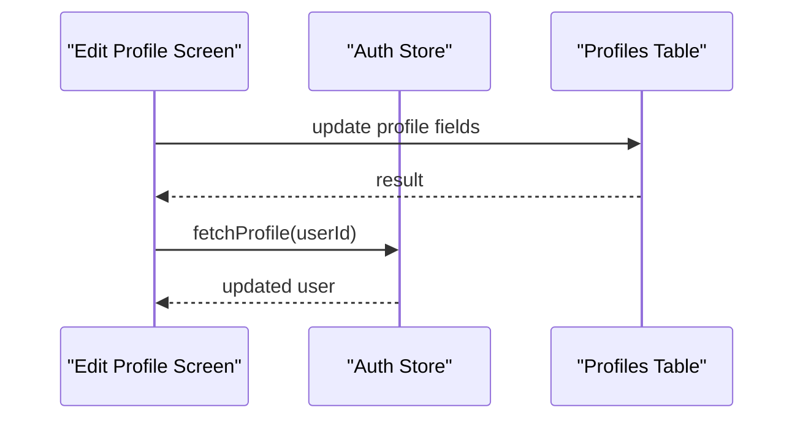
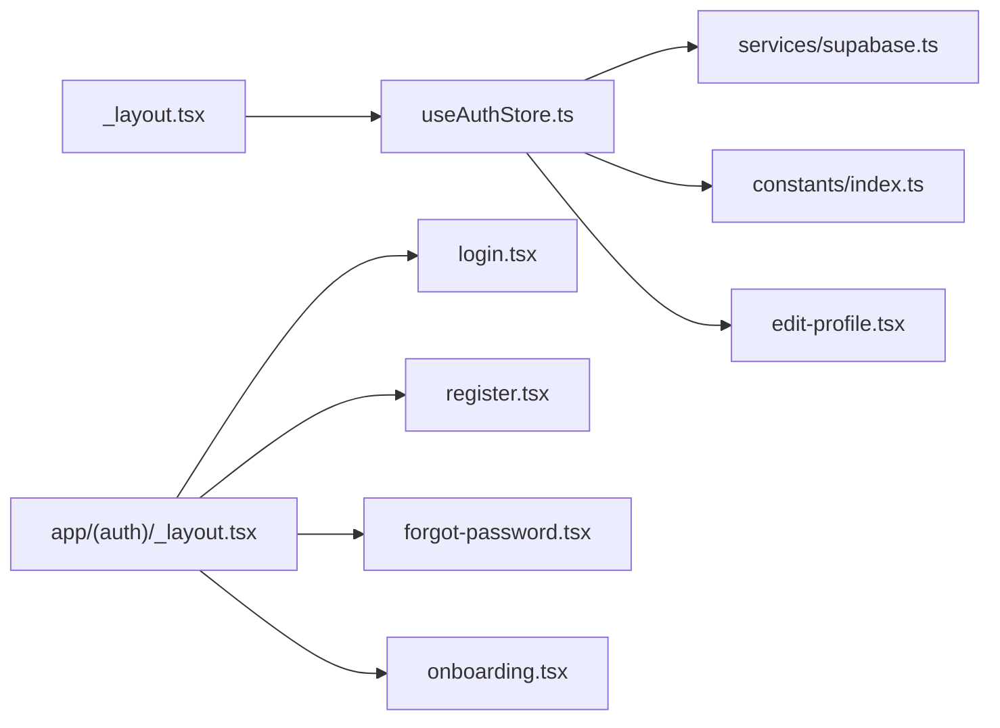

# Authentication & Security

<cite>
**Referenced Files in This Document**
- [supabase.ts](file://apps/mobile/src/services/supabase.ts)
- [useAuthStore.ts](file://apps/mobile/src/store/useAuthStore.ts)
- [login.tsx](file://apps/mobile/src/app/(auth)/login.tsx)
- [register.tsx](file://apps/mobile/src/app/(auth)/register.tsx)
- [forgot-password.tsx](file://apps/mobile/src/app/(auth)/forgot-password.tsx)
- [onboarding.tsx](file://apps/mobile/src/app/(auth)/onboarding.tsx)
- [_layout.tsx](file://apps/mobile/src/app/_layout.tsx)
- [_layout.tsx](file://apps/mobile/src/app/(auth)/_layout.tsx)
- [edit-profile.tsx](file://apps/mobile/src/app/edit-profile.tsx)
- [index.ts](file://apps/mobile/src/constants/index.ts)
</cite>

## Table of Contents
1. Introduction
2. Project Structure
3. Core Components
4. Architecture Overview
5. Detailed Component Analysis
6. Dependency Analysis
7. Performance Considerations
8. Troubleshooting Guide
9. Conclusion
10. Appendices

## Introduction
This document explains the mobile application’s authentication system integrated with Supabase Auth. It covers user registration, login, password recovery, session management, onboarding, profile updates, and security practices for mobile apps. It also outlines where to implement role-based access control, secure token storage using expo-secure-store, and guards for protected routes.

## Project Structure
The authentication logic is primarily implemented in the mobile app:
- Supabase client configuration and secure storage adapter
- Global auth state and lifecycle management
- Auth screens (login, register, forgot password, onboarding)
- Root layout that initializes auth and config at startup
- Profile editing screen that persists user data

**Diagram sources**
- [_layout.tsx:57-72](file://apps/mobile/src/app/_layout.tsx#L57-L72)
- [useAuthStore.ts:24-57](file://apps/mobile/src/store/useAuthStore.ts#L24-L57)
- [supabase.ts:1-41](file://apps/mobile/src/services/supabase.ts#L1-L41)
- [_layout.tsx:5-20](file://apps/mobile/src/app/(auth)/_layout.tsx#L5-L20)
- [login.tsx:76-142](file://apps/mobile/src/app/(auth)/login.tsx#L76-L142)
- [register.tsx:29-92](file://apps/mobile/src/app/(auth)/register.tsx#L29-L92)
- [forgot-password.tsx:28-61](file://apps/mobile/src/app/(auth)/forgot-password.tsx#L28-L61)
- [onboarding.tsx:65-76](file://apps/mobile/src/app/(auth)/onboarding.tsx#L65-L76)
- [edit-profile.tsx:37-74](file://apps/mobile/src/app/edit-profile.tsx#L37-L74)
- [index.ts:15-20](file://apps/mobile/src/constants/index.ts#L15-L20)

**Section sources**
- [_layout.tsx:57-72](file://apps/mobile/src/app/_layout.tsx#L57-L72)
- [_layout.tsx:5-20](file://apps/mobile/src/app/(auth)/_layout.tsx#L5-L20)

## Core Components
- Supabase client with secure storage: Configures Supabase JS client with a custom storage adapter that uses expo-secure-store on native platforms and localStorage on web. Enables auto-refresh tokens and session persistence.
- Auth store: Initializes auth state, loads onboarding flag from secure storage, fetches current session and user profile, subscribes to auth state changes, and provides sign-out.
- Auth screens: Provide UI and flows for login, registration, password reset, and onboarding completion.
- Root layout: Bootstraps auth initialization and config fetching at app start.

Key responsibilities:
- Secure token storage via expo-secure-store
- Session persistence across app restarts
- Onboarding completion tracking
- User profile retrieval and updates

**Section sources**
- [supabase.ts:1-41](file://apps/mobile/src/services/supabase.ts#L1-L41)
- [useAuthStore.ts:1-90](file://apps/mobile/src/store/useAuthStore.ts#L1-L90)
- [_layout.tsx:57-72](file://apps/mobile/src/app/_layout.tsx#L57-L72)

## Architecture Overview
The authentication flow integrates Expo Router groups, Supabase Auth, and a Zustand store for global state. The root layout initializes auth and config; the auth group contains screens for onboarding, login, register, and password recovery.

**Diagram sources**
- [_layout.tsx:57-72](file://apps/mobile/src/app/_layout.tsx#L57-L72)
- [useAuthStore.ts:24-57](file://apps/mobile/src/store/useAuthStore.ts#L24-L57)
- [supabase.ts:33-40](file://apps/mobile/src/services/supabase.ts#L33-L40)
- [login.tsx:107-136](file://apps/mobile/src/app/(auth)/login.tsx#L107-L136)
- [register.tsx:49-82](file://apps/mobile/src/app/(auth)/register.tsx#L49-L82)
- [forgot-password.tsx:41-55](file://apps/mobile/src/app/(auth)/forgot-password.tsx#L41-L55)

## Detailed Component Analysis

### Supabase Client and Secure Storage
- Implements a cross-platform storage adapter that delegates to expo-secure-store on native and localStorage on web.
- Enables auto-refresh-token and persist-session to maintain authenticated state across app launches.
- Exposes a supabase instance and an environment flag to bypass network calls during development.

Security notes:
- Tokens are stored in platform-secure storage on mobile, reducing risk of extraction.
- Auto-refresh reduces manual re-authentication while keeping sessions valid.

**Section sources**
- [supabase.ts:1-41](file://apps/mobile/src/services/supabase.ts#L1-L41)

### Auth Store (Global State and Lifecycle)
Responsibilities:
- Reads onboarding completion flag from secure storage.
- Retrieves current session and loads user profile if present.
- Subscribes to auth state changes to keep UI in sync.
- Provides sign-out and sets user to null.

Complexity:
- Profile fetch is O(1) per user id with single-row query.
- Auth state subscription is event-driven and efficient.

Error handling:
- Gracefully handles placeholder environments and errors by marking session checked and stopping loading states.

**Section sources**
- [useAuthStore.ts:24-89](file://apps/mobile/src/store/useAuthStore.ts#L24-L89)
- [index.ts:15-20](file://apps/mobile/src/constants/index.ts#L15-L20)

### Login Flow
- Validates inputs with schema validation.
- Calls sign-in with email/password.
- On success, navigates to the main tabs; on failure, shows error toast.
- Supports placeholder mode for offline development.

**Diagram sources**
- [login.tsx:76-142](file://apps/mobile/src/app/(auth)/login.tsx#L76-L142)

**Section sources**
- [login.tsx:76-142](file://apps/mobile/src/app/(auth)/login.tsx#L76-L142)

### Registration Flow
- Validates full name, email, and password.
- Creates account with metadata including role.
- Handles verification-required scenarios and navigates accordingly.

**Diagram sources**
- [register.tsx:29-92](file://apps/mobile/src/app/(auth)/register.tsx#L29-L92)

**Section sources**
- [register.tsx:29-92](file://apps/mobile/src/app/(auth)/register.tsx#L29-L92)

### Password Recovery Flow
- Validates email format.
- Sends password reset email via Supabase.
- Shows success state and returns to login.

**Diagram sources**
- [forgot-password.tsx:28-61](file://apps/mobile/src/app/(auth)/forgot-password.tsx#L28-L61)

**Section sources**
- [forgot-password.tsx:28-61](file://apps/mobile/src/app/(auth)/forgot-password.tsx#L28-L61)

### Onboarding Flow
- Presents feature slides and tracks progress.
- Marks onboarding completed in secure storage.
- Navigates to login after completion.

**Diagram sources**
- [onboarding.tsx:65-76](file://apps/mobile/src/app/(auth)/onboarding.tsx#L65-L76)
- [useAuthStore.ts:63-66](file://apps/mobile/src/store/useAuthStore.ts#L63-L66)

**Section sources**
- [onboarding.tsx:65-76](file://apps/mobile/src/app/(auth)/onboarding.tsx#L65-L76)
- [useAuthStore.ts:63-66](file://apps/mobile/src/store/useAuthStore.ts#L63-L66)

### Profile Management
- Allows updating display fields such as full name and avatar URL.
- Persists changes to the profiles table and refreshes local state.

**Diagram sources**
- [edit-profile.tsx:37-74](file://apps/mobile/src/app/edit-profile.tsx#L37-L74)

**Section sources**
- [edit-profile.tsx:37-74](file://apps/mobile/src/app/edit-profile.tsx#L37-L74)

### Role-Based Access Control (RBAC)
Current implementation:
- Stores a role field in user metadata during registration.
- Does not enforce RBAC on the client side yet.

Recommended approach:
- Enforce roles server-side using Supabase Row Level Security policies on tables and functions.
- On the client, read the user’s role from the profile and gate features/routes accordingly.
- Use middleware or route guards to redirect unauthorized users.

[No sources needed since this section proposes future enhancements]

### Authentication Guards for Protected Routes
Current implementation:
- The root layout initializes auth but does not guard routes based on session state.
- Auth screens are grouped under (auth), while main content resides under (tabs).

Recommended approach:
- Add a navigation guard in the root layout or a wrapper component that checks session before rendering protected routes.
- Redirect unauthenticated users to the login screen and authenticated users to the dashboard.

[No sources needed since this section proposes future enhancements]

### Social Authentication
Current implementation:
- Not implemented in the provided files.

Recommended approach:
- Configure social providers in Supabase Dashboard.
- Use supabase.auth.signInWithOAuth({ provider }) from the login or a dedicated social button.
- Handle callback URLs and post-login redirects appropriately for mobile.

[No sources needed since this section proposes future enhancements]

### Multi-Factor Authentication (MFA)
Current implementation:
- Not implemented in the provided files.

Recommended approach:
- Enable MFA in Supabase and prompt users to enroll via SMS or TOTP when accessing sensitive areas.
- Use Supabase Auth methods to challenge and verify MFA during login or privileged actions.

[No sources needed since this section proposes future enhancements]

### Logout Flow
- The store provides a sign-out method that clears the session and resets user state.
- After sign-out, clients should navigate back to the login screen.

**Section sources**
- [useAuthStore.ts:83-89](file://apps/mobile/src/store/useAuthStore.ts#L83-L89)

## Dependency Analysis

**Diagram sources**
- [_layout.tsx:57-72](file://apps/mobile/src/app/_layout.tsx#L57-L72)
- [useAuthStore.ts:1-90](file://apps/mobile/src/store/useAuthStore.ts#L1-L90)
- [supabase.ts:1-41](file://apps/mobile/src/services/supabase.ts#L1-L41)
- [index.ts:15-20](file://apps/mobile/src/constants/index.ts#L15-L20)
- [_layout.tsx:5-20](file://apps/mobile/src/app/(auth)/_layout.tsx#L5-L20)
- [login.tsx:76-142](file://apps/mobile/src/app/(auth)/login.tsx#L76-L142)
- [register.tsx:29-92](file://apps/mobile/src/app/(auth)/register.tsx#L29-L92)
- [forgot-password.tsx:28-61](file://apps/mobile/src/app/(auth)/forgot-password.tsx#L28-L61)
- [onboarding.tsx:65-76](file://apps/mobile/src/app/(auth)/onboarding.tsx#L65-L76)
- [edit-profile.tsx:37-74](file://apps/mobile/src/app/edit-profile.tsx#L37-L74)

**Section sources**
- [_layout.tsx:57-72](file://apps/mobile/src/app/_layout.tsx#L57-L72)
- [useAuthStore.ts:1-90](file://apps/mobile/src/store/useAuthStore.ts#L1-L90)

## Performance Considerations
- Prefer lazy-loading auth-dependent screens until session is resolved.
- Cache user profile locally after first fetch to reduce network calls.
- Debounce rapid UI interactions during auth operations to avoid duplicate requests.
- Use Supabase’s auto-refresh token to minimize re-authentication overhead.

[No sources needed since this section provides general guidance]

## Troubleshooting Guide
Common issues and resolutions:
- Placeholder environment: When using placeholder Supabase URLs, network calls are bypassed to speed up development. Ensure real credentials are configured for production.
- Network errors: If the backend is unreachable, show a connection error toast and retry later.
- Verification required: After signup without immediate session, guide users to check email and then log in.
- Profile updates fail: Validate inputs and handle errors gracefully; refresh profile after successful update.

**Section sources**
- [supabase.ts:28-40](file://apps/mobile/src/services/supabase.ts#L28-L40)
- [login.tsx:107-136](file://apps/mobile/src/app/(auth)/login.tsx#L107-L136)
- [register.tsx:49-82](file://apps/mobile/src/app/(auth)/register.tsx#L49-L82)
- [forgot-password.tsx:41-55](file://apps/mobile/src/app/(auth)/forgot-password.tsx#L41-L55)
- [edit-profile.tsx:37-74](file://apps/mobile/src/app/edit-profile.tsx#L37-L74)

## Conclusion
The mobile app implements a robust authentication foundation using Supabase Auth with secure token storage via expo-secure-store. It supports login, registration, password recovery, and onboarding completion. To fully secure the app, add client-side route guards, enforce server-side RBAC with Supabase RLS, and consider adding social login and multi-factor authentication as needed.

[No sources needed since this section summarizes without analyzing specific files]

## Appendices

### Security Best Practices for Mobile Apps
- Always use HTTPS and validate certificates.
- Store secrets securely; never hardcode keys in source code.
- Use platform secure storage for tokens and sensitive data.
- Implement timeouts and retries for network calls.
- Log minimal, non-sensitive diagnostics for debugging.

[No sources needed since this section provides general guidance]