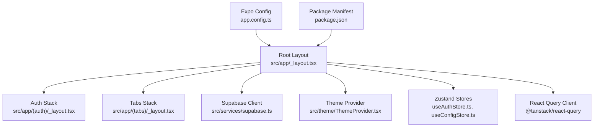
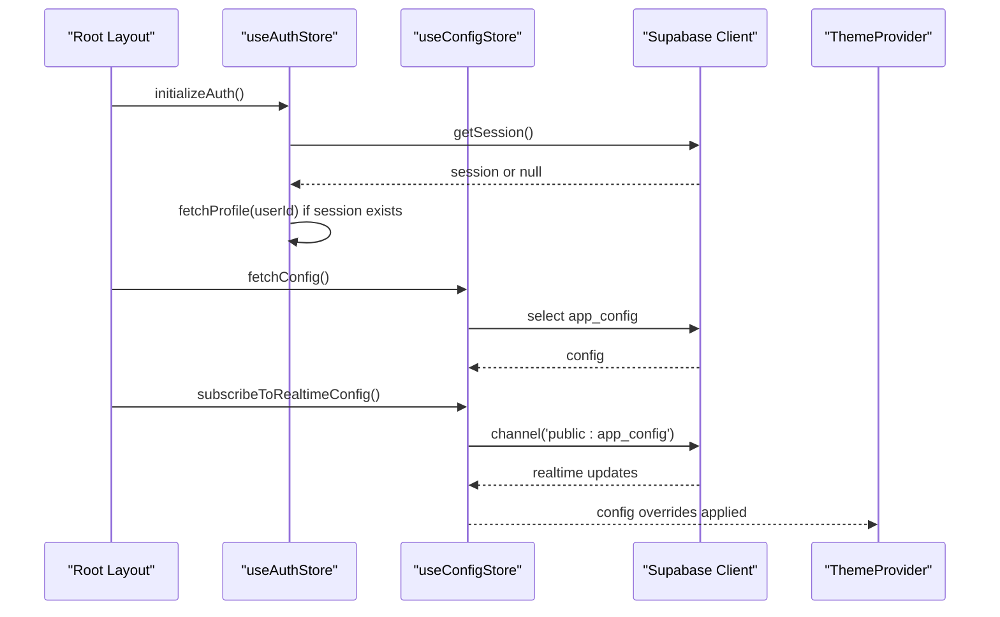
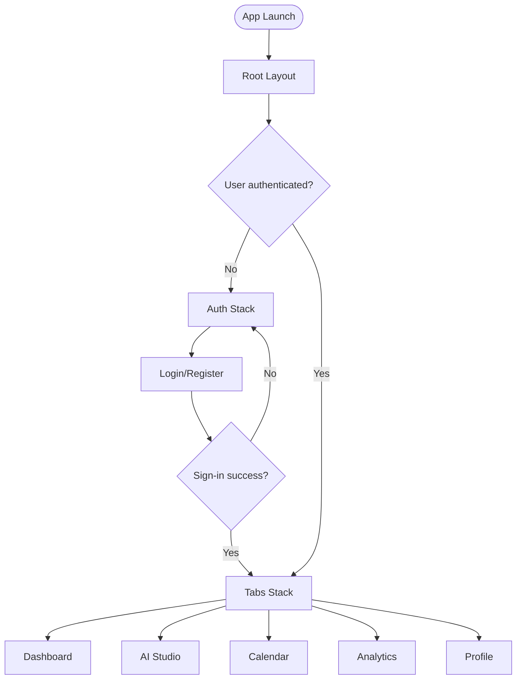
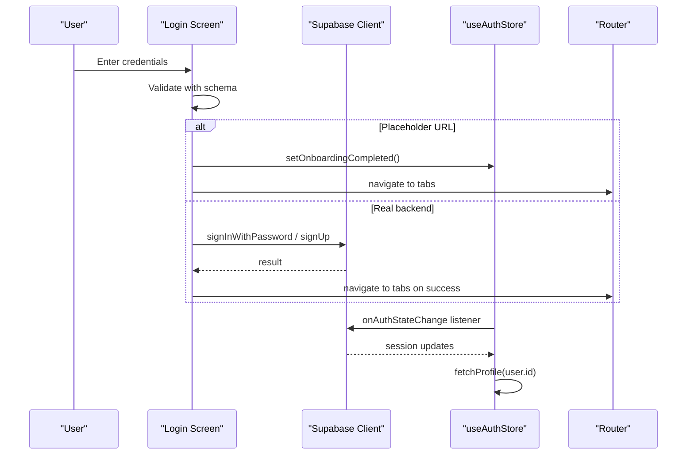
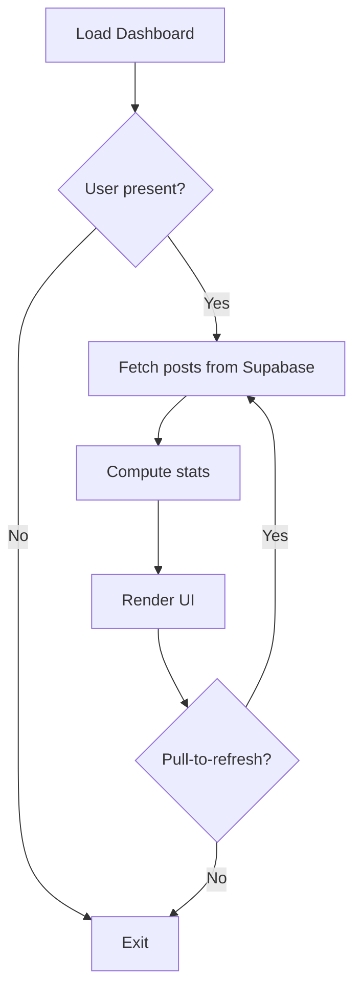
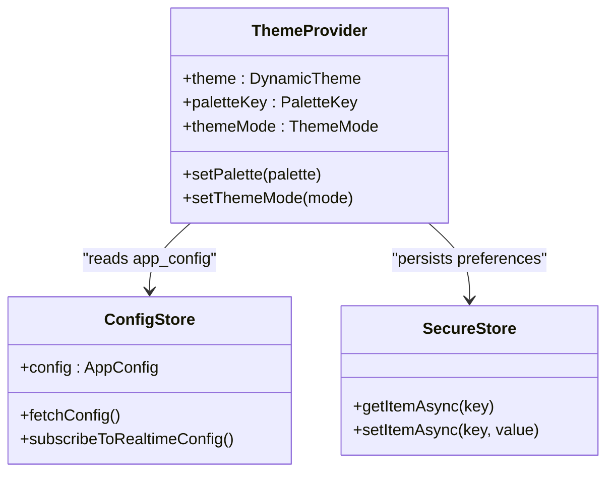
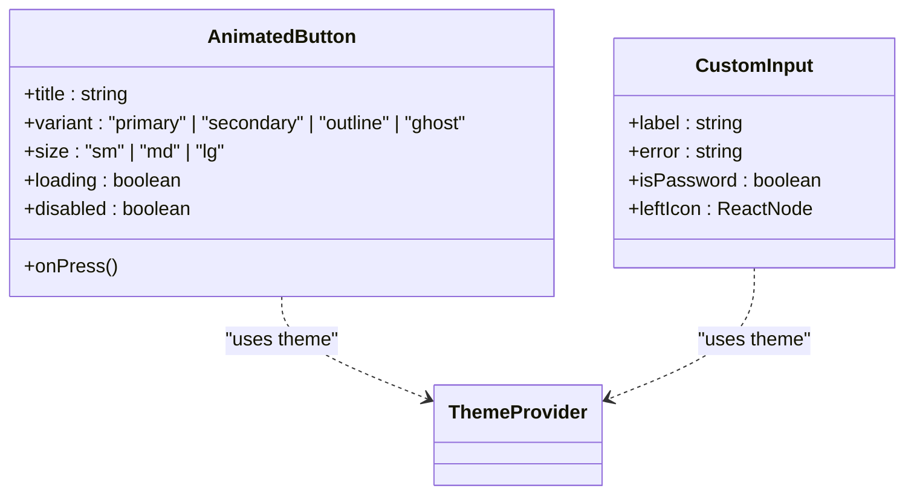
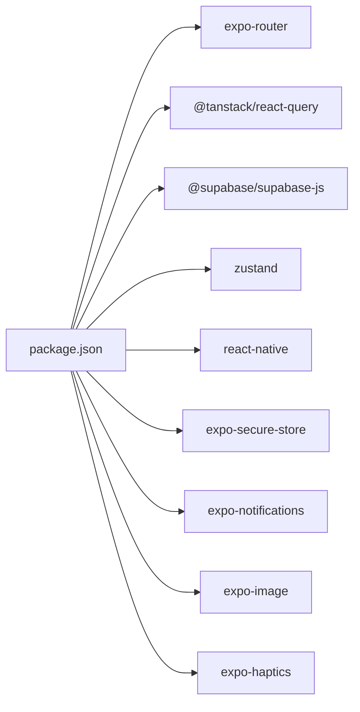

# Mobile Application

<cite>
**Referenced Files in This Document**
- [package.json](file://apps/mobile/package.json)
- [app.config.ts](file://apps/mobile/app.config.ts)
- [_layout.tsx](file://apps/mobile/src/app/_layout.tsx)
- [supabase.ts](file://apps/mobile/src/services/supabase.ts)
- [useAuthStore.ts](file://apps/mobile/src/store/useAuthStore.ts)
- [useConfigStore.ts](file://apps/mobile/src/store/useConfigStore.ts)
- [ThemeProvider.tsx](file://apps/mobile/src/theme/ThemeProvider.tsx)
- [index.ts (theme)](file://apps/mobile/src/theme/index.ts)
- [index.ts (constants)](file://apps/mobile/src/constants/index.ts)
- [_layout.tsx (auth)](file://apps/mobile/src/app/(auth)/_layout.tsx)
- [_layout.tsx (tabs)](file://apps/mobile/src/app/(tabs)/_layout.tsx)
- [login.tsx](file://apps/mobile/src/app/(auth)/login.tsx)
- [index.tsx (dashboard)](file://apps/mobile/src/app/(tabs)/index.tsx)
- [CustomInput.tsx](file://apps/mobile/src/components/atoms/CustomInput.tsx)
- [AnimatedButton.tsx](file://apps/mobile/src/components/atoms/AnimatedButton.tsx)
</cite>

## Table of Contents
1. Introduction
2. Project Structure
3. Core Components
4. Architecture Overview
5. Detailed Component Analysis
6. Dependency Analysis
7. Performance Considerations
8. Troubleshooting Guide
9. Conclusion

## Introduction
This document provides comprehensive documentation for the Expo/React Native mobile application. It explains the app structure built with Expo Router, navigation patterns, platform-specific configuration, state management using Zustand and React Query, and integration with Supabase for authentication, data synchronization, and real-time features. It also outlines mobile-specific capabilities such as push notifications, offline support via secure storage, and native device integrations. Guidelines are included for building reusable components following atomic design principles, theming, responsive design, performance optimization, testing strategies, and deployment to iOS and Android.

## Project Structure
The mobile app is organized under apps/mobile with a feature-oriented layout:
- Routing and navigation: Expo Router file-based routing with grouped layouts for authentication and tabs.
- State management: Zustand stores for client-side state (authentication, configuration, UI).
- Server state: React Query client configured at the root layout.
- Services: Supabase client with secure storage adapter for cross-platform persistence.
- Theming: Theme provider with dynamic palettes and white-label overrides from remote config.
- Components: Atomic design system (atoms, molecules, organisms, templates).
- Platform configuration: Expo config for iOS/Android identifiers, splash screen, plugins, and experiments.

**Diagram sources**
- [_layout.tsx:1-98](file://apps/mobile/src/app/_layout.tsx#L1-L98)
- [_layout.tsx (auth):1-23](file://apps/mobile/src/app/(auth)/_layout.tsx#L1-L23)
- [_layout.tsx (tabs):1-106](file://apps/mobile/src/app/(tabs)/_layout.tsx#L1-L106)
- [supabase.ts:1-41](file://apps/mobile/src/services/supabase.ts#L1-L41)
- [ThemeProvider.tsx:1-97](file://apps/mobile/src/theme/ThemeProvider.tsx#L1-L97)
- [useAuthStore.ts:1-90](file://apps/mobile/src/store/useAuthStore.ts#L1-L90)
- [useConfigStore.ts:1-67](file://apps/mobile/src/store/useConfigStore.ts#L1-L67)
- [app.config.ts:1-42](file://apps/mobile/app.config.ts#L1-L42)
- [package.json:1-53](file://apps/mobile/package.json#L1-L53)

**Section sources**
- [package.json:1-53](file://apps/mobile/package.json#L1-L53)
- [app.config.ts:1-42](file://apps/mobile/app.config.ts#L1-L42)
- [_layout.tsx:1-98](file://apps/mobile/src/app/_layout.tsx#L1-L98)

## Core Components
- Root layout initializes global providers: SafeAreaProvider, GestureHandlerRootView, QueryClientProvider, ThemeProvider, ToastProvider. It sets up the navigation stack and triggers auth initialization and configuration fetching with realtime subscription.
- Auth stack groups authentication screens with consistent styling and transitions.
- Tabs stack defines primary navigation surfaces: Dashboard, AI Studio, Calendar, Analytics, Profile.
- Supabase client uses a secure storage adapter that persists sessions across app restarts on both web and native platforms.
- Zustand stores manage:
  - Authentication state and profile fetches, sign-out, and onboarding flags.
  - App configuration fetched once and updated in real time via Supabase channels.
  - Drawer visibility for UI state.
- Theme provider manages palette selection, theme mode (light/dark/system), and applies white-label overrides from remote config.

Key responsibilities and interactions:
- Root layout bootstraps services and navigation.
- Auth store listens to Supabase auth state changes and updates user profile when available.
- Config store subscribes to realtime changes for dynamic branding and feature toggles.
- Theme provider consumes config to override colors dynamically.

**Section sources**
- [_layout.tsx:1-98](file://apps/mobile/src/app/_layout.tsx#L1-L98)
- [_layout.tsx (auth):1-23](file://apps/mobile/src/app/(auth)/_layout.tsx#L1-L23)
- [_layout.tsx (tabs):1-106](file://apps/mobile/src/app/(tabs)/_layout.tsx#L1-L106)
- [supabase.ts:1-41](file://apps/mobile/src/services/supabase.ts#L1-L41)
- [useAuthStore.ts:1-90](file://apps/mobile/src/store/useAuthStore.ts#L1-L90)
- [useConfigStore.ts:1-67](file://apps/mobile/src/store/useConfigStore.ts#L1-L67)
- [ThemeProvider.tsx:1-97](file://apps/mobile/src/theme/ThemeProvider.tsx#L1-L97)

## Architecture Overview
The app follows a layered architecture:
- Presentation layer: Screens and components built with React Native and Expo Router.
- State layer: Zustand for local state; React Query for server state caching and background updates.
- Service layer: Supabase client for auth, database queries, and realtime subscriptions.
- Configuration layer: Expo config and runtime theme provider for branding and appearance.

**Diagram sources**
- [_layout.tsx:1-98](file://apps/mobile/src/app/_layout.tsx#L1-L98)
- [useAuthStore.ts:1-90](file://apps/mobile/src/store/useAuthStore.ts#L1-L90)
- [useConfigStore.ts:1-67](file://apps/mobile/src/store/useConfigStore.ts#L1-L67)
- [supabase.ts:1-41](file://apps/mobile/src/services/supabase.ts#L1-L41)
- [ThemeProvider.tsx:1-97](file://apps/mobile/src/theme/ThemeProvider.tsx#L1-L97)

## Detailed Component Analysis

### Navigation and Routing
- File-based routing with Expo Router organizes routes into groups:
  - (auth): Onboarding, login, register, forgot-password.
  - (tabs): Dashboard, AI Studio, Calendar, Analytics, Profile.
- Root layout registers top-level screens and modal presentations for studio menu and not-found handling.
- Tab bar is themed and platform-aware for height and spacing.

**Diagram sources**
- [_layout.tsx:1-98](file://apps/mobile/src/app/_layout.tsx#L1-L98)
- [_layout.tsx (auth):1-23](file://apps/mobile/src/app/(auth)/_layout.tsx#L1-L23)
- [_layout.tsx (tabs):1-106](file://apps/mobile/src/app/(tabs)/_layout.tsx#L1-L106)

**Section sources**
- [_layout.tsx:1-98](file://apps/mobile/src/app/_layout.tsx#L1-L98)
- [_layout.tsx (auth):1-23](file://apps/mobile/src/app/(auth)/_layout.tsx#L1-L23)
- [_layout.tsx (tabs):1-106](file://apps/mobile/src/app/(tabs)/_layout.tsx#L1-L106)

### Authentication Flow
- The login screen validates inputs, handles placeholder environment bypass, and calls Supabase auth methods for sign-in or sign-up.
- On success, it navigates to the tabs group and marks onboarding completed.
- The auth store initializes by checking existing sessions and setting up realtime listeners for auth state changes.

**Diagram sources**
- [login.tsx:1-424](file://apps/mobile/src/app/(auth)/login.tsx#L1-L424)
- [useAuthStore.ts:1-90](file://apps/mobile/src/store/useAuthStore.ts#L1-L90)
- [supabase.ts:1-41](file://apps/mobile/src/services/supabase.ts#L1-L41)

**Section sources**
- [login.tsx:1-424](file://apps/mobile/src/app/(auth)/login.tsx#L1-L424)
- [useAuthStore.ts:1-90](file://apps/mobile/src/store/useAuthStore.ts#L1-L90)

### Data Fetching and Realtime Updates
- Dashboard screen loads posts for the current user and computes stats. In placeholder mode, it serves mock data.
- Config store fetches app configuration and subscribes to realtime changes to update branding and features dynamically.

**Diagram sources**
- [index.tsx (dashboard):1-428](file://apps/mobile/src/app/(tabs)/index.tsx#L1-L428)
- [useConfigStore.ts:1-67](file://apps/mobile/src/store/useConfigStore.ts#L1-L67)

**Section sources**
- [index.tsx (dashboard):1-428](file://apps/mobile/src/app/(tabs)/index.tsx#L1-L428)
- [useConfigStore.ts:1-67](file://apps/mobile/src/store/useConfigStore.ts#L1-L67)

### Theming and White-Label Overrides
- Theme provider loads persisted palette and mode, computes active theme based on system preference and selected mode, and merges remote config overrides for primary, secondary, and accent colors.
- Constants define storage keys for persisting preferences.

**Diagram sources**
- [ThemeProvider.tsx:1-97](file://apps/mobile/src/theme/ThemeProvider.tsx#L1-L97)
- [useConfigStore.ts:1-67](file://apps/mobile/src/store/useConfigStore.ts#L1-L67)
- [index.ts (constants):1-23](file://apps/mobile/src/constants/index.ts#L1-L23)

**Section sources**
- [ThemeProvider.tsx:1-97](file://apps/mobile/src/theme/ThemeProvider.tsx#L1-L97)
- [index.ts (theme):1-12](file://apps/mobile/src/theme/index.ts#L1-L12)
- [index.ts (constants):1-23](file://apps/mobile/src/constants/index.ts#L1-L23)

### Reusable Components (Atomic Design)
- Atoms include AnimatedButton and CustomInput with theme-aware styling, animations, and accessibility considerations.
- These components encapsulate common behaviors like loading states, gradients, focus effects, and error display.

**Diagram sources**
- [AnimatedButton.tsx:1-195](file://apps/mobile/src/components/atoms/AnimatedButton.tsx#L1-L195)
- [CustomInput.tsx:1-165](file://apps/mobile/src/components/atoms/CustomInput.tsx#L1-L165)
- [ThemeProvider.tsx:1-97](file://apps/mobile/src/theme/ThemeProvider.tsx#L1-L97)

**Section sources**
- [AnimatedButton.tsx:1-195](file://apps/mobile/src/components/atoms/AnimatedButton.tsx#L1-L195)
- [CustomInput.tsx:1-165](file://apps/mobile/src/components/atoms/CustomInput.tsx#L1-L165)

## Dependency Analysis
- The app depends on Expo Router for navigation, React Query for server state, Supabase for auth and realtime, and Zustand for local state.
- Platform-specific behavior is handled via expo-secure-store and react-native-safe-area-context.
- Package manifest lists core dependencies and scripts for development and builds.

**Diagram sources**
- [package.json:1-53](file://apps/mobile/package.json#L1-L53)

**Section sources**
- [package.json:1-53](file://apps/mobile/package.json#L1-L53)

## Performance Considerations
- Use React Query defaults for caching and retries to reduce network overhead.
- Avoid unnecessary re-renders by memoizing components and selecting only needed store slices.
- Prefer platform-specific optimizations:
  - Use expo-image for optimized image loading.
  - Use react-native-reanimated for smooth animations on the UI thread.
- Minimize heavy computations on the main thread; consider worklets where applicable.
- Leverage placeholder mode to avoid blocking DNS timeouts during development.

[No sources needed since this section provides general guidance]

## Troubleshooting Guide
Common issues and resolutions:
- Network timeouts or placeholder URL:
  - The app detects placeholder URLs and bypasses network calls to prevent long waits during development.
- Authentication errors:
  - Ensure Supabase credentials are correctly configured in environment variables.
  - Verify email verification flows if required by your Supabase settings.
- Realtime connection failures:
  - Realtime subscriptions are guarded against placeholder URLs; ensure proper Supabase project setup for production.
- Theme persistence:
  - Confirm SecureStore permissions and keys are correctly defined.

**Section sources**
- [supabase.ts:1-41](file://apps/mobile/src/services/supabase.ts#L1-L41)
- [useAuthStore.ts:1-90](file://apps/mobile/src/store/useAuthStore.ts#L1-L90)
- [useConfigStore.ts:1-67](file://apps/mobile/src/store/useConfigStore.ts#L1-L67)

## Conclusion
The mobile application leverages Expo Router for structured navigation, Zustand for efficient client state, and React Query for robust server state management. Supabase integration provides secure authentication, data access, and realtime updates. The theming system supports dynamic white-label customization, while the atomic component library ensures consistency and reusability. With careful attention to performance, testing, and deployment practices, the app delivers a responsive and scalable mobile experience across iOS and Android.

[No sources needed since this section summarizes without analyzing specific files]