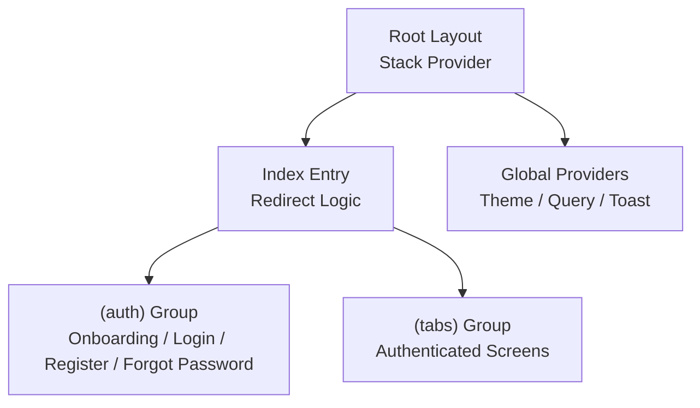
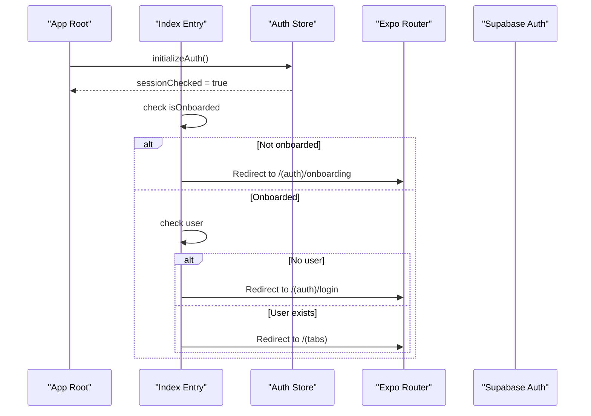
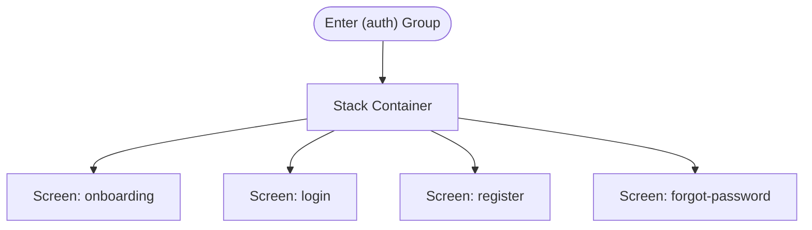
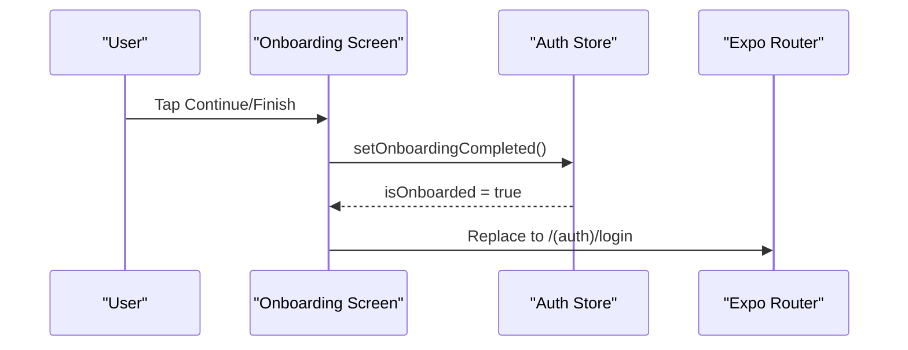
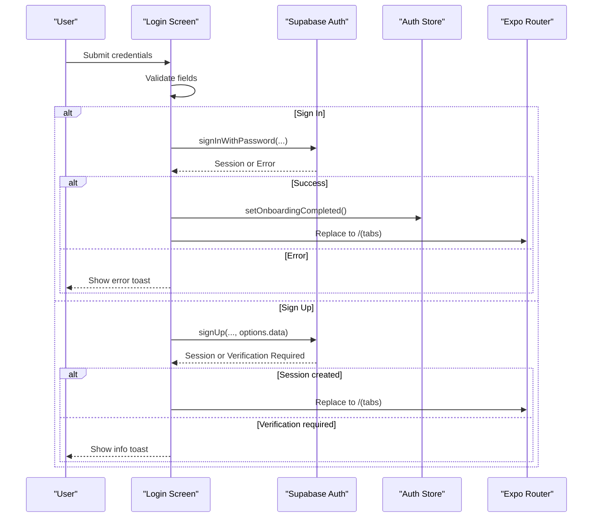
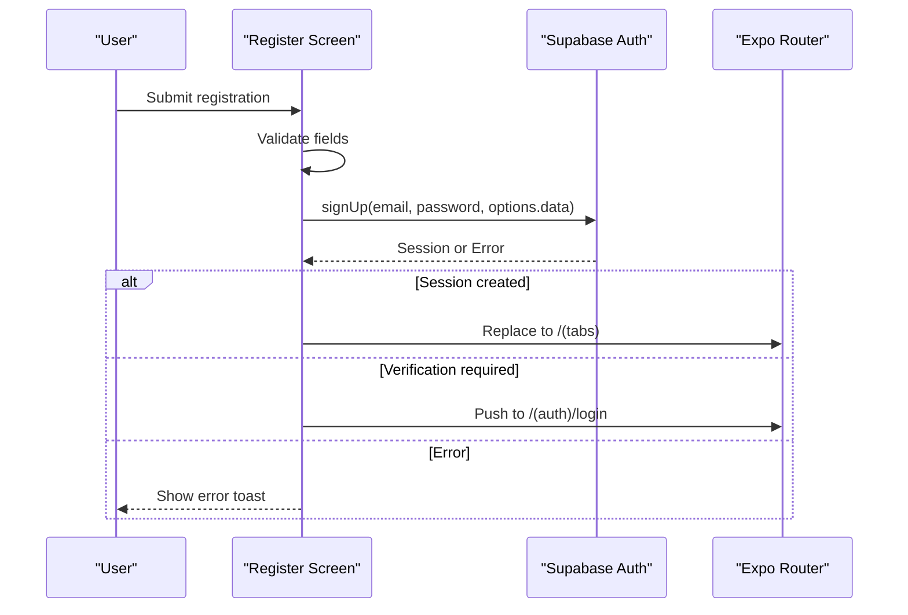
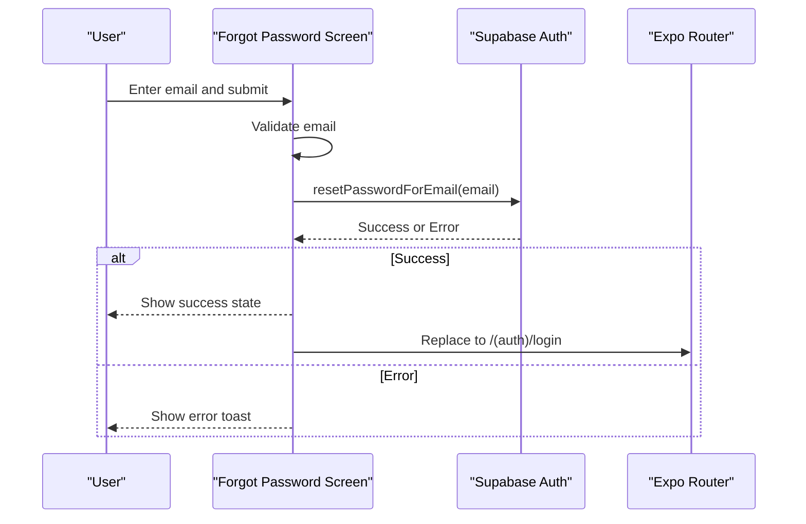
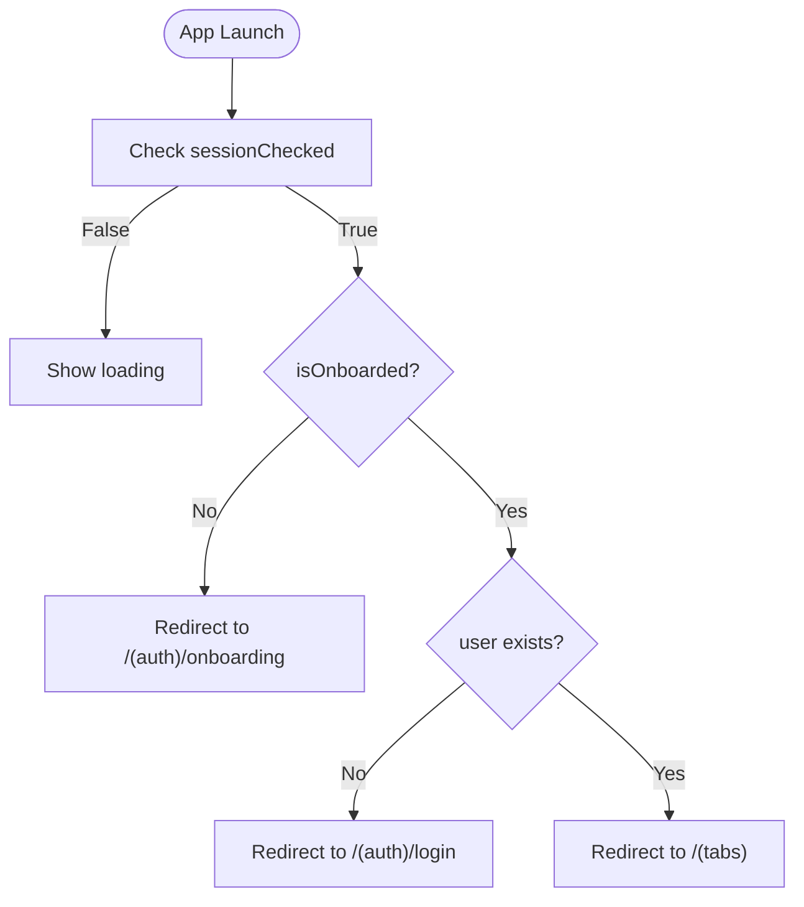
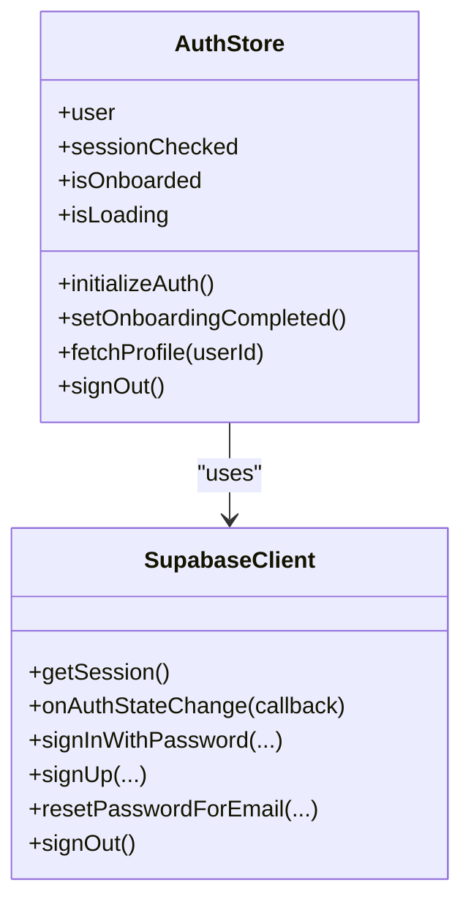
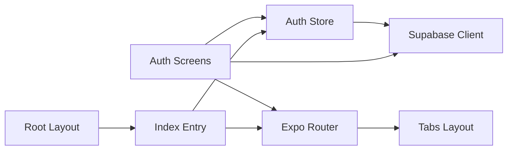

# Authentication Routing

<cite>
**Referenced Files in This Document**
- [_layout.tsx](file://apps/mobile/src/app/_layout.tsx)
- [index.tsx](file://apps/mobile/src/app/index.tsx)
- [_layout.tsx (auth)](file://apps/mobile/src/app/(auth)/_layout.tsx)
- [login.tsx](file://apps/mobile/src/app/(auth)/login.tsx)
- [register.tsx](file://apps/mobile/src/app/(auth)/register.tsx)
- [onboarding.tsx](file://apps/mobile/src/app/(auth)/onboarding.tsx)
- [forgot-password.tsx](file://apps/mobile/src/app/(auth)/forgot-password.tsx)
- [_layout.tsx (tabs)](file://apps/mobile/src/app/(tabs)/_layout.tsx)
- [useAuthStore.ts](file://apps/mobile/src/store/useAuthStore.ts)
- [supabase.ts](file://apps/mobile/src/services/supabase.ts)
</cite>

## Table of Contents
1. [Introduction](#introduction)
2. [Project Structure](#project-structure)
3. [Core Components](#core-components)
4. [Architecture Overview](#architecture-overview)
5. [Detailed Component Analysis](#detailed-component-analysis)
6. [Dependency Analysis](#dependency-analysis)
7. [Performance Considerations](#performance-considerations)
8. [Troubleshooting Guide](#troubleshooting-guide)
9. [Conclusion](#conclusion)

## Introduction
This document explains the authentication routing system for the mobile app built with Expo Router and Supabase Auth. It covers:
- The (auth) route group structure and its screens: onboarding, login, register, and forgot password
- Navigation guards that protect authenticated routes via the root index redirect logic
- Flow between authentication screens and how state changes drive navigation
- Examples of implementing redirects, handling auth state changes, and managing session transitions
- Security considerations for protected routes and best practices for robust authentication flows

## Project Structure
The authentication flow is organized into a dedicated route group under (auth), which groups all pre-authenticated screens together. The root layout defines the top-level stack and registers the (auth) and (tabs) groups. The root index acts as the entry point and enforces navigation based on authentication and onboarding state.

**Diagram sources**
- [_layout.tsx:27-55](file://apps/mobile/src/app/_layout.tsx#L27-L55)
- [index.tsx:6-26](file://apps/mobile/src/app/index.tsx#L6-L26)
- [_layout.tsx (auth):5-22](file://apps/mobile/src/app/(auth)/_layout.tsx#L5-L22)
- [_layout.tsx (tabs):7-95](file://apps/mobile/src/app/(tabs)/_layout.tsx#L7-L95)

**Section sources**
- [_layout.tsx:27-55](file://apps/mobile/src/app/_layout.tsx#L27-L55)
- [index.tsx:6-26](file://apps/mobile/src/app/index.tsx#L6-L26)

## Core Components
- Root layout: Provides global providers and the main Stack with named groups (auth) and (tabs).
- Index entry: Central redirect logic that decides whether to show onboarding, login, or tabs based on auth store state.
- Auth group layout: Configures a minimal stack for auth screens without headers and with consistent animations.
- Auth screens: Onboarding, Login, Register, Forgot Password implement validation, API calls, and navigation.
- Auth store: Manages user profile, onboarding flag, session checks, and subscribes to auth state changes.
- Supabase service: Initializes client with secure storage adapter and environment configuration.

**Section sources**
- [_layout.tsx:27-55](file://apps/mobile/src/app/_layout.tsx#L27-L55)
- [index.tsx:6-26](file://apps/mobile/src/app/index.tsx#L6-L26)
- [_layout.tsx (auth):5-22](file://apps/mobile/src/app/(auth)/_layout.tsx#L5-L22)
- [useAuthStore.ts:18-90](file://apps/mobile/src/store/useAuthStore.ts#L18-L90)
- [supabase.ts:1-41](file://apps/mobile/src/services/supabase.ts#L1-L41)

## Architecture Overview
The app uses a simple but effective guard pattern at the root index:
- If onboarding is not completed, redirect to onboarding
- Else if no user session exists, redirect to login
- Otherwise, navigate to the authenticated tabs

The (auth) group provides a cohesive UI for pre-authentication flows. After successful sign-in or registration, users are redirected to (tabs). The auth store persists onboarding completion and listens to auth state changes to keep UI in sync.

**Diagram sources**
- [index.tsx:6-26](file://apps/mobile/src/app/index.tsx#L6-L26)
- [useAuthStore.ts:24-61](file://apps/mobile/src/store/useAuthStore.ts#L24-L61)

## Detailed Component Analysis

### (auth) Route Group Layout
- Purpose: Groups all pre-authentication screens and applies consistent stack behavior (no header, slide animation).
- Registered screens: onboarding, login, register, forgot-password.

**Diagram sources**
- [_layout.tsx (auth):5-22](file://apps/mobile/src/app/(auth)/_layout.tsx#L5-L22)

**Section sources**
- [_layout.tsx (auth):5-22](file://apps/mobile/src/app/(auth)/_layout.tsx#L5-L22)

### Onboarding Screen
- Behavior: Presents feature slides; on finish, marks onboarding as completed and navigates to login.
- State persistence: Uses secure storage to persist onboarding completion.

**Diagram sources**
- [onboarding.tsx:65-68](file://apps/mobile/src/app/(auth)/onboarding.tsx#L65-L68)
- [useAuthStore.ts:63-66](file://apps/mobile/src/store/useAuthStore.ts#L63-L66)

**Section sources**
- [onboarding.tsx:48-76](file://apps/mobile/src/app/(auth)/onboarding.tsx#L48-L76)
- [useAuthStore.ts:63-66](file://apps/mobile/src/store/useAuthStore.ts#L63-L66)

### Login Screen
- Behavior: Unified Sign In / Create Account tabbed interface. Validates input, then either signs in or signs up.
- Post-action navigation: On success, replaces route to (tabs); on verification required, informs user and remains in auth flow.

**Diagram sources**
- [login.tsx:76-142](file://apps/mobile/src/app/(auth)/login.tsx#L76-L142)

**Section sources**
- [login.tsx:26-142](file://apps/mobile/src/app/(auth)/login.tsx#L26-L142)

### Register Screen
- Behavior: Dedicated registration form with validation and Supabase sign-up.
- Post-action navigation: If session created, go to (tabs); otherwise prompt email verification and return to login.

**Diagram sources**
- [register.tsx:29-92](file://apps/mobile/src/app/(auth)/register.tsx#L29-L92)

**Section sources**
- [register.tsx:12-92](file://apps/mobile/src/app/(auth)/register.tsx#L12-L92)

### Forgot Password Screen
- Behavior: Validates email and triggers password reset flow. Shows success state and returns to login.

**Diagram sources**
- [forgot-password.tsx:28-61](file://apps/mobile/src/app/(auth)/forgot-password.tsx#L28-L61)

**Section sources**
- [forgot-password.tsx:13-61](file://apps/mobile/src/app/(auth)/forgot-password.tsx#L13-L61)

### Root Index Guard
- Behavior: Centralized redirect logic based on onboarding and user session state.
- Ensures first-time users complete onboarding before accessing authenticated areas.

**Diagram sources**
- [index.tsx:6-26](file://apps/mobile/src/app/index.tsx#L6-L26)

**Section sources**
- [index.tsx:6-26](file://apps/mobile/src/app/index.tsx#L6-L26)

### Auth Store and Session Management
- Responsibilities:
  - Initialize auth on app start, load onboarding flag from secure storage
  - Fetch user profile when session exists
  - Subscribe to auth state changes to update UI and user data
  - Persist onboarding completion
  - Provide sign-out capability

**Diagram sources**
- [useAuthStore.ts:18-90](file://apps/mobile/src/store/useAuthStore.ts#L18-L90)
- [supabase.ts:1-41](file://apps/mobile/src/services/supabase.ts#L1-L41)

**Section sources**
- [useAuthStore.ts:18-90](file://apps/mobile/src/store/useAuthStore.ts#L18-L90)
- [supabase.ts:1-41](file://apps/mobile/src/services/supabase.ts#L1-L41)

## Dependency Analysis
- Root layout depends on theme, query client, and stores to provide context and services.
- Index depends on auth store to determine initial navigation.
- Auth screens depend on:
  - Expo Router for navigation
  - Auth store for onboarding state
  - Supabase client for authentication operations
- Tabs layout is the authenticated destination after successful login/registration.

**Diagram sources**
- [_layout.tsx:27-55](file://apps/mobile/src/app/_layout.tsx#L27-L55)
- [index.tsx:6-26](file://apps/mobile/src/app/index.tsx#L6-L26)
- [useAuthStore.ts:18-90](file://apps/mobile/src/store/useAuthStore.ts#L18-L90)
- [supabase.ts:1-41](file://apps/mobile/src/services/supabase.ts#L1-L41)
- [_layout.tsx (tabs):7-95](file://apps/mobile/src/app/(tabs)/_layout.tsx#L7-L95)

**Section sources**
- [_layout.tsx:27-55](file://apps/mobile/src/app/_layout.tsx#L27-L55)
- [index.tsx:6-26](file://apps/mobile/src/app/index.tsx#L6-L26)
- [useAuthStore.ts:18-90](file://apps/mobile/src/store/useAuthStore.ts#L18-L90)
- [supabase.ts:1-41](file://apps/mobile/src/services/supabase.ts#L1-L41)
- [_layout.tsx (tabs):7-95](file://apps/mobile/src/app/(tabs)/_layout.tsx#L7-L95)

## Performance Considerations
- Minimize network calls during startup by deferring non-critical work until after initial render.
- Use placeholder mode optimizations to avoid blocking network requests during development.
- Debounce or throttle repeated auth state updates if necessary to prevent excessive re-renders.
- Keep auth store actions lightweight; fetch profiles only when needed.

[No sources needed since this section provides general guidance]

## Troubleshooting Guide
Common issues and resolutions:
- Stuck on loading screen: Ensure initializeAuth completes and sets sessionChecked. Verify Supabase client configuration and network connectivity.
- Redirect loops: Confirm that onboarding flag is persisted correctly and that user session exists before redirecting to tabs.
- Email verification required: Handle cases where sign-up does not create an immediate session; guide users to verify email and return to login.
- Network errors: Wrap API calls in try/catch and display user-friendly messages; ensure fallbacks for placeholder environments.

**Section sources**
- [login.tsx:76-142](file://apps/mobile/src/app/(auth)/login.tsx#L76-L142)
- [register.tsx:29-92](file://apps/mobile/src/app/(auth)/register.tsx#L29-L92)
- [forgot-password.tsx:28-61](file://apps/mobile/src/app/(auth)/forgot-password.tsx#L28-L61)
- [useAuthStore.ts:24-61](file://apps/mobile/src/store/useAuthStore.ts#L24-L61)

## Conclusion
The authentication routing system leverages a clear separation between unauthenticated and authenticated flows using Expo Router groups and a centralized redirect strategy at the root index. The auth store manages session state and onboarding persistence, while Supabase handles credential-based authentication. This design ensures predictable navigation, robust error handling, and a smooth user experience across onboarding, login, registration, and password recovery flows.

[No sources needed since this section summarizes without analyzing specific files]