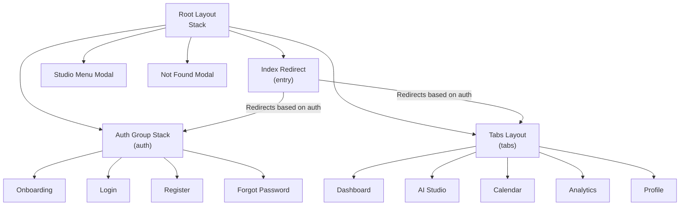
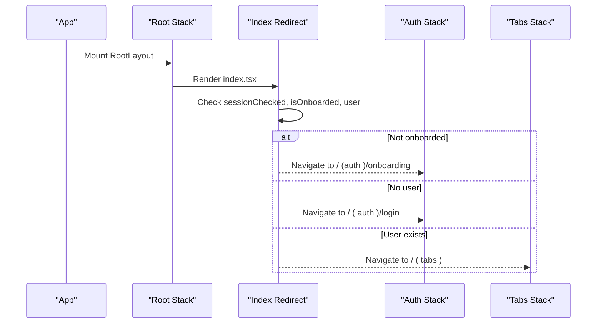
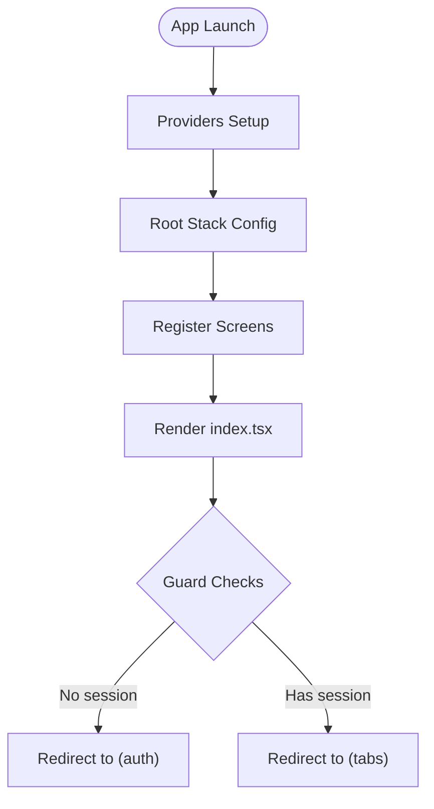
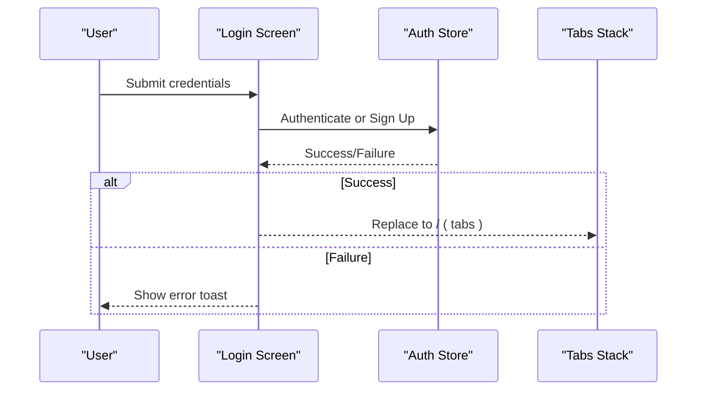
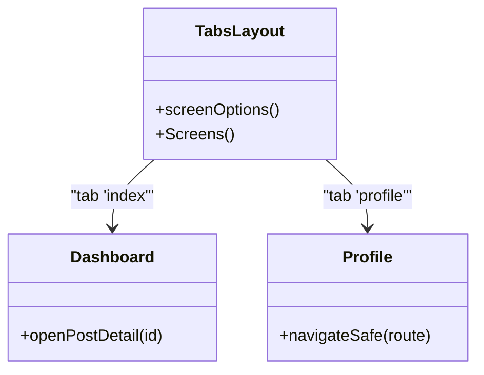
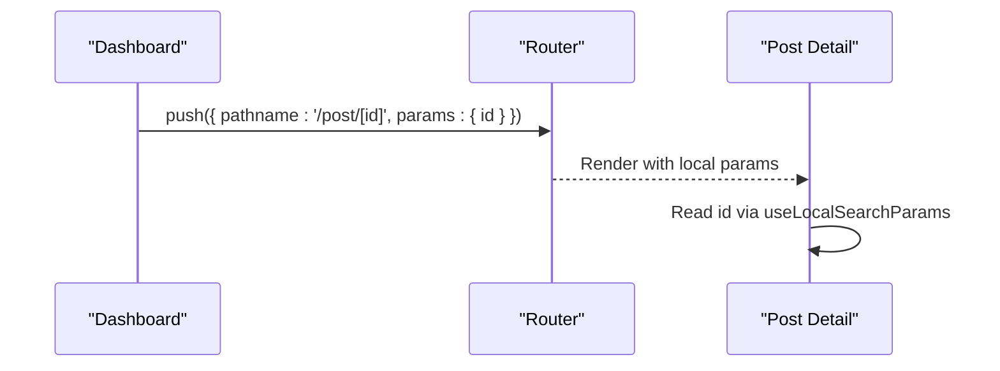
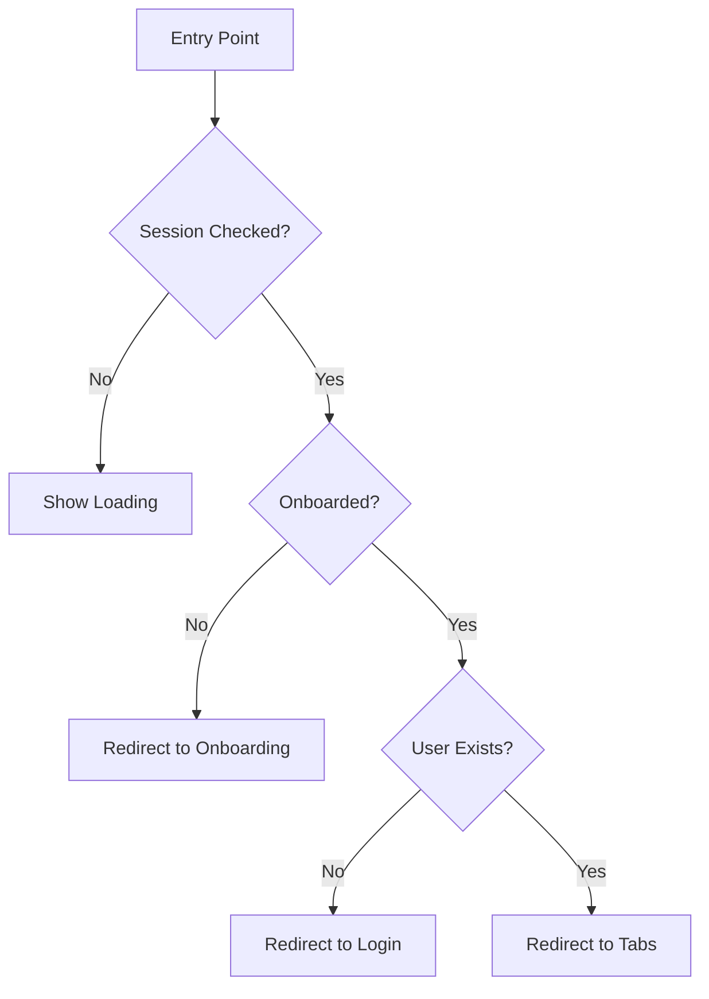
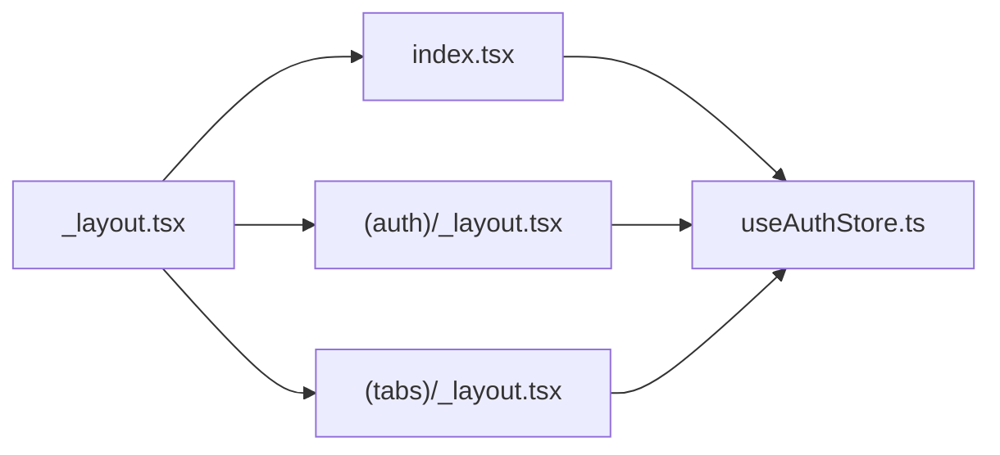

# Navigation & Routing

<cite>
**Referenced Files in This Document**
- [_layout.tsx](file://apps/mobile/src/app/_layout.tsx)
- [index.tsx](file://apps/mobile/src/app/index.tsx)
- [_layout.tsx (auth)](file://apps/mobile/src/app/(auth)/_layout.tsx)
- [login.tsx](file://apps/mobile/src/app/(auth)/login.tsx)
- [register.tsx](file://apps/mobile/src/app/(auth)/register.tsx)
- [onboarding.tsx](file://apps/mobile/src/app/(auth)/onboarding.tsx)
- [forgot-password.tsx](file://apps/mobile/src/app/(auth)/forgot-password.tsx)
- [_layout.tsx (tabs)](file://apps/mobile/src/app/(tabs)/_layout.tsx)
- [index.tsx (tabs)](file://apps/mobile/src/app/(tabs)/index.tsx)
- [profile.tsx](file://apps/mobile/src/app/(tabs)/profile.tsx)
- [post/[id].tsx](file://apps/mobile/src/app/post/[id].tsx)
- [useAuthStore.ts](file://apps/mobile/src/store/useAuthStore.ts)
</cite>

## Table of Contents
1. Introduction
2. Project Structure
3. Core Components
4. Architecture Overview
5. Detailed Component Analysis
6. Dependency Analysis
7. Performance Considerations
8. Troubleshooting Guide
9. Conclusion
10. Appendices

## Introduction
This document explains the navigation and routing system implemented with Expo Router in the mobile app. It covers route groups, layout components, nested routing patterns, programmatic navigation, authentication flow routing, tab navigation, deep linking considerations, creating new routes, handling parameters, implementing guards for protected routes, navigation state persistence, and performance optimization techniques.

## Project Structure
The navigation is organized using Expo Router’s file-based routing:
- Root stack defines top-level screens and groups: index, (auth), (tabs), studio-menu, and a not-found screen.
- Route groups:
  - (auth): Authentication flows including onboarding, login, register, and forgot-password.
  - (tabs): Main application tabs with a bottom tab navigator.
- Nested dynamic route: post/[id] for editing a specific post.

**Diagram sources**
- [_layout.tsx:27-55](file://apps/mobile/src/app/_layout.tsx#L27-L55)
- [index.tsx:6-26](file://apps/mobile/src/app/index.tsx#L6-L26)
- [_layout.tsx (auth):5-22](file://apps/mobile/src/app/(auth)/_layout.tsx#L5-L22)
- [_layout.tsx (tabs):7-95](file://apps/mobile/src/app/(tabs)/_layout.tsx#L7-L95)

**Section sources**
- [_layout.tsx:27-55](file://apps/mobile/src/app/_layout.tsx#L27-L55)
- [index.tsx:6-26](file://apps/mobile/src/app/index.tsx#L6-L26)
- [_layout.tsx (auth):5-22](file://apps/mobile/src/app/(auth)/_layout.tsx#L5-L22)
- [_layout.tsx (tabs):7-95](file://apps/mobile/src/app/(tabs)/_layout.tsx#L7-L95)

## Core Components
- Root layout: Initializes providers (theme, query client, toast), configures the root Stack, and registers top-level screens and groups.
- Index entry: Guards the initial route by checking session and onboarding status to redirect users appropriately.
- Auth group: Provides a dedicated stack for authentication flows with consistent slide animations and no header.
- Tabs group: Configures a bottom tab navigator with custom icons and styling for main features.

Key responsibilities:
- Centralized navigation configuration at the root level.
- Conditional redirection based on authentication state.
- Isolated navigation contexts per feature via route groups.

**Section sources**
- [_layout.tsx:17-55](file://apps/mobile/src/app/_layout.tsx#L17-L55)
- [index.tsx:6-26](file://apps/mobile/src/app/index.tsx#L6-L26)
- [_layout.tsx (auth):5-22](file://apps/mobile/src/app/(auth)/_layout.tsx#L5-L22)
- [_layout.tsx (tabs):7-95](file://apps/mobile/src/app/(tabs)/_layout.tsx#L7-L95)

## Architecture Overview
The navigation architecture uses a root Stack with three primary destinations:
- Index: Entry point that redirects based on auth state.
- (auth): A grouped stack for authentication-related screens.
- (tabs): A grouped tab navigator for authenticated app sections.

Additionally, there are modal-style overlays like studio-menu and a +not-found handler.

**Diagram sources**
- [index.tsx:6-26](file://apps/mobile/src/app/index.tsx#L6-L26)
- [_layout.tsx:27-55](file://apps/mobile/src/app/_layout.tsx#L27-L55)

## Detailed Component Analysis

### Root Layout and Top-Level Routes
- The root layout sets up global providers and a Stack with options for animations and presentation modes.
- Registers screens:
  - index
  - (auth) group
  - (tabs) group
  - studio-menu as a transparent modal
  - +not-found as a modal

**Diagram sources**
- [_layout.tsx:17-55](file://apps/mobile/src/app/_layout.tsx#L17-L55)
- [index.tsx:6-26](file://apps/mobile/src/app/index.tsx#L6-L26)

**Section sources**
- [_layout.tsx:27-55](file://apps/mobile/src/app/_layout.tsx#L27-L55)

### Authentication Flow Routing
- Route group (auth) includes onboarding, login, register, and forgot-password.
- Onboarding marks completion and navigates to login.
- Login handles sign-in/sign-up and navigates to (tabs) upon success.
- Register validates input, calls auth service, and navigates accordingly.
- Forgot password sends recovery email and returns to login.

**Diagram sources**
- [login.tsx:76-142](file://apps/mobile/src/app/(auth)/login.tsx#L76-L142)
- [register.tsx:29-92](file://apps/mobile/src/app/(auth)/register.tsx#L29-L92)
- [_layout.tsx (auth):5-22](file://apps/mobile/src/app/(auth)/_layout.tsx#L5-L22)

**Section sources**
- [_layout.tsx (auth):5-22](file://apps/mobile/src/app/(auth)/_layout.tsx#L5-L22)
- [login.tsx:76-142](file://apps/mobile/src/app/(auth)/login.tsx#L76-L142)
- [register.tsx:29-92](file://apps/mobile/src/app/(auth)/register.tsx#L29-L92)
- [onboarding.tsx:65-76](file://apps/mobile/src/app/(auth)/onboarding.tsx#L65-L76)
- [forgot-password.tsx:28-61](file://apps/mobile/src/app/(auth)/forgot-password.tsx#L28-L61)

### Tab Navigation Implementation
- The (tabs) group configures a Tabs navigator with five tabs: Dashboard, AI Studio, Calendar, Analytics, Profile.
- Each tab has a title and icon; styles are themed and platform-aware.
- Navigation within tabs uses router.push to open nested routes like post detail.

**Diagram sources**
- [_layout.tsx (tabs):7-95](file://apps/mobile/src/app/(tabs)/_layout.tsx#L7-L95)
- [index.tsx (tabs):103-111](file://apps/mobile/src/app/(tabs)/index.tsx#L103-L111)
- [profile.tsx:27-34](file://apps/mobile/src/app/(tabs)/profile.tsx#L27-L34)

**Section sources**
- [_layout.tsx (tabs):7-95](file://apps/mobile/src/app/(tabs)/_layout.tsx#L7-L95)
- [index.tsx (tabs):103-111](file://apps/mobile/src/app/(tabs)/index.tsx#L103-L111)
- [profile.tsx:27-34](file://apps/mobile/src/app/(tabs)/profile.tsx#L27-L34)

### Dynamic Routes and Parameters
- Post detail screen uses a dynamic route post/[id] and reads the id parameter via useLocalSearchParams.
- Navigating to this route passes params from the dashboard.

**Diagram sources**
- [index.tsx (tabs):103-111](file://apps/mobile/src/app/(tabs)/index.tsx#L103-L111)
- [post/[id].tsx:43-48](file://apps/mobile/src/app/post/[id].tsx#L43-L48)

**Section sources**
- [post/[id].tsx:43-48](file://apps/mobile/src/app/post/[id].tsx#L43-L48)
- [index.tsx (tabs):103-111](file://apps/mobile/src/app/(tabs)/index.tsx#L103-L111)

### Programmatic Navigation Patterns
- Use router.replace to navigate after successful authentication or registration to avoid stacking back history.
- Use router.push for standard navigation to nested routes like studio-menu or post detail.
- Use router.back for returning from detail screens.

Examples across the codebase:
- Authentication success paths replace to (tabs).
- Onboarding completion replaces to login.
- Forgot password success returns to login.

**Section sources**
- [login.tsx:103-132](file://apps/mobile/src/app/(auth)/login.tsx#L103-L132)
- [register.tsx:68-82](file://apps/mobile/src/app/(auth)/register.tsx#L68-L82)
- [onboarding.tsx:65-76](file://apps/mobile/src/app/(auth)/onboarding.tsx#L65-L76)
- [forgot-password.tsx:89-94](file://apps/mobile/src/app/(auth)/forgot-password.tsx#L89-L94)
- [post/[id].tsx:71-89](file://apps/mobile/src/app/post/[id].tsx#L71-L89)

### Deep Linking Capabilities
- Expo Router supports deep links out-of-the-box when configured in app.config.
- To enable deep linking:
  - Ensure scheme is set in app configuration.
  - Define routes that can be linked to (e.g., /(auth)/login, /(tabs), post/[id]).
  - Handle incoming URLs via Expo Router’s built-in link handling.
- In this project, the file-based routes already map to URL paths; ensure the app config includes a scheme and any required domains if universal links are needed.

[No sources needed since this section provides general guidance without analyzing specific files]

### Creating New Routes
- Add a new file under the appropriate directory:
  - For a new auth flow: create a file under src/app/(auth)/your-screen.tsx and register it in the (auth) layout if needed.
  - For a new tab: add a file under src/app/(tabs)/your-tab.tsx and register a Tabs.Screen in (tabs) layout.
  - For a nested route: create a folder/file under src/app/your-feature/your-screen.tsx.
- Update layouts to include the new screen if necessary.

**Section sources**
- [_layout.tsx (auth):5-22](file://apps/mobile/src/app/(auth)/_layout.tsx#L5-L22)
- [_layout.tsx (tabs):7-95](file://apps/mobile/src/app/(tabs)/_layout.tsx#L7-L95)

### Handling Navigation Parameters
- Use useLocalSearchParams to read parameters from dynamic routes.
- Pass parameters via router.push with a params object.

**Section sources**
- [post/[id].tsx:43-48](file://apps/mobile/src/app/post/[id].tsx#L43-L48)
- [index.tsx (tabs):103-111](file://apps/mobile/src/app/(tabs)/index.tsx#L103-L111)

### Implementing Guards for Protected Routes
- The current guard logic resides in the index entry:
  - If not onboarded, redirect to onboarding.
  - If no user, redirect to login.
  - Otherwise, redirect to tabs.
- For additional protection, consider wrapping protected screens with a higher-order component or a layout guard that checks auth state before rendering content.

**Diagram sources**
- [index.tsx:6-26](file://apps/mobile/src/app/index.tsx#L6-L26)
- [useAuthStore.ts:24-61](file://apps/mobile/src/store/useAuthStore.ts#L24-L61)

**Section sources**
- [index.tsx:6-26](file://apps/mobile/src/app/index.tsx#L6-L26)
- [useAuthStore.ts:24-61](file://apps/mobile/src/store/useAuthStore.ts#L24-L61)

### Navigation State Persistence
- Onboarding completion is persisted using SecureStore.
- Auth session is managed via Supabase auth and Zustand store; profile data is fetched and stored in memory.
- For deeper persistence (e.g., restoring navigation state), consider integrating a navigation state persistence library compatible with Expo Router.

**Section sources**
- [useAuthStore.ts:24-66](file://apps/mobile/src/store/useAuthStore.ts#L24-L66)

## Dependency Analysis
- Root layout depends on theme provider, query client, toast provider, and safe area context.
- Index depends on auth store to determine redirection.
- Auth screens depend on auth store and services for authentication.
- Tabs screens depend on router for navigation and stores for user data.

**Diagram sources**
- [_layout.tsx:17-55](file://apps/mobile/src/app/_layout.tsx#L17-L55)
- [index.tsx:6-26](file://apps/mobile/src/app/index.tsx#L6-L26)
- [_layout.tsx (auth):5-22](file://apps/mobile/src/app/(auth)/_layout.tsx#L5-L22)
- [_layout.tsx (tabs):7-95](file://apps/mobile/src/app/(tabs)/_layout.tsx#L7-L95)
- [useAuthStore.ts:24-61](file://apps/mobile/src/store/useAuthStore.ts#L24-L61)

**Section sources**
- [_layout.tsx:17-55](file://apps/mobile/src/app/_layout.tsx#L17-L55)
- [index.tsx:6-26](file://apps/mobile/src/app/index.tsx#L6-L26)
- [useAuthStore.ts:24-61](file://apps/mobile/src/store/useAuthStore.ts#L24-L61)

## Performance Considerations
- Minimize re-renders in navigation-heavy screens by memoizing callbacks and avoiding unnecessary state updates.
- Use router.replace for authentication transitions to prevent back-stack bloat.
- Debounce rapid navigation attempts using refs or flags to avoid duplicate pushes.
- Keep tab screens lightweight; defer heavy computations until needed.
- Use lazy loading for non-critical resources and images.
- Configure QueryClient options for caching and retries to reduce network overhead.

[No sources needed since this section provides general guidance]

## Troubleshooting Guide
Common issues and resolutions:
- Infinite redirect loops: Ensure guard conditions are correct and rely on sessionChecked to avoid premature redirects.
- Navigation not working: Verify routes exist in the corresponding layout and that router methods are used correctly.
- Parameter not received: Confirm dynamic route naming matches and params are passed correctly.
- Deep links not opening app: Check app config scheme and platform-specific settings.

**Section sources**
- [index.tsx:6-26](file://apps/mobile/src/app/index.tsx#L6-L26)
- [post/[id].tsx:43-48](file://apps/mobile/src/app/post/[id].tsx#L43-L48)

## Conclusion
The navigation system leverages Expo Router’s file-based routing with clear separation between authentication flows and main app tabs. The root layout centralizes configuration, while the index acts as a guard to direct users based on their authentication state. Route groups provide isolated navigation contexts, and dynamic routes enable flexible parameter handling. By following the patterns outlined here, you can extend the navigation structure, implement robust guards, and optimize performance effectively.

## Appendices

### Quick Reference: Key Navigation Patterns
- Redirects:
  - From index to (auth) or (tabs) based on session and onboarding status.
- Replacements:
  - After successful authentication or registration to avoid back-stack issues.
- Pushes:
  - For navigating to nested routes like studio-menu or post detail.
- Back:
  - Returning from detail screens.

**Section sources**
- [index.tsx:6-26](file://apps/mobile/src/app/index.tsx#L6-L26)
- [login.tsx:103-132](file://apps/mobile/src/app/(auth)/login.tsx#L103-L132)
- [register.tsx:68-82](file://apps/mobile/src/app/(auth)/register.tsx#L68-L82)
- [post/[id].tsx:71-89](file://apps/mobile/src/app/post/[id].tsx#L71-L89)