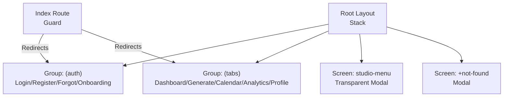
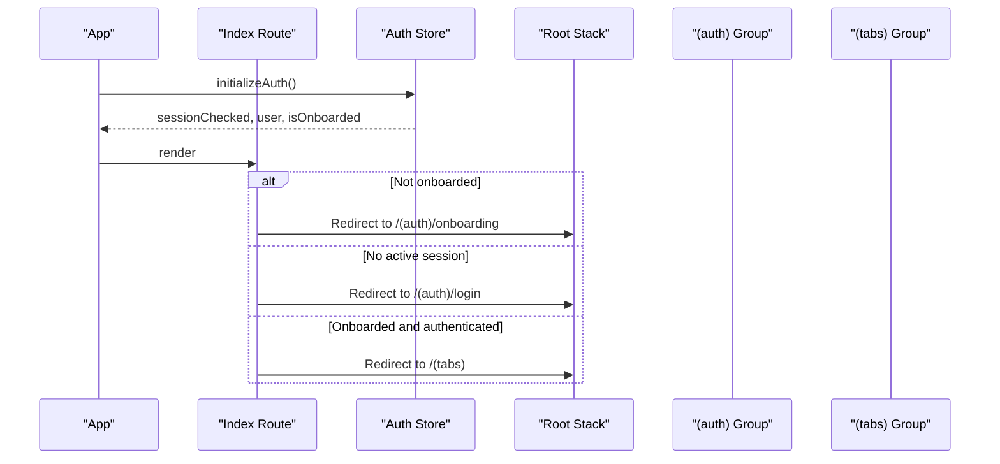
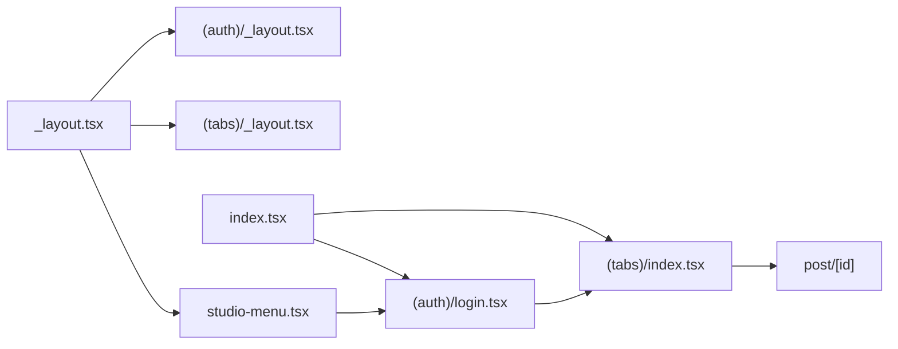

# Navigation Patterns & Guards

<cite>
**Referenced Files in This Document**
- [_layout.tsx](file://apps/mobile/src/app/_layout.tsx)
- [index.tsx](file://apps/mobile/src/app/index.tsx)
- [_layout.tsx (auth)](file://apps/mobile/src/app/(auth)/_layout.tsx)
- [_layout.tsx (tabs)](file://apps/mobile/src/app/(tabs)/_layout.tsx)
- [login.tsx](file://apps/mobile/src/app/(auth)/login.tsx)
- [index.tsx (tabs)](file://apps/mobile/src/app/(tabs)/index.tsx)
- [studio-menu.tsx](file://apps/mobile/src/app/studio-menu.tsx)
- [ScreenWrapper.tsx](file://apps/mobile/src/components/templates/ScreenWrapper.tsx)
- [useAuthStore.ts](file://apps/mobile/src/store/useAuthStore.ts)
- [useSafePress.ts](file://apps/mobile/src/hooks/useSafePress.ts)
</cite>

## Table of Contents
1. Introduction
2. Project Structure
3. Core Components
4. Architecture Overview
5. Detailed Component Analysis
6. Dependency Analysis
7. Performance Considerations
8. Troubleshooting Guide
9. Conclusion

## Introduction
This document explains the mobile app’s navigation patterns and routing guards, focusing on:
- The ScreenWrapper component for consistent screen context and safe area handling
- Routing guards that protect routes based on authentication state and onboarding status
- Programmatic navigation, deep linking via dynamic routes, and parameter passing
- Navigation state management using a global auth store
- Back button handling and reusable interaction utilities
- Modal presentations and transparent overlays such as the studio menu

The goal is to provide both high-level guidance and code-mapped details so you can implement robust, secure, and user-friendly navigation flows.

## Project Structure
The app uses Expo Router with grouped layouts and a root stack:
- Root layout defines the main Stack, including groups and special screens like a transparent modal menu
- Auth group contains login, register, forgot password, and onboarding
- Tabs group provides the primary tabbed experience
- A top-level index route acts as a guard to redirect users based on session and onboarding state
- Studio menu is presented as a transparent modal overlay

**Diagram sources**
- [_layout.tsx:27-55](file://apps/mobile/src/app/_layout.tsx#L27-L55)
- [index.tsx:6-26](file://apps/mobile/src/app/index.tsx#L6-L26)

**Section sources**
- [_layout.tsx:27-55](file://apps/mobile/src/app/_layout.tsx#L27-L55)
- [index.tsx:6-26](file://apps/mobile/src/app/index.tsx#L6-L26)

## Core Components
- ScreenWrapper: Provides consistent safe area insets, keyboard-aware scrolling, theme-aware background, and optional scroll behavior for all screens. It centralizes UI chrome and ensures predictable spacing across devices.
- Root Stack: Declares screens and presentation modes, including a transparent modal for the studio menu and a modal for not-found.
- Index Guard: Centralized entry point that redirects to onboarding, login, or tabs based on auth state and onboarding flag.
- Auth Store: Manages session checks, profile fetching, sign-out, and onboarding completion; used by guards and screens.
- Safe Press Hook: Prevents rapid double/triple taps and protects async actions and navigation calls.

Key responsibilities:
- Consistent screen chrome and safe areas via ScreenWrapper
- Centralized routing decisions via index guard
- Presentation modes for overlays and modals via root stack options
- Interaction safety via useSafePress

**Section sources**
- [ScreenWrapper.tsx:18-102](file://apps/mobile/src/components/templates/ScreenWrapper.tsx#L18-L102)
- [_layout.tsx:27-55](file://apps/mobile/src/app/_layout.tsx#L27-L55)
- [index.tsx:6-26](file://apps/mobile/src/app/index.tsx#L6-L26)
- [useAuthStore.ts:7-89](file://apps/mobile/src/store/useAuthStore.ts#L7-L89)
- [useSafePress.ts:9-33](file://apps/mobile/src/hooks/useSafePress.ts#L9-L33)

## Architecture Overview
The navigation architecture combines file-based routing with programmatic guards and presentation modes:
- Entry point (index) evaluates session and onboarding to redirect appropriately
- Root stack defines groups and screens, including a transparent modal for the studio menu
- Screens use ScreenWrapper for consistent layout and safe areas
- Auth state drives redirection and access control
- Transitions and animations are configured at the stack level

**Diagram sources**
- [index.tsx:6-26](file://apps/mobile/src/app/index.tsx#L6-L26)
- [_layout.tsx:27-55](file://apps/mobile/src/app/_layout.tsx#L27-L55)
- [useAuthStore.ts:24-61](file://apps/mobile/src/store/useAuthStore.ts#L24-L61)

## Detailed Component Analysis

### ScreenWrapper: Consistent Navigation Context and Screen Management
ScreenWrapper standardizes:
- Safe area insets for top/bottom margins
- Keyboard-aware content padding to avoid input overlap
- Theme-aware background and status bar styling
- Optional scrollable container with controlled keyboard behavior
- Optional non-scrollable mode for fixed-content screens

Usage pattern:
- Wrap every screen with ScreenWrapper to ensure consistent spacing and behavior
- Use props to toggle scrollability and inset inclusion per screen needs

Benefits:
- Reduces duplication of safe area and keyboard logic
- Ensures consistent visual rhythm across screens
- Improves accessibility and usability on varied devices

**Section sources**
- [ScreenWrapper.tsx:18-102](file://apps/mobile/src/components/templates/ScreenWrapper.tsx#L18-L102)

### Routing Guards: Protecting Routes Based on Authentication and Onboarding
The index route implements a simple but effective guard:
- While session is being checked, show a loading indicator
- If not onboarded, redirect to onboarding
- If no active user session, redirect to login
- Otherwise, redirect to the tabs group

Implementation notes:
- Uses a global auth store to read session state and onboarding flag
- Uses Redirect from expo-router to navigate without adding history entries
- Keeps guard logic centralized and easy to extend (e.g., role or subscription checks)

Extending guards:
- Add checks for roles or subscription levels before redirecting to protected routes
- Create a higher-order component or wrapper if multiple routes need similar checks

**Section sources**
- [index.tsx:6-26](file://apps/mobile/src/app/index.tsx#L6-L26)
- [useAuthStore.ts:24-61](file://apps/mobile/src/store/useAuthStore.ts#L24-L61)

### Programmatic Navigation and Deep Linking
Programmatic navigation:
- Use router.push to navigate to new screens
- Use router.replace to replace current screen (e.g., after successful login)
- Use router.back to return to previous screen (e.g., closing overlays)

Deep linking and parameters:
- Dynamic route /post/[id] demonstrates parameterized URLs
- Pass params via router.push with pathname and params object
- Access params within the target screen to load specific content

Examples in code:
- Login flow replaces to tabs after success
- Dashboard navigates to post detail with an id param

**Section sources**
- [login.tsx:107-136](file://apps/mobile/src/app/(auth)/login.tsx#L107-L136)
- [index.tsx (tabs):103-111](file://apps/mobile/src/app/(tabs)/index.tsx#L103-L111)

### Handling Navigation Parameters Across Screen Types
- Parameterized routes enable sharing context between screens (e.g., post id)
- Use router.push with params to pass data without global state when appropriate
- Validate and handle missing or invalid params defensively in target screens

Best practices:
- Keep payload minimal and only pass identifiers where possible
- Fetch full data in the target screen using the passed id
- Provide fallback UI for missing or invalid parameters

**Section sources**
- [index.tsx (tabs):103-111](file://apps/mobile/src/app/(tabs)/index.tsx#L103-L111)

### Navigation State Management
Global state via Zustand store:
- initializeAuth sets up session checks and real-time listeners
- fetchProfile retrieves user profile and updates state
- signOut clears session and resets state
- setOnboardingCompleted persists and updates onboarding flag

Integration with navigation:
- Index guard reads sessionChecked, user, and isOnboarded to decide redirects
- Screens can subscribe to user changes to update UI or trigger side effects

**Section sources**
- [useAuthStore.ts:7-89](file://apps/mobile/src/store/useAuthStore.ts#L7-L89)
- [index.tsx:6-26](file://apps/mobile/src/app/index.tsx#L6-L26)

### Back Button Handling and Reusable Utilities
Back handling:
- Overlays and menus call router.back to dismiss themselves
- Sign out flow returns to previous screen then replaces with login

Reusable utility:
- useSafePress prevents rapid repeated presses and protects async operations
- Wraps navigation and API calls to avoid duplicate submissions

Usage examples:
- Studio menu uses safePress for navigation items and sign out
- Login form uses safePress for authentication actions

**Section sources**
- [studio-menu.tsx:40-51](file://apps/mobile/src/app/studio-menu.tsx#L40-L51)
- [useSafePress.ts:9-33](file://apps/mobile/src/hooks/useSafePress.ts#L9-L33)

### Modal Presentations and Transparent Overlays
Presentation modes:
- studio-menu is registered with transparentModal presentation and slide animation
- +not-found is presented as a modal

Overlay implementation:
- studio-menu renders a full-screen backdrop and a left-docked drawer
- Tap backdrop or close button triggers router.back to dismiss

Use cases:
- Non-intrusive menus and settings panels
- Temporary overlays that preserve underlying navigation state

**Section sources**
- [_layout.tsx:43-51](file://apps/mobile/src/app/_layout.tsx#L43-L51)
- [studio-menu.tsx:33-51](file://apps/mobile/src/app/studio-menu.tsx#L33-L51)
- [studio-menu.tsx:189-193](file://apps/mobile/src/app/studio-menu.tsx#L189-L193)

### Complex Navigation Scenarios
- Post detail navigation with parameters shows how to pass context between screens
- Dashboard opens post detail with debounced navigation to prevent rapid re-navigation
- Login flow demonstrates replacing the stack after authentication to prevent back navigation into auth screens

Patterns:
- Use router.replace for final destinations after actions
- Debounce or guard against rapid navigation to avoid race conditions
- Combine guards with presentation modes for layered experiences

**Section sources**
- [index.tsx (tabs):103-111](file://apps/mobile/src/app/(tabs)/index.tsx#L103-L111)
- [login.tsx:107-136](file://apps/mobile/src/app/(auth)/login.tsx#L107-L136)

## Dependency Analysis
Navigation dependencies and relationships:
- Root layout depends on theme provider, query client, and safe area provider
- Index guard depends on auth store to determine redirects
- Auth screens depend on auth store and config store for branding and actions
- Tabs screens depend on auth store for user context and navigation to other screens
- Studio menu depends on router and auth store for navigation and sign out

**Diagram sources**
- [_layout.tsx:27-55](file://apps/mobile/src/app/_layout.tsx#L27-L55)
- [index.tsx:6-26](file://apps/mobile/src/app/index.tsx#L6-L26)
- [login.tsx:107-136](file://apps/mobile/src/app/(auth)/login.tsx#L107-L136)
- [index.tsx (tabs):103-111](file://apps/mobile/src/app/(tabs)/index.tsx#L103-L111)
- [studio-menu.tsx:40-51](file://apps/mobile/src/app/studio-menu.tsx#L40-L51)

**Section sources**
- [_layout.tsx:27-55](file://apps/mobile/src/app/_layout.tsx#L27-L55)
- [index.tsx:6-26](file://apps/mobile/src/app/index.tsx#L6-L26)
- [login.tsx:107-136](file://apps/mobile/src/app/(auth)/login.tsx#L107-L136)
- [index.tsx (tabs):103-111](file://apps/mobile/src/app/(tabs)/index.tsx#L103-L111)
- [studio-menu.tsx:40-51](file://apps/mobile/src/app/studio-menu.tsx#L40-L51)

## Performance Considerations
- Prefer router.replace for final destinations to avoid unnecessary history entries
- Use ScreenWrapper to minimize redundant safe area and keyboard calculations
- Debounce or guard rapid navigation to prevent overlapping transitions
- Avoid heavy computations inside render paths; fetch data in effects or callbacks
- Use transparent modal overlays sparingly to reduce rendering overhead

[No sources needed since this section provides general guidance]

## Troubleshooting Guide
Common issues and resolutions:
- Redirect loops: Ensure the index guard correctly handles sessionChecked and user states; verify that sign-in/sign-up flows replace routes instead of pushing
- Overlays not closing: Confirm router.back is called on backdrop press and close buttons; check that the route is registered with transparentModal
- Keyboard covering inputs: Verify ScreenWrapper is wrapping screens and that keyboardShouldPersistTaps is set appropriately
- Rapid double-tap issues: Wrap interactions with useSafePress to prevent duplicate submissions
- Missing params in deep links: Validate params in target screens and provide fallbacks

**Section sources**
- [index.tsx:6-26](file://apps/mobile/src/app/index.tsx#L6-L26)
- [studio-menu.tsx:189-193](file://apps/mobile/src/app/studio-menu.tsx#L189-L193)
- [ScreenWrapper.tsx:39-55](file://apps/mobile/src/components/templates/ScreenWrapper.tsx#L39-L55)
- [useSafePress.ts:9-33](file://apps/mobile/src/hooks/useSafePress.ts#L9-L33)

## Conclusion
The mobile app’s navigation system combines a centralized guard, consistent screen wrappers, and presentation modes to deliver a secure and polished experience. By leveraging the index route for access control, ScreenWrapper for consistent UI context, and transparent modals for overlays, the app maintains clarity and performance. Extend guards for roles and subscriptions as needed, and continue using programmatic navigation with parameters for flexible, deep-linkable flows.

[No sources needed since this section summarizes without analyzing specific files]