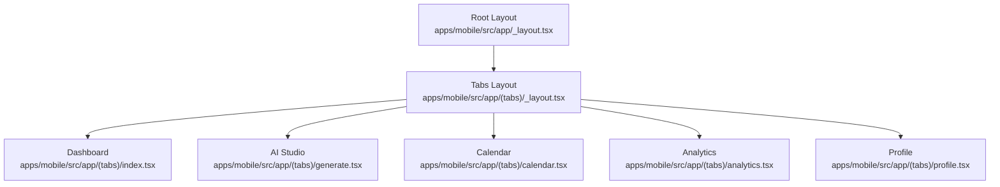
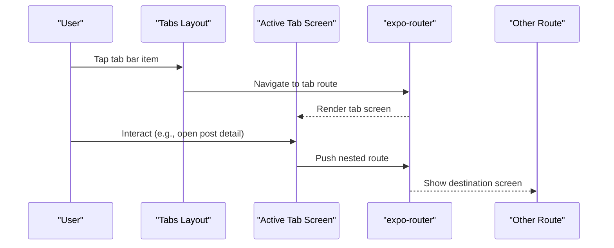
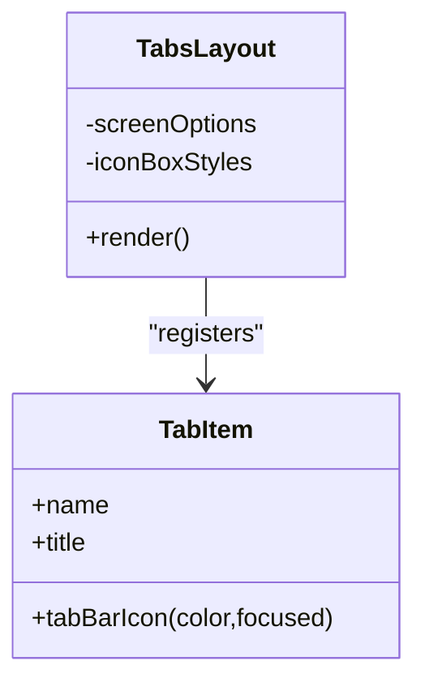
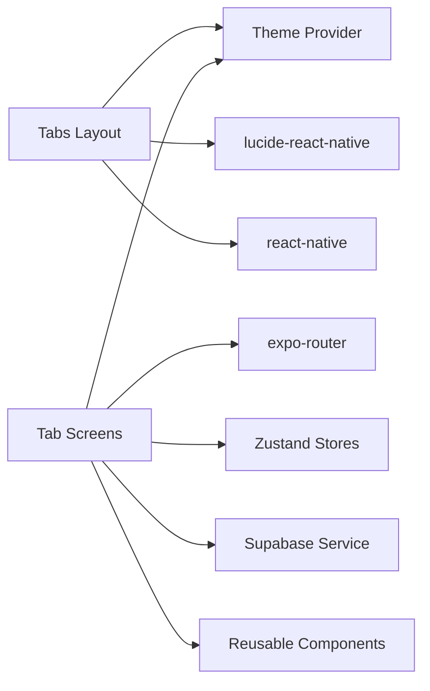

# Tab Navigation

<cite>
**Referenced Files in This Document**
- [_layout.tsx](file://apps/mobile/src/app/(tabs)/_layout.tsx)
- [index.tsx](file://apps/mobile/src/app/(tabs)/index.tsx)
- [analytics.tsx](file://apps/mobile/src/app/(tabs)/analytics.tsx)
- [calendar.tsx](file://apps/mobile/src/app/(tabs)/calendar.tsx)
- [generate.tsx](file://apps/mobile/src/app/(tabs)/generate.tsx)
- [profile.tsx](file://apps/mobile/src/app/(tabs)/profile.tsx)
- [_layout.tsx](file://apps/mobile/src/app/_layout.tsx)
- [ThemeProvider.tsx](file://apps/mobile/src/theme/ThemeProvider.tsx)
- [useAuthStore.ts](file://apps/mobile/src/store/useAuthStore.ts)
- [useConfigStore.ts](file://apps/mobile/src/store/useConfigStore.ts)
</cite>

## Table of Contents
1. [Introduction](#introduction)
2. [Project Structure](#project-structure)
3. [Core Components](#core-components)
4. [Architecture Overview](#architecture-overview)
5. [Detailed Component Analysis](#detailed-component-analysis)
6. [Dependency Analysis](#dependency-analysis)
7. [Performance Considerations](#performance-considerations)
8. [Troubleshooting Guide](#troubleshooting-guide)
9. [Conclusion](#conclusion)
10. [Appendices](#appendices)

## Introduction
This document explains the tab navigation system built with Expo Router’s tab navigator in the mobile app. It covers the (tabs) route group structure, how each tab is configured with icons and labels, and how navigation states are managed across tabs. The main tabs include Dashboard (home), Analytics, Calendar, AI Content Generation, and Profile. You will also find guidance on adding new tabs, customizing appearance, handling tab-specific navigation, persisting state, and optimizing performance for smooth tab switching.

## Project Structure
The tab-based UI lives under apps/mobile/src/app/(tabs). A dedicated layout file configures the tab bar and registers all screens. Each screen file implements a single tab’s content and behavior. The root layout wires the (tabs) group into the app’s stack and sets global providers like theme and query client.

**Diagram sources**
- [_layout.tsx:27-53](file://apps/mobile/src/app/_layout.tsx#L27-L53)
- [_layout.tsx:1-106](file://apps/mobile/src/app/(tabs)/_layout.tsx#L1-L106)

**Section sources**
- [_layout.tsx:27-53](file://apps/mobile/src/app/_layout.tsx#L27-L53)
- [_layout.tsx:1-106](file://apps/mobile/src/app/(tabs)/_layout.tsx#L1-L106)

## Core Components
- Tabs Layout: Defines the tab navigator, global tab styles, and registers each tab with title and icon.
- Screens: Each tab screen renders its own content and handles local interactions and navigation to other routes.
- Theme Provider: Supplies dynamic colors and modes used by the tab bar and screens.
- Stores: Auth and configuration stores provide user data and app settings consumed by screens.

Key responsibilities:
- Tab registration and styling: centralized in the tabs layout.
- Screen logic: isolated per tab file.
- Theming: centralized via ThemeProvider.
- Data access: via Zustand stores and Supabase services.

**Section sources**
- [_layout.tsx:1-106](file://apps/mobile/src/app/(tabs)/_layout.tsx#L1-L106)
- [ThemeProvider.tsx:1-97](file://apps/mobile/src/theme/ThemeProvider.tsx#L1-L97)
- [useAuthStore.ts:1-90](file://apps/mobile/src/store/useAuthStore.ts#L1-L90)
- [useConfigStore.ts:1-67](file://apps/mobile/src/store/useConfigStore.ts#L1-L67)

## Architecture Overview
The app uses a top-level Stack that includes the (tabs) group as one of its screens. Inside the (tabs) group, Expo Router renders a tab navigator with five tabs. Each tab screen can navigate to other routes using expo-router’s router API.

**Diagram sources**
- [_layout.tsx:27-53](file://apps/mobile/src/app/_layout.tsx#L27-L53)
- [_layout.tsx:1-106](file://apps/mobile/src/app/(tabs)/_layout.tsx#L1-L106)
- [index.tsx:103-111](file://apps/mobile/src/app/(tabs)/index.tsx#L103-L111)
- [calendar.tsx:104-112](file://apps/mobile/src/app/(tabs)/calendar.tsx#L104-L112)

## Detailed Component Analysis

### Tabs Layout: Configuration and Styling
- Registers five tabs: index (Dashboard), generate (AI Studio), calendar, analytics, profile.
- Sets tab bar options globally: hides header, active/inactive colors, label style, platform-specific heights, elevation/shadow.
- Each tab defines a title and a custom icon component that adapts to focus state and theme.

**Diagram sources**
- [_layout.tsx:10-95](file://apps/mobile/src/app/(tabs)/_layout.tsx#L10-L95)

Practical notes:
- Titles map to user-facing labels.
- Icons use lucide-react-native and adapt to theme colors and focus state.
- Platform differences are handled for iOS vs Android tab bar height and padding.

**Section sources**
- [_layout.tsx:10-95](file://apps/mobile/src/app/(tabs)/_layout.tsx#L10-L95)

### Dashboard (Home)
- Displays recent posts, quick stats, and a hero action to launch AI Studio.
- Uses expo-router to navigate to post details and schedule from dashboard actions.
- Pulls user data from auth store and fetches posts when available.

Navigation patterns:
- Navigates to post detail with params.
- Navigates to calendar to view schedule.

State considerations:
- Local loading and refresh state for pull-to-refresh.
- Guard against rapid navigation using a ref flag.

**Section sources**
- [index.tsx:14-111](file://apps/mobile/src/app/(tabs)/index.tsx#L14-L111)
- [index.tsx:113-259](file://apps/mobile/src/app/(tabs)/index.tsx#L113-L259)

### AI Content Generation (Generate)
- Provides two modes: text copywriter and image generator.
- Manages local state for platforms, content types, tones, prompts, and results.
- Integrates with auth store to update credits after generation and navigates to calendar or back to dashboard.

Flow highlights:
- Validates inputs before generation.
- Simulates async generation with feedback and toast notifications.
- Updates user credits and persists changes through the auth store.

**Section sources**
- [generate.tsx:94-176](file://apps/mobile/src/app/(tabs)/generate.tsx#L94-L176)
- [generate.tsx:184-429](file://apps/mobile/src/app/(tabs)/generate.tsx#L184-L429)

### Calendar
- Implements a weekly strip and timeline queue for scheduled posts.
- Filters posts by day and platform, supports editing and deletion with toast feedback.
- Navigates to post detail and to AI Studio for creating new posts.

Interaction flow:
- Select day to filter posts.
- Filter by channel pills.
- Open post detail or delete items.

**Section sources**
- [calendar.tsx:76-118](file://apps/mobile/src/app/(tabs)/calendar.tsx#L76-L118)
- [calendar.tsx:120-341](file://apps/mobile/src/app/(tabs)/calendar.tsx#L120-L341)

### Analytics
- Shows performance insights with time range selection and platform distribution metrics.
- Uses local state to switch between 7d, 30d, and 90d ranges.
- Visualizes reach, growth, and cadence with cards and progress bars.

**Section sources**
- [analytics.tsx:52-93](file://apps/mobile/src/app/(tabs)/analytics.tsx#L52-L93)
- [analytics.tsx:95-217](file://apps/mobile/src/app/(tabs)/analytics.tsx#L95-L217)

### Profile
- Displays creator identity, tier badge, and AI credits meter.
- Navigates to edit profile and paywall flows.
- Uses auth store for user data and safe navigation guard.

**Section sources**
- [profile.tsx:20-34](file://apps/mobile/src/app/(tabs)/profile.tsx#L20-L34)
- [profile.tsx:36-131](file://apps/mobile/src/app/(tabs)/profile.tsx#L36-L131)

## Dependency Analysis
- Tabs Layout depends on:
  - expo-router Tabs and Screens
  - lucide-react-native icons
  - theme provider for colors
  - react-native View, StyleSheet, Platform
- Screens depend on:
  - expo-router router for navigation
  - theme provider for consistent styling
  - zustand stores for user and config
  - supabase service for data operations
  - reusable components (GlassCard, AnimatedButton, Badge, ScreenWrapper)

**Diagram sources**
- [_layout.tsx:1-106](file://apps/mobile/src/app/(tabs)/_layout.tsx#L1-L106)
- [index.tsx:1-20](file://apps/mobile/src/app/(tabs)/index.tsx#L1-L20)
- [generate.tsx:1-40](file://apps/mobile/src/app/(tabs)/generate.tsx#L1-L40)
- [calendar.tsx:1-22](file://apps/mobile/src/app/(tabs)/calendar.tsx#L1-L22)
- [analytics.tsx:1-21](file://apps/mobile/src/app/(tabs)/analytics.tsx#L1-L21)
- [profile.tsx:1-18](file://apps/mobile/src/app/(tabs)/profile.tsx#L1-L18)
- [ThemeProvider.tsx:1-97](file://apps/mobile/src/theme/ThemeProvider.tsx#L1-L97)
- [useAuthStore.ts:1-90](file://apps/mobile/src/store/useAuthStore.ts#L1-L90)
- [useConfigStore.ts:1-67](file://apps/mobile/src/store/useConfigStore.ts#L1-L67)

**Section sources**
- [_layout.tsx:1-106](file://apps/mobile/src/app/(tabs)/_layout.tsx#L1-L106)
- [ThemeProvider.tsx:1-97](file://apps/mobile/src/theme/ThemeProvider.tsx#L1-L97)
- [useAuthStore.ts:1-90](file://apps/mobile/src/store/useAuthStore.ts#L1-L90)
- [useConfigStore.ts:1-67](file://apps/mobile/src/store/useConfigStore.ts#L1-L67)

## Performance Considerations
- Keep tab screens lightweight: avoid heavy computations on render; defer work to effects or callbacks.
- Use memoization where appropriate to prevent unnecessary re-renders within screens.
- Avoid deep nesting inside tab screens; prefer flat layouts and reusable components.
- Minimize network calls on mount; cache data and use pull-to-refresh only when needed.
- Debounce or throttle frequent state updates (e.g., input fields) to reduce re-renders.
- Use safe navigation guards to prevent rapid repeated pushes that can cause jank.
- Prefer lazy loading for non-critical assets and modals.

[No sources needed since this section provides general guidance]

## Troubleshooting Guide
Common issues and resolutions:
- Tab not appearing: Ensure the tab is registered in the tabs layout with a unique name matching the file path.
- Icon not showing: Verify icon imports and that the tabBarIcon function returns a valid React node.
- Navigation errors: Confirm route paths match the file structure and parameters are passed correctly.
- Theme not applied: Ensure components are wrapped by ThemeProvider and use theme hooks consistently.
- State resets on tab switch: If you need persistence across tab switches, move critical state to a store or persist it locally.

**Section sources**
- [_layout.tsx:10-95](file://apps/mobile/src/app/(tabs)/_layout.tsx#L10-L95)
- [index.tsx:103-111](file://apps/mobile/src/app/(tabs)/index.tsx#L103-L111)
- [calendar.tsx:104-112](file://apps/mobile/src/app/(tabs)/calendar.tsx#L104-L112)
- [profile.tsx:27-34](file://apps/mobile/src/app/(tabs)/profile.tsx#L27-L34)

## Conclusion
The tab navigation system is centered around a clean tabs layout that configures the tab bar and registers each tab with titles and icons. Each tab screen manages its own state and navigation while leveraging shared theme and stores. By following the patterns shown here, you can add new tabs, customize appearance, handle navigation safely, and optimize performance for smooth user experiences.

[No sources needed since this section summarizes without analyzing specific files]

## Appendices

### How to Add a New Tab
Steps:
1. Create a new file under apps/mobile/src/app/(tabs)/ with the desired route name.
2. Implement the screen component with your content and navigation logic.
3. Register the tab in the tabs layout by adding a Tabs.Screen entry with name, title, and tabBarIcon.
4. Test navigation from other screens to the new tab.

Reference locations:
- Tabs layout registration pattern: [tabs layout](file://apps/mobile/src/app/(tabs)/_layout.tsx#L38-L93)
- Example screen usage of router: [dashboard navigation](file://apps/mobile/src/app/(tabs)/index.tsx#L103-L111)

**Section sources**
- [_layout.tsx:38-93](file://apps/mobile/src/app/(tabs)/_layout.tsx#L38-L93)
- [index.tsx:103-111](file://apps/mobile/src/app/(tabs)/index.tsx#L103-L111)

### Customizing Tab Appearance
- Change active/inactive colors via screenOptions in the tabs layout.
- Adjust label font size, weight, and spacing in tabBarLabelStyle.
- Modify tab bar background, borders, and platform-specific heights in tabBarStyle.
- Customize icons by returning themed views with lucide-react-native icons.

Reference locations:
- Global tab options: [tabs layout screenOptions](file://apps/mobile/src/app/(tabs)/_layout.tsx#L12-L36)
- Icon customization: [tabBarIcon examples](file://apps/mobile/src/app/(tabs)/_layout.tsx#L40-L92)

**Section sources**
- [_layout.tsx:12-36](file://apps/mobile/src/app/(tabs)/_layout.tsx#L12-L36)
- [_layout.tsx:40-92](file://apps/mobile/src/app/(tabs)/_layout.tsx#L40-L92)

### Handling Tab-Specific Navigation
- Use expo-router’s router.push to navigate to nested routes or sibling tabs.
- Pass parameters via pathname and params for dynamic routes.
- Guard against rapid navigation with refs to prevent duplicate pushes.

Examples:
- Dashboard navigating to post detail: [navigation example](file://apps/mobile/src/app/(tabs)/index.tsx#L103-L111)
- Calendar navigating to post detail: [navigation example](file://apps/mobile/src/app/(tabs)/calendar.tsx#L104-L112)

**Section sources**
- [index.tsx:103-111](file://apps/mobile/src/app/(tabs)/index.tsx#L103-L111)
- [calendar.tsx:104-112](file://apps/mobile/src/app/(tabs)/calendar.tsx#L104-L112)

### Managing Tab State Persistence
- For cross-tab persistence, consider storing critical state in a Zustand store or secure storage.
- The theme provider demonstrates persistence via SecureStore for palette and mode preferences.
- For tab-specific ephemeral state, keep it local to the screen unless you need it across navigations.

References:
- Theme persistence pattern: [theme provider:25-50](file://apps/mobile/src/theme/ThemeProvider.tsx#L25-L50)
- Auth store initialization and session handling: [auth store:24-61](file://apps/mobile/src/store/useAuthStore.ts#L24-L61)

**Section sources**
- [ThemeProvider.tsx:25-50](file://apps/mobile/src/theme/ThemeProvider.tsx#L25-L50)
- [useAuthStore.ts:24-61](file://apps/mobile/src/store/useAuthStore.ts#L24-L61)