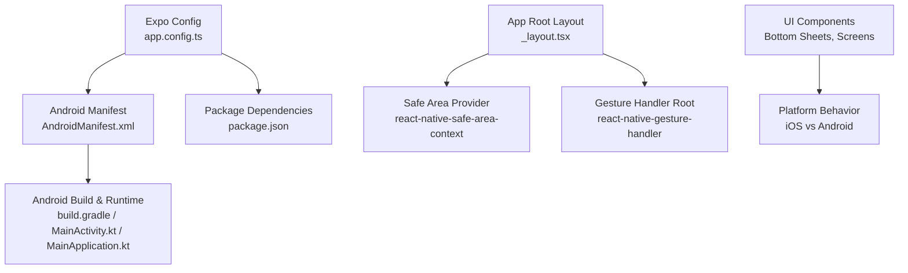
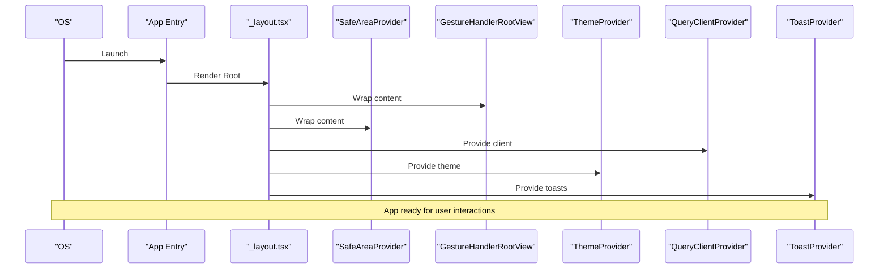
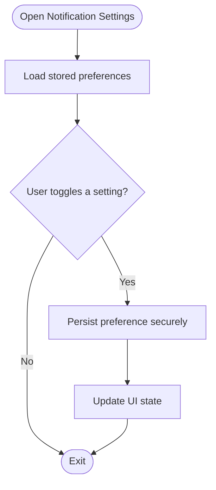
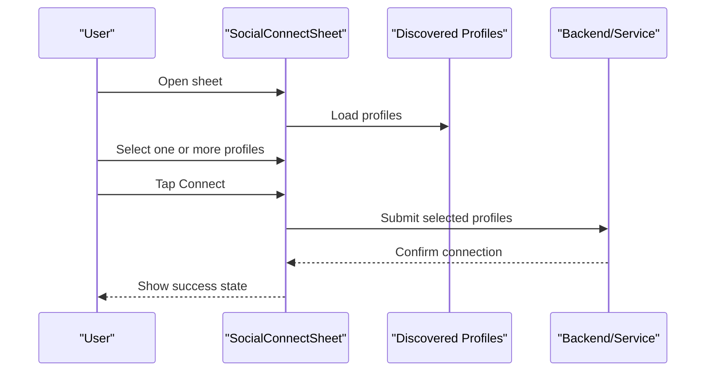
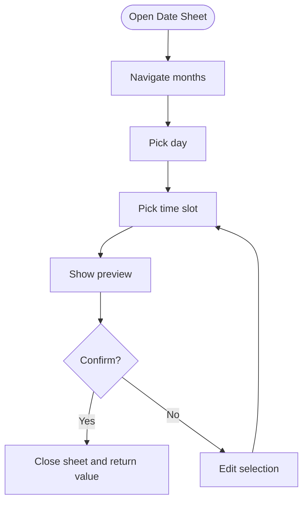
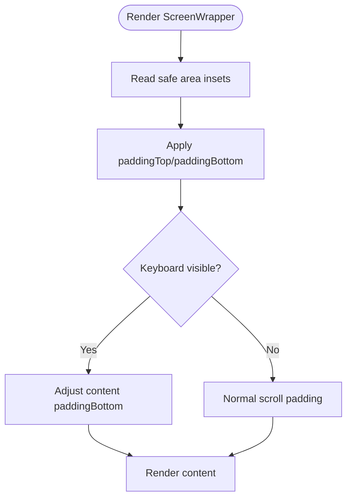
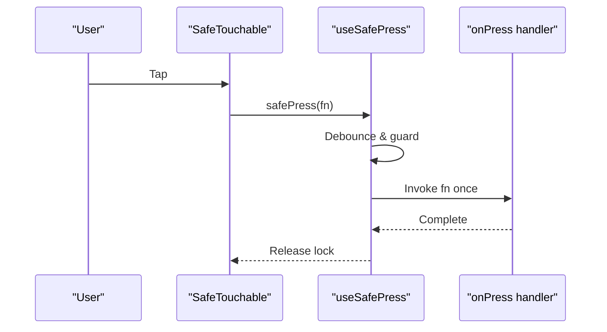
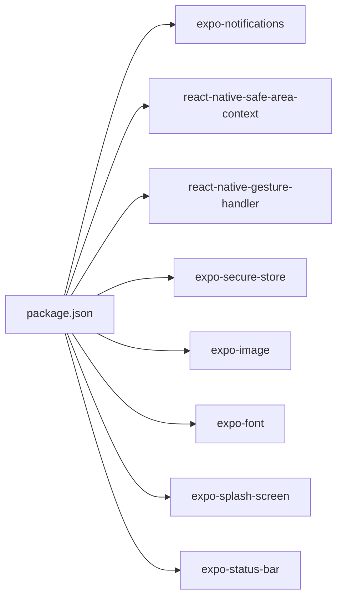

# Platform-Specific Features

<cite>
**Referenced Files in This Document**
- [app.config.ts](file://apps/mobile/app.config.ts)
- [AndroidManifest.xml](file://apps/mobile/android/app/src/main/AndroidManifest.xml)
- [build.gradle](file://apps/mobile/android/app/build.gradle)
- [MainActivity.kt](file://apps/mobile/android/app/src/main/java/com/socialpilot/aipro/MainActivity.kt)
- [MainApplication.kt](file://apps/mobile/android/app/src/main/java/com/socialpilot/aipro/MainApplication.kt)
- [package.json](file://apps/mobile/package.json)
- [eas.json](file://apps/mobile/eas.json)
- [_layout.tsx](file://apps/mobile/src/app/_layout.tsx)
- [ScreenWrapper.tsx](file://apps/mobile/src/components/templates/ScreenWrapper.tsx)
- [ScheduleDatePickerSheet.tsx](file://apps/mobile/src/components/organisms/ScheduleDatePickerSheet.tsx)
- [SocialConnectSheet.tsx](file://apps/mobile/src/components/organisms/SocialConnectSheet.tsx)
- [useSafePress.ts](file://apps/mobile/src/hooks/useSafePress.ts)
- [SafeTouchable.tsx](file://apps/mobile/src/components/atoms/SafeTouchable.tsx)
- [notification-settings.tsx](file://apps/mobile/src/app/notification-settings.tsx)
</cite>

## Table of Contents
1. Introduction
2. Project Structure
3. Core Components
4. Architecture Overview
5. Detailed Component Analysis
6. Dependency Analysis
7. Performance Considerations
8. Troubleshooting Guide
9. Conclusion
10. Appendices

## Introduction
This document explains platform-specific features and native integrations for the mobile application, focusing on push notifications setup for iOS and Android, camera/media integration considerations, device-specific optimizations, bottom sheets for date selection and social account connections, safe area handling, gesture handling, platform differences, performance considerations, testing strategies, guidelines for adding new native features, permissions management, dependency handling, and deployment to iOS App Store and Google Play Store.

## Project Structure
The mobile app is built with Expo and React Native. The configuration and native scaffolding are under apps/mobile, with:
- Expo config and plugins at the root of the mobile app
- Android native files under android/app
- Shared UI components and screens under src
- Global layout and providers in src/app/_layout.tsx

**Diagram sources**
- [app.config.ts:1-42](file://apps/mobile/app.config.ts#L1-L42)
- [AndroidManifest.xml:1-32](file://apps/mobile/android/app/src/main/AndroidManifest.xml#L1-L32)
- [build.gradle:1-183](file://apps/mobile/android/app/build.gradle#L1-L183)
- [_layout.tsx:1-98](file://apps/mobile/src/app/_layout.tsx#L1-L98)

**Section sources**
- [app.config.ts:1-42](file://apps/mobile/app.config.ts#L1-L42)
- [AndroidManifest.xml:1-32](file://apps/mobile/android/app/src/main/AndroidManifest.xml#L1-L32)
- [build.gradle:1-183](file://apps/mobile/android/app/build.gradle#L1-L183)
- [_layout.tsx:1-98](file://apps/mobile/src/app/_layout.tsx#L1-L98)

## Core Components
- Push Notifications:
  - expo-notifications is included as a dependency for cross-platform notification support.
  - Notification preferences are persisted using expo-secure-store and exposed via a settings screen.
- Camera/Media Integration:
  - expo-image is available for optimized image rendering; camera capture flows can be integrated via standard Expo media APIs where needed.
- Bottom Sheets:
  - ScheduleDatePickerSheet provides a modal-based sheet for selecting date and time slots.
  - SocialConnectSheet provides a modal-based sheet for connecting/disconnecting social accounts and managing profiles.
- Safe Area Handling:
  - ScreenWrapper uses react-native-safe-area-context to apply top/bottom insets and keyboard-aware scrolling.
- Gesture Handling:
  - react-native-gesture-handler is enabled at the root via GestureHandlerRootView.
  - useSafePress and SafeTouchable protect against rapid taps and double-triggering async actions.

**Section sources**
- [package.json:13-44](file://apps/mobile/package.json#L13-L44)
- [notification-settings.tsx:33-53](file://apps/mobile/src/app/notification-settings.tsx#L33-L53)
- [ScreenWrapper.tsx:1-126](file://apps/mobile/src/components/templates/ScreenWrapper.tsx#L1-L126)
- [_layout.tsx:1-98](file://apps/mobile/src/app/_layout.tsx#L1-L98)
- [useSafePress.ts:1-34](file://apps/mobile/src/hooks/useSafePress.ts#L1-L34)
- [SafeTouchable.tsx:1-20](file://apps/mobile/src/components/atoms/SafeTouchable.tsx#L1-L20)

## Architecture Overview
The app bootstraps with a root layout that sets up providers (theme, query client, toast, safe area, gestures). Android manifest declares permissions and deep link scheme. Expo config centralizes app metadata and plugin usage.

**Diagram sources**
- [_layout.tsx:1-98](file://apps/mobile/src/app/_layout.tsx#L1-L98)

**Section sources**
- [_layout.tsx:1-98](file://apps/mobile/src/app/_layout.tsx#L1-L98)

## Detailed Component Analysis

### Push Notifications Setup (iOS and Android)
- Dependencies:
  - expo-notifications is declared in package dependencies.
- Configuration:
  - Android manifest includes system-level permissions and meta-data for updates; notifications typically require additional permission declarations depending on target SDK and behavior.
  - Expo config defines app identity and schemes used by deep links and potentially notification actions.
- User Preferences:
  - A dedicated settings screen persists toggles for reminders/alerts using secure storage.
- Implementation Notes:
  - Request runtime permissions before scheduling or displaying notifications.
  - On iOS, configure notification categories and presentation options through Expo config and native capabilities as required by your flow.
  - On Android, ensure proper permission declarations and handle Do Not Disturb and channel configurations if needed.

**Diagram sources**
- [notification-settings.tsx:33-53](file://apps/mobile/src/app/notification-settings.tsx#L33-L53)

**Section sources**
- [package.json:13-44](file://apps/mobile/package.json#L13-L44)
- [AndroidManifest.xml:1-32](file://apps/mobile/android/app/src/main/AndroidManifest.xml#L1-L32)
- [app.config.ts:1-42](file://apps/mobile/app.config.ts#L1-L42)
- [notification-settings.tsx:33-53](file://apps/mobile/src/app/notification-settings.tsx#L33-L53)

### Camera and Media Capture Integration
- Current State:
  - expo-image is present for optimized image display.
  - No explicit camera picker implementation was found in the analyzed files.
- Recommended Approach:
  - Use Expo Image Picker/Camera APIs to request permissions and capture/select media.
  - Handle platform differences in permission prompts and result formats.
  - Integrate with existing UI (e.g., avatar editing) by updating selected media state and persisting securely when necessary.

[No sources needed since this section provides general guidance based on available dependencies]

### Bottom Sheets: Date Selection and Social Account Connections
- ScheduleDatePickerSheet:
  - Modal-based sheet with month navigation, day grid, time slot selection, preview banner, and confirm action.
  - Uses theme tokens for consistent styling across platforms.
- SocialConnectSheet:
  - Modal-based sheet supporting profile discovery, multi-selection, security messaging, and disconnect flow.
  - Provides helper guide and visual feedback during processing.

**Diagram sources**
- [SocialConnectSheet.tsx:1-471](file://apps/mobile/src/components/organisms/SocialConnectSheet.tsx#L1-L471)

**Diagram sources**
- [ScheduleDatePickerSheet.tsx:1-374](file://apps/mobile/src/components/organisms/ScheduleDatePickerSheet.tsx#L1-L374)

**Section sources**
- [ScheduleDatePickerSheet.tsx:1-374](file://apps/mobile/src/components/organisms/ScheduleDatePickerSheet.tsx#L1-L374)
- [SocialConnectSheet.tsx:1-471](file://apps/mobile/src/components/organisms/SocialConnectSheet.tsx#L1-L471)

### Safe Area Handling
- Root provider:
  - SafeAreaProvider wraps the entire app to handle notches, home indicators, and system chrome.
- Screen wrapper:
  - ScreenWrapper applies top/bottom padding based on safe area insets and adjusts scroll content for keyboard visibility.
- Platform differences:
  - Keyboard events differ between iOS and Android; the wrapper listens to appropriate events per platform.

**Diagram sources**
- [_layout.tsx:1-98](file://apps/mobile/src/app/_layout.tsx#L1-L98)
- [ScreenWrapper.tsx:1-126](file://apps/mobile/src/components/templates/ScreenWrapper.tsx#L1-L126)

**Section sources**
- [_layout.tsx:1-98](file://apps/mobile/src/app/_layout.tsx#L1-L98)
- [ScreenWrapper.tsx:1-126](file://apps/mobile/src/components/templates/ScreenWrapper.tsx#L1-L126)

### Gesture Handling
- Root-level gesture handling:
  - GestureHandlerRootView enables advanced gestures throughout the app.
- Interaction safety:
  - useSafePress prevents rapid repeated triggers and ensures async operations complete before allowing another press.
  - SafeTouchable integrates the hook into touch targets.

**Diagram sources**
- [_layout.tsx:1-98](file://apps/mobile/src/app/_layout.tsx#L1-L98)
- [useSafePress.ts:1-34](file://apps/mobile/src/hooks/useSafePress.ts#L1-L34)
- [SafeTouchable.tsx:1-20](file://apps/mobile/src/components/atoms/SafeTouchable.tsx#L1-L20)

**Section sources**
- [_layout.tsx:1-98](file://apps/mobile/src/app/_layout.tsx#L1-L98)
- [useSafePress.ts:1-34](file://apps/mobile/src/hooks/useSafePress.ts#L1-L34)
- [SafeTouchable.tsx:1-20](file://apps/mobile/src/components/atoms/SafeTouchable.tsx#L1-L20)

## Dependency Analysis
Key dependencies and their roles:
- expo-notifications: Cross-platform notifications
- react-native-safe-area-context: Safe area insets
- react-native-gesture-handler: Gesture system
- expo-secure-store: Secure local storage for preferences/tokens
- expo-image: Optimized image rendering
- expo-font, expo-splash-screen, expo-status-bar: UX and platform polish

**Diagram sources**
- [package.json:13-44](file://apps/mobile/package.json#L13-L44)

**Section sources**
- [package.json:13-44](file://apps/mobile/package.json#L13-L44)

## Performance Considerations
- Android build optimizations:
  - R8/minify and resource shrinking can be enabled in release builds.
  - PNG crunching can be enabled to reduce asset size.
  - Hermes can be enabled for improved JS execution speed and memory usage.
- UI performance:
  - Use memoization for expensive components where applicable.
  - Avoid unnecessary re-renders in sheets and lists.
- Networking:
  - Configure caching and retry policies in the query client to reduce network overhead.

**Section sources**
- [build.gradle:66-123](file://apps/mobile/android/app/build.gradle#L66-L123)
- [build.gradle:155-183](file://apps/mobile/android/app/build.gradle#L155-L183)
- [_layout.tsx:17-25](file://apps/mobile/src/app/_layout.tsx#L17-L25)

## Troubleshooting Guide
- Permissions:
  - Ensure required permissions are declared in Android manifest for storage, overlay, and vibration if used.
  - For notifications, verify runtime permission requests and platform-specific settings.
- Deep Links:
  - Verify custom scheme is registered in both Expo config and Android manifest intent filters.
- Safe Area:
  - If content overlaps system UI, confirm SafeAreaProvider is wrapping the root and ScreenWrapper is applied consistently.
- Gesture Conflicts:
  - If gestures do not work as expected, ensure GestureHandlerRootView is at the root and nested navigators are properly configured.

**Section sources**
- [AndroidManifest.xml:1-32](file://apps/mobile/android/app/src/main/AndroidManifest.xml#L1-L32)
- [app.config.ts:1-42](file://apps/mobile/app.config.ts#L1-L42)
- [_layout.tsx:1-98](file://apps/mobile/src/app/_layout.tsx#L1-L98)

## Conclusion
The mobile app leverages Expo and React Native to provide a cohesive experience across iOS and Android. It includes robust foundations for notifications, safe area handling, gesture handling, and reusable bottom sheets for scheduling and social account management. Android build optimizations are available for production releases. Follow the guidelines below to extend native features safely and deploy confidently to app stores.

## Appendices

### Platform Differences in UI Behavior
- Safe area and keyboard handling vary by platform; ScreenWrapper abstracts these differences.
- Gesture behaviors and animations may feel different due to platform defaults; react-native-reanimated and gesture handler help unify experiences.
- Notification permissions and behaviors differ; always test on real devices for each platform.

[No sources needed since this section provides general guidance]

### Testing Strategies
- Unit tests:
  - Test hooks like useSafePress for debouncing and guard logic.
- Component tests:
  - Validate bottom sheet interactions (selection, confirmation) and state transitions.
- Integration tests:
  - Simulate notification permission flows and preference persistence.
- Device testing:
  - Test on iOS and Android devices for safe area, keyboard, and gesture behavior.

[No sources needed since this section provides general guidance]

### Guidelines for Adding New Native Features
- Add dependencies in package.json and run native linking/build as required by Expo.
- Declare any required permissions in Android manifest and add iOS capabilities in Expo config or native project as needed.
- Wrap new screens with SafeAreaProvider and consider using ScreenWrapper for consistent safe area and keyboard handling.
- Use GestureHandlerRootView for advanced gestures and integrate SafeTouchable for interaction safety.

[No sources needed since this section provides general guidance]

### Managing Platform-Specific Dependencies
- Centralize shared dependencies in package.json.
- Keep platform-specific code isolated in platform folders or conditional imports.
- Use Expo config plugins to manage native modules and capabilities.

[No sources needed since this section provides general guidance]

### Deployment Considerations
- iOS App Store:
  - Ensure all required capabilities and entitlements are configured in Expo config and native project.
  - Validate notification permissions and deep link schemes.
  - Use EAS Build and submit via EAS Submit or App Store Connect.
- Google Play Store:
  - Configure signing in build.gradle and generate a release keystore for production.
  - Enable minification and resource shrinking for release builds.
  - Use EAS Build and submit via EAS Submit or Play Console.

**Section sources**
- [eas.json:1-18](file://apps/mobile/eas.json#L1-L18)
- [build.gradle:100-123](file://apps/mobile/android/app/build.gradle#L100-L123)
- [app.config.ts:1-42](file://apps/mobile/app.config.ts#L1-L42)