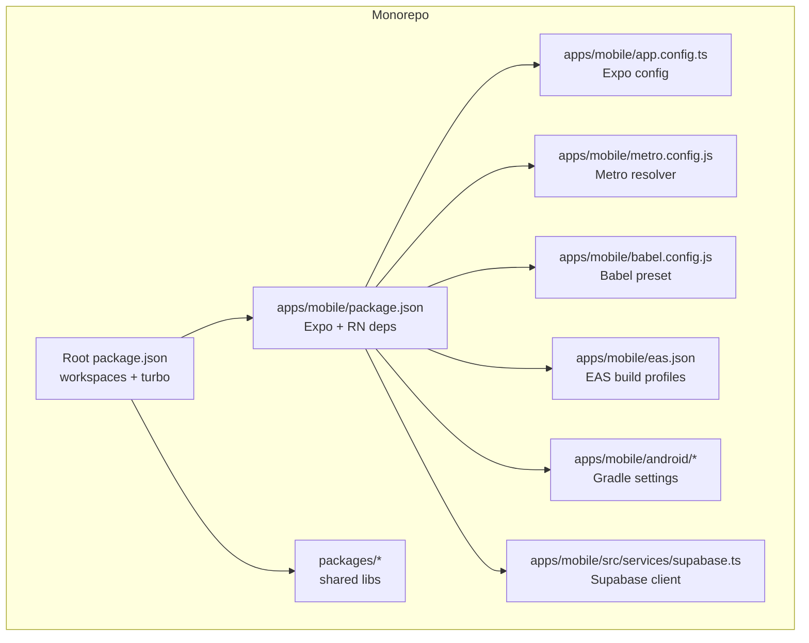
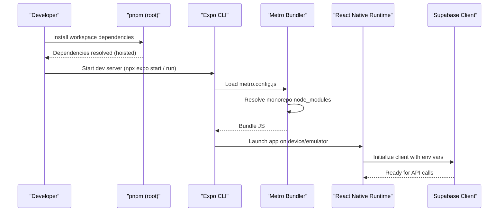
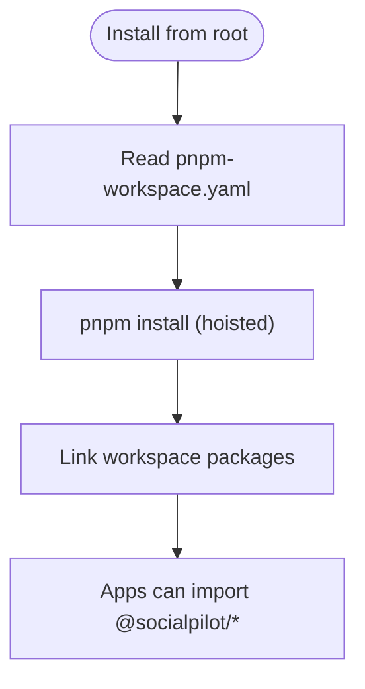
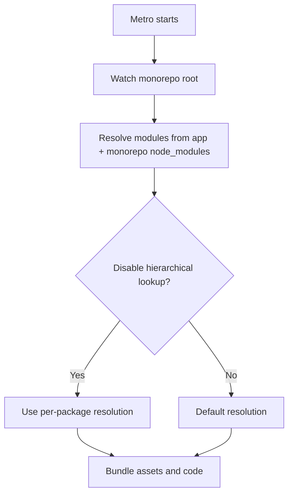
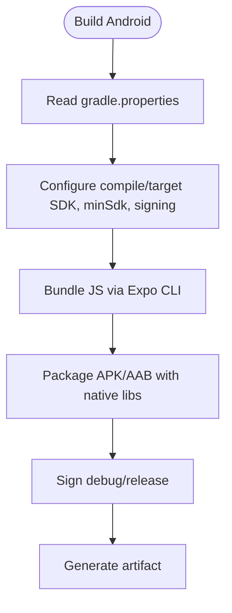
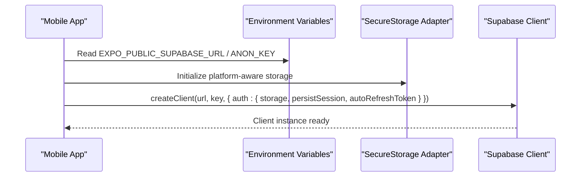
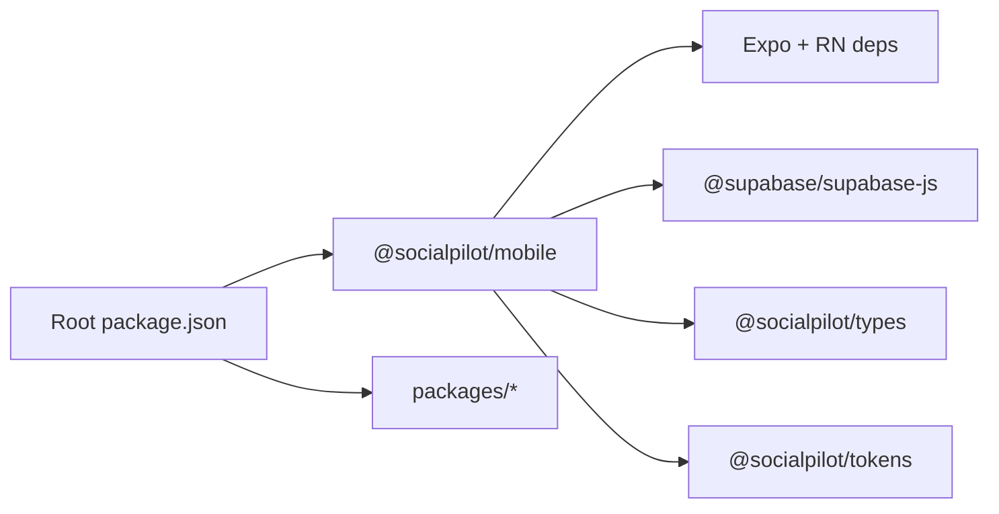

# Setup & Configuration

<cite>
**Referenced Files in This Document**
- [package.json](file://package.json)
- [pnpm-workspace.yaml](file://pnpm-workspace.yaml)
- [.npmrc](file://.npmrc)
- [apps/mobile/package.json](file://apps/mobile/package.json)
- [apps/mobile/app.config.ts](file://apps/mobile/app.config.ts)
- [apps/mobile/babel.config.js](file://apps/mobile/babel.config.js)
- [apps/mobile/metro.config.js](file://apps/mobile/metro.config.js)
- [apps/mobile/eas.json](file://apps/mobile/eas.json)
- [apps/mobile/android/gradle.properties](file://apps/mobile/android/gradle.properties)
- [apps/mobile/android/app/build.gradle](file://apps/mobile/android/app/build.gradle)
- [apps/mobile/src/services/supabase.ts](file://apps/mobile/src/services/supabase.ts)
- [scripts/setup-all.cjs](file://scripts/setup-all.cjs)
- [INSTALLATION.md](file://INSTALLATION.md)
- [TROUBLESHOOTING.md](file://TROUBLESHOOTING.md)
</cite>

## Table of Contents
1. [Introduction](#introduction)
2. [Project Structure](#project-structure)
3. [Core Components](#core-components)
4. [Architecture Overview](#architecture-overview)
5. [Detailed Component Analysis](#detailed-component-analysis)
6. [Dependency Analysis](#dependency-analysis)
7. [Performance Considerations](#performance-considerations)
8. [Troubleshooting Guide](#troubleshooting-guide)
9. [Conclusion](#conclusion)

## Introduction
This document provides a complete setup and configuration guide for the Expo/React Native mobile application within a pnpm monorepo. It covers environment prerequisites, project structure, dependency management, key configuration files (app.config.ts, babel.config.js, metro.config.js), Supabase client setup, environment variables, and platform-specific requirements for iOS and Android. It also includes troubleshooting guidance for common setup issues.

## Project Structure
The repository is a pnpm workspace containing multiple apps and shared packages:
- apps/mobile: Expo/React Native app using Expo Router and TypeScript
- apps/admin: Next.js admin panel (not the focus here)
- packages/*: Shared libraries (e.g., types, tokens) consumed by apps
- scripts: Automation helpers (e.g., setup-all.cjs)
- supabase: Local config and migrations for backend services

Key workspace and tooling:
- Root package manager is pnpm with hoisted linking
- Turbo orchestrates tasks across workspaces
- Mobile app uses Expo CLI, Metro bundler, Babel preset for Expo, and EAS for builds

**Diagram sources**
- [package.json:1-21](file://package.json#L1-L21)
- [apps/mobile/package.json:1-53](file://apps/mobile/package.json#L1-L53)
- [apps/mobile/app.config.ts:1-42](file://apps/mobile/app.config.ts#L1-L42)
- [apps/mobile/metro.config.js:1-22](file://apps/mobile/metro.config.js#L1-L22)
- [apps/mobile/babel.config.js:1-7](file://apps/mobile/babel.config.js#L1-L7)
- [apps/mobile/eas.json:1-18](file://apps/mobile/eas.json#L1-L18)
- [apps/mobile/android/app/build.gradle:1-183](file://apps/mobile/android/app/build.gradle#L1-L183)
- [apps/mobile/src/services/supabase.ts:1-41](file://apps/mobile/src/services/supabase.ts#L1-L41)

**Section sources**
- [package.json:1-21](file://package.json#L1-L21)
- [pnpm-workspace.yaml:1-4](file://pnpm-workspace.yaml#L1-L4)
- [apps/mobile/package.json:1-53](file://apps/mobile/package.json#L1-L53)

## Core Components
- Development environment: Node.js v18+ or v20+, pnpm, Expo CLI, platform SDKs (iOS/Android)
- Workspace dependencies: pnpm workspaces with hoisted linker configured at root
- Mobile app entry: Expo Router-based app with TypeScript and React Native
- Build system: Metro bundler with custom resolution for monorepo; Babel preset for Expo
- Platform configs: Android Gradle properties and build script; EAS profiles for development/preview/production
- Backend integration: Supabase client with secure storage adapter for sessions

**Section sources**
- [INSTALLATION.md:7-11](file://INSTALLATION.md#L7-L11)
- [apps/mobile/package.json:1-53](file://apps/mobile/package.json#L1-L53)
- [apps/mobile/metro.config.js:1-22](file://apps/mobile/metro.config.js#L1-L22)
- [apps/mobile/babel.config.js:1-7](file://apps/mobile/babel.config.js#L1-L7)
- [apps/mobile/android/gradle.properties:1-63](file://apps/mobile/android/gradle.properties#L1-L63)
- [apps/mobile/android/app/build.gradle:1-183](file://apps/mobile/android/app/build.gradle#L1-L183)
- [apps/mobile/eas.json:1-18](file://apps/mobile/eas.json#L1-L18)
- [apps/mobile/src/services/supabase.ts:1-41](file://apps/mobile/src/services/supabase.ts#L1-L41)

## Architecture Overview
High-level setup flow from environment to running the mobile app:

**Diagram sources**
- [package.json:1-21](file://package.json#L1-L21)
- [pnpm-workspace.yaml:1-4](file://pnpm-workspace.yaml#L1-L4)
- [apps/mobile/metro.config.js:1-22](file://apps/mobile/metro.config.js#L1-L22)
- [apps/mobile/package.json:1-53](file://apps/mobile/package.json#L1-L53)
- [apps/mobile/src/services/supabase.ts:1-41](file://apps/mobile/src/services/supabase.ts#L1-L41)

## Detailed Component Analysis

### Environment Prerequisites
- Node.js: v18+ or v20+
- pnpm: installed globally
- Supabase account and project created
- Platform toolchains:
  - Android: Android Studio, SDK, NDK, Gradle (managed via Expo/RN defaults)
  - iOS: Xcode and command-line tools (for building on macOS)

Run the automated setup wizard to scaffold environment files and install dependencies:
- Execute the setup script from the repository root
- It creates starter .env files if missing and runs pnpm install

**Section sources**
- [INSTALLATION.md:7-11](file://INSTALLATION.md#L7-L11)
- [scripts/setup-all.cjs:21-53](file://scripts/setup-all.cjs#L21-L53)

### Workspace and Dependency Management
- Workspaces include apps/* and packages/*
- Root package manager pinned to pnpm
- Hoisted linker enabled to resolve cross-package dependencies reliably
- Scripts use Turbo for orchestration

**Diagram sources**
- [pnpm-workspace.yaml:1-4](file://pnpm-workspace.yaml#L1-L4)
- [package.json:1-21](file://package.json#L1-L21)
- [.npmrc:1-5](file://.npmrc#L1-L5)

**Section sources**
- [pnpm-workspace.yaml:1-4](file://pnpm-workspace.yaml#L1-L4)
- [package.json:1-21](file://package.json#L1-L21)
- [.npmrc:1-5](file://.npmrc#L1-L5)

### Mobile App Configuration (app.config.ts)
- App name sourced from environment variable
- Unique slug and version set
- Orientation and splash screen configured
- iOS bundle identifier and Android package defined
- Plugins registered (router, secure store, font plugin)
- Typed routes experiment enabled

**Section sources**
- [apps/mobile/app.config.ts:1-42](file://apps/mobile/app.config.ts#L1-L42)

### Babel Configuration (babel.config.js)
- Uses the official Expo Babel preset for transpilation and compatibility

**Section sources**
- [apps/mobile/babel.config.js:1-7](file://apps/mobile/babel.config.js#L1-L7)

### Metro Configuration (metro.config.js)
- Extends default Expo Metro config
- Watches monorepo root to detect changes in workspace packages
- Configures nodeModulesPaths to resolve packages from both app and monorepo node_modules
- Disables hierarchical lookup to ensure nested packages resolve correctly

**Diagram sources**
- [apps/mobile/metro.config.js:1-22](file://apps/mobile/metro.config.js#L1-L22)

**Section sources**
- [apps/mobile/metro.config.js:1-22](file://apps/mobile/metro.config.js#L1-L22)

### Android Platform Configuration
- Gradle properties enable Hermes, new architecture, edge-to-edge display, and image formats
- Build script sets namespace, applicationId, signing configs, and release optimizations
- Bundling uses Expo CLI to ensure correct Metro integration

**Diagram sources**
- [apps/mobile/android/gradle.properties:1-63](file://apps/mobile/android/gradle.properties#L1-L63)
- [apps/mobile/android/app/build.gradle:1-183](file://apps/mobile/android/app/build.gradle#L1-L183)

**Section sources**
- [apps/mobile/android/gradle.properties:1-63](file://apps/mobile/android/gradle.properties#L1-L63)
- [apps/mobile/android/app/build.gradle:1-183](file://apps/mobile/android/app/build.gradle#L1-L183)

### iOS Platform Configuration
- Bundle identifier set in app config
- Ensure Xcode and required iOS toolchains are installed for local builds
- Use Expo CLI commands to run on iOS simulator or device

**Section sources**
- [apps/mobile/app.config.ts:17-20](file://apps/mobile/app.config.ts#L17-L20)

### EAS Build Profiles (eas.json)
- Defines development, preview, and production build profiles
- Enables development client for internal distribution
- Configures submission settings for production

**Section sources**
- [apps/mobile/eas.json:1-18](file://apps/mobile/eas.json#L1-L18)

### Supabase Client Setup
- Creates a Supabase client with URL and anon key from environment variables
- Uses a secure storage adapter that switches between SecureStore (native) and localStorage (web) based on platform
- Enables session persistence and auto-refresh token handling
- Exposes a flag to detect placeholder values for early validation

**Diagram sources**
- [apps/mobile/src/services/supabase.ts:1-41](file://apps/mobile/src/services/supabase.ts#L1-L41)

**Section sources**
- [apps/mobile/src/services/supabase.ts:1-41](file://apps/mobile/src/services/supabase.ts#L1-L41)

### Environment Variables
- Mobile app expects:
  - EXPO_PUBLIC_SUPABASE_URL
  - EXPO_PUBLIC_SUPABASE_ANON_KEY
  - EXPO_PUBLIC_APP_NAME
- The setup script generates starter .env files if missing
- Replace placeholders with your actual Supabase project credentials

**Section sources**
- [INSTALLATION.md:33-46](file://INSTALLATION.md#L33-L46)
- [scripts/setup-all.cjs:21-44](file://scripts/setup-all.cjs#L21-L44)
- [apps/mobile/src/services/supabase.ts:28-31](file://apps/mobile/src/services/supabase.ts#L28-L31)

### Running the App
- From the mobile app directory:
  - Start development server and run on Android emulator/device
  - Alternatively, use Expo Go for quick previews
- For web admin panel, use the provided filter command

**Section sources**
- [INSTALLATION.md:50-63](file://INSTALLATION.md#L50-L63)
- [apps/mobile/package.json:5-12](file://apps/mobile/package.json#L5-L12)

## Dependency Analysis
- Root workspace defines apps/* and packages/*
- Mobile app depends on:
  - Expo ecosystem packages (expo-router, expo-secure-store, etc.)
  - React Native core and UI primitives
  - State management and form libraries
  - Supabase client for backend communication
  - Workspace packages (@socialpilot/types, @socialpilot/tokens)

**Diagram sources**
- [package.json:1-21](file://package.json#L1-L21)
- [apps/mobile/package.json:1-53](file://apps/mobile/package.json#L1-L53)

**Section sources**
- [package.json:1-21](file://package.json#L1-L21)
- [apps/mobile/package.json:1-53](file://apps/mobile/package.json#L1-L53)

## Performance Considerations
- Enable Hermes for faster JS execution and smaller bundles on Android
- New architecture flags are enabled for improved performance and future compatibility
- Image format support (GIF/WebP) can be toggled via Gradle properties
- Release builds can enable resource shrinking and minification for smaller artifacts

[No sources needed since this section provides general guidance]

## Troubleshooting Guide
Common issues and resolutions:
- Module resolution errors in monorepo:
  - Ensure you run pnpm install from the repository root so the hoisted linker resolves dependencies across workspaces
- Supabase queries returning empty arrays or permission denied:
  - Apply Row Level Security policies by running the initial schema migration in Supabase SQL editor
- Admin access denied:
  - Update user role in Supabase Table Editor to super_admin or admin
- Realtime theme updates not reflecting:
  - Ensure realtime replication is enabled for relevant tables

Additional checks:
- Verify environment variables are set correctly in apps/mobile/.env
- Confirm Metro is watching the monorepo root and resolving node_modules paths properly
- Validate Android build properties (Hermes, newArchEnabled) match expectations

**Section sources**
- [TROUBLESHOOTING.md:3-23](file://TROUBLESHOOTING.md#L3-L23)
- [apps/mobile/metro.config.js:9-19](file://apps/mobile/metro.config.js#L9-L19)
- [apps/mobile/android/gradle.properties:33-42](file://apps/mobile/android/gradle.properties#L33-L42)

## Conclusion
You now have a complete setup and configuration reference for the Expo/React Native mobile app within a pnpm monorepo. Follow the prerequisites, configure environment variables, and use the provided scripts and configurations to develop, build, and distribute your app. Refer to the troubleshooting section for common issues and platform-specific tips.