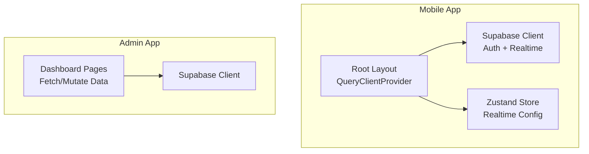
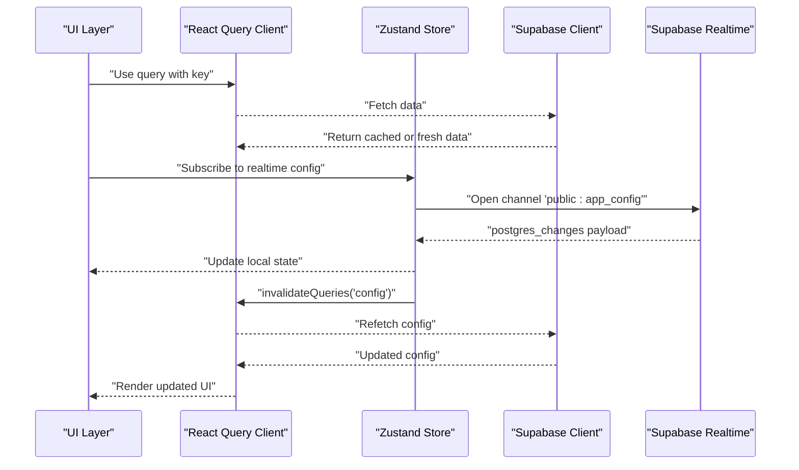
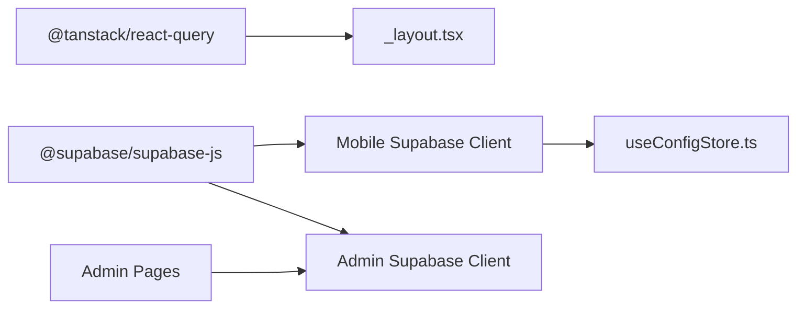

# React Query Server State Management

<cite>
**Referenced Files in This Document**
- [_layout.tsx](file://apps/mobile/src/app/_layout.tsx)
- [supabase.ts (mobile)](file://apps/mobile/src/services/supabase.ts)
- [useConfigStore.ts](file://apps/mobile/src/store/useConfigStore.ts)
- [supabase.ts (admin)](file://apps/admin/src/lib/supabase.ts)
- [posts/page.tsx (admin)](file://apps/admin/src/app/(dashboard)/posts/page.tsx)
- [initial_schema.sql](file://supabase/migrations/20240001000000_initial_schema.sql)
</cite>

## Table of Contents
1. [Introduction](#introduction)
2. [Project Structure](#project-structure)
3. [Core Components](#core-components)
4. [Architecture Overview](#architecture-overview)
5. [Detailed Component Analysis](#detailed-component-analysis)
6. [Dependency Analysis](#dependency-analysis)
7. [Performance Considerations](#performance-considerations)
8. [Troubleshooting Guide](#troubleshooting-guide)
9. [Conclusion](#conclusion)

## Introduction
This document explains how server state is managed with React Query and Supabase across the mobile and admin applications. It covers data fetching patterns, caching strategies, real-time synchronization via Supabase subscriptions, query key design, mutation handling, optimistic updates, error retry mechanisms, infinite queries for pagination, background refetching, cache invalidation, and performance optimizations such as deduplication, stale time configuration, and memory management.

## Project Structure
The project includes:
- Mobile app: React Native + Expo with a global React Query client configured at the root layout and Supabase client setup for auth and realtime.
- Admin app: Next.js application with a Supabase client and pages that fetch and mutate server state directly using Supabase.

**Diagram sources**
- [_layout.tsx:18-25](file://apps/mobile/src/app/_layout.tsx#L18-L25)
- [supabase.ts (mobile):1-40](file://apps/mobile/src/services/supabase.ts#L1-L40)
- [useConfigStore.ts:1-66](file://apps/mobile/src/store/useConfigStore.ts#L1-L66)
- [supabase.ts (admin):1-14](file://apps/admin/src/lib/supabase.ts#L1-L14)
- [posts/page.tsx (admin):1-137](file://apps/admin/src/app/(dashboard)/posts/page.tsx#L1-L137)

**Section sources**
- [_layout.tsx:18-25](file://apps/mobile/src/app/_layout.tsx#L18-L25)
- [supabase.ts (mobile):1-40](file://apps/mobile/src/services/supabase.ts#L1-L40)
- [useConfigStore.ts:1-66](file://apps/mobile/src/store/useConfigStore.ts#L1-L66)
- [supabase.ts (admin):1-14](file://apps/admin/src/lib/supabase.ts#L1-L14)
- [posts/page.tsx (admin):1-137](file://apps/admin/src/app/(dashboard)/posts/page.tsx#L1-L137)

## Core Components
- React Query client initialization with default retry and staleTime settings to balance freshness and network usage.
- Supabase client configured with persistent sessions and auto token refresh on both platforms.
- Realtime subscription for app config updates in the mobile app, bypassing WebSocket connections when using placeholder URLs.

Key responsibilities:
- Provide a globally shared QueryClient instance to enable query deduplication and consistent caching behavior.
- Centralize Supabase client configuration for authentication and realtime features.
- Manage realtime subscriptions safely with cleanup on unmount.

**Section sources**
- [_layout.tsx:18-25](file://apps/mobile/src/app/_layout.tsx#L18-L25)
- [supabase.ts (mobile):1-40](file://apps/mobile/src/services/supabase.ts#L1-L40)
- [useConfigStore.ts:39-65](file://apps/mobile/src/store/useConfigStore.ts#L39-L65)

## Architecture Overview
The architecture integrates React Query for server state caching and Supabase for data persistence and realtime updates. The mobile app uses a Zustand store to manage realtime config updates, while the admin app performs direct Supabase queries and mutations in page components.

**Diagram sources**
- [_layout.tsx:18-25](file://apps/mobile/src/app/_layout.tsx#L18-L25)
- [useConfigStore.ts:39-65](file://apps/mobile/src/store/useConfigStore.ts#L39-L65)
- [supabase.ts (mobile):1-40](file://apps/mobile/src/services/supabase.ts#L1-L40)

## Detailed Component Analysis

### React Query Client Configuration (Mobile)
- Global QueryClient is created with default options:
  - retry set to a low value to avoid excessive retries on transient errors.
  - staleTime configured to reduce unnecessary refetches and improve perceived performance.
- QueryClientProvider wraps the app to share the client across components.

Best practices applied:
- Centralized configuration ensures consistent caching and retry behavior.
- Stale time balances freshness with reduced network calls.

**Section sources**
- [_layout.tsx:18-25](file://apps/mobile/src/app/_layout.tsx#L18-L25)

### Supabase Client Setup (Mobile)
- Supabase client is created with environment-based URL and anon key.
- Auth storage adapter supports web (localStorage) and native (SecureStore).
- Session persistence and auto token refresh are enabled for seamless auth flows.
- Placeholder URL detection prevents unnecessary network attempts during development.

Operational notes:
- Placeholder URL bypass avoids DNS timeouts and WebSocket connection failures in dev environments.
- Secure storage ensures tokens are persisted securely on native platforms.

**Section sources**
- [supabase.ts (mobile):1-40](file://apps/mobile/src/services/supabase.ts#L1-L40)

### Realtime Config Subscription (Mobile)
- Zustand store provides fetchConfig and subscribeToRealtimeConfig.
- On placeholder URL, subscription returns a no-op cleanup function to prevent WebSocket errors.
- Subscribes to postgres_changes on app_config table; updates local state when new payloads arrive.
- Cleanup removes the channel on unmount to free resources.

Integration with React Query:
- After receiving realtime updates, invalidate related queries to refetch fresh data from the server.
- This pattern keeps UI consistent with server state without manual polling.

**Section sources**
- [useConfigStore.ts:15-38](file://apps/mobile/src/store/useConfigStore.ts#L15-L38)
- [useConfigStore.ts:39-65](file://apps/mobile/src/store/useConfigStore.ts#L39-L65)

### Admin Data Fetching and Mutations
- Dashboard pages perform direct Supabase queries to load posts and user data.
- Mutations (e.g., delete post, update credits) trigger re-fetch by calling the same fetch function after success.
- Error handling surfaces user-friendly messages via toast notifications.

Recommendations for migration to React Query:
- Replace useEffect-based fetching with useQuery to benefit from caching, deduplication, and automatic refetching.
- Use useMutation for write operations with onSuccess handlers to invalidate relevant queries.
- Implement optimistic updates to improve perceived responsiveness.

**Section sources**
- [posts/page.tsx (admin):13-44](file://apps/admin/src/app/(dashboard)/posts/page.tsx#L13-L44)

### Supabase Realtime Enablement
- Realtime is enabled for specific tables through migrations, allowing WebSockets to push changes to clients.
- Tables include app_config, posts, notifications, and templates.

Implications:
- Clients can subscribe to changes on these tables to maintain live UIs.
- Ensure proper indexing and RLS policies for secure and efficient realtime streams.

**Section sources**
- [initial_schema.sql:227-231](file://supabase/migrations/20240001000000_initial_schema.sql#L227-L231)

## Dependency Analysis
- Mobile app depends on React Query for caching and Supabase for data and realtime.
- Admin app depends on Supabase for data access; React Query is available but not used in current pages.
- Shared types and utilities support consistent data modeling across apps.

**Diagram sources**
- [_layout.tsx:18-25](file://apps/mobile/src/app/_layout.tsx#L18-L25)
- [supabase.ts (mobile):1-40](file://apps/mobile/src/services/supabase.ts#L1-L40)
- [supabase.ts (admin):1-14](file://apps/admin/src/lib/supabase.ts#L1-L14)
- [useConfigStore.ts:1-66](file://apps/mobile/src/store/useConfigStore.ts#L1-L66)
- [posts/page.tsx (admin):1-137](file://apps/admin/src/app/(dashboard)/posts/page.tsx#L1-L137)

**Section sources**
- [_layout.tsx:18-25](file://apps/mobile/src/app/_layout.tsx#L18-L25)
- [supabase.ts (mobile):1-40](file://apps/mobile/src/services/supabase.ts#L1-L40)
- [supabase.ts (admin):1-14](file://apps/admin/src/lib/supabase.ts#L1-L14)
- [useConfigStore.ts:1-66](file://apps/mobile/src/store/useConfigStore.ts#L1-L66)
- [posts/page.tsx (admin):1-137](file://apps/admin/src/app/(dashboard)/posts/page.tsx#L1-L137)

## Performance Considerations
- Query deduplication: Enabled by sharing a single QueryClient instance; identical queries are coalesced into one network request.
- Stale time configuration: Set to a reasonable duration to reduce refetch frequency while keeping UI reasonably fresh.
- Retry strategy: Low retry count prevents excessive retries on flaky networks; consider exponential backoff for critical endpoints.
- Memory management:
  - Remove realtime channels on unmount to avoid leaks.
  - Avoid storing large datasets in local stores; prefer React Query cache with appropriate gcTime and staleTime.
  - Use placeholder URL checks to skip network calls in development.

Optimization opportunities:
- Introduce per-query staleTime and gcTime based on data volatility.
- Paginate large lists using infinite queries to limit initial payload size.
- Debounce search inputs before triggering queries to reduce network churn.

[No sources needed since this section provides general guidance]

## Troubleshooting Guide
Common issues and resolutions:
- Placeholder URL causing timeouts:
  - Ensure placeholder URL detection is active to bypass network calls and WebSocket connections during development.
- Realtime subscription errors:
  - Confirm Supabase realtime is enabled for required tables via migrations.
  - Verify channel names match schema/table filters and that subscriptions are removed on unmount.
- Excessive refetches:
  - Adjust staleTime and refetchInterval to balance freshness and performance.
  - Use query keys precisely to avoid unintended invalidations.
- Authentication session issues:
  - Ensure persistSession and autoRefreshToken are enabled in Supabase client configuration.

Actionable checks:
- Validate environment variables for Supabase URL and anon key.
- Inspect browser/network logs for failed realtime connections.
- Review toast messages and error handling paths in admin pages.

**Section sources**
- [supabase.ts (mobile):28-40](file://apps/mobile/src/services/supabase.ts#L28-L40)
- [useConfigStore.ts:39-65](file://apps/mobile/src/store/useConfigStore.ts#L39-L65)
- [initial_schema.sql:227-231](file://supabase/migrations/20240001000000_initial_schema.sql#L227-L231)
- [posts/page.tsx (admin):13-44](file://apps/admin/src/app/(dashboard)/posts/page.tsx#L13-L44)

## Conclusion
The mobile app establishes a solid foundation for server state management using React Query and Supabase, with centralized client configuration and robust realtime subscriptions. The admin app currently uses direct Supabase calls; migrating to React Query will unlock powerful caching, deduplication, and mutation workflows. By applying query key best practices, optimizing stale times, implementing infinite queries for pagination, and leveraging realtime invalidations, the applications can deliver responsive, reliable, and scalable user experiences.

[No sources needed since this section summarizes without analyzing specific files]