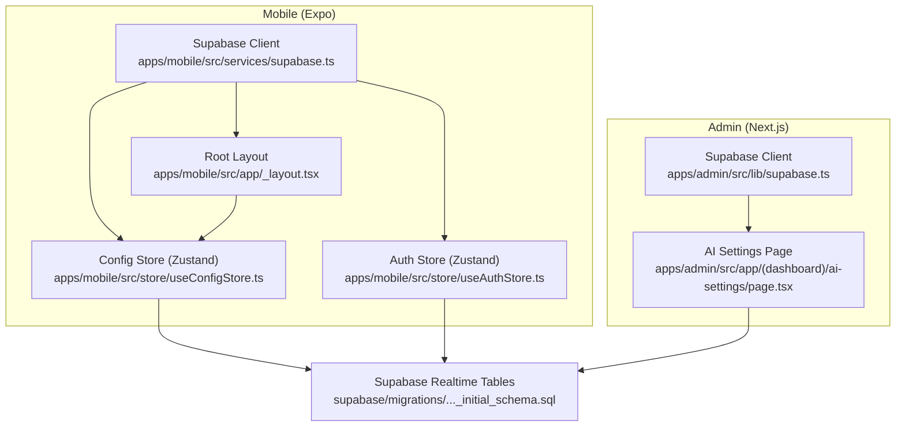
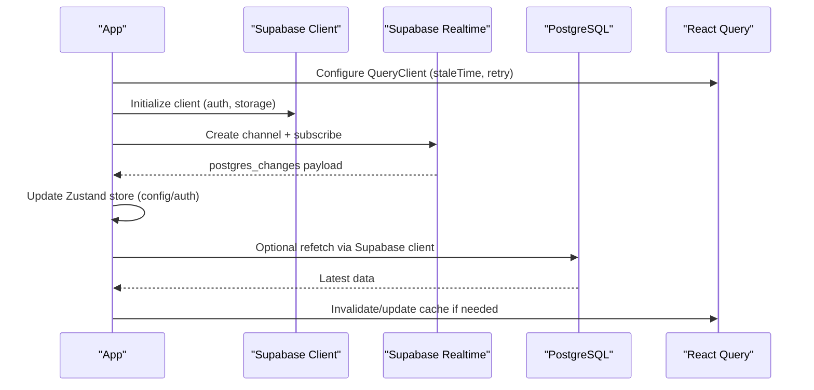
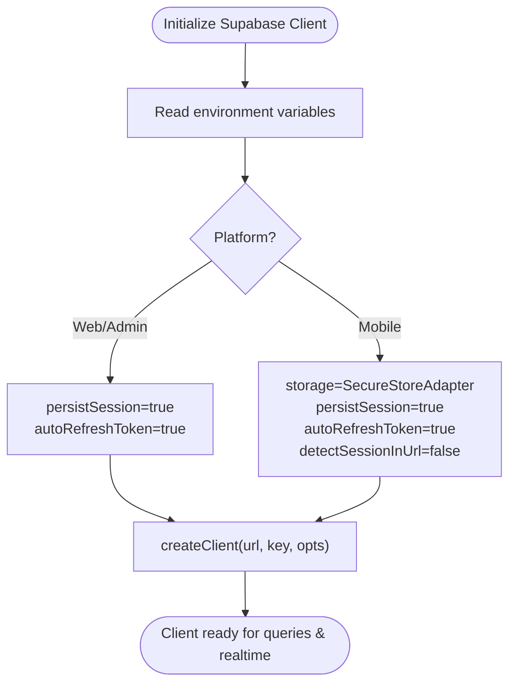
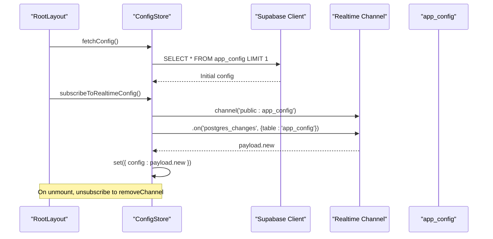
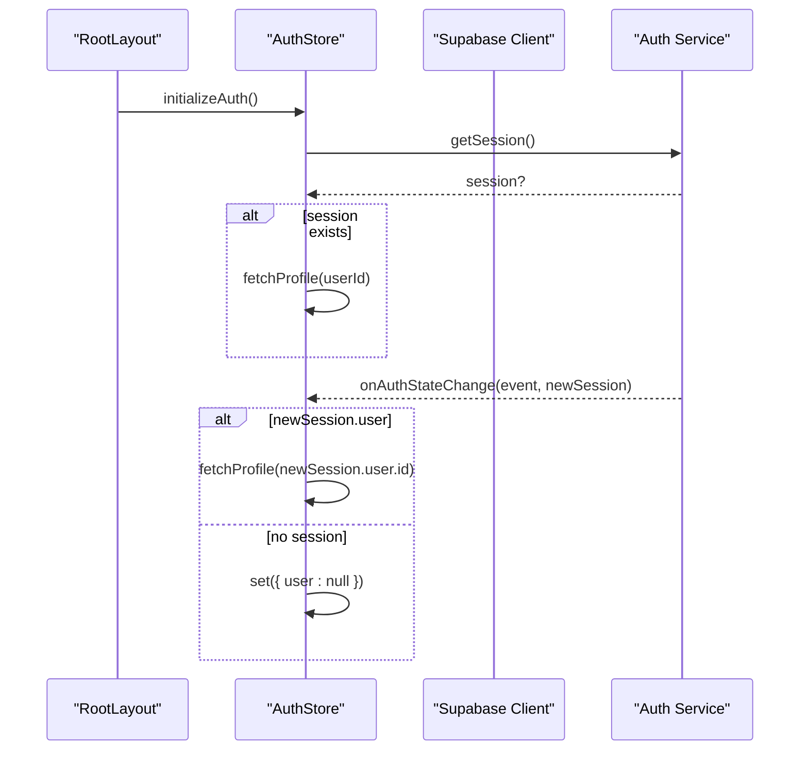
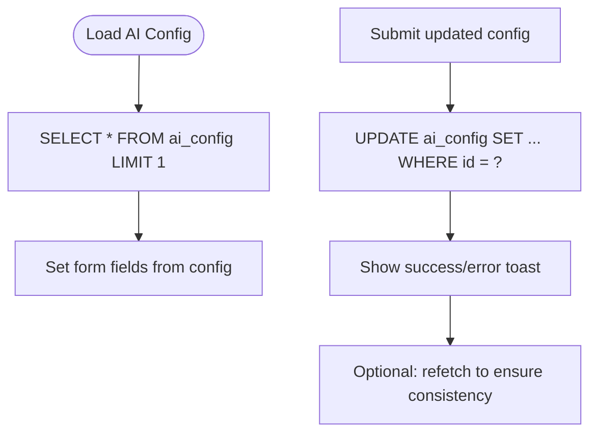
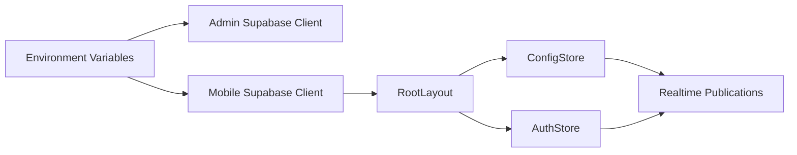

# Real-time Data Synchronization

<cite>
**Referenced Files in This Document**
- [supabase.ts](file://apps/admin/src/lib/supabase.ts)
- [supabase.ts](file://apps/mobile/src/services/supabase.ts)
- [_layout.tsx](file://apps/mobile/src/app/_layout.tsx)
- [useConfigStore.ts](file://apps/mobile/src/store/useConfigStore.ts)
- [useAuthStore.ts](file://apps/mobile/src/store/useAuthStore.ts)
- [page.tsx](file://apps/admin/src/app/(dashboard)/ai-settings/page.tsx)
- [initial_schema.sql](file://supabase/migrations/20240001000000_initial_schema.sql)
</cite>

## Table of Contents
1. [Introduction](#introduction)
2. [Project Structure](#project-structure)
3. [Core Components](#core-components)
4. [Architecture Overview](#architecture-overview)
5. [Detailed Component Analysis](#detailed-component-analysis)
6. [Dependency Analysis](#dependency-analysis)
7. [Performance Considerations](#performance-considerations)
8. [Troubleshooting Guide](#troubleshooting-guide)
9. [Conclusion](#conclusion)

## Introduction
This document explains how the application implements real-time data synchronization using Supabase WebSockets and integrates with React Query for caching and background updates. It covers WebSocket connection management, channel subscriptions, event handling patterns, live updates for configuration changes and user sessions, reconnection strategies, offline-first considerations, performance tuning for high-frequency updates, and debugging techniques to monitor connection health.

## Project Structure
The real-time features are implemented across both the admin web app and the mobile app:
- Supabase client initialization is provided per platform (Next.js admin and Expo mobile).
- The mobile app initializes authentication and subscribes to real-time channels at app startup.
- Configuration state is managed via a Zustand store that fetches initial data and listens to real-time changes.
- Admin pages demonstrate direct Supabase queries and can be extended with real-time listeners.
- Database migrations enable real-time publication for key tables.

**Diagram sources**
- [supabase.ts:8-13](file://apps/admin/src/lib/supabase.ts#L8-L13)
- [supabase.ts:33-40](file://apps/mobile/src/services/supabase.ts#L33-L40)
- [_layout.tsx:18-25](file://apps/mobile/src/app/_layout.tsx#L18-L25)
- [_layout.tsx:64-72](file://apps/mobile/src/app/_layout.tsx#L64-L72)
- [useConfigStore.ts:12-66](file://apps/mobile/src/store/useConfigStore.ts#L12-L66)
- [useAuthStore.ts:18-89](file://apps/mobile/src/store/useAuthStore.ts#L18-L89)
- [page.tsx:23-85](file://apps/admin/src/app/(dashboard)/ai-settings/page.tsx#L23-L85)
- [initial_schema.sql:227-231](file://supabase/migrations/20240001000000_initial_schema.sql#L227-L231)

**Section sources**
- [supabase.ts:8-13](file://apps/admin/src/lib/supabase.ts#L8-L13)
- [supabase.ts:33-40](file://apps/mobile/src/services/supabase.ts#L33-L40)
- [_layout.tsx:18-25](file://apps/mobile/src/app/_layout.tsx#L18-L25)
- [_layout.tsx:64-72](file://apps/mobile/src/app/_layout.tsx#L64-L72)
- [useConfigStore.ts:12-66](file://apps/mobile/src/store/useConfigStore.ts#L12-L66)
- [useAuthStore.ts:18-89](file://apps/mobile/src/store/useAuthStore.ts#L18-L89)
- [page.tsx:23-85](file://apps/admin/src/app/(dashboard)/ai-settings/page.tsx#L23-L85)
- [initial_schema.sql:227-231](file://supabase/migrations/20240001000000_initial_schema.sql#L227-L231)

## Core Components
- Supabase clients:
  - Admin Next.js client configured with session persistence and auto token refresh.
  - Mobile Expo client configured with secure storage adapter, session persistence, and token refresh.
- Root layout:
  - Initializes React Query client with default options.
  - Starts auth initialization and config fetching, then subscribes to real-time config changes; unsubscribes on cleanup.
- Config store:
  - Fetches initial configuration from the database.
  - Subscribes to real-time changes on the configuration table and updates local state when new payloads arrive.
  - Safely bypasses WebSocket attempts when running against placeholder URLs.
- Auth store:
  - Initializes auth session and listens for auth state changes to update user profile data.
  - Provides sign-out and profile fetching utilities.
- Admin AI settings page:
  - Demonstrates reading and updating configuration via Supabase; can be extended with real-time listeners for live UI updates.

**Section sources**
- [supabase.ts:8-13](file://apps/admin/src/lib/supabase.ts#L8-L13)
- [supabase.ts:33-40](file://apps/mobile/src/services/supabase.ts#L33-L40)
- [_layout.tsx:18-25](file://apps/mobile/src/app/_layout.tsx#L18-L25)
- [_layout.tsx:64-72](file://apps/mobile/src/app/_layout.tsx#L64-L72)
- [useConfigStore.ts:12-66](file://apps/mobile/src/store/useConfigStore.ts#L12-L66)
- [useAuthStore.ts:18-89](file://apps/mobile/src/store/useAuthStore.ts#L18-L89)
- [page.tsx:23-85](file://apps/admin/src/app/(dashboard)/ai-settings/page.tsx#L23-L85)

## Architecture Overview
The system combines Supabase’s real-time capabilities with React Query for robust data synchronization:
- Supabase clients establish persistent connections to Supabase Realtime.
- Channels subscribe to specific tables or events; incoming messages update local state stores.
- React Query manages cache lifetimes and retries for HTTP-based operations.
- Database publications include tables used by real-time listeners.

**Diagram sources**
- [_layout.tsx:18-25](file://apps/mobile/src/app/_layout.tsx#L18-L25)
- [_layout.tsx:64-72](file://apps/mobile/src/app/_layout.tsx#L64-L72)
- [useConfigStore.ts:45-61](file://apps/mobile/src/store/useConfigStore.ts#L45-L61)
- [initial_schema.sql:227-231](file://supabase/migrations/20240001000000_initial_schema.sql#L227-L231)

## Detailed Component Analysis

### Supabase Client Initialization
- Admin client enables session persistence and automatic token refresh for seamless auth flows.
- Mobile client uses a secure storage adapter for cross-platform session persistence and disables URL-based session detection.

**Diagram sources**
- [supabase.ts:8-13](file://apps/admin/src/lib/supabase.ts#L8-L13)
- [supabase.ts:33-40](file://apps/mobile/src/services/supabase.ts#L33-L40)

**Section sources**
- [supabase.ts:8-13](file://apps/admin/src/lib/supabase.ts#L8-L13)
- [supabase.ts:33-40](file://apps/mobile/src/services/supabase.ts#L33-L40)

### Real-time Configuration Updates (Mobile)
- The root layout initializes auth, fetches initial configuration, and subscribes to real-time changes for the configuration table. On unmount, it unsubscribes to free resources.
- The config store provides a safe subscription method that avoids WebSocket attempts on placeholder URLs and updates local state when new rows arrive.

**Diagram sources**
- [_layout.tsx:64-72](file://apps/mobile/src/app/_layout.tsx#L64-L72)
- [useConfigStore.ts:15-66](file://apps/mobile/src/store/useConfigStore.ts#L15-L66)
- [initial_schema.sql:227-231](file://supabase/migrations/20240001000000_initial_schema.sql#L227-L231)

**Section sources**
- [_layout.tsx:64-72](file://apps/mobile/src/app/_layout.tsx#L64-L72)
- [useConfigStore.ts:15-66](file://apps/mobile/src/store/useConfigStore.ts#L15-L66)
- [initial_schema.sql:227-231](file://supabase/migrations/20240001000000_initial_schema.sql#L227-L231)

### User Session Real-time Handling
- The auth store initializes the session, fetches the user profile when present, and listens for auth state changes to keep the UI in sync with login/logout events.

**Diagram sources**
- [_layout.tsx:64-72](file://apps/mobile/src/app/_layout.tsx#L64-L72)
- [useAuthStore.ts:24-59](file://apps/mobile/src/store/useAuthStore.ts#L24-L59)

**Section sources**
- [_layout.tsx:64-72](file://apps/mobile/src/app/_layout.tsx#L64-L72)
- [useAuthStore.ts:24-59](file://apps/mobile/src/store/useAuthStore.ts#L24-L59)

### Admin Configuration Editing
- The AI settings page demonstrates fetching and updating configuration via Supabase. While this example uses HTTP, you can add a real-time listener to reflect changes immediately without manual refresh.

**Diagram sources**
- [page.tsx:23-85](file://apps/admin/src/app/(dashboard)/ai-settings/page.tsx#L23-L85)

**Section sources**
- [page.tsx:23-85](file://apps/admin/src/app/(dashboard)/ai-settings/page.tsx#L23-L85)

## Dependency Analysis
- Platform-specific Supabase clients depend on environment variables and platform storage mechanisms.
- The mobile root layout depends on React Query for caching and on Zustand stores for state management.
- Real-time subscriptions depend on database publications enabled in migrations.

**Diagram sources**
- [supabase.ts:8-13](file://apps/admin/src/lib/supabase.ts#L8-L13)
- [supabase.ts:33-40](file://apps/mobile/src/services/supabase.ts#L33-L40)
- [_layout.tsx:18-25](file://apps/mobile/src/app/_layout.tsx#L18-L25)
- [_layout.tsx:64-72](file://apps/mobile/src/app/_layout.tsx#L64-L72)
- [useConfigStore.ts:45-61](file://apps/mobile/src/store/useConfigStore.ts#L45-L61)
- [useAuthStore.ts:24-59](file://apps/mobile/src/store/useAuthStore.ts#L24-L59)
- [initial_schema.sql:227-231](file://supabase/migrations/20240001000000_initial_schema.sql#L227-L231)

**Section sources**
- [supabase.ts:8-13](file://apps/admin/src/lib/supabase.ts#L8-L13)
- [supabase.ts:33-40](file://apps/mobile/src/services/supabase.ts#L33-L40)
- [_layout.tsx:18-25](file://apps/mobile/src/app/_layout.tsx#L18-L25)
- [_layout.tsx:64-72](file://apps/mobile/src/app/_layout.tsx#L64-L72)
- [useConfigStore.ts:45-61](file://apps/mobile/src/store/useConfigStore.ts#L45-L61)
- [useAuthStore.ts:24-59](file://apps/mobile/src/store/useAuthStore.ts#L24-L59)
- [initial_schema.sql:227-231](file://supabase/migrations/20240001000000_initial_schema.sql#L227-L231)

## Performance Considerations
- High-frequency updates:
  - Use targeted table filters in channel subscriptions to minimize message volume.
  - Debounce or batch UI updates when receiving frequent payloads to avoid excessive re-renders.
- Message batching:
  - Coalesce multiple rapid updates into a single state change where possible.
  - Prefer server-side filtering and projections to reduce payload size.
- Memory cleanup:
  - Always unsubscribe from channels on component unmount to prevent memory leaks.
  - Avoid long-lived global channels unless necessary; scope subscriptions to feature areas.
- Caching strategy:
  - Tune React Query staleTime and retry policies to balance freshness and network usage.
  - Invalidate or refetch caches after mutations to maintain consistency.

[No sources needed since this section provides general guidance]

## Troubleshooting Guide
- Connection health monitoring:
  - Observe whether channels are created and subscribed successfully.
  - Verify that placeholders are detected to avoid unnecessary WebSocket attempts during development.
- Reconnection logic:
  - Ensure Supabase client options enable auto token refresh and session persistence.
  - Implement explicit re-subscription on reconnect events if your use case requires it.
- Debugging steps:
  - Log channel creation and subscription lifecycle events.
  - Inspect incoming payloads to confirm schema alignment and expected fields.
  - Validate database publications include the tables you subscribe to.

**Section sources**
- [supabase.ts:8-13](file://apps/admin/src/lib/supabase.ts#L8-L13)
- [supabase.ts:33-40](file://apps/mobile/src/services/supabase.ts#L33-L40)
- [_layout.tsx:64-72](file://apps/mobile/src/app/_layout.tsx#L64-L72)
- [useConfigStore.ts:39-66](file://apps/mobile/src/store/useConfigStore.ts#L39-L66)
- [initial_schema.sql:227-231](file://supabase/migrations/20240001000000_initial_schema.sql#L227-L231)

## Conclusion
The application leverages Supabase WebSockets for real-time updates and React Query for robust caching. The mobile app demonstrates a complete pattern: initialize clients, start auth, fetch initial data, subscribe to real-time channels, and clean up on unmount. Admin pages show how to read and write configuration, which can be enhanced with real-time listeners for immediate UI updates. By following the outlined practices for performance, error handling, and debugging, teams can build reliable, scalable real-time experiences across platforms.

[No sources needed since this section summarizes without analyzing specific files]