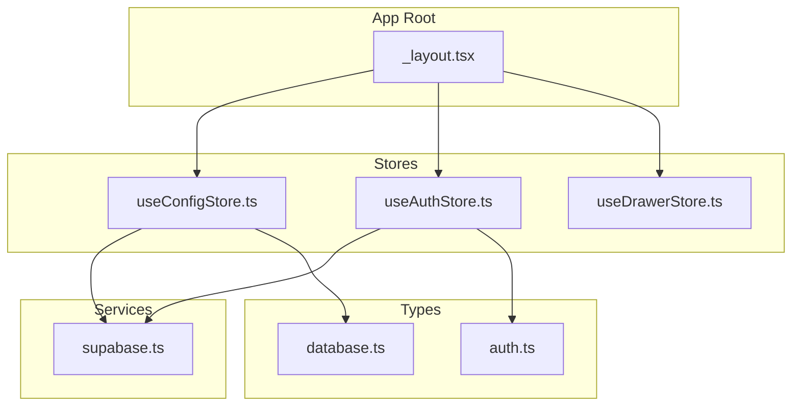
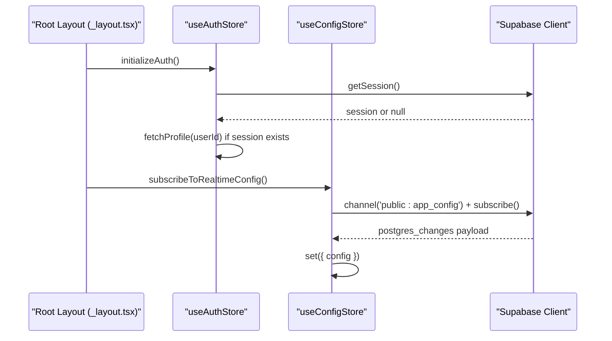
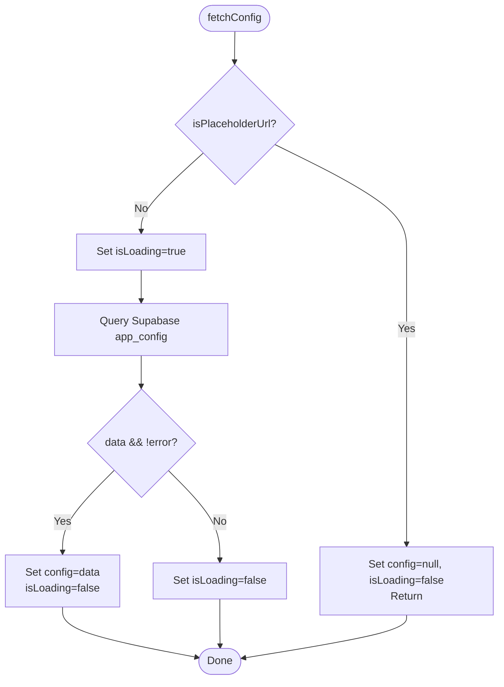
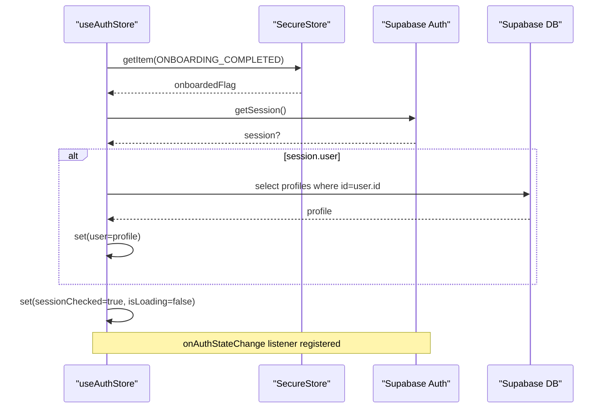
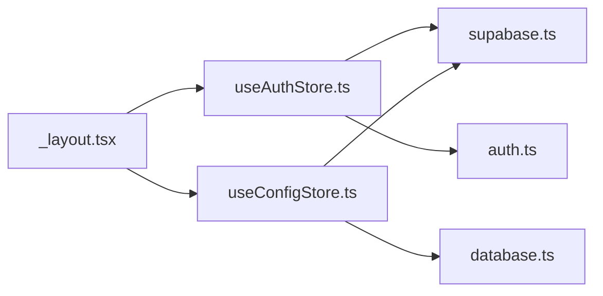

# State Management

<cite>
**Referenced Files in This Document**
- [useConfigStore.ts](file://apps/mobile/src/store/useConfigStore.ts)
- [useAuthStore.ts](file://apps/mobile/src/store/useAuthStore.ts)
- [useDrawerStore.ts](file://apps/mobile/src/store/useDrawerStore.ts)
- [supabase.ts](file://apps/mobile/src/services/supabase.ts)
- [_layout.tsx](file://apps/mobile/src/app/_layout.tsx)
- [index.ts](file://apps/mobile/src/constants/index.ts)
- [auth.ts](file://packages/types/src/auth.ts)
- [database.ts](file://packages/types/src/database.ts)
</cite>

## Table of Contents
1. [Introduction](#introduction)
2. [Project Structure](#project-structure)
3. [Core Components](#core-components)
4. [Architecture Overview](#architecture-overview)
5. [Detailed Component Analysis](#detailed-component-analysis)
6. [Dependency Analysis](#dependency-analysis)
7. [Performance Considerations](#performance-considerations)
8. [Troubleshooting Guide](#troubleshooting-guide)
9. [Conclusion](#conclusion)
10. [Appendices](#appendices)

## Introduction
This document explains the state management architecture for the mobile application, focusing on:
- Client-side state with Zustand stores: useConfigStore (global configuration), useAuthStore (authentication and profile), and useDrawerStore (UI drawer).
- Server state management using React Query via a shared QueryClient.
- Data synchronization with Supabase, including real-time subscriptions to app configuration changes.
- Guidelines for creating new stores, handling asynchronous operations, error boundaries, performance optimization, state persistence, caching strategies, and debugging techniques.

## Project Structure
The mobile app organizes state into focused stores under apps/mobile/src/store, integrates React Query at the root layout, and communicates with Supabase through a centralized client. Types are shared from packages/types.

**Diagram sources**
- [_layout.tsx:1-25](file://apps/mobile/src/app/_layout.tsx#L1-L25)
- [useConfigStore.ts:1-10](file://apps/mobile/src/store/useConfigStore.ts#L1-L10)
- [useAuthStore.ts:1-16](file://apps/mobile/src/store/useAuthStore.ts#L1-L16)
- [useDrawerStore.ts:1-8](file://apps/mobile/src/store/useDrawerStore.ts#L1-L8)
- [supabase.ts:1-40](file://apps/mobile/src/services/supabase.ts#L1-L40)
- [auth.ts:5-18](file://packages/types/src/auth.ts#L5-L18)
- [database.ts:36-50](file://packages/types/src/database.ts#L36-L50)

**Section sources**
- [_layout.tsx:1-25](file://apps/mobile/src/app/_layout.tsx#L1-L25)
- [supabase.ts:1-40](file://apps/mobile/src/services/supabase.ts#L1-L40)
- [auth.ts:5-18](file://packages/types/src/auth.ts#L5-L18)
- [database.ts:36-50](file://packages/types/src/database.ts#L36-L50)

## Core Components
- useConfigStore: Manages global app configuration fetched from Supabase and subscribes to real-time updates for live config changes. Includes a placeholder URL bypass to avoid network timeouts during development.
- useAuthStore: Initializes authentication session, fetches user profile, persists onboarding status, and handles sign-out. Uses secure storage for sensitive tokens and flags.
- useDrawerStore: Simple UI store controlling drawer open/close state.

Key responsibilities:
- Centralized client state via Zustand.
- Real-time data sync via Supabase channels.
- Secure session persistence and platform-aware storage.

**Section sources**
- [useConfigStore.ts:5-66](file://apps/mobile/src/store/useConfigStore.ts#L5-L66)
- [useAuthStore.ts:7-89](file://apps/mobile/src/store/useAuthStore.ts#L7-L89)
- [useDrawerStore.ts:3-15](file://apps/mobile/src/store/useDrawerStore.ts#L3-L15)
- [supabase.ts:5-40](file://apps/mobile/src/services/supabase.ts#L5-L40)

## Architecture Overview
At app bootstrap, the root layout sets up React Query and providers, initializes auth and config, and subscribes to real-time configuration updates. Stores interact with Supabase for both synchronous queries and real-time events.

**Diagram sources**
- [_layout.tsx:18-25](file://apps/mobile/src/app/_layout.tsx#L18-L25)
- [_layout.tsx:68-72](file://apps/mobile/src/app/_layout.tsx#L68-L72)
- [useAuthStore.ts:24-61](file://apps/mobile/src/store/useAuthStore.ts#L24-L61)
- [useConfigStore.ts:39-65](file://apps/mobile/src/store/useConfigStore.ts#L39-L65)
- [supabase.ts:33-40](file://apps/mobile/src/services/supabase.ts#L33-L40)

## Detailed Component Analysis

### useConfigStore
Responsibilities:
- Fetch initial app configuration from Supabase.
- Subscribe to real-time changes on the app_config table.
- Bypass network calls when running with placeholder URLs to prevent long DNS timeouts.

Data model:
- Holds AppConfig and loading state.

Operations:
- fetchConfig: Loads single record and updates store.
- subscribeToRealtimeConfig: Creates a Supabase channel and updates config on changes; returns an unsubscribe function.

Error handling:
- Gracefully sets isLoading to false on errors.
- Returns no-op cleanup functions when placeholder mode is active.

**Diagram sources**
- [useConfigStore.ts:15-38](file://apps/mobile/src/store/useConfigStore.ts#L15-L38)

**Section sources**
- [useConfigStore.ts:5-66](file://apps/mobile/src/store/useConfigStore.ts#L5-L66)
- [database.ts:36-50](file://packages/types/src/database.ts#L36-L50)

### useAuthStore
Responsibilities:
- Initialize auth session and mark sessionChecked.
- Fetch user profile when a session exists.
- Persist onboarding completion flag securely.
- Handle sign-out and clear local user state.

Data model:
- UserProfile, sessionChecked, isOnboarded, isLoading.

Operations:
- initializeAuth: Reads onboarding flag, gets session, fetches profile, listens to auth state changes.
- setOnboardingCompleted: Persists flag and updates store.
- fetchProfile: Retrieves profile by userId.
- signOut: Signs out via Supabase and clears user.

Error handling:
- Ensures sessionChecked becomes true even on errors to unblock UI flow.
- Skips network calls in placeholder mode.

**Diagram sources**
- [useAuthStore.ts:24-61](file://apps/mobile/src/store/useAuthStore.ts#L24-L61)
- [useAuthStore.ts:68-81](file://apps/mobile/src/store/useAuthStore.ts#L68-L81)
- [supabase.ts:33-40](file://apps/mobile/src/services/supabase.ts#L33-L40)

**Section sources**
- [useAuthStore.ts:7-89](file://apps/mobile/src/store/useAuthStore.ts#L7-L89)
- [auth.ts:5-18](file://packages/types/src/auth.ts#L5-L18)
- [index.ts:15-20](file://apps/mobile/src/constants/index.ts#L15-L20)

### useDrawerStore
Responsibilities:
- Manage simple boolean state for drawer visibility.
- Provide open, close, and toggle actions.

Usage:
- Lightweight UI state that does not depend on server state.

**Section sources**
- [useDrawerStore.ts:3-15](file://apps/mobile/src/store/useDrawerStore.ts#L3-L15)

### React Query Integration
- A single QueryClient is created at the app root with default options:
  - retry: 1
  - staleTime: 5 minutes
- The QueryClientProvider wraps the app tree, enabling declarative server state management throughout components.

Guidelines:
- Use React Query hooks for fetching, caching, and background refetching of server data.
- Leverage staleTime to reduce network requests while keeping data reasonably fresh.
- Combine with Zustand for UI-only state (e.g., drawer, form inputs) and React Query for remote data.

**Section sources**
- [_layout.tsx:18-25](file://apps/mobile/src/app/_layout.tsx#L18-L25)

## Dependency Analysis
- useConfigStore depends on Supabase client and AppConfig type.
- useAuthStore depends on Supabase auth/DB and UserProfile type, plus secure storage keys.
- Root layout wires up React Query and triggers initialization flows.

**Diagram sources**
- [useAuthStore.ts:1-4](file://apps/mobile/src/store/useAuthStore.ts#L1-L4)
- [useConfigStore.ts:1-3](file://apps/mobile/src/store/useConfigStore.ts#L1-L3)
- [_layout.tsx:10-12](file://apps/mobile/src/app/_layout.tsx#L10-L12)
- [auth.ts:5-18](file://packages/types/src/auth.ts#L5-L18)
- [database.ts:36-50](file://packages/types/src/database.ts#L36-L50)
- [supabase.ts:33-40](file://apps/mobile/src/services/supabase.ts#L33-L40)

**Section sources**
- [useAuthStore.ts:1-4](file://apps/mobile/src/store/useAuthStore.ts#L1-L4)
- [useConfigStore.ts:1-3](file://apps/mobile/src/store/useConfigStore.ts#L1-L3)
- [_layout.tsx:10-12](file://apps/mobile/src/app/_layout.tsx#L10-L12)

## Performance Considerations
- Placeholder URL bypass: Both auth and config stores short-circuit network calls when running with placeholder URLs to avoid long DNS timeouts and improve startup time.
- Real-time updates: useConfigStore uses a single Supabase channel to keep configuration in sync without polling.
- React Query caching: Configure staleTime to balance freshness and network usage; adjust based on feature needs.
- Minimal re-renders: Keep UI-only state in Zustand (e.g., drawer) and server state in React Query to reduce unnecessary component updates.
- Secure storage: Use platform-aware secure storage for tokens and sensitive flags to ensure reliability across platforms.

[No sources needed since this section provides general guidance]

## Troubleshooting Guide
Common issues and resolutions:
- Long DNS timeouts during development: Ensure placeholder URL detection is active; stores skip network calls automatically.
- Real-time not updating: Verify Supabase channel subscription is active and that the correct schema/table is used; confirm environment variables are set correctly.
- Auth state not persisting: Confirm secure storage adapter is configured and platform-specific behavior is working (localStorage on web vs SecureStore on native).
- Onboarding flag not recognized: Check STORAGE_KEYS constants and ensure the value is stored as expected.

Debugging tips:
- Inspect Supabase client configuration and environment variables.
- Log store state transitions around key methods (initializeAuth, fetchConfig, subscribeToRealtimeConfig).
- Use React Query DevTools to inspect cache, retries, and invalidation.

**Section sources**
- [useConfigStore.ts:15-38](file://apps/mobile/src/store/useConfigStore.ts#L15-L38)
- [useConfigStore.ts:39-65](file://apps/mobile/src/store/useConfigStore.ts#L39-L65)
- [useAuthStore.ts:24-61](file://apps/mobile/src/store/useAuthStore.ts#L24-L61)
- [supabase.ts:5-40](file://apps/mobile/src/services/supabase.ts#L5-L40)
- [index.ts:15-20](file://apps/mobile/src/constants/index.ts#L15-L20)

## Conclusion
The application combines Zustand for lightweight client state and React Query for robust server state management, with Supabase providing both REST-like queries and real-time subscriptions. This separation yields predictable state updates, efficient caching, and responsive UIs. Following the guidelines below will help maintain consistency and performance as the codebase grows.

[No sources needed since this section summarizes without analyzing specific files]

## Appendices

### Creating a New Zustand Store
- Define a TypeScript interface for state and actions.
- Use create to define the store with initial state and methods.
- Keep UI-only state in Zustand; move server-driven data to React Query.
- If interacting with Supabase, follow patterns in useConfigStore and useAuthStore for placeholder bypass and error handling.

**Section sources**
- [useDrawerStore.ts:3-15](file://apps/mobile/src/store/useDrawerStore.ts#L3-L15)
- [useConfigStore.ts:5-10](file://apps/mobile/src/store/useConfigStore.ts#L5-L10)
- [useAuthStore.ts:7-16](file://apps/mobile/src/store/useAuthStore.ts#L7-L16)

### Handling Asynchronous Operations
- Use async functions within stores for network calls.
- Always update loading states and handle errors gracefully.
- For auth flows, register listeners for state changes and clean up resources when necessary.

**Section sources**
- [useConfigStore.ts:15-38](file://apps/mobile/src/store/useConfigStore.ts#L15-L38)
- [useAuthStore.ts:24-61](file://apps/mobile/src/store/useAuthStore.ts#L24-L61)

### Error Boundaries
- While not implemented here, wrap critical trees with error boundaries to catch rendering errors.
- For network errors, rely on store-level try/catch and React Query’s onError callbacks.

[No sources needed since this section provides general guidance]

### State Persistence and Caching Strategies
- Persist sensitive flags and sessions using secure storage (platform-aware).
- Use React Query’s staleTime and retry options to control caching and resilience.
- Cache UI-only preferences locally if needed, but prefer stores for transient UI state.

**Section sources**
- [supabase.ts:5-40](file://apps/mobile/src/services/supabase.ts#L5-L40)
- [_layout.tsx:18-25](file://apps/mobile/src/app/_layout.tsx#L18-L25)
- [index.ts:15-20](file://apps/mobile/src/constants/index.ts#L15-L20)

### Debugging Techniques
- Enable logging in stores around key transitions.
- Use React Query DevTools to inspect query state and cache.
- Validate Supabase environment variables and channel subscriptions.

**Section sources**
- [_layout.tsx:18-25](file://apps/mobile/src/app/_layout.tsx#L18-L25)
- [useConfigStore.ts:39-65](file://apps/mobile/src/store/useConfigStore.ts#L39-L65)
- [useAuthStore.ts:24-61](file://apps/mobile/src/store/useAuthStore.ts#L24-L61)