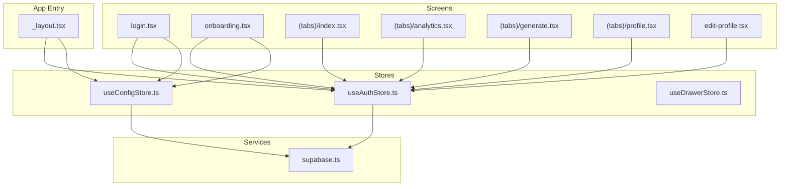
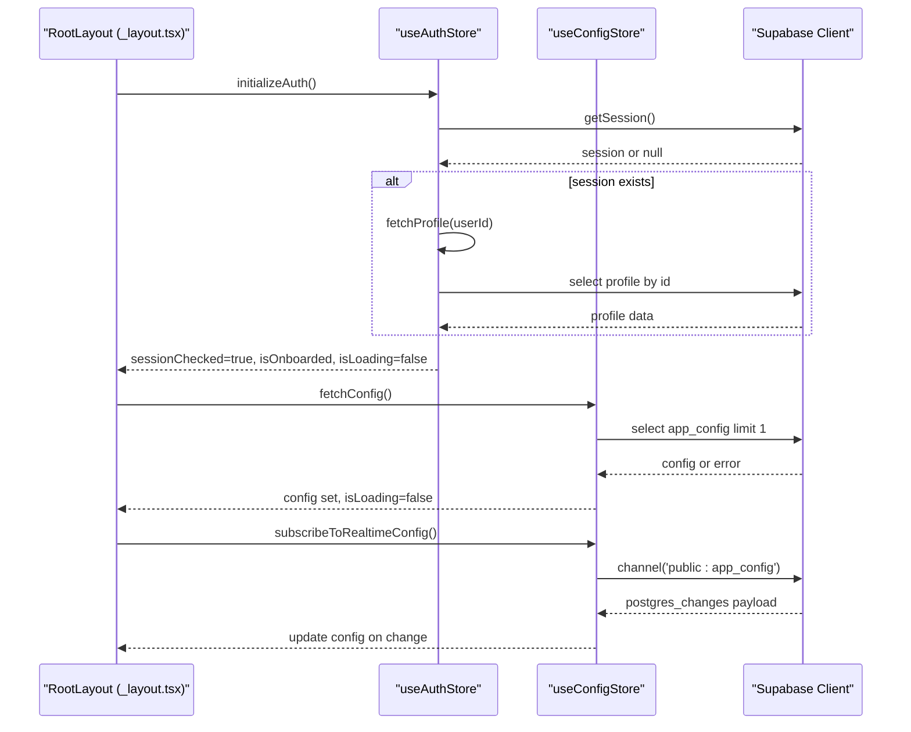
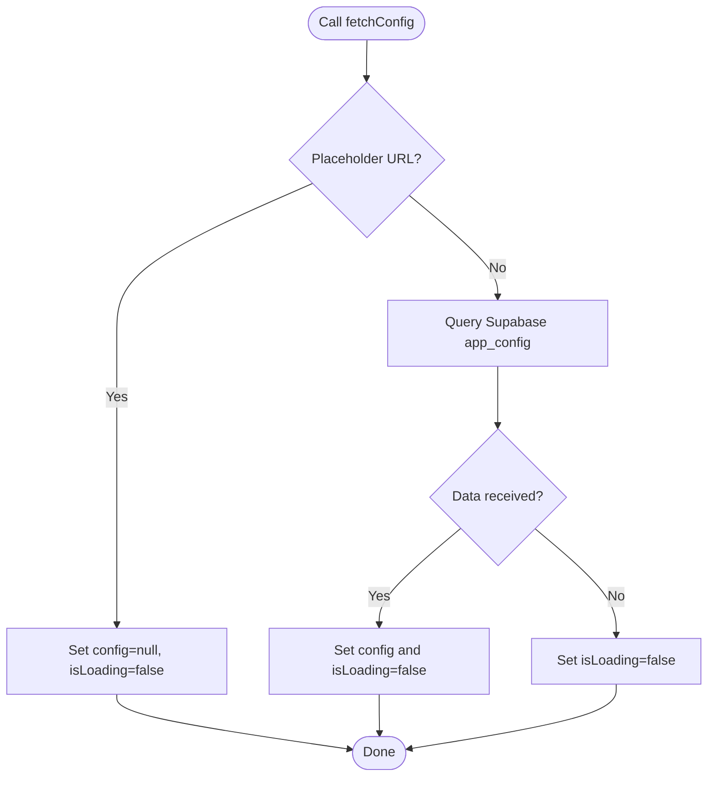
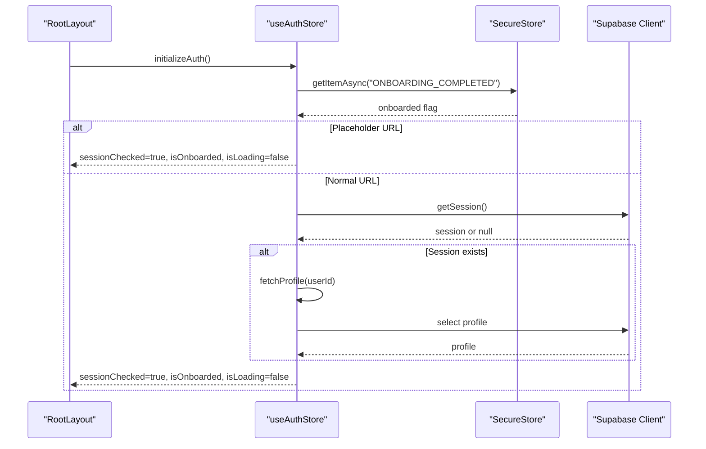
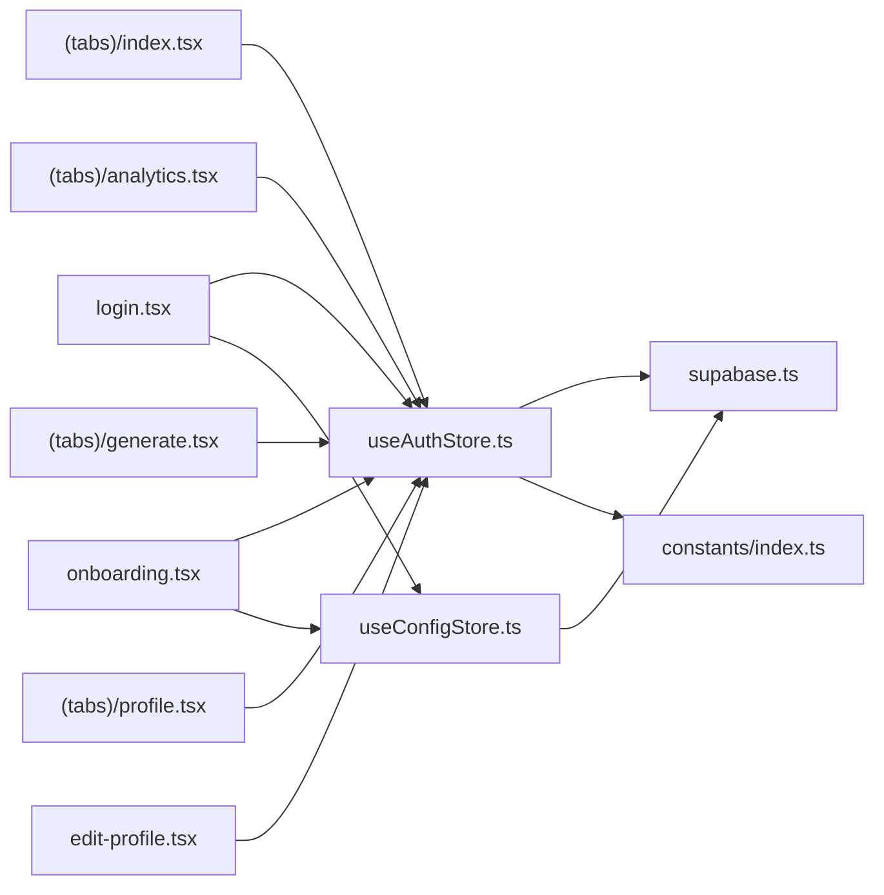

# Zustand Local State Management

<cite>
**Referenced Files in This Document**
- [useConfigStore.ts](file://apps/mobile/src/store/useConfigStore.ts)
- [useAuthStore.ts](file://apps/mobile/src/store/useAuthStore.ts)
- [useDrawerStore.ts](file://apps/mobile/src/store/useDrawerStore.ts)
- [_layout.tsx](file://apps/mobile/src/app/_layout.tsx)
- [supabase.ts](file://apps/mobile/src/services/supabase.ts)
- [index.ts](file://apps/mobile/src/constants/index.ts)
- [login.tsx](file://apps/mobile/src/app/(auth)/login.tsx)
- [onboarding.tsx](file://apps/mobile/src/app/(auth)/onboarding.tsx)
- [analytics.tsx](file://apps/mobile/src/app/(tabs)/analytics.tsx)
- [generate.tsx](file://apps/mobile/src/app/(tabs)/generate.tsx)
- [index.tsx](file://apps/mobile/src/app/(tabs)/index.tsx)
- [profile.tsx](file://apps/mobile/src/app/(tabs)/profile.tsx)
- [edit-profile.tsx](file://apps/mobile/src/app/edit-profile.tsx)
</cite>

## Table of Contents
1. Introduction
2. Project Structure
3. Core Components
4. Architecture Overview
5. Detailed Component Analysis
6. Dependency Analysis
7. Performance Considerations
8. Troubleshooting Guide
9. Conclusion
10. Appendices

## Introduction
This document explains the local state management approach used in the mobile application with Zustand. It covers the store architecture for application configuration, authentication state, and UI navigation state. It also documents store creation patterns, state persistence strategies, middleware usage, performance optimization techniques, examples for creating new stores, handling asynchronous operations, error boundaries, debugging with Redux DevTools integration, state serialization, hydration on app startup, and cleanup procedures.

## Project Structure
The mobile app organizes global state into feature-scoped stores under a dedicated store directory. Stores are consumed by screens and layout components to drive UI behavior and data fetching. The root layout initializes authentication and configuration at app startup and sets up real-time listeners for configuration updates.

**Diagram sources**
- [_layout.tsx:57-72](file://apps/mobile/src/app/_layout.tsx#L57-L72)
- [useAuthStore.ts:18-89](file://apps/mobile/src/store/useAuthStore.ts#L18-L89)
- [useConfigStore.ts:12-66](file://apps/mobile/src/store/useConfigStore.ts#L12-L66)
- [supabase.ts:1-41](file://apps/mobile/src/services/supabase.ts#L1-L41)

**Section sources**
- [_layout.tsx:57-72](file://apps/mobile/src/app/_layout.tsx#L57-L72)
- [useAuthStore.ts:18-89](file://apps/mobile/src/store/useAuthStore.ts#L18-L89)
- [useConfigStore.ts:12-66](file://apps/mobile/src/store/useConfigStore.ts#L12-L66)
- [useDrawerStore.ts:10-15](file://apps/mobile/src/store/useDrawerStore.ts#L10-L15)
- [supabase.ts:1-41](file://apps/mobile/src/services/supabase.ts#L1-L41)

## Core Components
- useConfigStore: Manages application configuration fetched from Supabase, loading state, and real-time subscription to configuration changes. Includes safeguards for placeholder environments to avoid network timeouts.
- useAuthStore: Manages user session, profile data, onboarding status, and sign-out flow. Persists onboarding completion using secure storage and integrates with Supabase auth lifecycle.
- useDrawerStore: Lightweight UI state for drawer visibility with open/close/toggle actions.

Key responsibilities:
- Hydration: App root initializes auth and config on startup.
- Realtime: Config store subscribes to database changes and updates state reactively.
- Persistence: Onboarding flag persisted via secure storage; sessions managed by Supabase client with platform-aware storage adapter.

**Section sources**
- [useConfigStore.ts:12-66](file://apps/mobile/src/store/useConfigStore.ts#L12-L66)
- [useAuthStore.ts:18-89](file://apps/mobile/src/store/useAuthStore.ts#L18-L89)
- [useDrawerStore.ts:10-15](file://apps/mobile/src/store/useDrawerStore.ts#L10-L15)
- [_layout.tsx:57-72](file://apps/mobile/src/app/_layout.tsx#L57-L72)
- [supabase.ts:1-41](file://apps/mobile/src/services/supabase.ts#L1-L41)
- [index.ts:15-20](file://apps/mobile/src/constants/index.ts#L15-L20)

## Architecture Overview
The stores follow a simple pattern: create typed Zustand stores with selectors for fine-grained reactivity. Asynchronous operations are encapsulated within store methods, returning promises where appropriate. The root layout orchestrates initialization and real-time subscriptions.

**Diagram sources**
- [_layout.tsx:60-72](file://apps/mobile/src/app/_layout.tsx#L60-L72)
- [useAuthStore.ts:24-89](file://apps/mobile/src/store/useAuthStore.ts#L24-L89)
- [useConfigStore.ts:15-66](file://apps/mobile/src/store/useConfigStore.ts#L15-L66)
- [supabase.ts:1-41](file://apps/mobile/src/services/supabase.ts#L1-L41)

## Detailed Component Analysis

### useConfigStore
Responsibilities:
- Fetch initial configuration from Supabase table.
- Manage loading state during fetch.
- Subscribe to realtime changes for configuration updates.
- Guard against placeholder URLs to prevent long DNS timeouts.

Data model:
- config: Application configuration object or null.
- isLoading: Boolean indicating fetch status.
- fetchConfig(): Async function to load configuration.
- subscribeToRealtimeConfig(): Returns an unsubscribe function for realtime listener.

Error handling:
- Catches errors during fetch and ensures loading state resets.
- Realtime subscription wraps logic in try/catch and returns a no-op cleanup if connection fails.

Performance considerations:
- Early return for placeholder environment avoids unnecessary network calls.
- Single-row query limits bandwidth.
- Realtime updates minimize polling overhead.

Usage examples:
- Root layout initializes fetch and subscribes on mount, then unsubscribes on unmount.
- Screens can read config via selector to avoid unnecessary re-renders.

**Section sources**
- [useConfigStore.ts:12-66](file://apps/mobile/src/store/useConfigStore.ts#L12-L66)
- [_layout.tsx:60-72](file://apps/mobile/src/app/_layout.tsx#L60-L72)
- [login.tsx:37-38](file://apps/mobile/src/app/(auth)/login.tsx#L37-L38)
- [onboarding.tsx:52-53](file://apps/mobile/src/app/(auth)/onboarding.tsx#L52-L53)

#### Flowchart: Configuration Fetch and Realtime Update

**Diagram sources**
- [useConfigStore.ts:15-38](file://apps/mobile/src/store/useConfigStore.ts#L15-L38)

### useAuthStore
Responsibilities:
- Initialize authentication session and hydrate onboarding state.
- Fetch user profile when session exists.
- Listen to auth state changes to keep profile in sync.
- Persist onboarding completion securely.
- Sign out and clear user state.

Data model:
- user: Current user profile or null.
- sessionChecked: Indicates whether session check completed.
- isOnboarded: Whether user has completed onboarding.
- isLoading: Loading indicator for initialization.
- initializeAuth(): Async function to bootstrap auth state.
- setOnboardingCompleted(): Async function to mark onboarding done.
- fetchProfile(userId): Async function to retrieve profile.
- signOut(): Async function to sign out and reset state.

Persistence strategy:
- Uses SecureStore for onboarding flag.
- Supabase client persists session using a platform-aware storage adapter (SecureStore on native, localStorage on web).

Error handling:
- Initialization catches errors and marks sessionChecked true to proceed with UI.
- Profile fetch handles errors silently to avoid blocking UI.

Performance considerations:
- Early return for placeholder environment prevents network block.
- Selector-based usage in components reduces re-renders.

Usage examples:
- Root layout calls initializeAuth on mount.
- Screens consume user and profile functions via selectors.

**Section sources**
- [useAuthStore.ts:18-89](file://apps/mobile/src/store/useAuthStore.ts#L18-L89)
- [supabase.ts:1-41](file://apps/mobile/src/services/supabase.ts#L1-L41)
- [index.ts:15-20](file://apps/mobile/src/constants/index.ts#L15-L20)
- [_layout.tsx:60-66](file://apps/mobile/src/app/_layout.tsx#L60-L66)
- [login.tsx:37-38](file://apps/mobile/src/app/(auth)/login.tsx#L37-L38)
- [onboarding.tsx:52-53](file://apps/mobile/src/app/(auth)/onboarding.tsx#L52-L53)
- [analytics.tsx:54](file://apps/mobile/src/app/(tabs)/analytics.tsx#L54)
- [generate.tsx:98-99](file://apps/mobile/src/app/(tabs)/generate.tsx#L98-L99)
- [index.tsx:18-19](file://apps/mobile/src/app/(tabs)/index.tsx#L18-L19)
- [profile.tsx:24](file://apps/mobile/src/app/(tabs)/profile.tsx#L24)
- [edit-profile.tsx:27](file://apps/mobile/src/app/edit-profile.tsx#L27)

#### Sequence Diagram: Authentication Initialization

**Diagram sources**
- [useAuthStore.ts:24-61](file://apps/mobile/src/store/useAuthStore.ts#L24-L61)
- [supabase.ts:1-41](file://apps/mobile/src/services/supabase.ts#L1-L41)
- [index.ts:15-20](file://apps/mobile/src/constants/index.ts#L15-L20)

### useDrawerStore
Responsibilities:
- Manage drawer visibility state.
- Provide open, close, and toggle actions.

Data model:
- isOpen: Boolean indicating drawer state.
- openDrawer(): Sets isOpen to true.
- closeDrawer(): Sets isOpen to false.
- toggleDrawer(): Toggles isOpen based on current state.

Usage:
- Typically used by UI components that render a drawer or side menu.

**Section sources**
- [useDrawerStore.ts:10-15](file://apps/mobile/src/store/useDrawerStore.ts#L10-L15)

## Dependency Analysis
The stores depend on external services and constants:
- Supabase client provides authentication and database access with a platform-aware storage adapter.
- Constants define storage keys for persistent flags.
- Screens import specific selectors to minimize re-renders.

**Diagram sources**
- [useAuthStore.ts:18-89](file://apps/mobile/src/store/useAuthStore.ts#L18-L89)
- [useConfigStore.ts:12-66](file://apps/mobile/src/store/useConfigStore.ts#L12-L66)
- [supabase.ts:1-41](file://apps/mobile/src/services/supabase.ts#L1-L41)
- [index.ts:15-20](file://apps/mobile/src/constants/index.ts#L15-L20)
- [login.tsx:37-38](file://apps/mobile/src/app/(auth)/login.tsx#L37-L38)
- [onboarding.tsx:52-53](file://apps/mobile/src/app/(auth)/onboarding.tsx#L52-L53)
- [index.tsx:18-19](file://apps/mobile/src/app/(tabs)/index.tsx#L18-L19)
- [analytics.tsx:54](file://apps/mobile/src/app/(tabs)/analytics.tsx#L54)
- [generate.tsx:98-99](file://apps/mobile/src/app/(tabs)/generate.tsx#L98-L99)
- [profile.tsx:24](file://apps/mobile/src/app/(tabs)/profile.tsx#L24)
- [edit-profile.tsx:27](file://apps/mobile/src/app/edit-profile.tsx#L27)

**Section sources**
- [useAuthStore.ts:18-89](file://apps/mobile/src/store/useAuthStore.ts#L18-L89)
- [useConfigStore.ts:12-66](file://apps/mobile/src/store/useConfigStore.ts#L12-L66)
- [supabase.ts:1-41](file://apps/mobile/src/services/supabase.ts#L1-L41)
- [index.ts:15-20](file://apps/mobile/src/constants/index.ts#L15-L20)

## Performance Considerations
- Selector-based subscriptions: Components subscribe to minimal slices of state to reduce re-renders.
- Early exits for placeholder environments: Prevents long network timeouts and unnecessary work.
- Realtime updates: Avoids polling by subscribing to database changes for configuration.
- Platform-aware storage: Ensures efficient and secure persistence across platforms.

Recommendations:
- Prefer selectors over whole-store subscriptions in components.
- Keep async operations inside stores to centralize error handling and loading states.
- Use lightweight stores for UI-only state (e.g., drawer) to avoid unnecessary complexity.

[No sources needed since this section provides general guidance]

## Troubleshooting Guide
Common issues and resolutions:
- Long DNS timeout on placeholder URL:
  - Ensure placeholder checks are present before network calls in stores.
  - Verify that both auth and config flows bypass network when placeholder is detected.
- Realtime subscription not cleaning up:
  - Always capture the unsubscribe function returned by subscribeToRealtimeConfig and call it on component unmount.
- Session not persisting:
  - Confirm Supabase client uses a storage adapter compatible with the platform.
  - Check that secure storage permissions are granted on native platforms.
- Onboarding flag not updating:
  - Ensure setOnboardingCompleted writes to the correct key and updates state immediately after write.

Debugging tips:
- Inspect store state via console logs around key transitions (initializeAuth, fetchConfig, realtime updates).
- Validate Supabase client configuration and environment variables.
- Use React Native debugger or Expo dev tools to inspect network requests and storage contents.

**Section sources**
- [useConfigStore.ts:15-66](file://apps/mobile/src/store/useConfigStore.ts#L15-L66)
- [useAuthStore.ts:24-89](file://apps/mobile/src/store/useAuthStore.ts#L24-L89)
- [_layout.tsx:60-72](file://apps/mobile/src/app/_layout.tsx#L60-L72)
- [supabase.ts:1-41](file://apps/mobile/src/services/supabase.ts#L1-L41)

## Conclusion
The mobile application implements a clean and scalable Zustand-based local state management strategy. Stores encapsulate domain-specific concerns, integrate with Supabase for persistence and realtime updates, and provide robust error handling and performance optimizations. The root layout coordinates initialization and cleanup, ensuring consistent app state across sessions and screens.

[No sources needed since this section summarizes without analyzing specific files]

## Appendices

### Creating a New Store
Pattern:
- Define a TypeScript interface describing state and actions.
- Create a Zustand store using create with typed state.
- Implement synchronous setters for immediate UI updates.
- Implement asynchronous methods for network or storage operations.
- Export the store for consumption by components.

Example outline:
- Interface: { state fields, action methods }
- Store: create<State>((set) => ({ ... }))
- Actions: set(state updates), async methods with try/catch

[No sources needed since this section provides general guidance]

### Handling Asynchronous Operations
Guidelines:
- Encapsulate async logic inside store methods.
- Set loading flags before starting async work and reset them afterward.
- Handle errors gracefully to avoid leaving UI in inconsistent states.
- Return promises to allow callers to await completion if necessary.

**Section sources**
- [useConfigStore.ts:15-38](file://apps/mobile/src/store/useConfigStore.ts#L15-L38)
- [useAuthStore.ts:24-89](file://apps/mobile/src/store/useAuthStore.ts#L24-L89)

### Error Boundaries
Approach:
- Wrap critical UI sections with error boundaries to catch rendering errors.
- Use store-level try/catch blocks to handle async failures.
- Provide fallback UI or retry mechanisms where appropriate.

[No sources needed since this section provides general guidance]

### Debugging with Redux DevTools Integration
Options:
- Zustand supports middleware for devtools; configure a devtools middleware in development builds to inspect state changes.
- Alternatively, log state transitions in stores and use React Native/Expo dev tools to inspect.

[No sources needed since this section provides general guidance]

### State Serialization and Hydration
- Onboarding flag is stored securely and hydrated at app start.
- Supabase session is persisted via a platform-aware storage adapter.
- For additional state persistence, consider serializing store state to secure storage and hydrating on startup.

**Section sources**
- [useAuthStore.ts:24-66](file://apps/mobile/src/store/useAuthStore.ts#L24-L66)
- [supabase.ts:1-41](file://apps/mobile/src/services/supabase.ts#L1-L41)
- [index.ts:15-20](file://apps/mobile/src/constants/index.ts#L15-L20)

### Cleanup Procedures
- Realtime subscriptions must be unsubscribed on unmount to prevent memory leaks.
- Ensure any timers or listeners created in stores are cleaned up properly.

**Section sources**
- [useConfigStore.ts:39-66](file://apps/mobile/src/store/useConfigStore.ts#L39-L66)
- [_layout.tsx:60-72](file://apps/mobile/src/app/_layout.tsx#L60-L72)