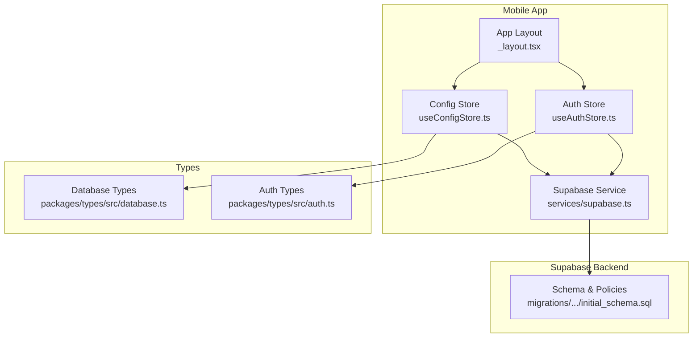
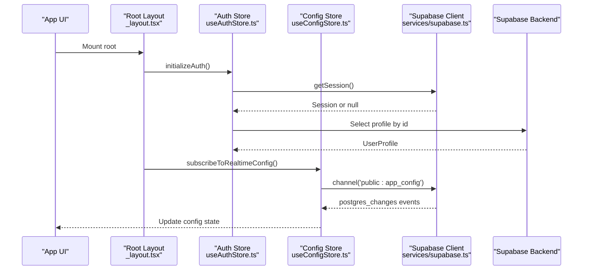
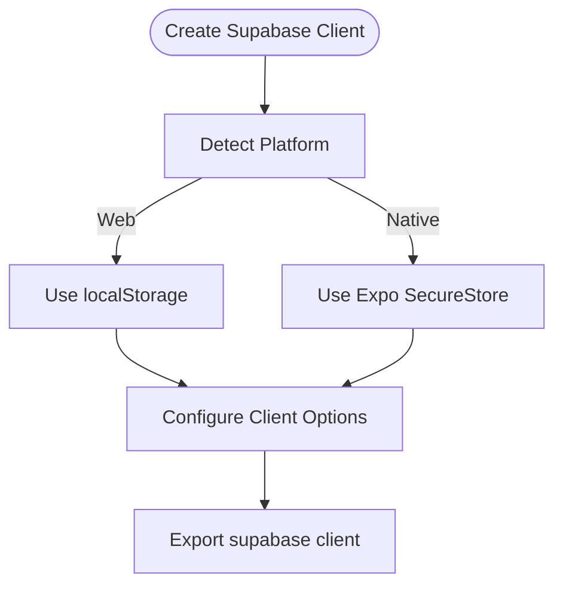
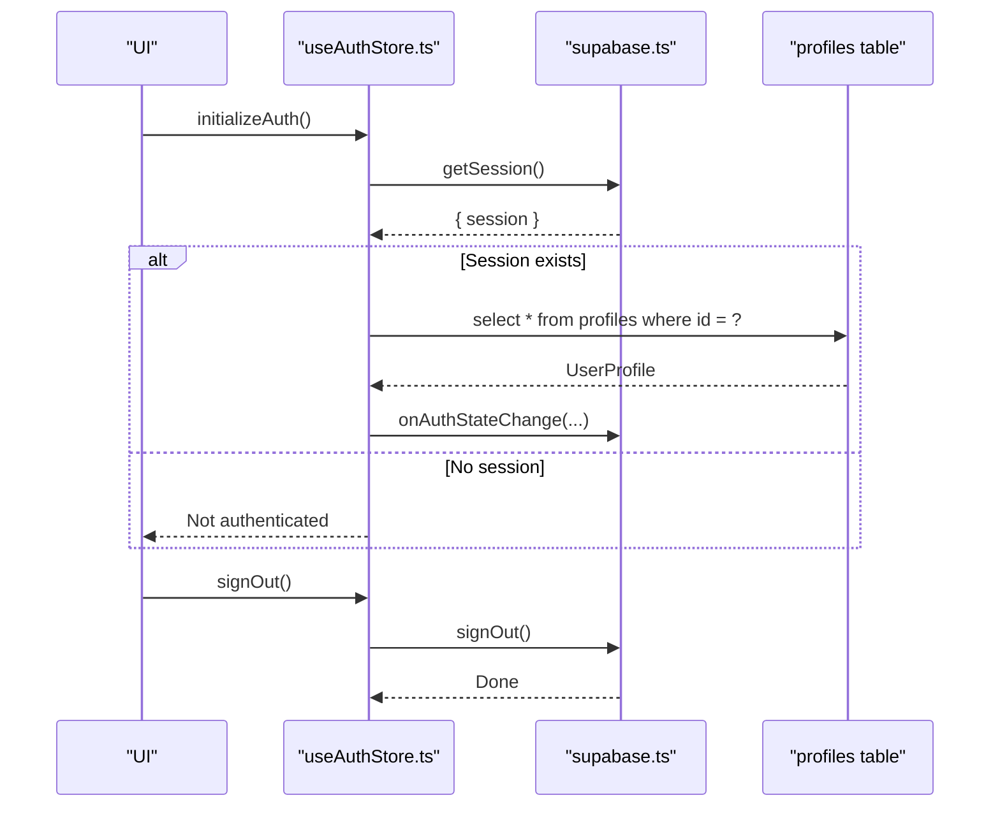
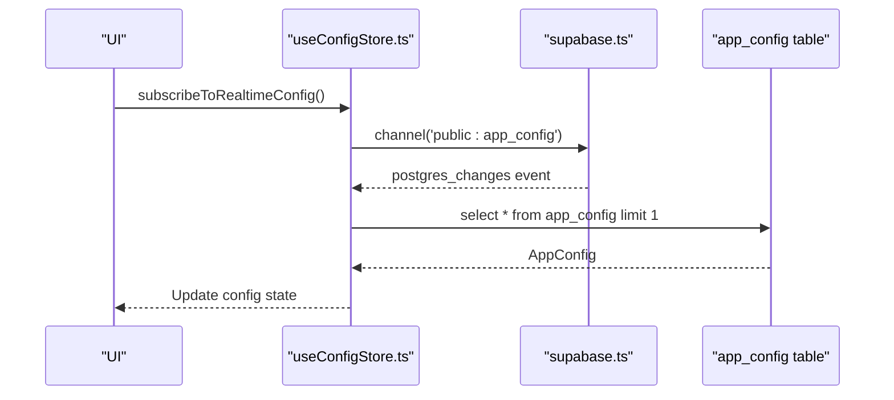
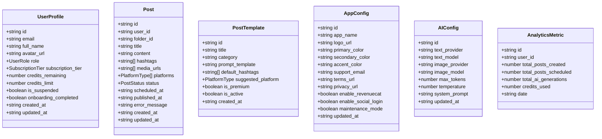
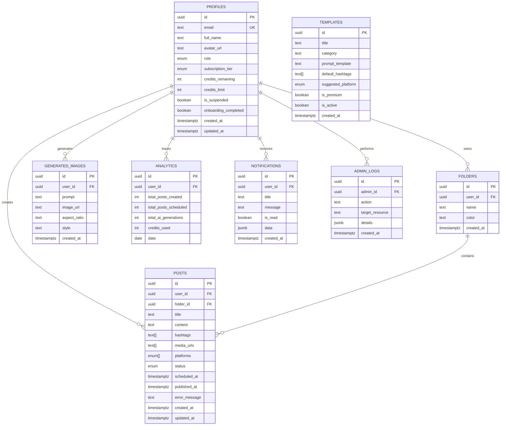
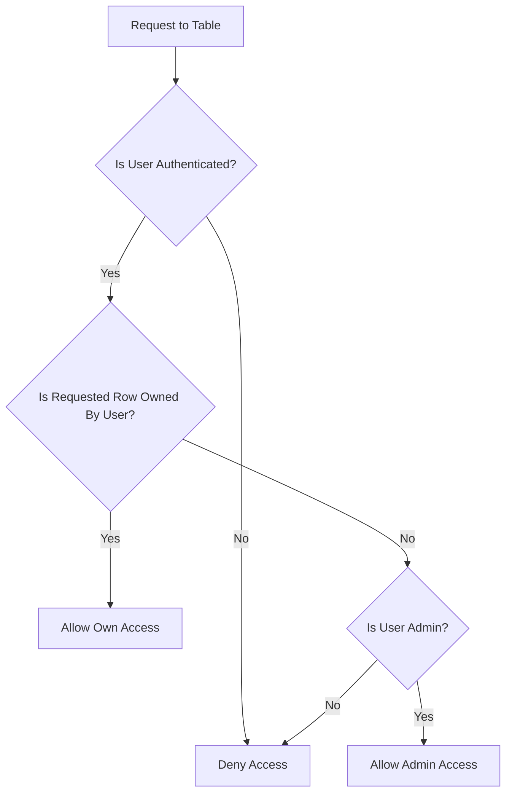
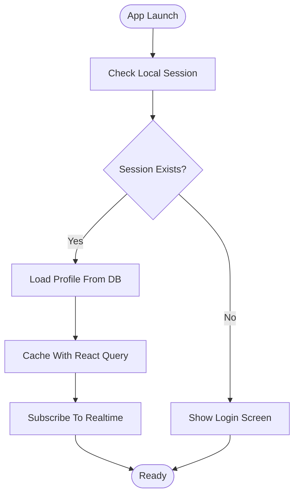
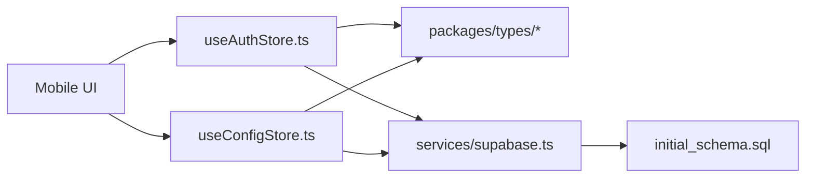

# Database Operations

<cite>
**Referenced Files in This Document**
- [supabase.ts](file://apps/mobile/src/services/supabase.ts)
- [useAuthStore.ts](file://apps/mobile/src/store/useAuthStore.ts)
- [useConfigStore.ts](file://apps/mobile/src/store/useConfigStore.ts)
- [_layout.tsx](file://apps/mobile/src/app/_layout.tsx)
- [database.ts](file://packages/types/src/database.ts)
- [auth.ts](file://packages/types/src/auth.ts)
- [initial_schema.sql](file://supabase/migrations/20240001000000_initial_schema.sql)
</cite>

## Table of Contents
1. Introduction
2. Project Structure
3. Core Components
4. Architecture Overview
5. Detailed Component Analysis
6. Dependency Analysis
7. Performance Considerations
8. Troubleshooting Guide
9. Conclusion

## Introduction
This document explains database operations for the mobile application with a focus on Supabase client configuration, secure storage adapter for cross-platform compatibility, data models and TypeScript types, Row Level Security (RLS), query patterns, real-time subscriptions, schema relationships, constraints, validation rules, offline synchronization strategies, caching, and performance considerations tailored for mobile environments.

## Project Structure
The mobile app integrates Supabase via a dedicated service module that configures the client with a secure storage adapter. Authentication state and configuration are managed by Zustand stores that perform queries and subscribe to real-time changes. Shared TypeScript types define the shape of database entities used across the app. The database schema is defined in migrations and includes RLS policies and Realtime publications.

**Diagram sources**
- [_layout.tsx:68-97](file://apps/mobile/src/app/_layout.tsx#L68-L97)
- [useAuthStore.ts:1-90](file://apps/mobile/src/store/useAuthStore.ts#L1-L90)
- [useConfigStore.ts:1-66](file://apps/mobile/src/store/useConfigStore.ts#L1-L66)
- [supabase.ts:1-41](file://apps/mobile/src/services/supabase.ts#L1-L41)
- [database.ts:1-73](file://packages/types/src/database.ts#L1-L73)
- [auth.ts:1-25](file://packages/types/src/auth.ts#L1-L25)
- [initial_schema.sql:15-232](file://supabase/migrations/20240001000000_initial_schema.sql#L15-L232)

**Section sources**
- [_layout.tsx:68-97](file://apps/mobile/src/app/_layout.tsx#L68-L97)
- [supabase.ts:1-41](file://apps/mobile/src/services/supabase.ts#L1-L41)
- [useAuthStore.ts:1-90](file://apps/mobile/src/store/useAuthStore.ts#L1-L90)
- [useConfigStore.ts:1-66](file://apps/mobile/src/store/useConfigStore.ts#L1-L66)
- [database.ts:1-73](file://packages/types/src/database.ts#L1-L73)
- [auth.ts:1-25](file://packages/types/src/auth.ts#L1-L25)
- [initial_schema.sql:15-232](file://supabase/migrations/20240001000000_initial_schema.sql#L15-L232)

## Core Components
- Supabase Client Configuration: Creates a client with environment-based URL and key, and uses a custom secure storage adapter that switches between Expo SecureStore and localStorage based on platform.
- Authentication Store: Initializes auth session, fetches user profile, listens to auth state changes, and handles sign-out.
- Configuration Store: Fetches app configuration and subscribes to real-time updates for live theme/config changes.
- Data Models: Centralized TypeScript interfaces for posts, templates, configs, analytics, and user profiles.
- Schema and Security: SQL migration defines tables, enums, constraints, triggers, RLS policies, and Realtime publications.

**Section sources**
- [supabase.ts:1-41](file://apps/mobile/src/services/supabase.ts#L1-L41)
- [useAuthStore.ts:1-90](file://apps/mobile/src/store/useAuthStore.ts#L1-L90)
- [useConfigStore.ts:1-66](file://apps/mobile/src/store/useConfigStore.ts#L1-L66)
- [database.ts:1-73](file://packages/types/src/database.ts#L1-L73)
- [auth.ts:1-25](file://packages/types/src/auth.ts#L1-L25)
- [initial_schema.sql:15-232](file://supabase/migrations/20240001000000_initial_schema.sql#L15-L232)

## Architecture Overview
The mobile app initializes a React Query client and sets up global providers. It then starts authentication initialization and subscribes to real-time configuration updates. All database interactions go through the centralized Supabase service, which enforces secure session persistence and token refresh.

**Diagram sources**
- [_layout.tsx:68-97](file://apps/mobile/src/app/_layout.tsx#L68-L97)
- [useAuthStore.ts:24-57](file://apps/mobile/src/store/useAuthStore.ts#L24-L57)
- [useConfigStore.ts:39-66](file://apps/mobile/src/store/useConfigStore.ts#L39-L66)
- [supabase.ts:33-40](file://apps/mobile/src/services/supabase.ts#L33-L40)

## Detailed Component Analysis

### Supabase Client Configuration and Secure Storage Adapter
- Cross-platform storage adapter: Uses Platform detection to choose between Expo SecureStore (native) and localStorage (web).
- Client options: Enables auto-refresh tokens, persists sessions, and disables URL-based session detection for mobile safety.
- Environment variables: Reads Supabase URL and anon key from environment; exposes a placeholder flag to avoid network calls during development.

**Diagram sources**
- [supabase.ts:5-26](file://apps/mobile/src/services/supabase.ts#L5-L26)
- [supabase.ts:28-40](file://apps/mobile/src/services/supabase.ts#L28-L40)

**Section sources**
- [supabase.ts:1-41](file://apps/mobile/src/services/supabase.ts#L1-L41)

### Authentication Flow and Profile Management
- Initialization: Retrieves existing session, loads user profile if present, and sets up an auth state change listener to keep UI in sync.
- Profile fetching: Queries the profiles table using the authenticated user’s id.
- Sign out: Clears session and resets local state.

**Diagram sources**
- [useAuthStore.ts:24-57](file://apps/mobile/src/store/useAuthStore.ts#L24-L57)
- [useAuthStore.ts:68-89](file://apps/mobile/src/store/useAuthStore.ts#L68-L89)
- [supabase.ts:33-40](file://apps/mobile/src/services/supabase.ts#L33-L40)

**Section sources**
- [useAuthStore.ts:1-90](file://apps/mobile/src/store/useAuthStore.ts#L1-L90)

### Configuration Store and Real-Time Subscriptions
- Fetch config: Loads a single row from app_config with error handling and loading state management.
- Real-time subscription: Subscribes to all changes on app_config and updates store when new data arrives.
- Placeholder guard: Skips network calls when running against placeholder URLs to prevent timeouts.

**Diagram sources**
- [useConfigStore.ts:15-38](file://apps/mobile/src/store/useConfigStore.ts#L15-L38)
- [useConfigStore.ts:39-66](file://apps/mobile/src/store/useConfigStore.ts#L39-L66)
- [supabase.ts:33-40](file://apps/mobile/src/services/supabase.ts#L33-L40)

**Section sources**
- [useConfigStore.ts:1-66](file://apps/mobile/src/store/useConfigStore.ts#L1-L66)

### Data Models and Type Safety
- Database types: Define Post, PostTemplate, AppConfig, AIConfig, AnalyticsMetric with precise field types and arrays for platforms/hashtags/media.
- Auth types: Define UserRole, SubscriptionTier, UserProfile, and AuthSessionState for consistent typing across the app.

**Diagram sources**
- [auth.ts:1-25](file://packages/types/src/auth.ts#L1-L25)
- [database.ts:1-73](file://packages/types/src/database.ts#L1-L73)

**Section sources**
- [auth.ts:1-25](file://packages/types/src/auth.ts#L1-L25)
- [database.ts:1-73](file://packages/types/src/database.ts#L1-L73)

### Database Schema, Relationships, Constraints, and Validation
- Tables and relationships:
  - profiles references auth.users (one-to-one)
  - folders and posts reference profiles (user ownership)
  - posts optionally reference folders
  - generated_images, analytics, notifications, admin_logs reference profiles
- Enums: user_role, subscription_tier, post_status, platform_type constrain values at the database level.
- Constraints:
  - Unique email in profiles
  - Unique (user_id, date) in analytics
  - Arrays for hashtags, media_urls, platforms with defaults
- Triggers:
  - Automatic creation of profiles on user signup
- Realtime:
  - Publications enabled for app_config, posts, notifications, templates

**Diagram sources**
- [initial_schema.sql:15-153](file://supabase/migrations/20240001000000_initial_schema.sql#L15-L153)

**Section sources**
- [initial_schema.sql:15-153](file://supabase/migrations/20240001000000_initial_schema.sql#L15-L153)

### Row Level Security Policies
- Profiles: Users can read/update their own profile; admins have full access.
- Posts: Users manage their own posts; admins can moderate.
- Folders: Users manage their own folders.
- Templates: Authenticated users read active templates; admins manage all.
- Generated images, notifications, analytics: Scoped to user or admin.
- Admin logs: Admin-only access.

**Diagram sources**
- [initial_schema.sql:159-202](file://supabase/migrations/20240001000000_initial_schema.sql#L159-L202)

**Section sources**
- [initial_schema.sql:159-202](file://supabase/migrations/20240001000000_initial_schema.sql#L159-L202)

### Query Patterns and Optimization
- Single-row reads: Use .select('*').eq('id', userId).single() for profiles to ensure type safety and efficient retrieval.
- Limited selects: Use .limit(1).single() for singleton configurations like app_config.
- Real-time updates: Subscribe to specific channels per table to minimize bandwidth and keep UI current without polling.
- Placeholder guards: Skip network calls when using placeholder URLs to avoid long DNS timeouts and wasted resources.

**Section sources**
- [useAuthStore.ts:68-80](file://apps/mobile/src/store/useAuthStore.ts#L68-L80)
- [useConfigStore.ts:15-38](file://apps/mobile/src/store/useConfigStore.ts#L15-L38)
- [useConfigStore.ts:39-66](file://apps/mobile/src/store/useConfigStore.ts#L39-L66)

### Real-Time Subscriptions
- Channel naming: Uses Supabase channel names such as 'public:app_config'.
- Event handling: Listens to postgres_changes events for insert/update/delete and updates store accordingly.
- Cleanup: Returns an unsubscribe function to remove channels when components unmount.

**Section sources**
- [useConfigStore.ts:39-66](file://apps/mobile/src/store/useConfigStore.ts#L39-L66)
- [initial_schema.sql:227-231](file://supabase/migrations/20240001000000_initial_schema.sql#L227-L231)

### Offline Data Synchronization and Caching Strategies
- Local session persistence: Enabled via Supabase client options to maintain login state across app restarts.
- Token auto-refresh: Ensures sessions remain valid without manual re-authentication.
- React Query caching: Global staleTime configured to reduce redundant network requests and improve perceived performance.
- Placeholder bypass: Prevents unnecessary network attempts during development or when backend is unavailable.

**Diagram sources**
- [supabase.ts:33-40](file://apps/mobile/src/services/supabase.ts#L33-L40)
- [_layout.tsx:68-97](file://apps/mobile/src/app/_layout.tsx#L68-L97)
- [useAuthStore.ts:24-57](file://apps/mobile/src/store/useAuthStore.ts#L24-L57)

**Section sources**
- [supabase.ts:33-40](file://apps/mobile/src/services/supabase.ts#L33-L40)
- [_layout.tsx:68-97](file://apps/mobile/src/app/_layout.tsx#L68-L97)
- [useAuthStore.ts:24-57](file://apps/mobile/src/store/useAuthStore.ts#L24-L57)

## Dependency Analysis
- Mobile app depends on Supabase client for all data operations.
- Stores depend on shared types for compile-time safety.
- Schema and policies enforce data integrity and access control at the database layer.

**Diagram sources**
- [useAuthStore.ts:1-90](file://apps/mobile/src/store/useAuthStore.ts#L1-L90)
- [useConfigStore.ts:1-66](file://apps/mobile/src/store/useConfigStore.ts#L1-L66)
- [supabase.ts:1-41](file://apps/mobile/src/services/supabase.ts#L1-L41)
- [database.ts:1-73](file://packages/types/src/database.ts#L1-L73)
- [auth.ts:1-25](file://packages/types/src/auth.ts#L1-L25)
- [initial_schema.sql:15-232](file://supabase/migrations/20240001000000_initial_schema.sql#L15-L232)

**Section sources**
- [useAuthStore.ts:1-90](file://apps/mobile/src/store/useAuthStore.ts#L1-L90)
- [useConfigStore.ts:1-66](file://apps/mobile/src/store/useConfigStore.ts#L1-L66)
- [supabase.ts:1-41](file://apps/mobile/src/services/supabase.ts#L1-L41)
- [database.ts:1-73](file://packages/types/src/database.ts#L1-L73)
- [auth.ts:1-25](file://packages/types/src/auth.ts#L1-L25)
- [initial_schema.sql:15-232](file://supabase/migrations/20240001000000_initial_schema.sql#L15-L232)

## Performance Considerations
- Prefer single-row queries with .single() to reduce payload size and simplify error handling.
- Limit selections to necessary fields where possible to minimize bandwidth.
- Use real-time subscriptions instead of polling to keep UI synchronized efficiently.
- Configure React Query staleTime to balance freshness and network usage.
- Guard against placeholder URLs to avoid long DNS timeouts and wasted retries.
- Ensure RLS policies are correctly applied to avoid permission errors and unnecessary retries.

[No sources needed since this section provides general guidance]

## Troubleshooting Guide
- Empty results or permission denied:
  - Verify RLS policies are applied by executing the initial schema migration in the Supabase dashboard.
- Admin access issues:
  - Ensure the user’s role in profiles is set to admin or super_admin for admin features.
- Realtime not updating:
  - Confirm that the relevant tables are included in the supabase_realtime publication.
- Network timeouts during development:
  - Use placeholder URL checks to skip network calls when backend is unavailable.

**Section sources**
- [initial_schema.sql:159-231](file://supabase/migrations/20240001000000_initial_schema.sql#L159-L231)

## Conclusion
The mobile application implements a robust database integration with Supabase using a secure, cross-platform storage adapter, well-defined TypeScript types, and strict Row Level Security policies. Real-time subscriptions provide live updates for critical data, while caching and placeholder guards optimize performance for mobile environments. Following the documented patterns ensures reliable CRUD operations, scalable queries, and resilient error handling.

[No sources needed since this section summarizes without analyzing specific files]