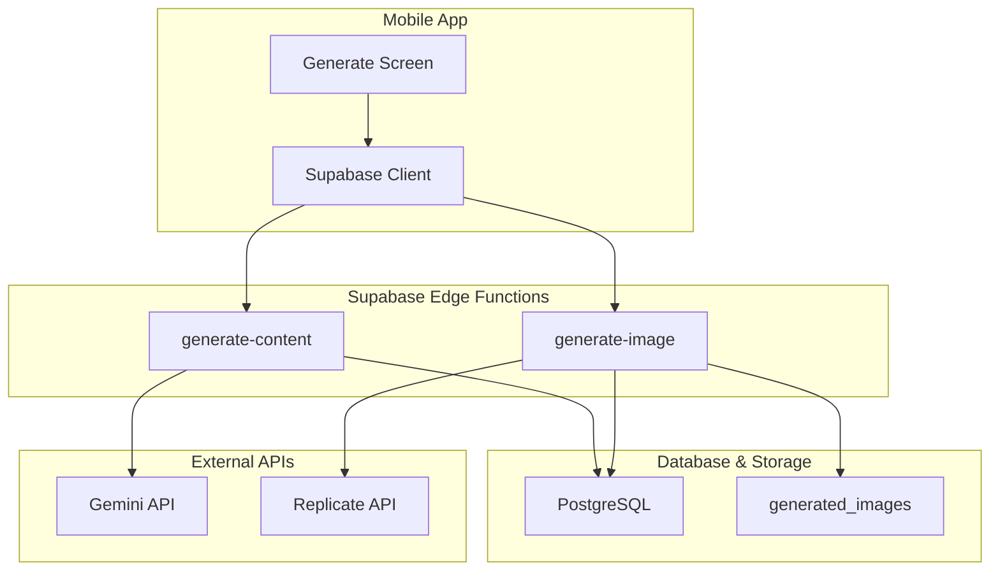
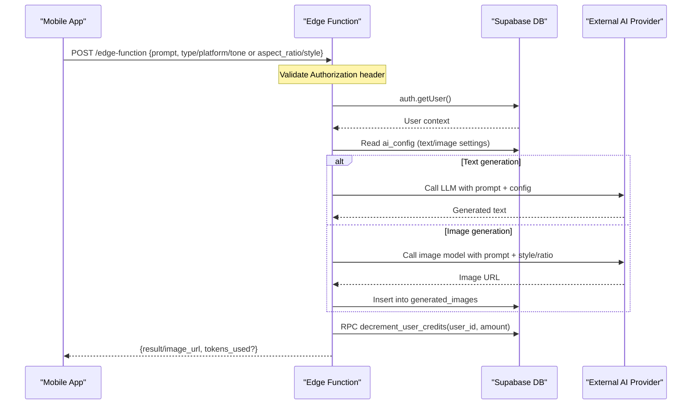
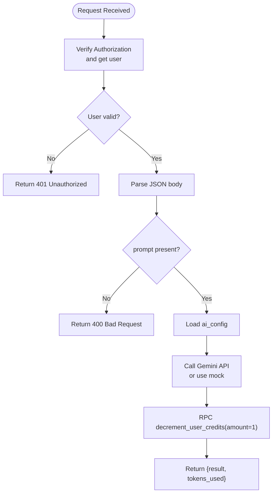
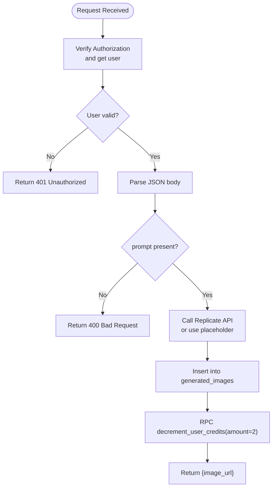
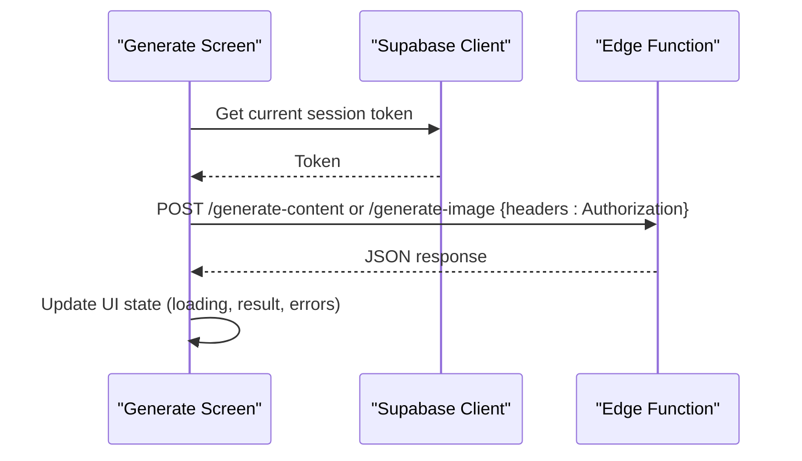
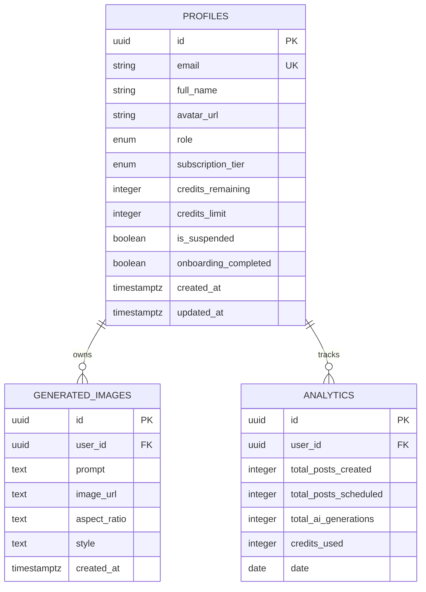
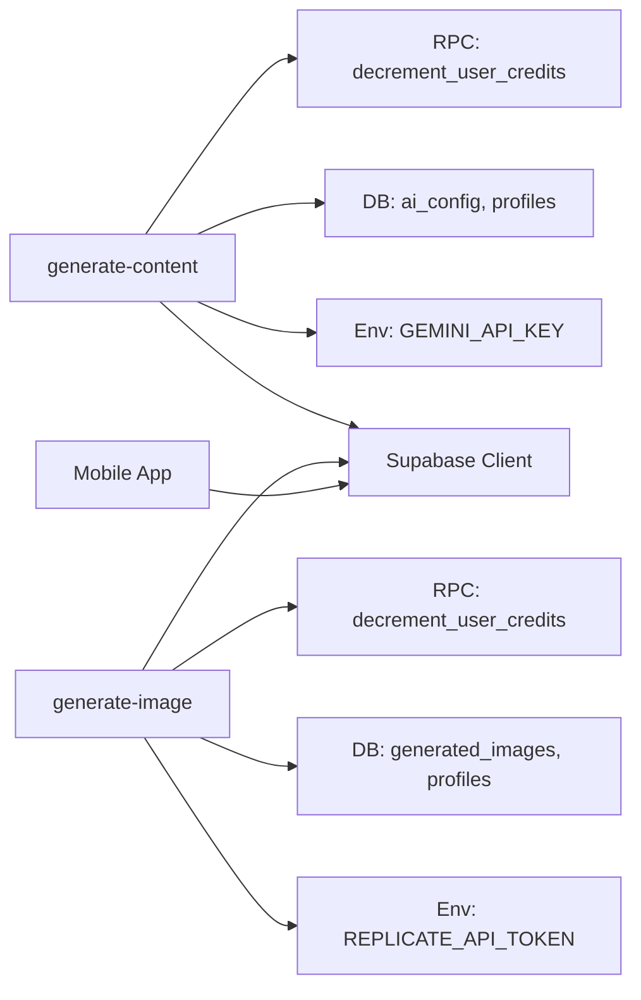

# Edge Functions

<cite>
**Referenced Files in This Document**
- [generate-content/index.ts](file://supabase/functions/generate-content/index.ts)
- [generate-image/index.ts](file://supabase/functions/generate-image/index.ts)
- [initial_schema.sql](file://supabase/migrations/20240001000000_initial_schema.sql)
- [supabase.ts (mobile)](file://apps/mobile/src/services/supabase.ts)
- [api.ts (types)](file://packages/types/src/api.ts)
- [auth.ts (types)](file://packages/types/src/auth.ts)
- [generate.tsx (mobile UI)](file://apps/mobile/src/app/(tabs)/generate.tsx)
</cite>

## Table of Contents
1. [Introduction](#introduction)
2. [Project Structure](#project-structure)
3. [Core Components](#core-components)
4. [Architecture Overview](#architecture-overview)
5. [Detailed Component Analysis](#detailed-component-analysis)
6. [Dependency Analysis](#dependency-analysis)
7. [Performance Considerations](#performance-considerations)
8. [Troubleshooting Guide](#troubleshooting-guide)
9. [Conclusion](#conclusion)
10. [Appendices](#appendices)

## Introduction
This document explains the Supabase Edge Functions used for AI text generation and image generation, how they authenticate users, integrate with a credit system, and return standardized responses. It also covers invocation patterns from the mobile app, request/response formats, error handling, security considerations, input validation, logging strategies, and guidance for asynchronous operations and rate limiting.

## Project Structure
The relevant parts of the project include:
- Two Deno-based Edge Functions under supabase/functions for content and image generation.
- A database schema defining profiles, generated images, analytics, and RLS policies.
- Mobile app configuration for Supabase client and session persistence.
- Shared TypeScript types describing API contracts for requests and responses.

**Diagram sources**
- [generate-content/index.ts:1-99](file://supabase/functions/generate-content/index.ts#L1-L99)
- [generate-image/index.ts:1-87](file://supabase/functions/generate-image/index.ts#L1-L87)
- [initial_schema.sql:31-132](file://supabase/migrations/20240001000000_initial_schema.sql#L31-L132)
- [supabase.ts (mobile):1-41](file://apps/mobile/src/services/supabase.ts#L1-L41)

**Section sources**
- [generate-content/index.ts:1-99](file://supabase/functions/generate-content/index.ts#L1-L99)
- [generate-image/index.ts:1-87](file://supabase/functions/generate-image/index.ts#L1-L87)
- [initial_schema.sql:1-232](file://supabase/migrations/20240001000000_initial_schema.sql#L1-L232)
- [supabase.ts (mobile):1-41](file://apps/mobile/src/services/supabase.ts#L1-L41)

## Core Components
- Content Generation Edge Function: Authenticates user, validates inputs, reads AI configuration, calls an external LLM, decrements credits via RPC, and returns generated text with token usage metadata.
- Image Generation Edge Function: Authenticates user, validates inputs, calls an image model provider, persists generated image metadata to the database, decrements credits via RPC, and returns the image URL.
- Database Schema: Defines profiles (with credits), generated_images, analytics, and RLS policies that restrict access to user-owned data.
- Mobile Supabase Client: Configures secure session storage and auto-refresh tokens for authenticated requests.
- API Types: Define typed request and response structures for both text and image generation endpoints.

**Section sources**
- [generate-content/index.ts:14-91](file://supabase/functions/generate-content/index.ts#L14-L91)
- [generate-image/index.ts:14-79](file://supabase/functions/generate-image/index.ts#L14-L79)
- [initial_schema.sql:44-132](file://supabase/migrations/20240001000000_initial_schema.sql#L44-L132)
- [supabase.ts (mobile):28-41](file://apps/mobile/src/services/supabase.ts#L28-L41)
- [api.ts (types):1-33](file://packages/types/src/api.ts#L1-L33)

## Architecture Overview
The mobile app authenticates users via Supabase Auth and then invokes edge functions with an Authorization header. Each function verifies identity using Supabase’s getUser, enforces input validation, interacts with external AI providers, updates the credit system through a database RPC, and returns structured JSON responses.

**Diagram sources**
- [generate-content/index.ts:14-91](file://supabase/functions/generate-content/index.ts#L14-L91)
- [generate-image/index.ts:14-79](file://supabase/functions/generate-image/index.ts#L14-L79)
- [initial_schema.sql:31-132](file://supabase/migrations/20240001000000_initial_schema.sql#L31-L132)

## Detailed Component Analysis

### Content Generation Edge Function
- Authentication: Extracts Authorization header and uses Supabase client to get current user; returns 401 if unauthorized.
- Input validation: Requires prompt; optional fields include type, platform (default instagram), tone (default Professional).
- Configuration: Reads ai_config to determine system_prompt, temperature, and max_tokens.
- External call: Calls Gemini API when key is present; otherwise returns a mock result.
- Credits: Decrements user credits by 1 via RPC.
- Response: Returns generated text and tokens_used.

**Diagram sources**
- [generate-content/index.ts:14-91](file://supabase/functions/generate-content/index.ts#L14-L91)

**Section sources**
- [generate-content/index.ts:14-91](file://supabase/functions/generate-content/index.ts#L14-L91)

### Image Generation Edge Function
- Authentication: Same pattern as content generation.
- Input validation: Requires prompt; optional aspect_ratio (default 1:1) and style (default Photorealistic).
- External call: Calls Replicate API when token is present; otherwise uses a placeholder image URL.
- Persistence: Inserts record into generated_images table with user_id, prompt, image_url, aspect_ratio, style.
- Credits: Decrements user credits by 2 via RPC.
- Response: Returns image_url.

**Diagram sources**
- [generate-image/index.ts:14-79](file://supabase/functions/generate-image/index.ts#L14-L79)

**Section sources**
- [generate-image/index.ts:14-79](file://supabase/functions/generate-image/index.ts#L14-L79)

### Mobile App Integration Patterns
- The mobile app initializes a Supabase client with secure storage and auto-refreshed sessions.
- The generate screen currently simulates generation locally and updates credits directly on the profile table; this can be replaced by calling the edge functions to centralize logic and enforce server-side validation and billing.
- When integrating, pass the user’s session token in the Authorization header to the edge functions.

**Diagram sources**
- [supabase.ts (mobile):28-41](file://apps/mobile/src/services/supabase.ts#L28-L41)
- [generate.tsx (mobile UI):123-160](file://apps/mobile/src/app/(tabs)/generate.tsx#L123-L160)

**Section sources**
- [supabase.ts (mobile):28-41](file://apps/mobile/src/services/supabase.ts#L28-L41)
- [generate.tsx (mobile UI):123-160](file://apps/mobile/src/app/(tabs)/generate.tsx#L123-L160)

### Data Models and Contracts
- Request/Response types define expected payloads for text and image generation, including optional fields like hashtags and revised prompts.
- User profile includes credits_remaining and credits_limit, which are decremented by edge functions via RPC.

**Diagram sources**
- [initial_schema.sql:44-132](file://supabase/migrations/20240001000000_initial_schema.sql#L44-L132)
- [auth.ts (types):5-18](file://packages/types/src/auth.ts#L5-L18)
- [api.ts (types):1-33](file://packages/types/src/api.ts#L1-L33)

**Section sources**
- [initial_schema.sql:44-132](file://supabase/migrations/20240001000000_initial_schema.sql#L44-L132)
- [auth.ts (types):5-18](file://packages/types/src/auth.ts#L5-L18)
- [api.ts (types):1-33](file://packages/types/src/api.ts#L1-L33)

## Dependency Analysis
- Edge functions depend on:
  - Supabase client for authentication and database access.
  - Environment variables for external API keys (e.g., Gemini, Replicate).
  - Database tables for configuration and persistence.
  - An RPC function named decrement_user_credits to adjust user credits atomically.
- Mobile app depends on:
  - Supabase client configured with secure storage and session management.
  - UI components to handle loading states and display results.

**Diagram sources**
- [generate-content/index.ts:14-91](file://supabase/functions/generate-content/index.ts#L14-L91)
- [generate-image/index.ts:14-79](file://supabase/functions/generate-image/index.ts#L14-L79)
- [initial_schema.sql:31-132](file://supabase/migrations/20240001000000_initial_schema.sql#L31-L132)

**Section sources**
- [generate-content/index.ts:14-91](file://supabase/functions/generate-content/index.ts#L14-L91)
- [generate-image/index.ts:14-79](file://supabase/functions/generate-image/index.ts#L14-L79)
- [initial_schema.sql:31-132](file://supabase/migrations/20240001000000_initial_schema.sql#L31-L132)

## Performance Considerations
- External API latency: Both functions call third-party services; consider timeouts and retries at the application layer.
- Concurrency: Edge functions run per request; avoid long-running synchronous loops. For heavy tasks, consider background jobs or webhooks.
- Database calls: Minimize queries; batch where possible. The current flow performs one config read and one RPC per request.
- Caching: Cache frequently accessed configuration (ai_config) in memory within the function runtime if appropriate.
- Rate limiting: Implement server-side throttling per user or globally to protect external APIs and database resources.

[No sources needed since this section provides general guidance]

## Troubleshooting Guide
Common issues and resolutions:
- Unauthorized (401): Ensure the Authorization header contains a valid Supabase session token. Verify the mobile client’s session persistence and auto-refresh settings.
- Bad Request (400): Confirm required fields are present (prompt). Check field types and allowed values.
- External API failures: Handle non-200 responses from Gemini or Replicate; surface meaningful errors to the client.
- Credit deduction failures: Ensure the RPC decrement_user_credits exists and is callable by the function’s service role or authenticated user context.
- CORS: The functions set permissive CORS headers; ensure browser or mobile network policies allow cross-origin requests.

**Section sources**
- [generate-content/index.ts:21-36](file://supabase/functions/generate-content/index.ts#L21-L36)
- [generate-image/index.ts:21-36](file://supabase/functions/generate-image/index.ts#L21-L36)
- [supabase.ts (mobile):28-41](file://apps/mobile/src/services/supabase.ts#L28-L41)

## Conclusion
The Supabase Edge Functions provide a secure, centralized way to perform AI-driven content and image generation while enforcing authentication, validating inputs, managing credits, and persisting results. Integrating the mobile app to call these functions ensures consistent behavior, robust error handling, and scalable usage tracking. Production deployments should add comprehensive logging, rate limiting, and retry strategies to handle external API variability and protect system resources.

[No sources needed since this section summarizes without analyzing specific files]

## Appendices

### Invocation Examples and Patterns
- Content generation:
  - Endpoint: POST to the generate-content edge function.
  - Headers: Include Authorization with a valid Supabase session token.
  - Body: prompt (required), type (optional), platform (optional, default instagram), tone (optional, default Professional).
  - Response: { result: string, tokens_used: number }.
- Image generation:
  - Endpoint: POST to the generate-image edge function.
  - Headers: Include Authorization with a valid Supabase session token.
  - Body: prompt (required), aspect_ratio (optional, default 1:1), style (optional, default Photorealistic).
  - Response: { image_url: string }.

**Section sources**
- [generate-content/index.ts:29-91](file://supabase/functions/generate-content/index.ts#L29-L91)
- [generate-image/index.ts:29-79](file://supabase/functions/generate-image/index.ts#L29-L79)
- [api.ts (types):1-33](file://packages/types/src/api.ts#L1-L33)

### Error Handling Strategy
- Validate inputs early and return 400 with descriptive messages.
- Propagate external API errors with status codes and concise messages.
- Wrap all async operations in try/catch to return 500 with error details.
- On the mobile side, handle loading states, show user-friendly messages, and retry failed requests with exponential backoff.

**Section sources**
- [generate-content/index.ts:31-36](file://supabase/functions/generate-content/index.ts#L31-L36)
- [generate-image/index.ts:31-36](file://supabase/functions/generate-image/index.ts#L31-L36)
- [generate-content/index.ts:92-97](file://supabase/functions/generate-content/index.ts#L92-L97)
- [generate-image/index.ts:80-85](file://supabase/functions/generate-image/index.ts#L80-L85)

### Security Considerations
- Always validate Authorization headers and reject unauthenticated requests.
- Use environment variables for secrets (API keys); never hardcode them.
- Enforce Row Level Security policies so users can only access their own data.
- Limit permissions: Edge functions should only access necessary tables and RPCs.

**Section sources**
- [generate-content/index.ts:14-27](file://supabase/functions/generate-content/index.ts#L14-L27)
- [generate-image/index.ts:14-27](file://supabase/functions/generate-image/index.ts#L14-L27)
- [initial_schema.sql:155-202](file://supabase/migrations/20240001000000_initial_schema.sql#L155-L202)

### Logging Strategies for Production
- Log request IDs, user IDs, timestamps, and outcomes (success/failure).
- Capture external API response codes and truncated payloads for debugging.
- Avoid logging sensitive data (tokens, prompts containing PII).
- Centralize logs in a monitoring system and set alerts for high error rates.

[No sources needed since this section provides general guidance]

### Asynchronous Operations and Rate Limits
- Use timeouts for external API calls; implement retries with jitter for transient errors.
- Implement per-user rate limits using Redis or database counters before invoking expensive operations.
- Queue long-running tasks (e.g., large image generations) and notify clients via webhooks or polling.

[No sources needed since this section provides general guidance]