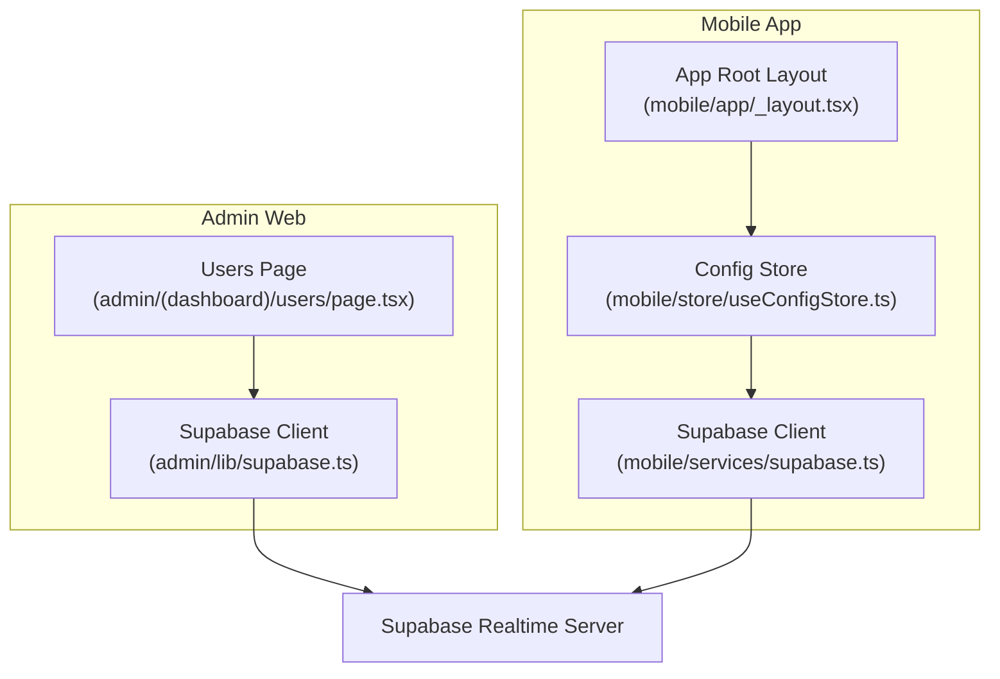
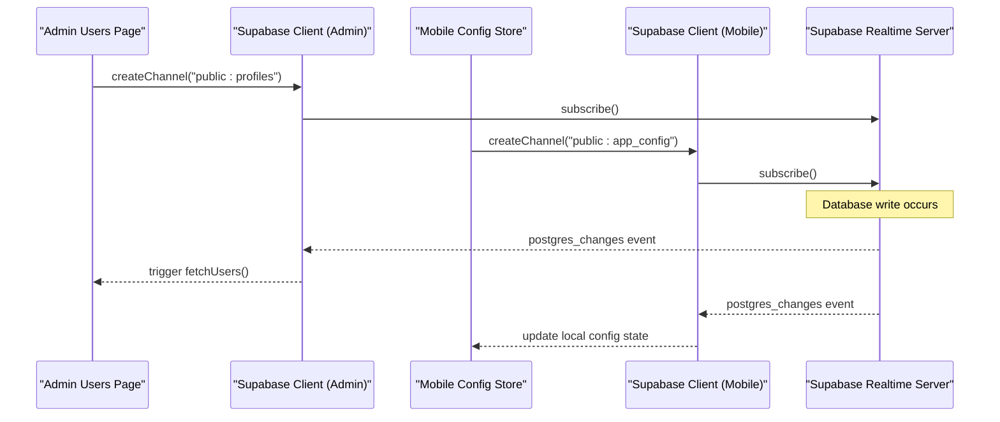
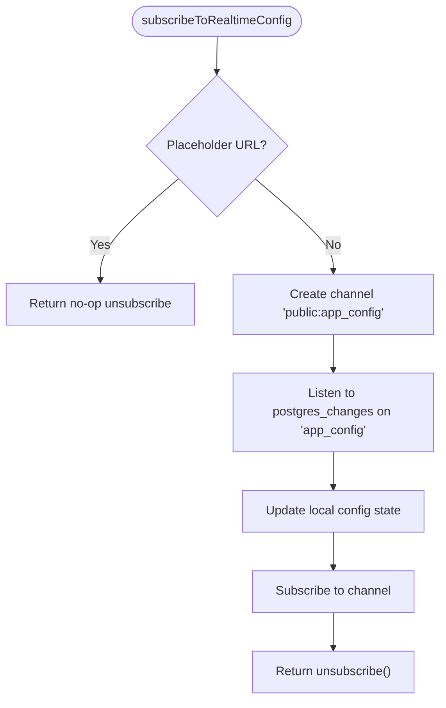
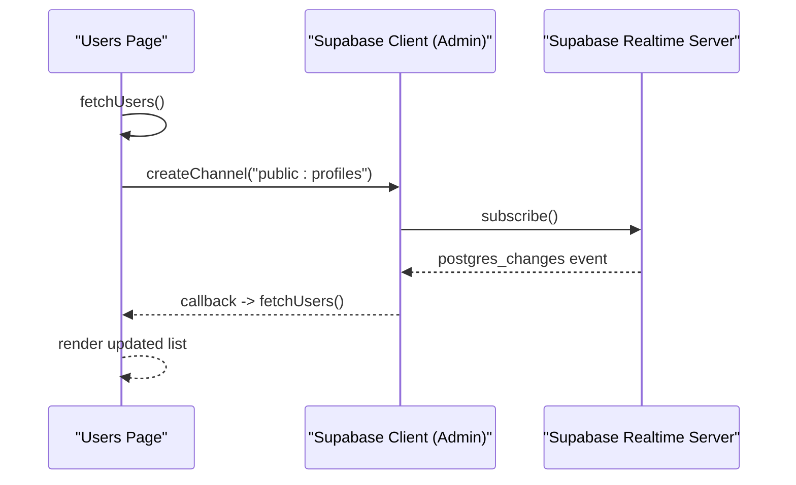
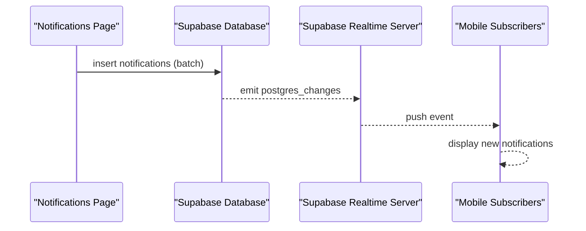
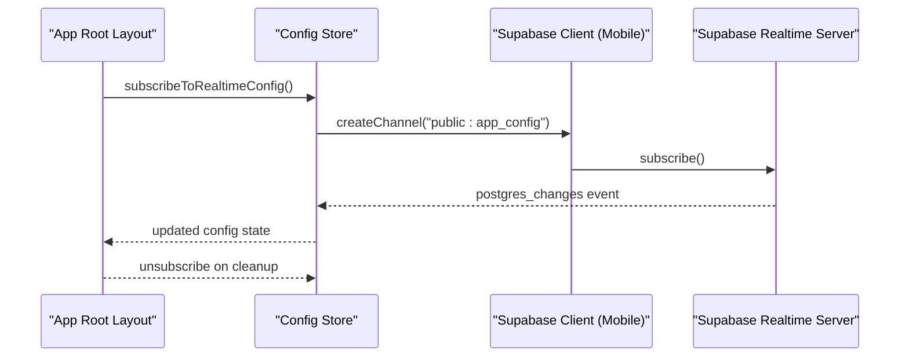
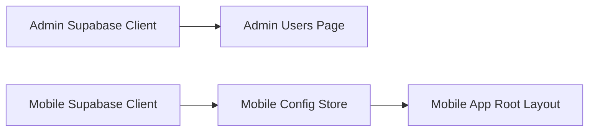

# Real-time Features

<cite>
**Referenced Files in This Document**
- [supabase.ts](file://apps/admin/src/lib/supabase.ts)
- [supabase.ts](file://apps/mobile/src/services/supabase.ts)
- [useConfigStore.ts](file://apps/mobile/src/store/useConfigStore.ts)
- [page.tsx](file://apps/admin/src/app/(dashboard)/users/page.tsx)
- [page.tsx](file://apps/admin/src/app/(dashboard)/notifications/page.tsx)
- [_layout.tsx](file://apps/mobile/src/app/_layout.tsx)
- [config.toml](file://supabase/config.toml)
</cite>

## Table of Contents
1. Introduction
2. Project Structure
3. Core Components
4. Architecture Overview
5. Detailed Component Analysis
6. Dependency Analysis
7. Performance Considerations
8. Troubleshooting Guide
9. Conclusion

## Introduction
This document explains how the application uses Supabase real-time features to deliver live updates across admin and mobile clients. It covers WebSocket connection management, channel creation, event handling patterns for database changes, broadcasting notifications, and connection state considerations. It also provides guidance on reconnection behavior, offline message queuing strategies, performance optimization for high-frequency updates, and debugging techniques for monitoring subscription health.

## Project Structure
Real-time functionality is implemented using the Supabase JavaScript client configured per app:
- Admin web client initializes a Supabase client with session persistence and token refresh.
- Mobile client initializes a Supabase client with secure storage and platform-aware session handling.
- A mobile store subscribes to a specific table via a Supabase channel to receive live configuration updates.
- An admin page subscribes to another table to keep the users list fresh without manual refresh.
- The mobile app root layout sets up the global real-time subscription lifecycle.

**Diagram sources**
- [supabase.ts:1-14](file://apps/admin/src/lib/supabase.ts#L1-L14)
- [supabase.ts:1-41](file://apps/mobile/src/services/supabase.ts#L1-L41)
- [useConfigStore.ts:1-66](file://apps/mobile/src/store/useConfigStore.ts#L1-L66)
- [page.tsx:1-213](file://apps/admin/src/app/(dashboard)/users/page.tsx#L1-L213)
- [_layout.tsx:68-97](file://apps/mobile/src/app/_layout.tsx#L68-L97)

**Section sources**
- [supabase.ts:1-14](file://apps/admin/src/lib/supabase.ts#L1-L14)
- [supabase.ts:1-41](file://apps/mobile/src/services/supabase.ts#L1-L41)
- [useConfigStore.ts:1-66](file://apps/mobile/src/store/useConfigStore.ts#L1-L66)
- [page.tsx:1-213](file://apps/admin/src/app/(dashboard)/users/page.tsx#L1-L213)
- [_layout.tsx:68-97](file://apps/mobile/src/app/_layout.tsx#L68-L97)

## Core Components
- Supabase client initialization (admin): Creates a client with session persistence and automatic token refresh to maintain authenticated real-time connections.
- Supabase client initialization (mobile): Creates a client with secure storage and platform-specific session handling to ensure reliable real-time connectivity on mobile and web.
- Real-time config subscription (mobile): Subscribes to a channel for a specific table and updates local state when changes occur; returns an unsubscribe function for cleanup.
- Real-time users list (admin): Subscribes to a channel for user profiles and triggers a data refresh whenever any change occurs.
- Notification broadcast (admin): Inserts notification records targeted at users, which can be consumed by clients that subscribe to the notifications table.

Key responsibilities:
- Connection lifecycle: Create channels, attach listeners, subscribe, and remove channels on unmount or when no longer needed.
- Event handling: Listen to postgres_changes events for tables and update UI state accordingly.
- Broadcast pattern: Insert rows into a shared table so subscribers receive updates automatically.

**Section sources**
- [supabase.ts:1-14](file://apps/admin/src/lib/supabase.ts#L1-L14)
- [supabase.ts:1-41](file://apps/mobile/src/services/supabase.ts#L1-L41)
- [useConfigStore.ts:39-66](file://apps/mobile/src/store/useConfigStore.ts#L39-L66)
- [page.tsx:32-46](file://apps/admin/src/app/(dashboard)/users/page.tsx#L32-L46)
- [page.tsx:14-60](file://apps/admin/src/app/(dashboard)/notifications/page.tsx#L14-L60)

## Architecture Overview
The real-time architecture centers on Supabase channels that listen to database changes. Clients create channels scoped to specific schemas and tables, register event handlers, and subscribe. When data changes, Supabase pushes events to all subscribed clients, enabling live UI updates without polling.

**Diagram sources**
- [page.tsx:32-46](file://apps/admin/src/app/(dashboard)/users/page.tsx#L32-L46)
- [useConfigStore.ts:45-61](file://apps/mobile/src/store/useConfigStore.ts#L45-L61)

## Detailed Component Analysis

### Supabase Client Initialization
- Admin client enables session persistence and auto-refresh to keep real-time connections authenticated.
- Mobile client uses secure storage and platform-aware session logic to ensure robust connectivity across environments.

Operational notes:
- Placeholder URLs are detected to avoid unnecessary network attempts during development.
- Token refresh and session persistence reduce reconnect churn and improve reliability.

**Section sources**
- [supabase.ts:1-14](file://apps/admin/src/lib/supabase.ts#L1-L14)
- [supabase.ts:1-41](file://apps/mobile/src/services/supabase.ts#L1-L41)

### Real-time Configuration Updates (Mobile)
- The mobile store creates a channel for the app_config table and listens for any postgres_changes event.
- On change, it updates the local configuration state.
- Returns an unsubscribe function that removes the channel when the component unmounts.
- Skips real-time setup when running against placeholder URLs to prevent timeouts.

**Diagram sources**
- [useConfigStore.ts:39-66](file://apps/mobile/src/store/useConfigStore.ts#L39-L66)

**Section sources**
- [useConfigStore.ts:1-66](file://apps/mobile/src/store/useConfigStore.ts#L1-L66)

### Real-time Users List (Admin)
- The users page performs an initial fetch and then subscribes to changes on the profiles table.
- Any change triggers a refetch to keep the table current.
- Channel is removed on cleanup to free resources.

**Diagram sources**
- [page.tsx:14-30](file://apps/admin/src/app/(dashboard)/users/page.tsx#L14-L30)
- [page.tsx:32-46](file://apps/admin/src/app/(dashboard)/users/page.tsx#L32-L46)

**Section sources**
- [page.tsx:14-46](file://apps/admin/src/app/(dashboard)/users/page.tsx#L14-L46)

### Notification Broadcasting (Admin)
- The broadcast page selects target users based on criteria and inserts notification records in batch.
- Clients subscribed to the notifications table will receive real-time updates for new entries.

**Diagram sources**
- [page.tsx:14-60](file://apps/admin/src/app/(dashboard)/notifications/page.tsx#L14-L60)

**Section sources**
- [page.tsx:14-60](file://apps/admin/src/app/(dashboard)/notifications/page.tsx#L14-L60)

### Global Real-time Subscription Lifecycle (Mobile)
- The mobile app root layout subscribes to real-time configuration at startup and ensures cleanup on unmount.

**Diagram sources**
- [_layout.tsx:68-97](file://apps/mobile/src/app/_layout.tsx#L68-L97)
- [useConfigStore.ts:45-61](file://apps/mobile/src/store/useConfigStore.ts#L45-L61)

**Section sources**
- [_layout.tsx:68-97](file://apps/mobile/src/app/_layout.tsx#L68-L97)
- [useConfigStore.ts:39-66](file://apps/mobile/src/store/useConfigStore.ts#L39-L66)

## Dependency Analysis
- Admin and mobile apps both depend on their respective Supabase client instances for real-time connectivity.
- The mobile config store depends on the mobile Supabase client and manages channel lifecycle.
- Admin pages depend on the admin Supabase client to create channels and handle events.
- The mobile app root orchestrates subscription lifecycle at the application level.

**Diagram sources**
- [supabase.ts:1-14](file://apps/admin/src/lib/supabase.ts#L1-L14)
- [supabase.ts:1-41](file://apps/mobile/src/services/supabase.ts#L1-L41)
- [useConfigStore.ts:1-66](file://apps/mobile/src/store/useConfigStore.ts#L1-L66)
- [page.tsx:1-213](file://apps/admin/src/app/(dashboard)/users/page.tsx#L1-L213)
- [_layout.tsx:68-97](file://apps/mobile/src/app/_layout.tsx#L68-L97)

**Section sources**
- [supabase.ts:1-14](file://apps/admin/src/lib/supabase.ts#L1-L14)
- [supabase.ts:1-41](file://apps/mobile/src/services/supabase.ts#L1-L41)
- [useConfigStore.ts:1-66](file://apps/mobile/src/store/useConfigStore.ts#L1-L66)
- [page.tsx:1-213](file://apps/admin/src/app/(dashboard)/users/page.tsx#L1-L213)
- [_layout.tsx:68-97](file://apps/mobile/src/app/_layout.tsx#L68-L97)

## Performance Considerations
- Prefer subscribing to specific tables and events rather than broad broadcasts to reduce payload size and processing overhead.
- Debounce or throttle UI updates when receiving high-frequency events to minimize re-renders.
- Use targeted queries after receiving change events to fetch only necessary fields.
- Avoid redundant subscriptions by ensuring channels are created once per feature area and cleaned up properly.
- Skip real-time setup for placeholder URLs to prevent unnecessary DNS and connection attempts.

[No sources needed since this section provides general guidance]

## Troubleshooting Guide
- Verify environment configuration: Ensure Supabase URL and keys are set correctly for each app.
- Confirm placeholders are handled: Both clients detect placeholder URLs to avoid failed connections during development.
- Validate channel names and filters: Ensure schema and table names match your database structure.
- Monitor subscription lifecycle: Always remove channels on cleanup to prevent memory leaks and stale listeners.
- Inspect errors and fallbacks: The mobile config store wraps subscription setup in try/catch and returns safe unsubscribe functions.
- Local configuration file: Review the Supabase configuration file if you are running locally.

**Section sources**
- [supabase.ts:1-14](file://apps/admin/src/lib/supabase.ts#L1-L14)
- [supabase.ts:1-41](file://apps/mobile/src/services/supabase.ts#L1-L41)
- [useConfigStore.ts:39-66](file://apps/mobile/src/store/useConfigStore.ts#L39-L66)
- [config.toml:1-2](file://supabase/config.toml#L1-L2)

## Conclusion
The application implements real-time updates through Supabase channels listening to database changes. The mobile app subscribes to configuration changes, while the admin dashboard subscribes to user profile updates. Notifications are broadcast by inserting records that propagate to subscribers. Proper channel lifecycle management, error handling, and environment checks ensure reliable operation. For high-frequency scenarios, apply debouncing, targeted queries, and careful subscription scoping to optimize performance.

[No sources needed since this section summarizes without analyzing specific files]