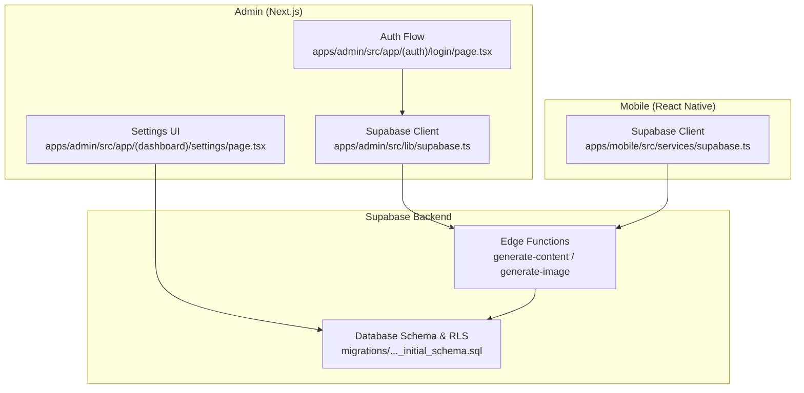
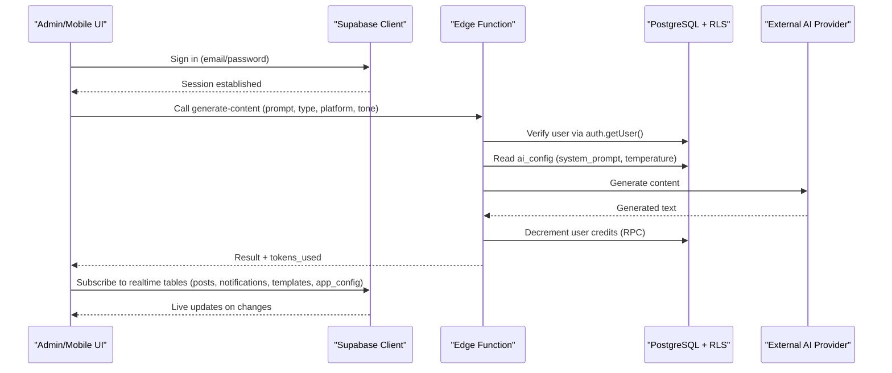
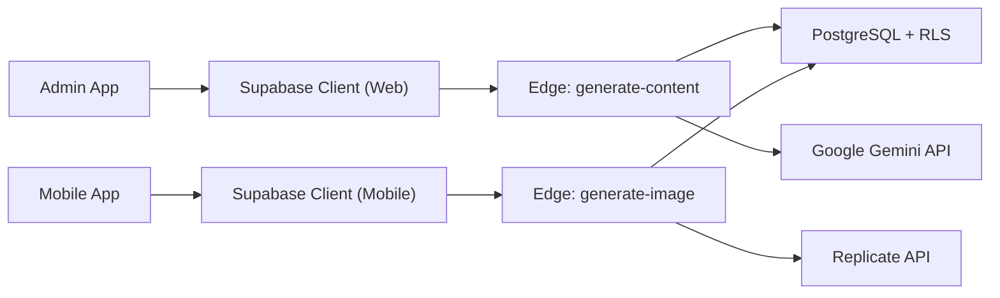

# Supabase Integration

<cite>
**Referenced Files in This Document**
- [apps/admin/src/lib/supabase.ts](file://apps/admin/src/lib/supabase.ts)
- [apps/mobile/src/services/supabase.ts](file://apps/mobile/src/services/supabase.ts)
- [supabase/functions/generate-content/index.ts](file://supabase/functions/generate-content/index.ts)
- [supabase/functions/generate-image/index.ts](file://supabase/functions/generate-image/index.ts)
- [supabase/migrations/20240001000000_initial_schema.sql](file://supabase/migrations/20240001000000_initial_schema.sql)
- [packages/types/src/auth.ts](file://packages/types/src/auth.ts)
- [packages/types/src/database.ts](file://packages/types/src/database.ts)
- [apps/admin/src/app/(auth)/login/page.tsx](file://apps/admin/src/app/(auth)/login/page.tsx)
- [apps/admin/src/app/(dashboard)/settings/page.tsx](file://apps/admin/src/app/(dashboard)/settings/page.tsx)
- [TROUBLESHOOTING.md](file://TROUBLESHOOTING.md)
</cite>

## Table of Contents
1. Introduction
2. Project Structure
3. Core Components
4. Architecture Overview
5. Detailed Component Analysis
6. Dependency Analysis
7. Performance Considerations
8. Troubleshooting Guide
9. Conclusion

## Introduction
This document explains how the application integrates with Supabase across database operations, real-time features, authentication, storage, and edge functions for AI content generation. It covers client configuration for web and mobile, TypeScript types for safe queries, real-time subscriptions for live updates, file storage patterns, invocation of edge functions for AI tasks, credit system tracking, analytics collection, error handling, retry strategies, offline support, performance optimization, connection management, error boundaries, and debugging techniques.

## Project Structure
The integration spans three main areas:
- Client SDK setup for Next.js admin app and React Native mobile app
- Serverless edge functions that call external AI providers and update the database
- Database schema and security policies that enforce access control and enable real-time replication

**Diagram sources**
- [apps/admin/src/lib/supabase.ts:1-13](file://apps/admin/src/lib/supabase.ts#L1-L13)
- [apps/mobile/src/services/supabase.ts:1-40](file://apps/mobile/src/services/supabase.ts#L1-L40)
- [supabase/functions/generate-content/index.ts:1-99](file://supabase/functions/generate-content/index.ts#L1-L99)
- [supabase/functions/generate-image/index.ts:1-87](file://supabase/functions/generate-image/index.ts#L1-L87)
- [supabase/migrations/20240001000000_initial_schema.sql:15-232](file://supabase/migrations/20240001000000_initial_schema.sql#L15-L232)

**Section sources**
- [apps/admin/src/lib/supabase.ts:1-13](file://apps/admin/src/lib/supabase.ts#L1-L13)
- [apps/mobile/src/services/supabase.ts:1-40](file://apps/mobile/src/services/supabase.ts#L1-L40)
- [supabase/migrations/20240001000000_initial_schema.sql:15-232](file://supabase/migrations/20240001000000_initial_schema.sql#L15-L232)

## Core Components
- Supabase client initialization for web and mobile with session persistence and token refresh
- Authentication flow with role checks for admin access
- Edge functions for AI content and image generation with secure user context and credit deduction
- Database schema with Row-Level Security (RLS), triggers, and Realtime publications
- Shared TypeScript types for profiles, posts, templates, configs, and analytics

Key responsibilities:
- Clients handle auth state, data reads/writes, and real-time subscriptions
- Edge functions encapsulate sensitive API keys and business logic like credit accounting
- Database enforces security via RLS and provides real-time change streams

**Section sources**
- [apps/admin/src/lib/supabase.ts:1-13](file://apps/admin/src/lib/supabase.ts#L1-L13)
- [apps/mobile/src/services/supabase.ts:1-40](file://apps/mobile/src/services/supabase.ts#L1-L40)
- [supabase/functions/generate-content/index.ts:1-99](file://supabase/functions/generate-content/index.ts#L1-L99)
- [supabase/functions/generate-image/index.ts:1-87](file://supabase/functions/generate-image/index.ts#L1-L87)
- [supabase/migrations/20240001000000_initial_schema.sql:15-232](file://supabase/migrations/20240001000000_initial_schema.sql#L15-L232)
- [packages/types/src/auth.ts:1-25](file://packages/types/src/auth.ts#L1-L25)
- [packages/types/src/database.ts:1-73](file://packages/types/src/database.ts#L1-L73)

## Architecture Overview
The system uses a client-server model where clients authenticate via Supabase Auth, perform database operations under RLS, subscribe to real-time events, and invoke edge functions for AI workloads. Edge functions validate user identity, call external AI APIs, persist results, and decrement credits atomically.

**Diagram sources**
- [apps/admin/src/lib/supabase.ts:1-13](file://apps/admin/src/lib/supabase.ts#L1-L13)
- [apps/mobile/src/services/supabase.ts:1-40](file://apps/mobile/src/services/supabase.ts#L1-L40)
- [supabase/functions/generate-content/index.ts:1-99](file://supabase/functions/generate-content/index.ts#L1-L99)
- [supabase/migrations/20240001000000_initial_schema.sql:15-232](file://supabase/migrations/20240001000000_initial_schema.sql#L15-L232)

## Detailed Component Analysis

### Supabase Client Configuration
- Web client initializes with environment variables, enables session persistence and auto-refresh
- Mobile client adds a secure storage adapter for Expo SecureStore or localStorage on web, disables URL-based session detection

Patterns:
- Centralized client export per app
- Placeholder URL detection for local development
- Platform-specific storage strategy for sessions

**Section sources**
- [apps/admin/src/lib/supabase.ts:1-13](file://apps/admin/src/lib/supabase.ts#L1-L13)
- [apps/mobile/src/services/supabase.ts:1-40](file://apps/mobile/src/services/supabase.ts#L1-L40)

### Authentication Integration
- Admin login page performs email/password sign-in, validates profile role, handles suspension, and redirects on success
- On placeholder URLs, a dev bypass allows immediate navigation for testing

Error handling:
- Displays toast messages for invalid credentials, permission errors, and connection issues
- Signs out on authorization failures

**Section sources**
- [apps/admin/src/app/(auth)/login/page.tsx:15-78](file://apps/admin/src/app/(auth)/login/page.tsx#L15-L78)

### Database Schema and Security
- Defines core tables: app_config, ai_config, profiles, folders, posts, templates, generated_images, analytics, notifications, admin_logs
- Enables RLS policies for all tables, restricting access by user ownership and admin roles
- Provides helper function is_admin() for policy enforcement
- Triggers create profiles on new users
- Enables Realtime for key tables

Security highlights:
- Users can only manage their own data unless they are admins
- Templates read active entries for authenticated users
- Analytics accessible to owners and admins

**Section sources**
- [supabase/migrations/20240001000000_initial_schema.sql:15-232](file://supabase/migrations/20240001000000_initial_schema.sql#L15-L232)

### Real-Time Subscriptions
- Realtime enabled for app_config, posts, notifications, and templates
- Admin settings UI indicates active replication status and number of subscribed tables

Usage pattern:
- Subscribe to table changes to reflect live updates across clients
- Unsubscribe on component unmount to avoid memory leaks

**Section sources**
- [supabase/migrations/20240001000000_initial_schema.sql:227-232](file://supabase/migrations/20240001000000_initial_schema.sql#L227-L232)
- [apps/admin/src/app/(dashboard)/settings/page.tsx:31-65](file://apps/admin/src/app/(dashboard)/settings/page.tsx#L31-L65)

### Edge Functions for AI Content Generation
- Validates user via Authorization header, reads AI config from database, calls Google Gemini API, returns generated content, decrements credits via RPC

Flow:
- Authenticate request
- Fetch ai_config (system_prompt, temperature, max_tokens)
- Call external AI provider
- Persist usage metrics and decrement credits
- Return result

Error handling:
- Returns 401 if unauthorized
- Returns 400 for missing prompt
- Returns 500 with error message on exceptions

**Section sources**
- [supabase/functions/generate-content/index.ts:1-99](file://supabase/functions/generate-content/index.ts#L1-L99)

### Edge Functions for Image Generation
- Authenticates request, calls Replicate API for image generation, stores image metadata, deducts credits

Flow:
- Authenticate request
- Validate prompt and options
- Call Replicate prediction endpoint
- Insert generated image record
- Deduct credits via RPC
- Return image URL

Error handling:
- Returns 401 if unauthorized
- Returns 400 for missing prompt
- Returns 500 with error message on exceptions

**Section sources**
- [supabase/functions/generate-image/index.ts:1-87](file://supabase/functions/generate-image/index.ts#L1-L87)

### TypeScript Types for Safe Queries
- Shared types define user roles, subscription tiers, profile fields, post structure, template fields, AI config, and analytics metrics
- Ensures compile-time safety for database interactions and API payloads

Types include:
- UserRole, SubscriptionTier, UserProfile, AuthSessionState
- Post, PostTemplate, AppConfig, AIConfig, AnalyticsMetric

**Section sources**
- [packages/types/src/auth.ts:1-25](file://packages/types/src/auth.ts#L1-L25)
- [packages/types/src/database.ts:1-73](file://packages/types/src/database.ts#L1-L73)

### File Storage Operations
- While no explicit storage service code is shown, generated images are persisted with metadata in the database
- For direct file uploads, use Supabase Storage alongside database records to track assets

Recommendations:
- Store file URLs in generated_images or media_urls arrays
- Enforce RLS policies on storage buckets similar to tables
- Use edge functions to mediate uploads when server-side validation is required

[No sources needed since this section provides general guidance]

### Credit System Tracking and Analytics
- Credits are decremented via RPC after AI generations
- Analytics table tracks daily usage per user including AI generations and credits used

Patterns:
- Atomic credit deduction within edge functions
- Daily aggregation in analytics for reporting

**Section sources**
- [supabase/functions/generate-content/index.ts:82-84](file://supabase/functions/generate-content/index.ts#L82-L84)
- [supabase/functions/generate-image/index.ts:73-74](file://supabase/functions/generate-image/index.ts#L73-L74)
- [supabase/migrations/20240001000000_initial_schema.sql:122-132](file://supabase/migrations/20240001000000_initial_schema.sql#L122-L132)

### Error Handling Patterns
- Consistent JSON error responses with appropriate HTTP status codes
- Unauthorized checks before processing requests
- Input validation for required fields

Best practices:
- Wrap edge function logic in try/catch blocks
- Return structured errors to clients for consistent handling

**Section sources**
- [supabase/functions/generate-content/index.ts:21-36](file://supabase/functions/generate-content/index.ts#L21-L36)
- [supabase/functions/generate-content/index.ts:92-97](file://supabase/functions/generate-content/index.ts#L92-L97)
- [supabase/functions/generate-image/index.ts:21-36](file://supabase/functions/generate-image/index.ts#L21-L36)
- [supabase/functions/generate-image/index.ts:80-85](file://supabase/functions/generate-image/index.ts#L80-L85)

### Retry Logic and Offline Support
- Implement exponential backoff retries for network calls in clients and edge functions
- Cache recent data locally using Supabase’s built-in caching or application-level stores
- Queue mutations when offline and reconcile on reconnect

Guidelines:
- Use retry wrappers around fetch calls to AI providers
- Debounce rapid retries to avoid rate limiting
- Persist pending writes to local storage and sync when online

[No sources needed since this section provides general guidance]

### Performance Optimization
- Minimize real-time subscriptions to necessary tables
- Use selective column projections in queries
- Leverage indexes on frequently filtered columns (e.g., user_id, date)
- Batch updates where possible

[No sources needed since this section provides general guidance]

### Connection Management and Error Boundaries
- Ensure sessions persist and refresh automatically
- Handle auth state changes to re-subscribe to real-time channels
- Wrap UI components with error boundaries to catch rendering errors during data loading

[No sources needed since this section provides general guidance]

### Debugging Techniques
- Check Realtime publication status for affected tables
- Verify RLS policies are applied correctly
- Inspect edge function logs for errors and response payloads
- Use admin settings UI to confirm connectivity and replication status

**Section sources**
- [TROUBLESHOOTING.md:9-23](file://TROUBLESHOOTING.md#L9-L23)
- [apps/admin/src/app/(dashboard)/settings/page.tsx:31-65](file://apps/admin/src/app/(dashboard)/settings/page.tsx#L31-L65)

## Dependency Analysis
The integration depends on:
- Supabase JS client for auth, database, and real-time
- Deno-based edge functions for serverless execution
- External AI providers (Google Gemini, Replicate) invoked from edge functions
- PostgreSQL with RLS and Realtime publications

**Diagram sources**
- [apps/admin/src/lib/supabase.ts:1-13](file://apps/admin/src/lib/supabase.ts#L1-L13)
- [apps/mobile/src/services/supabase.ts:1-40](file://apps/mobile/src/services/supabase.ts#L1-L40)
- [supabase/functions/generate-content/index.ts:1-99](file://supabase/functions/generate-content/index.ts#L1-L99)
- [supabase/functions/generate-image/index.ts:1-87](file://supabase/functions/generate-image/index.ts#L1-L87)
- [supabase/migrations/20240001000000_initial_schema.sql:15-232](file://supabase/migrations/20240001000000_initial_schema.sql#L15-L232)

**Section sources**
- [apps/admin/src/lib/supabase.ts:1-13](file://apps/admin/src/lib/supabase.ts#L1-L13)
- [apps/mobile/src/services/supabase.ts:1-40](file://apps/mobile/src/services/supabase.ts#L1-L40)
- [supabase/functions/generate-content/index.ts:1-99](file://supabase/functions/generate-content/index.ts#L1-L99)
- [supabase/functions/generate-image/index.ts:1-87](file://supabase/functions/generate-image/index.ts#L1-L87)
- [supabase/migrations/20240001000000_initial_schema.sql:15-232](file://supabase/migrations/20240001000000_initial_schema.sql#L15-L232)

## Performance Considerations
- Prefer server-side logic in edge functions for heavy computations and secret management
- Use real-time selectively to reduce bandwidth and CPU usage
- Cache AI responses when appropriate to avoid redundant calls
- Monitor credit usage and set rate limits at the edge function layer

[No sources needed since this section provides general guidance]

## Troubleshooting Guide
Common issues and resolutions:
- Module resolution issues in monorepo: ensure dependencies are installed from the root folder
- Empty query results or permission denied: verify RLS policies are applied via migration
- Admin login access denied: update user role in profiles table
- Realtime theme colors not updating: ensure Realtime replication is enabled for the relevant table

Operational checks:
- Confirm Supabase connection health and Realtime status in admin settings
- Validate edge function responses and error messages

**Section sources**
- [TROUBLESHOOTING.md:1-23](file://TROUBLESHOOTING.md#L1-L23)
- [apps/admin/src/app/(dashboard)/settings/page.tsx:31-65](file://apps/admin/src/app/(dashboard)/settings/page.tsx#L31-L65)

## Conclusion
The Supabase integration combines robust client configuration, secure authentication, strict database security via RLS, real-time capabilities, and powerful edge functions for AI workflows. By centralizing sensitive logic in edge functions, enforcing access controls at the database layer, and leveraging shared TypeScript types, the system ensures safety, scalability, and maintainability. Following the recommended patterns for error handling, retries, offline support, and performance optimization will further enhance reliability and user experience.