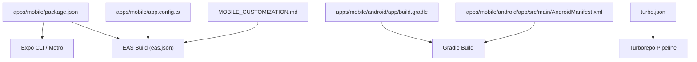
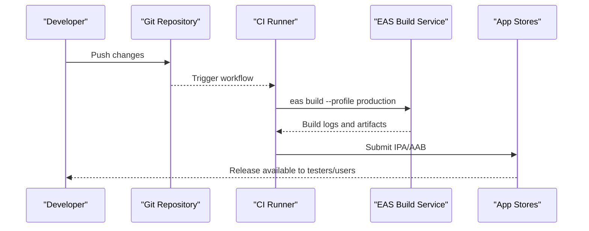
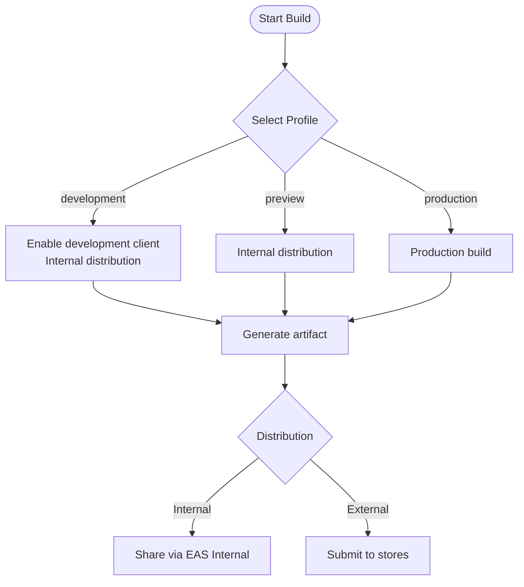
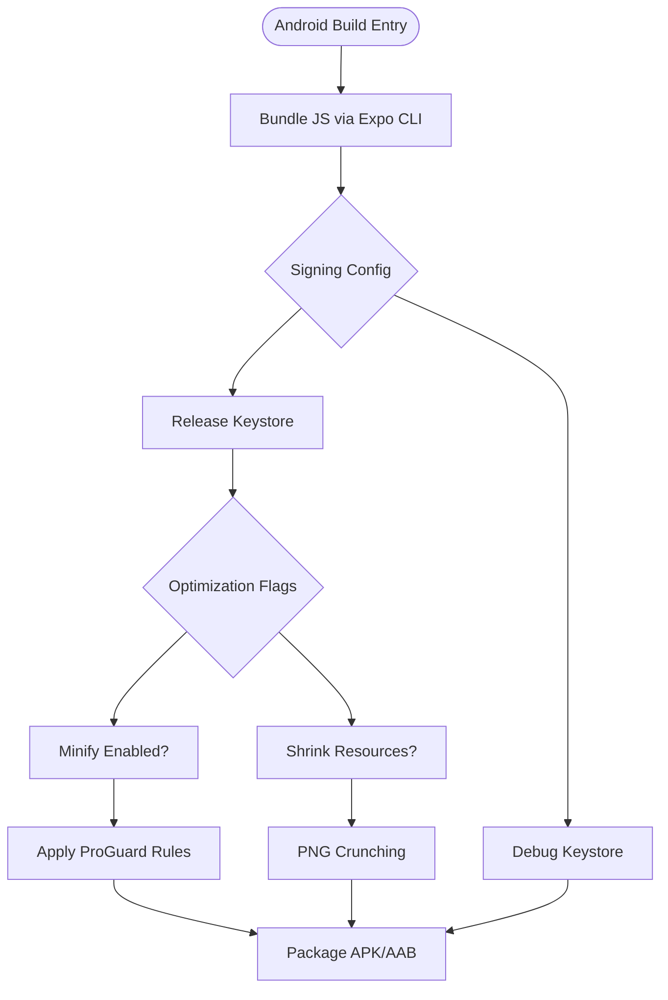
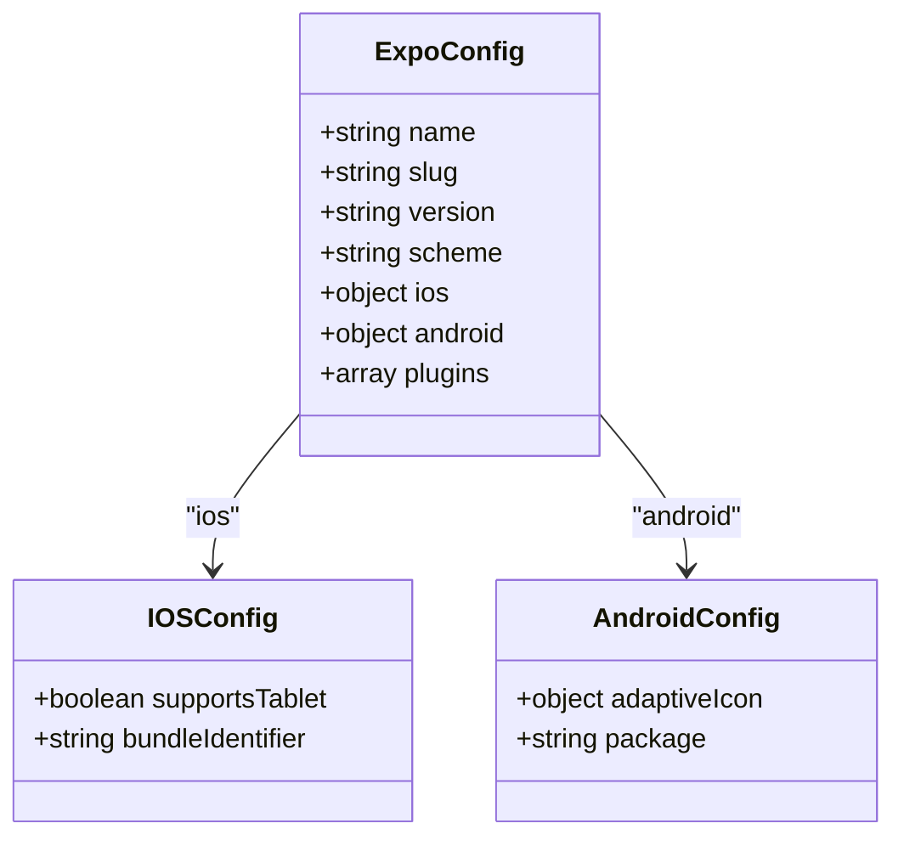
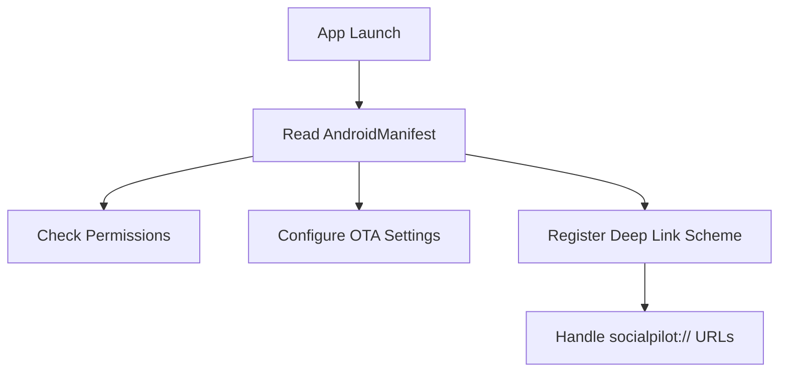
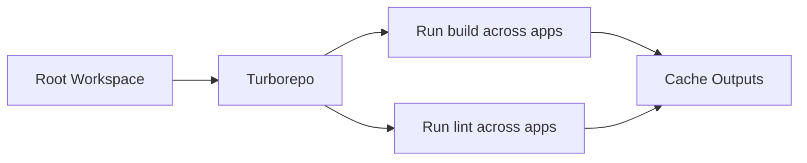
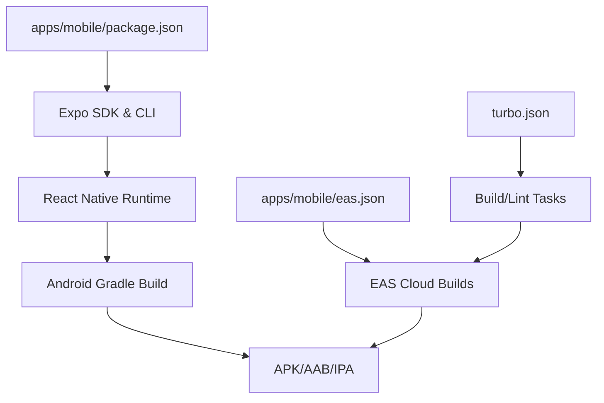

# Testing & Deployment

<cite>
**Referenced Files in This Document**
- [package.json](file://apps/mobile/package.json)
- [eas.json](file://apps/mobile/eas.json)
- [app.config.ts](file://apps/mobile/app.config.ts)
- [build.gradle](file://apps/mobile/android/app/build.gradle)
- [AndroidManifest.xml](file://apps/mobile/android/app/src/main/AndroidManifest.xml)
- [gradle.properties](file://apps/mobile/android/gradle.properties)
- [turbo.json](file://turbo.json)
- [MOBILE_CUSTOMIZATION.md](file://MOBILE_CUSTOMIZATION.md)
</cite>

## Table of Contents
1. [Introduction](#introduction)
2. [Project Structure](#project-structure)
3. [Core Components](#core-components)
4. [Architecture Overview](#architecture-overview)
5. [Detailed Component Analysis](#detailed-component-analysis)
6. [Dependency Analysis](#dependency-analysis)
7. [Performance Considerations](#performance-considerations)
8. [Troubleshooting Guide](#troubleshooting-guide)
9. [Conclusion](#conclusion)
10. [Appendices](#appendices)

## Introduction
This document provides comprehensive guidance for testing strategies and deployment processes for the mobile application built with Expo and React Native. It covers unit, integration, and end-to-end testing approaches; EAS Build pipeline configuration; code signing for iOS and Android; distribution via TestFlight and Google Play Console; CI/CD setup; automated workflows; release management; performance monitoring; crash reporting; production debugging; over-the-air updates; beta testing procedures; and rollback strategies.

## Project Structure
The mobile app resides under apps/mobile and is configured as an Expo project using Expo Router. The build system integrates with Gradle for Android and uses EAS for cloud builds. The monorepo uses Turborepo to orchestrate tasks across apps and packages.

**Diagram sources**
- [package.json:5-12](file://apps/mobile/package.json#L5-L12)
- [eas.json:5-17](file://apps/mobile/eas.json#L5-L17)
- [app.config.ts:3-41](file://apps/mobile/app.config.ts#L3-L41)
- [build.gradle:11-22](file://apps/mobile/android/app/build.gradle#L11-L22)
- [AndroidManifest.xml:14-30](file://apps/mobile/android/app/src/main/AndroidManifest.xml#L14-L30)
- [turbo.json:6-25](file://turbo.json#L6-L25)
- [MOBILE_CUSTOMIZATION.md:21-26](file://MOBILE_CUSTOMIZATION.md#L21-L26)

**Section sources**
- [package.json:5-12](file://apps/mobile/package.json#L5-L12)
- [eas.json:5-17](file://apps/mobile/eas.json#L5-L17)
- [app.config.ts:3-41](file://apps/mobile/app.config.ts#L3-L41)
- [build.gradle:11-22](file://apps/mobile/android/app/build.gradle#L11-L22)
- [AndroidManifest.xml:14-30](file://apps/mobile/android/app/src/main/AndroidManifest.xml#L14-L30)
- [turbo.json:6-25](file://turbo.json#L6-L25)
- [MOBILE_CUSTOMIZATION.md:21-26](file://MOBILE_CUSTOMIZATION.md#L21-L26)

## Core Components
- Mobile app entry and scripts: development server, platform runs, linting, and fast device launch.
- EAS configuration: development, preview, and production profiles; internal distribution; submission profile.
- App metadata and platform identifiers: bundle identifier and package name.
- Android build settings: bundling command, signing configs, minification, resource shrinking, ProGuard rules.
- Monorepo orchestration: Turborepo pipeline for build and lint tasks.

Key responsibilities:
- package.json defines commands used by developers and CI to run and lint the app.
- eas.json centralizes build profiles and submission behavior.
- app.config.ts sets app identity and platform-specific options.
- build.gradle configures how Android artifacts are produced and optimized.
- turbo.json coordinates cross-app tasks.

**Section sources**
- [package.json:5-12](file://apps/mobile/package.json#L5-L12)
- [eas.json:5-17](file://apps/mobile/eas.json#L5-L17)
- [app.config.ts:3-41](file://apps/mobile/app.config.ts#L3-L41)
- [build.gradle:69-123](file://apps/mobile/android/app/build.gradle#L69-L123)
- [turbo.json:6-25](file://turbo.json#L6-L25)

## Architecture Overview
The mobile build and deployment architecture leverages Expo tooling and EAS Cloud Builds. Developer workflows use local dev servers and device runs, while CI/CD triggers EAS builds to produce signed artifacts for distribution channels.

[No sources needed since this diagram shows conceptual workflow, not actual code structure]

## Detailed Component Analysis

### EAS Build Profiles and Distribution
- Development profile: enables development client and internal distribution for quick iteration.
- Preview profile: internal distribution for sharing previews.
- Production profile: standard production build without explicit flags in configuration; can be extended with signing and environment variables.
- Submit profile: production submission configuration placeholder.

**Diagram sources**
- [eas.json:5-17](file://apps/mobile/eas.json#L5-L17)

**Section sources**
- [eas.json:5-17](file://apps/mobile/eas.json#L5-L17)

### Android Build Configuration and Signing
- Bundling: uses Expo CLI to export and embed the JS bundle during Android builds.
- Signing: debug keystore configured; release build references a debug keystore by default and includes minification and resource shrinking toggles.
- Optimization: optional minify and shrink resources; ProGuard rules file included.
- Packaging: JNI libraries packaging options and legacy packaging toggle.

**Diagram sources**
- [build.gradle:11-22](file://apps/mobile/android/app/build.gradle#L11-L22)
- [build.gradle:69-123](file://apps/mobile/android/app/build.gradle#L69-L123)

**Section sources**
- [build.gradle:11-22](file://apps/mobile/android/app/build.gradle#L11-L22)
- [build.gradle:69-123](file://apps/mobile/android/app/build.gradle#L69-L123)

### App Identity and Platform Settings
- App name and slug define user-facing identity and unique slug.
- Bundle identifier for iOS and package for Android ensure uniqueness across platforms.
- Plugins include routing and secure storage; font plugin configured for asset inclusion.
- Splash screen background and orientation set for consistent UX.

**Diagram sources**
- [app.config.ts:3-41](file://apps/mobile/app.config.ts#L3-L41)

**Section sources**
- [app.config.ts:3-41](file://apps/mobile/app.config.ts#L3-L41)

### Android Manifest and Deep Linking
- Permissions include internet access, storage, vibration, and overlay window.
- Application meta-data controls OTA update behavior and patch support.
- Activity declares launcher intent and deep link scheme for socialpilot.

**Diagram sources**
- [AndroidManifest.xml:1-32](file://apps/mobile/android/app/src/main/AndroidManifest.xml#L1-L32)

**Section sources**
- [AndroidManifest.xml:1-32](file://apps/mobile/android/app/src/main/AndroidManifest.xml#L1-L32)

### Monorepo Orchestration
- Turborepo pipeline defines build and lint tasks with caching and dependency ordering.
- Global dependencies include environment files to ensure consistent builds across environments.

**Diagram sources**
- [turbo.json:1-26](file://turbo.json#L1-L26)

**Section sources**
- [turbo.json:1-26](file://turbo.json#L1-L26)

## Dependency Analysis
- The mobile app depends on Expo ecosystem packages and React Native runtime.
- Android build relies on Gradle, Hermes/JSC, and Expo’s CLI integration.
- EAS orchestrates cloud builds and submissions based on eas.json profiles.
- Turborepo coordinates multi-app tasks and caches outputs.

**Diagram sources**
- [package.json:13-44](file://apps/mobile/package.json#L13-L44)
- [eas.json:5-17](file://apps/mobile/eas.json#L5-L17)
- [turbo.json:6-25](file://turbo.json#L6-L25)

**Section sources**
- [package.json:13-44](file://apps/mobile/package.json#L13-L44)
- [eas.json:5-17](file://apps/mobile/eas.json#L5-L17)
- [turbo.json:6-25](file://turbo.json#L6-L25)

## Performance Considerations
- Enable minification and resource shrinking in release builds to reduce APK size and improve startup time.
- Use Hermes for JavaScript execution to optimize performance on Android.
- Configure PNG crunching to further reduce asset sizes.
- Monitor memory usage and network calls during development and test phases.
- Leverage EAS Build caching via Turborepo to speed up CI pipelines.

[No sources needed since this section provides general guidance]

## Troubleshooting Guide
- Build failures: verify Node and Gradle versions, ensure environment variables are set, and check EAS CLI version requirements.
- Signing issues: confirm keystore presence and passwords; replace debug keystore with proper release credentials for production.
- OTA updates: manifest indicates OTA disabled by default; enable and configure if needed for over-the-air updates.
- Deep linking: ensure scheme matches app configuration and that intent filters are correctly declared.

**Section sources**
- [build.gradle:100-123](file://apps/mobile/android/app/build.gradle#L100-L123)
- [AndroidManifest.xml:14-30](file://apps/mobile/android/app/src/main/AndroidManifest.xml#L14-L30)
- [eas.json:2-4](file://apps/mobile/eas.json#L2-L4)

## Conclusion
The mobile application uses Expo and EAS to streamline development, building, and distribution. With clear build profiles, robust Android build configuration, and monorepo orchestration, teams can implement reliable CI/CD pipelines, automate testing, and distribute releases efficiently. Adopting the recommended practices for performance, monitoring, and rollout strategies will help maintain high quality and stability in production.

[No sources needed since this section summarizes without analyzing specific files]

## Appendices

### Testing Strategies

#### Unit Testing
- Frameworks: Jest with React Native preset is supported by the React Native peer dependency configuration.
- Scope: Test pure functions, hooks logic, and component rendering in isolation.
- Mocking: Mock native modules and external services to ensure deterministic tests.
- Coverage: Track coverage metrics and enforce thresholds in CI.

[No sources needed since this section provides general guidance]

#### Integration Testing
- API Calls: Use service layer mocks or test harnesses to validate data fetching and error handling paths.
- State Management: Verify store interactions and side effects when integrating with APIs.
- Network Errors: Simulate timeouts and network failures to ensure graceful degradation.

[No sources needed since this section provides general guidance]

#### End-to-End Testing
- Tools: Detox or Maestro for UI automation on real devices or emulators.
- Scenarios: Cover critical user journeys such as authentication, navigation, and core feature flows.
- Devices: Run against multiple OS versions and screen sizes to catch regressions early.

[No sources needed since this section provides general guidance]

### Build Pipeline Using EAS Build
- Local development: Use development scripts to start the dev server and run on devices.
- Cloud builds: Configure EAS profiles for development, preview, and production; submit artifacts to stores.
- Environment: Manage secrets and environment variables through EAS Secrets and environment configuration.

**Section sources**
- [package.json:5-12](file://apps/mobile/package.json#L5-L12)
- [eas.json:5-17](file://apps/mobile/eas.json#L5-L17)
- [MOBILE_CUSTOMIZATION.md:21-26](file://MOBILE_CUSTOMIZATION.md#L21-L26)

### Code Signing for iOS and Android
- Android: Replace debug keystore with a secure release keystore; configure signing in Gradle and EAS.
- iOS: Set up provisioning profiles and certificates; configure EAS signing for iOS builds.
- Security: Store keys and secrets securely; avoid committing sensitive information to repositories.

**Section sources**
- [build.gradle:100-123](file://apps/mobile/android/app/build.gradle#L100-L123)
- [MOBILE_CUSTOMIZATION.md:21-26](file://MOBILE_CUSTOMIZATION.md#L21-L26)

### Distribution Channels
- TestFlight: Upload iOS builds via EAS submit or Xcode; manage beta testers and feedback.
- Google Play Console: Upload Android AAB via EAS submit or Play Console; manage tracks and rollouts.
- Internal Distribution: Use EAS Internal for quick sharing among team members.

**Section sources**
- [eas.json:5-17](file://apps/mobile/eas.json#L5-L17)
- [MOBILE_CUSTOMIZATION.md:21-26](file://MOBILE_CUSTOMIZATION.md#L21-L26)

### CI/CD Setup and Automated Workflows
- Triggers: On push or pull request, run lint, type checks, and unit tests.
- Builds: Trigger EAS builds for each branch or tag; cache dependencies via Turborepo.
- Releases: Automate submission to TestFlight and Google Play upon successful builds and approvals.

**Section sources**
- [turbo.json:6-25](file://turbo.json#L6-L25)
- [eas.json:5-17](file://apps/mobile/eas.json#L5-L17)

### Release Management Processes
- Versioning: Align app version with semantic versioning; increment version codes appropriately.
- Changelog: Maintain a changelog to track features, fixes, and breaking changes.
- Rollout Strategy: Use staged rollouts and beta tracks to mitigate risk.

**Section sources**
- [app.config.ts:3-41](file://apps/mobile/app.config.ts#L3-L41)
- [build.gradle:91-99](file://apps/mobile/android/app/build.gradle#L91-L99)

### Performance Monitoring, Crash Reporting, and Production Debugging
- Monitoring: Integrate performance monitoring tools to track metrics like load times and network latency.
- Crash Reporting: Implement crash reporting to capture stack traces and user context.
- Debugging: Use source maps and remote debugging tools; enable logging selectively in production.

[No sources needed since this section provides general guidance]

### Over-the-Air Updates, Beta Testing Procedures, and Rollback Strategies
- OTA Updates: Configure Expo OTA settings in the manifest and EAS; publish updates via EAS Update when enabled.
- Beta Testing: Use TestFlight and Google Play internal testing tracks for controlled releases.
- Rollbacks: Maintain previous stable builds; revert to prior versions quickly if issues arise.

**Section sources**
- [AndroidManifest.xml:14-30](file://apps/mobile/android/app/src/main/AndroidManifest.xml#L14-L30)
- [eas.json:5-17](file://apps/mobile/eas.json#L5-L17)