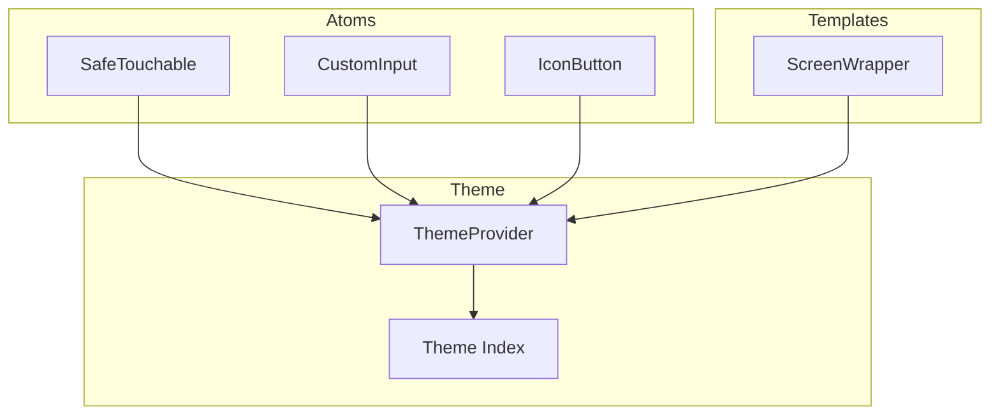
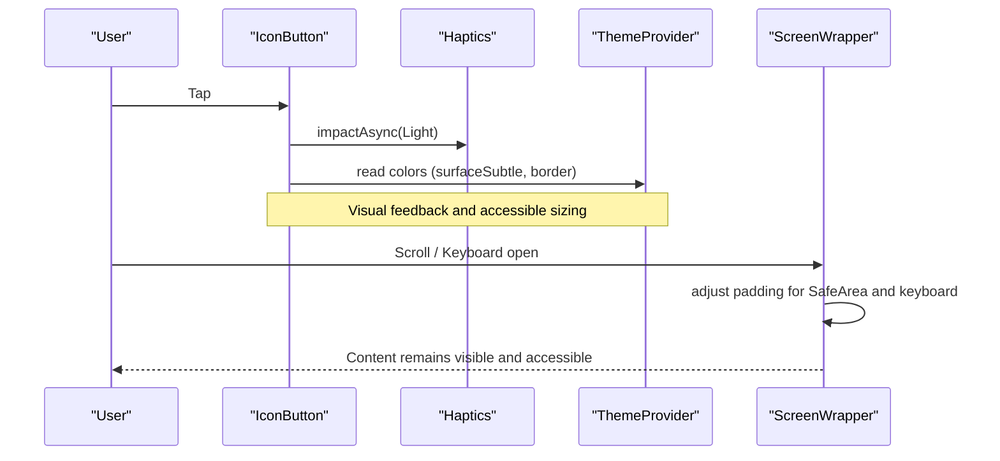
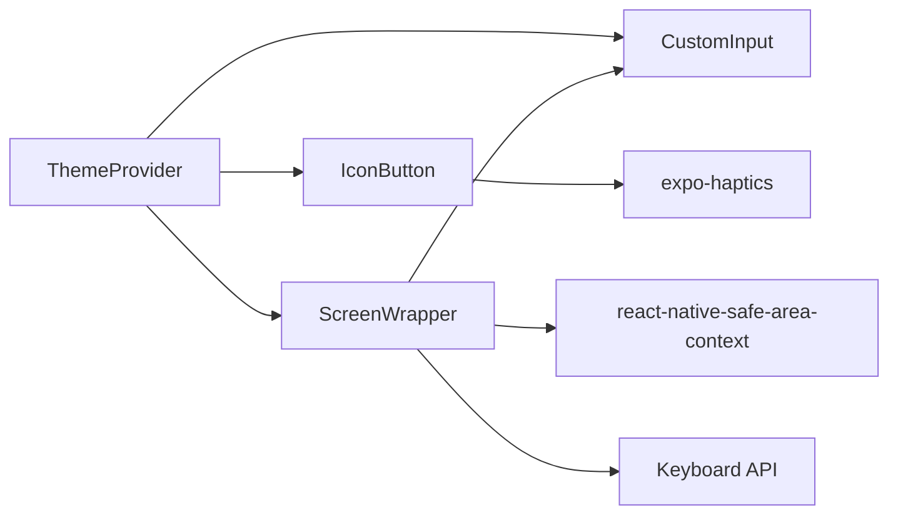

# Accessibility & Styling Guidelines

<cite>
**Referenced Files in This Document**
- [ThemeProvider.tsx](file://apps/mobile/src/theme/ThemeProvider.tsx)
- [index.ts (theme)](file://apps/mobile/src/theme/index.ts)
- [SafeTouchable.tsx](file://apps/mobile/src/components/atoms/SafeTouchable.tsx)
- [useSafePress.ts](file://apps/mobile/src/hooks/useSafePress.ts)
- [CustomInput.tsx](file://apps/mobile/src/components/atoms/CustomInput.tsx)
- [IconButton.tsx](file://apps/mobile/src/components/atoms/IconButton.tsx)
- [ScreenWrapper.tsx](file://apps/mobile/src/components/templates/ScreenWrapper.tsx)
- [app.config.ts](file://apps/mobile/app.config.ts)
</cite>

## Table of Contents
1. Introduction
2. Project Structure
3. Core Components
4. Architecture Overview
5. Detailed Component Analysis
6. Dependency Analysis
7. Performance Considerations
8. Troubleshooting Guide
9. Conclusion

## Introduction
This document defines accessibility standards and styling best practices for the mobile application, focusing on ARIA-equivalent behaviors for React Native, screen reader support, keyboard navigation, touch target sizing, SafeArea handling, platform-specific considerations, responsive design patterns, color contrast, font scaling, motion preferences, testing approaches, and performance optimization techniques for mobile platforms.

## Project Structure
The mobile app uses a theme-driven architecture with reusable UI atoms and templates that encapsulate accessibility and responsiveness:
- Theme system provides dynamic palettes, dark/light modes, and safe color usage.
- Atoms provide consistent interaction patterns (pressable components, inputs).
- Templates handle SafeArea insets, keyboard behavior, and scrollable content.
- App configuration sets user interface style and platform specifics.

**Diagram sources**
- [ThemeProvider.tsx:1-97](file://apps/mobile/src/theme/ThemeProvider.tsx#L1-L97)
- [index.ts (theme):1-12](file://apps/mobile/src/theme/index.ts#L1-L12)
- [SafeTouchable.tsx:1-21](file://apps/mobile/src/components/atoms/SafeTouchable.tsx#L1-L21)
- [CustomInput.tsx:1-165](file://apps/mobile/src/components/atoms/CustomInput.tsx#L1-L165)
- [IconButton.tsx:1-70](file://apps/mobile/src/components/atoms/IconButton.tsx#L1-L70)
- [ScreenWrapper.tsx:1-126](file://apps/mobile/src/components/templates/ScreenWrapper.tsx#L1-L126)

**Section sources**
- [ThemeProvider.tsx:1-97](file://apps/mobile/src/theme/ThemeProvider.tsx#L1-L97)
- [index.ts (theme):1-12](file://apps/mobile/src/theme/index.ts#L1-L12)
- [SafeTouchable.tsx:1-21](file://apps/mobile/src/components/atoms/SafeTouchable.tsx#L1-L21)
- [CustomInput.tsx:1-165](file://apps/mobile/src/components/atoms/CustomInput.tsx#L1-L165)
- [IconButton.tsx:1-70](file://apps/mobile/src/components/atoms/IconButton.tsx#L1-L70)
- [ScreenWrapper.tsx:1-126](file://apps/mobile/src/components/templates/ScreenWrapper.tsx#L1-L126)
- [app.config.ts:1-42](file://apps/mobile/app.config.ts#L1-L42)

## Core Components
- ThemeProvider: Centralizes theme state, palette selection, and mode switching; persists selections securely; computes active colors including white-label overrides.
- ScreenWrapper: Manages SafeArea insets, StatusBar appearance, keyboard-aware scrolling, and background theming.
- CustomInput: Accessible input with label, error text, focus states, password visibility toggle, and themed borders and colors.
- IconButton: Pressable icon button with haptic feedback and animated press states; sized to meet minimum touch targets.
- SafeTouchable + useSafePress: Prevents rapid double/triple taps and protects async actions without changing UI state.

Accessibility highlights:
- Inputs expose labels and errors for screen readers via native semantics.
- Buttons and touchables have adequate hit areas and haptic feedback.
- Keyboard interactions are handled by ScrollView and platform events.
- Theme ensures sufficient contrast through dynamic color tokens.

**Section sources**
- [ThemeProvider.tsx:19-87](file://apps/mobile/src/theme/ThemeProvider.tsx#L19-L87)
- [ScreenWrapper.tsx:27-101](file://apps/mobile/src/components/templates/ScreenWrapper.tsx#L27-L101)
- [CustomInput.tsx:20-113](file://apps/mobile/src/components/atoms/CustomInput.tsx#L20-L113)
- [IconButton.tsx:16-58](file://apps/mobile/src/components/atoms/IconButton.tsx#L16-L58)
- [SafeTouchable.tsx:10-20](file://apps/mobile/src/components/atoms/SafeTouchable.tsx#L10-L20)
- [useSafePress.ts:9-32](file://apps/mobile/src/hooks/useSafePress.ts#L9-L32)

## Architecture Overview
The theme flows from ThemeProvider into all UI components. ScreenWrapper wraps screens to ensure correct SafeArea and keyboard behavior. Input and button components consume theme tokens to maintain consistent contrast and sizing.

**Diagram sources**
- [IconButton.tsx:29-36](file://apps/mobile/src/components/atoms/IconButton.tsx#L29-L36)
- [ScreenWrapper.tsx:39-55](file://apps/mobile/src/components/templates/ScreenWrapper.tsx#L39-L55)
- [ScreenWrapper.tsx:82-99](file://apps/mobile/src/components/templates/ScreenWrapper.tsx#L82-L99)
- [ThemeProvider.tsx:59-81](file://apps/mobile/src/theme/ThemeProvider.tsx#L59-L81)

## Detailed Component Analysis

### Theme System and Color Contrast
- Dynamic theme resolves light/dark palettes and applies white-label overrides for primary, secondary, and accent colors.
- Colors are consumed across components to ensure consistent contrast ratios.
- Mode can be system-based or explicit, persisted securely.

Guidelines:
- Always derive colors from theme tokens to maintain contrast in both modes.
- Avoid hard-coded colors; prefer theme.colors.* for text, borders, backgrounds, and accents.
- Validate contrast for critical text and interactive elements using automated tools.

**Section sources**
- [ThemeProvider.tsx:25-81](file://apps/mobile/src/theme/ThemeProvider.tsx#L25-L81)
- [index.ts (theme):3-11](file://apps/mobile/src/theme/index.ts#L3-L11)

### SafeArea Handling and Platform-Specific Considerations
- ScreenWrapper reads SafeArea insets and adjusts top/bottom padding based on device notches and home indicators.
- Keyboard events are listened to per platform to compute available space and prevent content overlap.
- StatusBar is styled according to theme mode for optimal contrast.

Guidelines:
- Wrap every screen with ScreenWrapper to guarantee SafeArea compliance.
- Use keyboard-aware scrolling to keep focused inputs visible.
- Respect platform differences in keyboard events and inset behavior.

**Section sources**
- [ScreenWrapper.tsx:35-55](file://apps/mobile/src/components/templates/ScreenWrapper.tsx#L35-L55)
- [ScreenWrapper.tsx:57-99](file://apps/mobile/src/components/templates/ScreenWrapper.tsx#L57-L99)
- [app.config.ts:11-27](file://apps/mobile/app.config.ts#L11-L27)

### Touch Target Sizing and Interaction Safety
- IconButton defaults to a 44px size, meeting common minimum touch target guidelines.
- SafeTouchable prevents rapid repeated presses and protects async operations without altering UI state.
- Haptic feedback enhances perceived interactivity and accessibility.

Guidelines:
- Ensure all interactive elements have at least 44x44pt touch targets.
- Use SafeTouchable for actions that trigger network requests or navigation to avoid duplicate submissions.
- Provide haptic feedback for confirmatory actions where appropriate.

**Section sources**
- [IconButton.tsx:16-58](file://apps/mobile/src/components/atoms/IconButton.tsx#L16-L58)
- [SafeTouchable.tsx:10-20](file://apps/mobile/src/components/atoms/SafeTouchable.tsx#L10-L20)
- [useSafePress.ts:9-32](file://apps/mobile/src/hooks/useSafePress.ts#L9-L32)

### Accessible Inputs and Labels
- CustomInput supports labels, error messages, focus states, and password visibility toggles.
- Focus and blur states update visual cues and laser line animation for clarity.
- Error text is displayed below the input for screen readers and sighted users.

Guidelines:
- Always associate a label with inputs; use the label prop to expose semantic information.
- Display concise error messages near the field and ensure they are programmatically linked.
- For password fields, provide a clear toggle control with adequate hit area.

**Section sources**
- [CustomInput.tsx:20-113](file://apps/mobile/src/components/atoms/CustomInput.tsx#L20-L113)

### Responsive Design Patterns
- ScreenWrapper adapts to different screen sizes and orientations via SafeArea and keyboard measurements.
- Theme-driven styles allow consistent layouts across devices while respecting platform UI styles.

Guidelines:
- Prefer flexible layouts and relative spacing over fixed dimensions.
- Test on multiple device sizes and orientations to validate layout resilience.
- Use ScrollView with keyboard-aware padding to keep content accessible when the keyboard appears.

**Section sources**
- [ScreenWrapper.tsx:27-101](file://apps/mobile/src/components/templates/ScreenWrapper.tsx#L27-L101)
- [app.config.ts:8-16](file://apps/mobile/app.config.ts#L8-L16)

### Motion Preferences and Haptics
- Components use subtle animations and haptics to enhance feedback without overwhelming users.
- Haptics are used for press states and theme changes to improve discoverability.

Guidelines:
- Keep animations short and purposeful; avoid excessive motion.
- Respect user preferences for reduced motion where possible.
- Combine haptics with visual feedback for robust accessibility.

**Section sources**
- [IconButton.tsx:29-36](file://apps/mobile/src/components/atoms/IconButton.tsx#L29-L36)
- [ThemeProvider.tsx:40-50](file://apps/mobile/src/theme/ThemeProvider.tsx#L40-L50)

## Dependency Analysis
Components depend on the theme system for colors and mode, and on platform APIs for SafeArea and keyboard handling.

**Diagram sources**
- [ThemeProvider.tsx:19-87](file://apps/mobile/src/theme/ThemeProvider.tsx#L19-L87)
- [CustomInput.tsx:20-113](file://apps/mobile/src/components/atoms/CustomInput.tsx#L20-L113)
- [IconButton.tsx:16-58](file://apps/mobile/src/components/atoms/IconButton.tsx#L16-L58)
- [ScreenWrapper.tsx:27-101](file://apps/mobile/src/components/templates/ScreenWrapper.tsx#L27-L101)

**Section sources**
- [ThemeProvider.tsx:19-87](file://apps/mobile/src/theme/ThemeProvider.tsx#L19-L87)
- [ScreenWrapper.tsx:27-101](file://apps/mobile/src/components/templates/ScreenWrapper.tsx#L27-L101)

## Performance Considerations
- Minimize re-renders by memoizing components and avoiding unnecessary state updates.
- Use haptics sparingly to reduce overhead on low-end devices.
- Prefer theme-driven styles to avoid recalculating colors at runtime.
- Keep animations lightweight; use shared values and spring/timing utilities efficiently.
- Debounce or throttle frequent events like keyboard changes if needed.

[No sources needed since this section provides general guidance]

## Troubleshooting Guide
Common issues and resolutions:
- Inputs hidden by keyboard: Ensure ScreenWrapper is used and keyboardShouldPersistTaps is set appropriately.
- Inconsistent contrast: Verify colors are sourced from theme tokens and that white-label overrides do not reduce contrast.
- Double submissions: Wrap actions with SafeTouchable and useSafePress to prevent rapid taps.
- SafeArea misalignment: Confirm ScreenWrapper applies top/bottom insets and StatusBar settings match theme mode.

**Section sources**
- [ScreenWrapper.tsx:39-55](file://apps/mobile/src/components/templates/ScreenWrapper.tsx#L39-L55)
- [ScreenWrapper.tsx:82-99](file://apps/mobile/src/components/templates/ScreenWrapper.tsx#L82-L99)
- [ThemeProvider.tsx:59-81](file://apps/mobile/src/theme/ThemeProvider.tsx#L59-L81)
- [useSafePress.ts:9-32](file://apps/mobile/src/hooks/useSafePress.ts#L9-L32)

## Conclusion
By centralizing theme management, enforcing SafeArea and keyboard awareness, standardizing touch targets, and providing accessible inputs and buttons, the application establishes a strong foundation for inclusive and performant mobile experiences. Adhering to these guidelines will help maintain consistency, improve accessibility, and optimize performance across devices and platforms.

[No sources needed since this section summarizes without analyzing specific files]