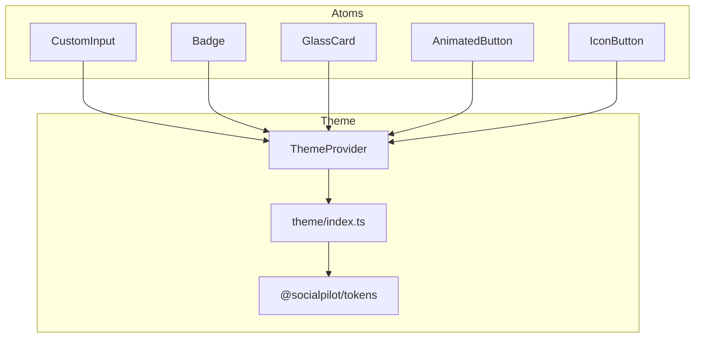
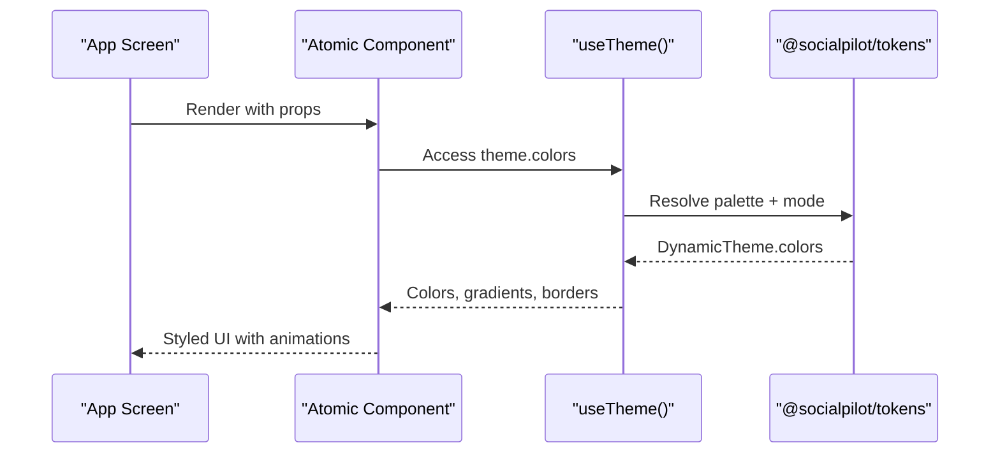
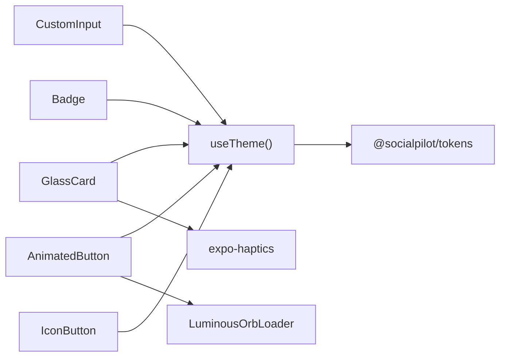

# Atomic Components

<cite>
**Referenced Files in This Document**
- [CustomInput.tsx](file://apps/mobile/src/components/atoms/CustomInput.tsx)
- [Badge.tsx](file://apps/mobile/src/components/atoms/Badge.tsx)
- [GlassCard.tsx](file://apps/mobile/src/components/atoms/GlassCard.tsx)
- [AnimatedButton.tsx](file://apps/mobile/src/components/atoms/AnimatedButton.tsx)
- [IconButton.tsx](file://apps/mobile/src/components/atoms/IconButton.tsx)
- [ThemeProvider.tsx](file://apps/mobile/src/theme/ThemeProvider.tsx)
- [index.ts (theme)](file://apps/mobile/src/theme/index.ts)
- [tokens index.ts](file://packages/tokens/src/index.ts)
- [atoms index.ts](file://apps/mobile/src/components/atoms/index.ts)
</cite>

## Table of Contents
1. Introduction
2. Project Structure
3. Core Components
4. Architecture Overview
5. Detailed Component Analysis
6. Dependency Analysis
7. Performance Considerations
8. Troubleshooting Guide
9. Conclusion

## Introduction
This document provides comprehensive documentation for the atomic component library used in the mobile application. It focuses on five base components: CustomInput, Badge, GlassCard, AnimatedButton, and IconButton. For each component, we describe props, styling options, usage patterns, accessibility considerations, event handling, and responsive behavior. We also explain how these components follow atomic design principles, how they compose together, and how they integrate with the theme system to support multiple palettes and light/dark modes.

## Project Structure
The atomic components live under apps/mobile/src/components/atoms and are re-exported via a central barrel file. The theme system is provided by ThemeProvider and color tokens from @socialpilot/tokens.

**Diagram sources**
- [CustomInput.tsx:1-165](file://apps/mobile/src/components/atoms/CustomInput.tsx#L1-L165)
- [Badge.tsx:1-78](file://apps/mobile/src/components/atoms/Badge.tsx#L1-L78)
- [GlassCard.tsx:1-81](file://apps/mobile/src/components/atoms/GlassCard.tsx#L1-L81)
- [AnimatedButton.tsx:1-195](file://apps/mobile/src/components/atoms/AnimatedButton.tsx#L1-L195)
- [IconButton.tsx:1-70](file://apps/mobile/src/components/atoms/IconButton.tsx#L1-L70)
- [ThemeProvider.tsx:1-97](file://apps/mobile/src/theme/ThemeProvider.tsx#L1-L97)
- [index.ts (theme):1-12](file://apps/mobile/src/theme/index.ts#L1-L12)
- [tokens index.ts:1-284](file://packages/tokens/src/index.ts#L1-L284)

**Section sources**
- [atoms index.ts:1-6](file://apps/mobile/src/components/atoms/index.ts#L1-L6)
- [ThemeProvider.tsx:1-97](file://apps/mobile/src/theme/ThemeProvider.tsx#L1-L97)
- [tokens index.ts:1-284](file://packages/tokens/src/index.ts#L1-L284)

## Core Components
- CustomInput: A themed, animated input field with optional label, left icon, password visibility toggle, focus laser line, and error messaging.
- Badge: A small status or category label with variants and theme-aware colors.
- GlassCard: A glassmorphic card container with press animation, optional elevation, and haptic feedback.
- AnimatedButton: A gradient or outlined button with size variants, loading state, icon support, and press animations.
- IconButton: A circular, theme-aware icon button with press animation and haptics.

All components consume the theme via useTheme and are styled using React Native StyleSheet and Reanimated for smooth interactions.

**Section sources**
- [CustomInput.tsx:12-115](file://apps/mobile/src/components/atoms/CustomInput.tsx#L12-L115)
- [Badge.tsx:5-59](file://apps/mobile/src/components/atoms/Badge.tsx#L5-L59)
- [GlassCard.tsx:7-62](file://apps/mobile/src/components/atoms/GlassCard.tsx#L7-L62)
- [AnimatedButton.tsx:11-155](file://apps/mobile/src/components/atoms/AnimatedButton.tsx#L11-L155)
- [IconButton.tsx:9-59](file://apps/mobile/src/components/atoms/IconButton.tsx#L9-L59)

## Architecture Overview
Components are thin, composable primitives that rely on a centralized theme context. They avoid hard-coded colors and instead read values from the active palette and mode. Animations are implemented with react-native-reanimated for performant UI updates. Haptics are integrated where appropriate to enhance tactile feedback.

**Diagram sources**
- [ThemeProvider.tsx:52-81](file://apps/mobile/src/theme/ThemeProvider.tsx#L52-L81)
- [tokens index.ts:4-26](file://packages/tokens/src/index.ts#L4-L26)
- [CustomInput.tsx:29-111](file://apps/mobile/src/components/atoms/CustomInput.tsx#L29-L111)
- [AnimatedButton.tsx:36-108](file://apps/mobile/src/components/atoms/AnimatedButton.tsx#L36-L108)

## Detailed Component Analysis

### CustomInput
Purpose:
- Provides an accessible, themed text input with optional label, left icon, password toggle, focus animation, and error display.

Props:
- Inherits all TextInputProps (e.g., placeholder, value, onChangeText, keyboardType, secureTextEntry).
- label?: string — Optional label displayed above the input.
- error?: string — Optional validation message shown below the input.
- leftIcon?: React.ReactNode — Optional leading icon inside the input wrapper.
- isPassword?: boolean — When true, toggles secureTextEntry and shows a visibility toggle.
- containerStyle?: ViewStyle — Additional styles for the root container.
- style?: ViewStyle — Styles passed through to the underlying TextInput.

Styling and Behavior:
- Uses theme colors for background, borders, text, and focus states.
- Focus triggers a laser-line gradient animation at the bottom of the input.
- Error state changes border color to a red tone and displays an error message.
- Password mode includes an eye icon to toggle visibility.

Accessibility:
- Supports standard accessibility attributes inherited from TextInput (e.g., accessibilityLabel, accessibilityHint).
- Ensure screen readers announce labels and errors by passing appropriate props when composing this component.

Event Handling:
- onFocus/onBlur manage focus state and trigger animations.
- Password toggle uses a local state to switch secureTextEntry.

Responsive Behavior:
- Layout adapts to content width; height and padding are fixed for consistency across devices.
- Use containerStyle to adjust spacing in different layouts.

Usage Patterns:
- Combine with form libraries or controlled state management.
- Provide leftIcon for visual cues (e.g., lock icon for passwords).
- Display error messages for validation feedback.

Code Example Paths:
- Basic usage: [CustomInput.tsx:20-115](file://apps/mobile/src/components/atoms/CustomInput.tsx#L20-L115)
- Password mode: [CustomInput.tsx:38-97](file://apps/mobile/src/components/atoms/CustomInput.tsx#L38-L97)
- Error state: [CustomInput.tsx:60-111](file://apps/mobile/src/components/atoms/CustomInput.tsx#L60-L111)

**Section sources**
- [CustomInput.tsx:12-165](file://apps/mobile/src/components/atoms/CustomInput.tsx#L12-L165)

### Badge
Purpose:
- Displays short status or category labels with variant-based theming.

Props:
- label: string — Text to display inside the badge.
- variant?: 'primary' | 'secondary' | 'accent' | 'neutral' — Visual style variant.
- style?: ViewStyle — Additional styles applied to the badge container.

Styling and Behavior:
- Variant mapping selects background, border, and text colors based on theme and dark/light mode.
- Neutral variant uses surfaceSubtle and border tokens.
- Primary, secondary, and accent variants use theme-specific colors.

Accessibility:
- As a presentational label, it should not require interaction. If used for status, consider wrapping with aria-like semantics in web contexts or providing context via surrounding UI.

Usage Patterns:
- Use for tags, statuses, or categories within lists or cards.
- Compose with other atoms like GlassCard to group related information.

Code Example Paths:
- Variant selection: [Badge.tsx:14-41](file://apps/mobile/src/components/atoms/Badge.tsx#L14-L41)
- Rendering: [Badge.tsx:45-58](file://apps/mobile/src/components/atoms/Badge.tsx#L45-L58)

**Section sources**
- [Badge.tsx:5-78](file://apps/mobile/src/components/atoms/Badge.tsx#L5-L78)

### GlassCard
Purpose:
- A glassmorphic container with press animation, optional elevation, and haptic feedback.

Props:
- children: React.ReactNode — Content to render inside the card.
- onPress?: () => void — Optional handler for tap events.
- style?: ViewStyle — Additional styles for the card container.
- elevated?: boolean — Adds shadow/elevation for depth.

Styling and Behavior:
- Background and border use theme tokens for glass effect.
- Press in/out triggers scale animation via Reanimated.
- Haptic feedback plays on press if onPress is provided.
- Elevated mode adds platform shadows.

Accessibility:
- If used as a button-like element, ensure accessibilityRole="button" and provide accessibilityLabel when composed around interactive content.

Event Handling:
- onPressIn and onPressOut drive animations and haptics.
- Disabled state is inferred when no onPress is provided.

Usage Patterns:
- Wrap groups of controls or content to create cohesive sections.
- Combine with AnimatedButton or IconButton for actions within the card.

Code Example Paths:
- Press animation and haptics: [GlassCard.tsx:29-40](file://apps/mobile/src/components/atoms/GlassCard.tsx#L29-L40)
- Styling and elevation: [GlassCard.tsx:48-60](file://apps/mobile/src/components/atoms/GlassCard.tsx#L48-L60)

**Section sources**
- [GlassCard.tsx:7-81](file://apps/mobile/src/components/atoms/GlassCard.tsx#L7-L81)

### AnimatedButton
Purpose:
- A versatile button with gradient or outline variants, sizes, loading state, icon support, and press animations.

Props:
- title: string — Button text.
- onPress: () => void — Click handler.
- variant?: 'primary' | 'secondary' | 'outline' | 'ghost' — Visual style.
- size?: 'sm' | 'md' | 'lg' — Size preset affecting height, padding, and font size.
- loading?: boolean — Shows a luminous orb loader and disables interaction.
- loadingText?: string — Optional text next to the loader.
- disabled?: boolean — Disables interaction and dims appearance.
- icon?: React.ReactNode — Optional leading icon.
- style?: ViewStyle — Additional container styles.
- textStyle?: TextStyle — Additional text styles.

Styling and Behavior:
- Gradient backgrounds for primary and secondary variants; outline and ghost use surface/border tokens.
- Press animation scales down slightly on press-in and returns on press-out.
- Loading state replaces content with LuminousOrbLoader and optional text.
- Shadow/glow effects for gradient variants.

Accessibility:
- Ensure accessibilityLabel is set when needed, especially if icon-only buttons are used elsewhere.
- Announce loading state appropriately in your app’s UX flow.

Event Handling:
- Debounces rapid taps using a timestamp ref to prevent double-firing during animations.
- Ignores presses when disabled or loading.

Usage Patterns:
- Use for primary actions; combine with icons for clarity.
- Show loading state during async operations; clear after completion.

Code Example Paths:
- Press animation and debouncing: [AnimatedButton.tsx:37-52](file://apps/mobile/src/components/atoms/AnimatedButton.tsx#L37-L52), [AnimatedButton.tsx:81-89](file://apps/mobile/src/components/atoms/AnimatedButton.tsx#L81-L89)
- Variants and sizing: [AnimatedButton.tsx:54-76](file://apps/mobile/src/components/atoms/AnimatedButton.tsx#L54-L76)
- Loading state: [AnimatedButton.tsx:122-137](file://apps/mobile/src/components/atoms/AnimatedButton.tsx#L122-L137)

**Section sources**
- [AnimatedButton.tsx:11-195](file://apps/mobile/src/components/atoms/AnimatedButton.tsx#L11-L195)

### IconButton
Purpose:
- A compact, circular button for icon actions with press animation and haptics.

Props:
- icon: React.ReactNode — Icon to render inside the button.
- onPress: () => void — Tap handler.
- size?: number — Diameter of the button; defaults to 44.
- style?: ViewStyle — Additional container styles.

Styling and Behavior:
- Circular shape with border and surface background from theme.
- Press animation scales down on press-in and returns on press-out.
- Haptic feedback on press-in.

Accessibility:
- Provide accessibilityLabel and role when used as a control.
- Ensure sufficient contrast for the icon against the background.

Usage Patterns:
- Use for toolbars, headers, or floating actions.
- Pair with GlassCard or other containers for grouped actions.

Code Example Paths:
- Press animation and haptics: [IconButton.tsx:29-36](file://apps/mobile/src/components/atoms/IconButton.tsx#L29-L36)
- Sizing and styling: [IconButton.tsx:43-54](file://apps/mobile/src/components/atoms/IconButton.tsx#L43-L54)

**Section sources**
- [IconButton.tsx:9-70](file://apps/mobile/src/components/atoms/IconButton.tsx#L9-L70)

## Dependency Analysis
- All components depend on the theme context via useTheme to access colors, gradients, and mode flags.
- AnimatedButton composes LuminousOrbLoader for loading states.
- GlassCard integrates expo-haptics for tactile feedback.
- CustomInput uses LinearGradient for the focus laser line.
- ThemeProvider resolves dynamic themes from @socialpilot/tokens and persists user preferences.

**Diagram sources**
- [CustomInput.tsx:1-11](file://apps/mobile/src/components/atoms/CustomInput.tsx#L1-L11)
- [Badge.tsx:1-4](file://apps/mobile/src/components/atoms/Badge.tsx#L1-L4)
- [GlassCard.tsx:1-6](file://apps/mobile/src/components/atoms/GlassCard.tsx#L1-L6)
- [AnimatedButton.tsx:1-7](file://apps/mobile/src/components/atoms/AnimatedButton.tsx#L1-L7)
- [IconButton.tsx:1-5](file://apps/mobile/src/components/atoms/IconButton.tsx#L1-L5)
- [ThemeProvider.tsx:1-97](file://apps/mobile/src/theme/ThemeProvider.tsx#L1-L97)
- [tokens index.ts:1-284](file://packages/tokens/src/index.ts#L1-L284)

**Section sources**
- [ThemeProvider.tsx:1-97](file://apps/mobile/src/theme/ThemeProvider.tsx#L1-L97)
- [tokens index.ts:1-284](file://packages/tokens/src/index.ts#L1-L284)

## Performance Considerations
- Animations: Components use react-native-reanimated shared values and worklets for smooth, GPU-accelerated transitions.
- Memoization: Components are wrapped with memo to prevent unnecessary re-renders when props do not change.
- Haptics: Haptic feedback is optional and guarded to avoid crashes on unsupported platforms.
- Gradients: LinearGradient is used sparingly and only when necessary to minimize layout overhead.

[No sources needed since this section provides general guidance]

## Troubleshooting Guide
Common issues and resolutions:
- Missing theme context:
  - Symptom: useTheme throws an error indicating it must be used within a ThemeProvider.
  - Resolution: Ensure your app tree wraps screens with ThemeProvider.
  - Reference: [ThemeProvider.tsx:90-96](file://apps/mobile/src/theme/ThemeProvider.tsx#L90-L96)
- Invalid variant or missing token:
  - Symptom: Unexpected colors or undefined styles.
  - Resolution: Verify variant values match supported enums and that tokens define required keys.
  - Reference: [tokens index.ts:4-26](file://packages/tokens/src/index.ts#L4-L26)
- Double-tap firing:
  - Symptom: onPress fires multiple times rapidly.
  - Resolution: AnimatedButton includes debouncing; ensure you are not attaching additional handlers that bypass it.
  - Reference: [AnimatedButton.tsx:81-89](file://apps/mobile/src/components/atoms/AnimatedButton.tsx#L81-L89)
- Haptics not playing:
  - Symptom: No tactile feedback on press.
  - Resolution: Haptics may be unavailable on certain emulators or platforms; errors are caught gracefully.
  - Reference: [GlassCard.tsx:29-33](file://apps/mobile/src/components/atoms/GlassCard.tsx#L29-L33), [IconButton.tsx:29-32](file://apps/mobile/src/components/atoms/IconButton.tsx#L29-L32)

**Section sources**
- [ThemeProvider.tsx:90-96](file://apps/mobile/src/theme/ThemeProvider.tsx#L90-L96)
- [AnimatedButton.tsx:81-89](file://apps/mobile/src/components/atoms/AnimatedButton.tsx#L81-L89)
- [GlassCard.tsx:29-33](file://apps/mobile/src/components/atoms/GlassCard.tsx#L29-L33)
- [IconButton.tsx:29-32](file://apps/mobile/src/components/atoms/IconButton.tsx#L29-L32)

## Conclusion
The atomic component library provides a cohesive set of reusable, theme-driven primitives that emphasize performance, accessibility, and consistent design. By leveraging a centralized theme system and modern animation libraries, these components deliver a polished user experience across different palettes and modes. Their modular nature encourages composition into higher-level UI elements while maintaining flexibility and maintainability.

[No sources needed since this section summarizes without analyzing specific files]