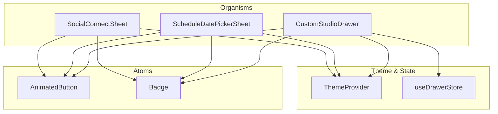
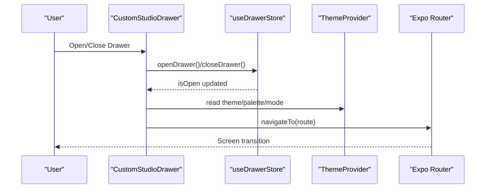
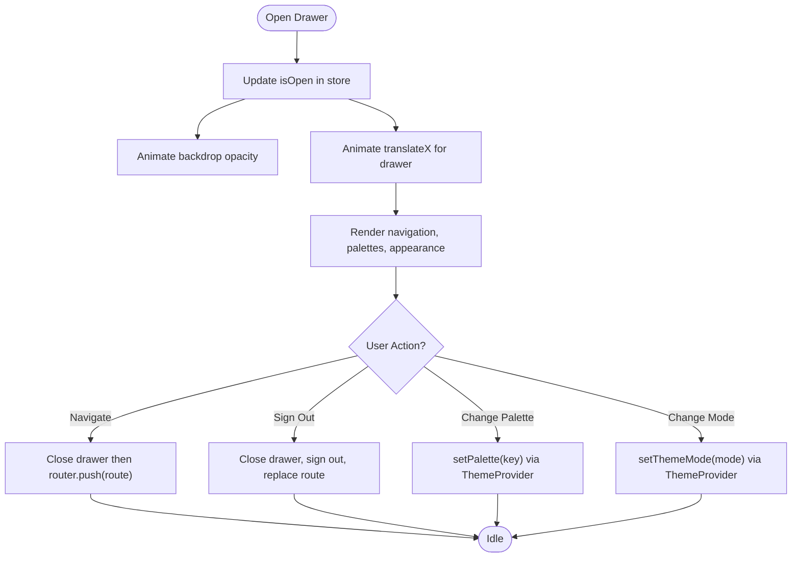
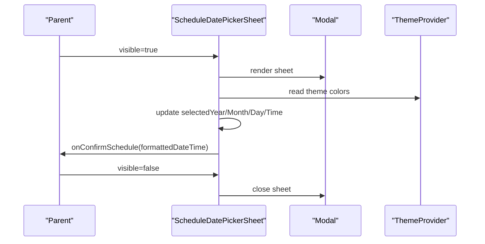
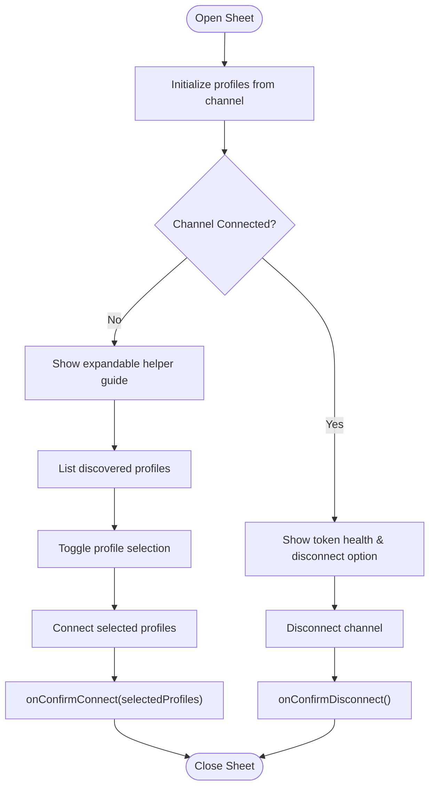
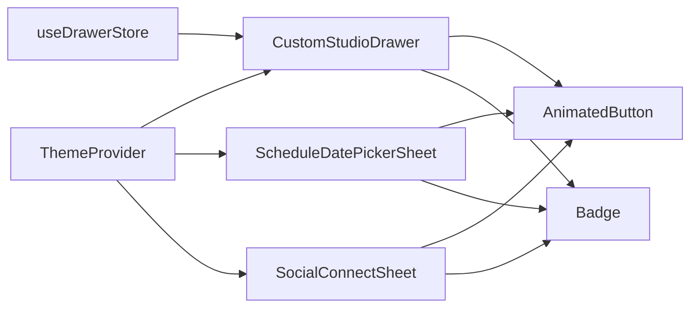

# Component Composition Patterns

<cite>
**Referenced Files in This Document**
- [CustomStudioDrawer.tsx](file://apps/mobile/src/components/organisms/CustomStudioDrawer.tsx)
- [ScheduleDatePickerSheet.tsx](file://apps/mobile/src/components/organisms/ScheduleDatePickerSheet.tsx)
- [SocialConnectSheet.tsx](file://apps/mobile/src/components/organisms/SocialConnectSheet.tsx)
- [ThemeProvider.tsx](file://apps/mobile/src/theme/ThemeProvider.tsx)
- [useDrawerStore.ts](file://apps/mobile/src/store/useDrawerStore.ts)
- [AnimatedButton.tsx](file://apps/mobile/src/components/atoms/AnimatedButton.tsx)
- [Badge.tsx](file://apps/mobile/src/components/atoms/Badge.tsx)
</cite>

## Table of Contents
1. [Introduction](#introduction)
2. [Project Structure](#project-structure)
3. [Core Components](#core-components)
4. [Architecture Overview](#architecture-overview)
5. [Detailed Component Analysis](#detailed-component-analysis)
6. [Dependency Analysis](#dependency-analysis)
7. [Performance Considerations](#performance-considerations)
8. [Troubleshooting Guide](#troubleshooting-guide)
9. [Conclusion](#conclusion)

## Introduction
This document explains the component composition patterns used in the mobile application, focusing on how atomic components are combined into molecules and organisms to build complex UI features. It provides a deep dive into three key organisms: CustomStudioDrawer, ScheduleDatePickerSheet, and SocialConnectSheet. You will learn how state is managed across components, how context and stores are used to avoid prop drilling, and how performance is optimized with animations and memoization. The guide also includes best practices for creating reusable compound components and managing lifecycle interactions.

## Project Structure
The mobile app follows an atomic design approach:
- Atoms: small, reusable building blocks like AnimatedButton and Badge.
- Molecules: combinations of atoms (not present in this snapshot).
- Organisms: feature-level components such as CustomStudioDrawer, ScheduleDatePickerSheet, and SocialConnectSheet.

**Diagram sources**
- [CustomStudioDrawer.tsx:1-493](file://apps/mobile/src/components/organisms/CustomStudioDrawer.tsx#L1-L493)
- [ScheduleDatePickerSheet.tsx:1-374](file://apps/mobile/src/components/organisms/ScheduleDatePickerSheet.tsx#L1-L374)
- [SocialConnectSheet.tsx:1-471](file://apps/mobile/src/components/organisms/SocialConnectSheet.tsx#L1-L471)
- [ThemeProvider.tsx:1-97](file://apps/mobile/src/theme/ThemeProvider.tsx#L1-L97)
- [useDrawerStore.ts:1-16](file://apps/mobile/src/store/useDrawerStore.ts#L1-L16)
- [AnimatedButton.tsx:1-195](file://apps/mobile/src/components/atoms/AnimatedButton.tsx#L1-L195)
- [Badge.tsx:1-78](file://apps/mobile/src/components/atoms/Badge.tsx#L1-L78)

**Section sources**
- [CustomStudioDrawer.tsx:1-493](file://apps/mobile/src/components/organisms/CustomStudioDrawer.tsx#L1-L493)
- [ScheduleDatePickerSheet.tsx:1-374](file://apps/mobile/src/components/organisms/ScheduleDatePickerSheet.tsx#L1-L374)
- [SocialConnectSheet.tsx:1-471](file://apps/mobile/src/components/organisms/SocialConnectSheet.tsx#L1-L471)
- [ThemeProvider.tsx:1-97](file://apps/mobile/src/theme/ThemeProvider.tsx#L1-L97)
- [useDrawerStore.ts:1-16](file://apps/mobile/src/store/useDrawerStore.ts#L1-L16)
- [AnimatedButton.tsx:1-195](file://apps/mobile/src/components/atoms/AnimatedButton.tsx#L1-L195)
- [Badge.tsx:1-78](file://apps/mobile/src/components/atoms/Badge.tsx#L1-L78)

## Core Components
- CustomStudioDrawer: A slide-in navigation drawer that composes atoms and integrates with theme and global store for state and navigation.
- ScheduleDatePickerSheet: A modal sheet for selecting date and time, using local state and theme context.
- SocialConnectSheet: A modal sheet for connecting/disconnecting social channels, handling multi-profile selection and async flows.

These organisms demonstrate:
- Composition of atoms (e.g., AnimatedButton, Badge) within larger UI structures.
- Use of ThemeProvider via useTheme hook to access dynamic styling without prop drilling.
- Use of Zustand store (useDrawerStore) for cross-cutting UI state (drawer visibility).
- Controlled modals with props and callbacks for parent-driven behavior.

**Section sources**
- [CustomStudioDrawer.tsx:1-493](file://apps/mobile/src/components/organisms/CustomStudioDrawer.tsx#L1-L493)
- [ScheduleDatePickerSheet.tsx:1-374](file://apps/mobile/src/components/organisms/ScheduleDatePickerSheet.tsx#L1-L374)
- [SocialConnectSheet.tsx:1-471](file://apps/mobile/src/components/organisms/SocialConnectSheet.tsx#L1-L471)
- [ThemeProvider.tsx:1-97](file://apps/mobile/src/theme/ThemeProvider.tsx#L1-L97)
- [useDrawerStore.ts:1-16](file://apps/mobile/src/store/useDrawerStore.ts#L1-L16)

## Architecture Overview
The architecture separates concerns across layers:
- Presentation layer: Organisms compose atoms and manage local UI state.
- Theming layer: ThemeProvider supplies colors, mode, and palette via React Context.
- Global state layer: Zustand stores (e.g., useDrawerStore) provide shared UI state.
- Navigation layer: Expo Router handles screen transitions from organism actions.

**Diagram sources**
- [CustomStudioDrawer.tsx:45-90](file://apps/mobile/src/components/organisms/CustomStudioDrawer.tsx#L45-L90)
- [useDrawerStore.ts:1-16](file://apps/mobile/src/store/useDrawerStore.ts#L1-L16)
- [ThemeProvider.tsx:19-87](file://apps/mobile/src/theme/ThemeProvider.tsx#L19-L87)

**Section sources**
- [CustomStudioDrawer.tsx:45-90](file://apps/mobile/src/components/organisms/CustomStudioDrawer.tsx#L45-L90)
- [useDrawerStore.ts:1-16](file://apps/mobile/src/store/useDrawerStore.ts#L1-L16)
- [ThemeProvider.tsx:19-87](file://apps/mobile/src/theme/ThemeProvider.tsx#L19-L87)

## Detailed Component Analysis

### CustomStudioDrawer
Responsibilities:
- Renders a slide-in drawer with backdrop and animated transitions.
- Integrates with ThemeProvider for dynamic theming and palette switching.
- Uses useDrawerStore to control open/close state.
- Navigates to screens and triggers sign-out flow.

Key patterns:
- Animation: Uses react-native-reanimated shared values and worklets for smooth drawer transitions.
- Context usage: Reads theme via useTheme; avoids prop drilling by consuming theme globally.
- Global state: Drawer visibility controlled via Zustand store.
- Composition: Composes atoms (Badge) and icons to build navigation items and palette picker.

**Diagram sources**
- [CustomStudioDrawer.tsx:52-84](file://apps/mobile/src/components/organisms/CustomStudioDrawer.tsx#L52-L84)
- [CustomStudioDrawer.tsx:231-321](file://apps/mobile/src/components/organisms/CustomStudioDrawer.tsx#L231-L321)
- [useDrawerStore.ts:1-16](file://apps/mobile/src/store/useDrawerStore.ts#L1-L16)
- [ThemeProvider.tsx:40-50](file://apps/mobile/src/theme/ThemeProvider.tsx#L40-L50)

**Section sources**
- [CustomStudioDrawer.tsx:45-90](file://apps/mobile/src/components/organisms/CustomStudioDrawer.tsx#L45-L90)
- [CustomStudioDrawer.tsx:231-321](file://apps/mobile/src/components/organisms/CustomStudioDrawer.tsx#L231-L321)
- [useDrawerStore.ts:1-16](file://apps/mobile/src/store/useDrawerStore.ts#L1-L16)
- [ThemeProvider.tsx:40-50](file://apps/mobile/src/theme/ThemeProvider.tsx#L40-L50)

### ScheduleDatePickerSheet
Responsibilities:
- Presents a modal sheet to pick a date and publishing hour.
- Manages local state for selected year, month, day, and time.
- Validates past dates and restricts navigation accordingly.
- Emits a formatted datetime string via callback to parent.

Key patterns:
- Local state: useState for selection state; no external store needed.
- Controlled modal: visible prop controls visibility; onClose and onConfirmSchedule handle lifecycle.
- Composition: Uses AnimatedButton and Badge for consistent UI.
- Validation: Prevents selecting past days and disables previous month when current.

**Diagram sources**
- [ScheduleDatePickerSheet.tsx:14-66](file://apps/mobile/src/components/organisms/ScheduleDatePickerSheet.tsx#L14-L66)
- [ScheduleDatePickerSheet.tsx:68-232](file://apps/mobile/src/components/organisms/ScheduleDatePickerSheet.tsx#L68-L232)
- [ThemeProvider.tsx:19-87](file://apps/mobile/src/theme/ThemeProvider.tsx#L19-L87)

**Section sources**
- [ScheduleDatePickerSheet.tsx:14-66](file://apps/mobile/src/components/organisms/ScheduleDatePickerSheet.tsx#L14-L66)
- [ScheduleDatePickerSheet.tsx:68-232](file://apps/mobile/src/components/organisms/ScheduleDatePickerSheet.tsx#L68-L232)

### SocialConnectSheet
Responsibilities:
- Displays a modal sheet to connect or disconnect a social channel.
- Supports multi-profile discovery and selection.
- Provides helper guidance and security messaging.
- Handles async operations with loading states and haptic feedback.

Key patterns:
- Props-driven configuration: Channel data passed via props; internal profiles state initialized on open.
- Selection management: Toggle profile selection locally; compute selected count.
- Async flows: Simulated processing delays before invoking callbacks; loading indicators via AnimatedButton.
- Composition: Uses GlassCard, AnimatedButton, Badge, and icons for rich UX.

**Diagram sources**
- [SocialConnectSheet.tsx:17-93](file://apps/mobile/src/components/organisms/SocialConnectSheet.tsx#L17-L93)
- [SocialConnectSheet.tsx:95-271](file://apps/mobile/src/components/organisms/SocialConnectSheet.tsx#L95-L271)

**Section sources**
- [SocialConnectSheet.tsx:17-93](file://apps/mobile/src/components/organisms/SocialConnectSheet.tsx#L17-L93)
- [SocialConnectSheet.tsx:95-271](file://apps/mobile/src/components/organisms/SocialConnectSheet.tsx#L95-L271)

## Dependency Analysis
- ThemeProvider: Centralizes theme and palette state; consumed by all organisms and atoms.
- useDrawerStore: Provides drawer visibility state used by CustomStudioDrawer.
- Atoms: AnimatedButton and Badge are reused across organisms for consistent interaction and labeling.

**Diagram sources**
- [ThemeProvider.tsx:19-87](file://apps/mobile/src/theme/ThemeProvider.tsx#L19-L87)
- [useDrawerStore.ts:1-16](file://apps/mobile/src/store/useDrawerStore.ts#L1-L16)
- [CustomStudioDrawer.tsx:1-493](file://apps/mobile/src/components/organisms/CustomStudioDrawer.tsx#L1-L493)
- [ScheduleDatePickerSheet.tsx:1-374](file://apps/mobile/src/components/organisms/ScheduleDatePickerSheet.tsx#L1-L374)
- [SocialConnectSheet.tsx:1-471](file://apps/mobile/src/components/organisms/SocialConnectSheet.tsx#L1-L471)
- [AnimatedButton.tsx:1-195](file://apps/mobile/src/components/atoms/AnimatedButton.tsx#L1-L195)
- [Badge.tsx:1-78](file://apps/mobile/src/components/atoms/Badge.tsx#L1-L78)

**Section sources**
- [ThemeProvider.tsx:19-87](file://apps/mobile/src/theme/ThemeProvider.tsx#L19-L87)
- [useDrawerStore.ts:1-16](file://apps/mobile/src/store/useDrawerStore.ts#L1-L16)
- [CustomStudioDrawer.tsx:1-493](file://apps/mobile/src/components/organisms/CustomStudioDrawer.tsx#L1-L493)
- [ScheduleDatePickerSheet.tsx:1-374](file://apps/mobile/src/components/organisms/ScheduleDatePickerSheet.tsx#L1-L374)
- [SocialConnectSheet.tsx:1-471](file://apps/mobile/src/components/organisms/SocialConnectSheet.tsx#L1-L471)
- [AnimatedButton.tsx:1-195](file://apps/mobile/src/components/atoms/AnimatedButton.tsx#L1-L195)
- [Badge.tsx:1-78](file://apps/mobile/src/components/atoms/Badge.tsx#L1-L78)

## Performance Considerations
- Animations: CustomStudioDrawer uses react-native-reanimated shared values and worklets for GPU-friendly transitions, minimizing main thread work.
- Memoization: Atoms like AnimatedButton and Badge are wrapped with memo to prevent unnecessary re-renders when props remain unchanged.
- Local vs Global State: ScheduleDatePickerSheet and SocialConnectSheet keep selection state local to reduce global store churn; only necessary events bubble up to parents.
- Conditional Rendering: SocialConnectSheet conditionally renders connected vs discovery views based on channel state, avoiding redundant computations.
- Safe Area Handling: CustomStudioDrawer adapts to safe area insets to ensure content remains visible on devices with notches or dynamic islands.

[No sources needed since this section provides general guidance]

## Troubleshooting Guide
Common issues and resolutions:
- Drawer does not animate: Ensure isOpen state is toggled via useDrawerStore and that reanimated worklets are correctly applied to shared values.
- Theme not updating: Confirm setPalette and setThemeMode are called through ThemeProvider; verify persisted storage keys are valid.
- Modal not closing: Verify visible prop is controlled by parent and onClose is invoked; check requestClose handler in Modal.
- Profile selection not persisting: Ensure profiles state is initialized from channel.discoveredProfiles when channel changes; confirm toggleSelectProfile updates selected flags.
- Loading states stuck: Check async handlers and ensure setIsProcessing is reset after completion; validate timeouts or network calls resolve properly.

**Section sources**
- [CustomStudioDrawer.tsx:52-90](file://apps/mobile/src/components/organisms/CustomStudioDrawer.tsx#L52-L90)
- [ThemeProvider.tsx:25-50](file://apps/mobile/src/theme/ThemeProvider.tsx#L25-L50)
- [ScheduleDatePickerSheet.tsx:68-75](file://apps/mobile/src/components/organisms/ScheduleDatePickerSheet.tsx#L68-L75)
- [SocialConnectSheet.tsx:58-93](file://apps/mobile/src/components/organisms/SocialConnectSheet.tsx#L58-L93)

## Conclusion
The mobile app demonstrates a robust composition model where atoms form cohesive molecules and organisms deliver feature-rich experiences. CustomStudioDrawer, ScheduleDatePickerSheet, and SocialConnectSheet illustrate effective use of context, stores, and local state to manage complexity while maintaining performance. By following these patterns—composing small, memoized components, leveraging context for theming, centralizing cross-cutting state in stores, and keeping local state scoped—you can build scalable, maintainable, and performant interfaces.

[No sources needed since this section summarizes without analyzing specific files]