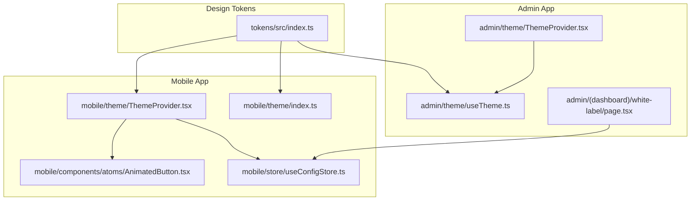
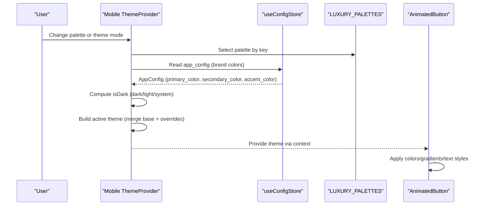
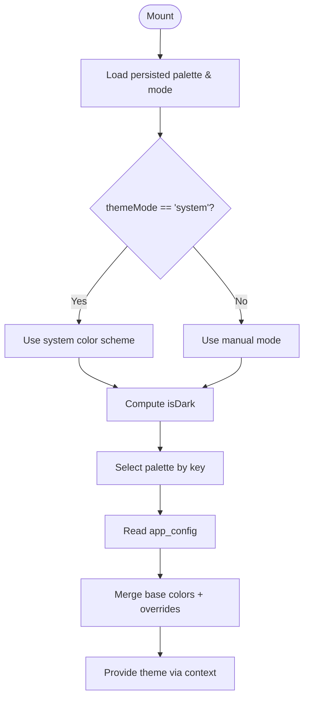
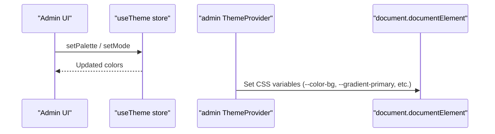
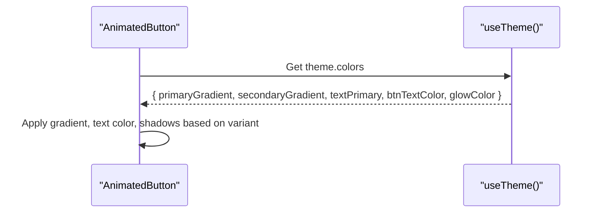
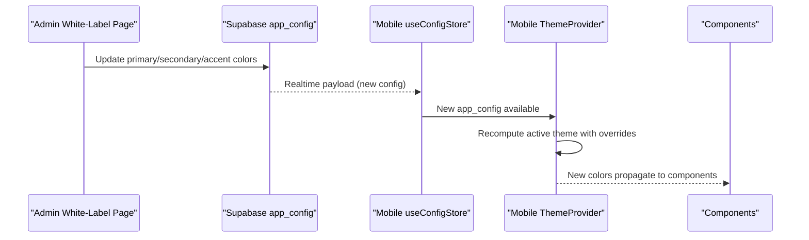
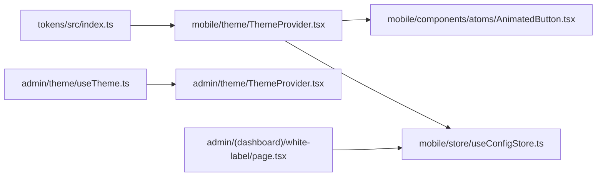

# Theme System & Design Tokens

<cite>
**Referenced Files in This Document**
- [packages/tokens/src/index.ts](file://packages/tokens/src/index.ts)
- [apps/mobile/src/theme/ThemeProvider.tsx](file://apps/mobile/src/theme/ThemeProvider.tsx)
- [apps/mobile/src/theme/index.ts](file://apps/mobile/src/theme/index.ts)
- [apps/mobile/src/store/useConfigStore.ts](file://apps/mobile/src/store/useConfigStore.ts)
- [apps/admin/src/theme/ThemeProvider.tsx](file://apps/admin/src/theme/ThemeProvider.tsx)
- [apps/admin/src/theme/useTheme.ts](file://apps/admin/src/theme/useTheme.ts)
- [apps/mobile/src/components/atoms/AnimatedButton.tsx](file://apps/mobile/src/components/atoms/AnimatedButton.tsx)
- [apps/admin/src/app/(dashboard)/white-label/page.tsx](file://apps/admin/src/app/(dashboard)/white-label/page.tsx)
</cite>

## Table of Contents
1. Introduction
2. Project Structure
3. Core Components
4. Architecture Overview
5. Detailed Component Analysis
6. Dependency Analysis
7. Performance Considerations
8. Troubleshooting Guide
9. Conclusion

## Introduction
This document explains the theming system and design token architecture across the mobile and admin applications. It covers how themes are defined, resolved at runtime, persisted, and consumed by components. It also documents white-label overrides that allow dynamic brand customization from the admin dashboard, including dark mode support and dynamic theme switching.

## Project Structure
The theming system is organized into three layers:
- Design tokens: a shared package defining color palettes and types.
- App-level theme providers: resolve active colors based on palette, mode, and runtime configuration.
- Components: consume theme values to style UI consistently.



**Diagram sources**
- [packages/tokens/src/index.ts:1-284](file://packages/tokens/src/index.ts#L1-L284)
- [apps/mobile/src/theme/ThemeProvider.tsx:1-97](file://apps/mobile/src/theme/ThemeProvider.tsx#L1-L97)
- [apps/mobile/src/theme/index.ts:1-12](file://apps/mobile/src/theme/index.ts#L1-L12)
- [apps/mobile/src/store/useConfigStore.ts:1-67](file://apps/mobile/src/store/useConfigStore.ts#L1-L67)
- [apps/admin/src/theme/ThemeProvider.tsx:1-41](file://apps/admin/src/theme/ThemeProvider.tsx#L1-L41)
- [apps/admin/src/theme/useTheme.ts:1-52](file://apps/admin/src/theme/useTheme.ts#L1-L52)
- [apps/mobile/src/components/atoms/AnimatedButton.tsx:1-195](file://apps/mobile/src/components/atoms/AnimatedButton.tsx#L1-L195)
- [apps/admin/src/app/(dashboard)/white-label/page.tsx:34-239](file://apps/admin/src/app/(dashboard)/white-label/page.tsx#L34-L239)

**Section sources**
- [packages/tokens/src/index.ts:1-284](file://packages/tokens/src/index.ts#L1-L284)
- [apps/mobile/src/theme/ThemeProvider.tsx:1-97](file://apps/mobile/src/theme/ThemeProvider.tsx#L1-L97)
- [apps/admin/src/theme/ThemeProvider.tsx:1-41](file://apps/admin/src/theme/ThemeProvider.tsx#L1-L41)

## Core Components
- Design tokens define the type contract for themes and provide multiple built-in palettes with light/dark variants.
- Mobile ThemeProvider resolves the active theme using selected palette, theme mode (dark/light/system), and optional white-label overrides fetched from the app config store.
- Admin ThemeProvider maps token colors to CSS custom properties for web styling.
- Components consume the theme via hooks to apply consistent colors and gradients.

Key responsibilities:
- Token definitions: centralized source of truth for colors and gradients.
- Runtime resolution: compute active theme once per change in palette/mode/config.
- Persistence: remember user’s palette and mode preferences.
- White-label overrides: allow admin-driven brand customization without code changes.

**Section sources**
- [packages/tokens/src/index.ts:1-284](file://packages/tokens/src/index.ts#L1-L284)
- [apps/mobile/src/theme/ThemeProvider.tsx:19-87](file://apps/mobile/src/theme/ThemeProvider.tsx#L19-L87)
- [apps/admin/src/theme/ThemeProvider.tsx:10-41](file://apps/admin/src/theme/ThemeProvider.tsx#L10-L41)
- [apps/mobile/src/components/atoms/AnimatedButton.tsx:24-155](file://apps/mobile/src/components/atoms/AnimatedButton.tsx#L24-L155)

## Architecture Overview
The theme system composes tokens with runtime state to produce a final theme object consumed by components.



**Diagram sources**
- [apps/mobile/src/theme/ThemeProvider.tsx:25-81](file://apps/mobile/src/theme/ThemeProvider.tsx#L25-L81)
- [apps/mobile/src/store/useConfigStore.ts:12-66](file://apps/mobile/src/store/useConfigStore.ts#L12-L66)
- [packages/tokens/src/index.ts:28-284](file://packages/tokens/src/index.ts#L28-L284)
- [apps/mobile/src/components/atoms/AnimatedButton.tsx:66-75](file://apps/mobile/src/components/atoms/AnimatedButton.tsx#L66-L75)

## Detailed Component Analysis

### Design Tokens
- Palette keys and modes are typed to ensure consistency.
- Each palette includes both light and dark color sets with semantic tokens (background, surface, text, primary, gradients, badges, glass cards).
- Extensibility: add new palette entries to the tokens map; apps automatically gain access.

```mermaid
classDiagram
class ThemeColors {
+string background
+string surface
+string surfaceSubtle
+string inputBg
+string border
+string borderActive
+string textPrimary
+string textSecondary
+string textMuted
+string primary
+readonly string[] primaryGradient
+readonly string[] secondaryGradient
+readonly string[] accentGradient
+readonly string[] laserGlow
+string glowColor
+string btnTextColor
+string badgeBg
+string badgeBorder
+string badgeText
+string cardGlass
+string cardGlassBorder
}
class LUXURY_PALETTES {
+Record~PaletteKey,{ name : string; dark : ThemeColors; light : ThemeColors }~
}
LUXURY_PALETTES --> ThemeColors : "provides dark/light"
```

**Diagram sources**
- [packages/tokens/src/index.ts:4-26](file://packages/tokens/src/index.ts#L4-L26)
- [packages/tokens/src/index.ts:28-284](file://packages/tokens/src/index.ts#L28-L284)

**Section sources**
- [packages/tokens/src/index.ts:1-284](file://packages/tokens/src/index.ts#L1-L284)

### Mobile ThemeProvider
- Persists palette and theme mode using secure storage.
- Resolves isDark based on mode and system preference.
- Builds an active theme by merging base palette colors with white-label overrides from app config.
- Exposes setters to update palette and mode, and a hook to consume the theme.



**Diagram sources**
- [apps/mobile/src/theme/ThemeProvider.tsx:25-81](file://apps/mobile/src/theme/ThemeProvider.tsx#L25-L81)
- [apps/mobile/src/store/useConfigStore.ts:12-66](file://apps/mobile/src/store/useConfigStore.ts#L12-L66)

**Section sources**
- [apps/mobile/src/theme/ThemeProvider.tsx:1-97](file://apps/mobile/src/theme/ThemeProvider.tsx#L1-L97)
- [apps/mobile/src/store/useConfigStore.ts:1-67](file://apps/mobile/src/store/useConfigStore.ts#L1-L67)

### Admin ThemeProvider and useTheme
- Admin uses a Zustand store to manage palette and mode, persisting state locally.
- The provider writes token colors to CSS custom properties on the root element, enabling CSS-based styling.
- A convenience hook exposes a uniform API similar to the mobile hook.



**Diagram sources**
- [apps/admin/src/theme/useTheme.ts:14-39](file://apps/admin/src/theme/useTheme.ts#L14-L39)
- [apps/admin/src/theme/ThemeProvider.tsx:10-41](file://apps/admin/src/theme/ThemeProvider.tsx#L10-L41)

**Section sources**
- [apps/admin/src/theme/useTheme.ts:1-52](file://apps/admin/src/theme/useTheme.ts#L1-L52)
- [apps/admin/src/theme/ThemeProvider.tsx:1-41](file://apps/admin/src/theme/ThemeProvider.tsx#L1-L41)

### Component Consumption: AnimatedButton
- Reads theme from context to determine gradient colors, text color, and shadow/glow.
- Uses size and variant props to select appropriate typography and layout tokens.
- Demonstrates how components stay theme-aware without hard-coded colors.



**Diagram sources**
- [apps/mobile/src/components/atoms/AnimatedButton.tsx:24-155](file://apps/mobile/src/components/atoms/AnimatedButton.tsx#L24-L155)

**Section sources**
- [apps/mobile/src/components/atoms/AnimatedButton.tsx:1-195](file://apps/mobile/src/components/atoms/AnimatedButton.tsx#L1-L195)

### White-Label Overrides and Dynamic Branding
- Admin dashboard allows editing primary, secondary, and accent colors.
- Changes are saved to the database and synced to mobile apps via realtime subscription.
- Mobile ThemeProvider merges these overrides into the active theme, updating all components instantly.



**Diagram sources**
- [apps/admin/src/app/(dashboard)/white-label/page.tsx:34-239](file://apps/admin/src/app/(dashboard)/white-label/page.tsx#L34-L239)
- [apps/mobile/src/store/useConfigStore.ts:39-66](file://apps/mobile/src/store/useConfigStore.ts#L39-L66)
- [apps/mobile/src/theme/ThemeProvider.tsx:59-81](file://apps/mobile/src/theme/ThemeProvider.tsx#L59-L81)

**Section sources**
- [apps/admin/src/app/(dashboard)/white-label/page.tsx:34-239](file://apps/admin/src/app/(dashboard)/white-label/page.tsx#L34-L239)
- [apps/mobile/src/store/useConfigStore.ts:1-67](file://apps/mobile/src/store/useConfigStore.ts#L1-L67)
- [apps/mobile/src/theme/ThemeProvider.tsx:59-81](file://apps/mobile/src/theme/ThemeProvider.tsx#L59-L81)

## Dependency Analysis
- Mobile ThemeProvider depends on:
  - Design tokens for palette definitions.
  - Config store for runtime brand overrides.
  - Secure storage for persistence.
  - Haptics for feedback on theme changes.
- Admin ThemeProvider depends on:
  - Admin theme store for palette/mode state.
  - Writes CSS variables for global styling.
- Components depend on:
  - Theme hooks to read current colors and gradients.



**Diagram sources**
- [packages/tokens/src/index.ts:1-284](file://packages/tokens/src/index.ts#L1-L284)
- [apps/mobile/src/theme/ThemeProvider.tsx:1-97](file://apps/mobile/src/theme/ThemeProvider.tsx#L1-L97)
- [apps/mobile/src/components/atoms/AnimatedButton.tsx:1-195](file://apps/mobile/src/components/atoms/AnimatedButton.tsx#L1-L195)
- [apps/mobile/src/store/useConfigStore.ts:1-67](file://apps/mobile/src/store/useConfigStore.ts#L1-L67)
- [apps/admin/src/theme/useTheme.ts:1-52](file://apps/admin/src/theme/useTheme.ts#L1-L52)
- [apps/admin/src/theme/ThemeProvider.tsx:1-41](file://apps/admin/src/theme/ThemeProvider.tsx#L1-L41)
- [apps/admin/src/app/(dashboard)/white-label/page.tsx:34-239](file://apps/admin/src/app/(dashboard)/white-label/page.tsx#L34-L239)

**Section sources**
- [apps/mobile/src/theme/ThemeProvider.tsx:1-97](file://apps/mobile/src/theme/ThemeProvider.tsx#L1-L97)
- [apps/admin/src/theme/ThemeProvider.tsx:1-41](file://apps/admin/src/theme/ThemeProvider.tsx#L1-L41)
- [apps/mobile/src/store/useConfigStore.ts:1-67](file://apps/mobile/src/store/useConfigStore.ts#L1-L67)

## Performance Considerations
- Memoization: Active theme computation is memoized to avoid unnecessary recalculations when inputs (palette, mode, config) do not change.
- Minimal re-renders: Only components consuming theme values will re-render on changes.
- Network efficiency: Realtime config subscription avoids polling; placeholder URLs short-circuit network calls to prevent timeouts.
- Storage I/O: Persisted settings are loaded once at startup to minimize overhead.

[No sources needed since this section provides general guidance]

## Troubleshooting Guide
- Theme not applying:
  - Ensure ThemeProvider wraps your app tree.
  - Verify that palette key exists in tokens and that mode is valid.
- Overrides not taking effect:
  - Confirm app_config has been updated and mobile app received realtime updates.
  - Check that placeholders bypass network calls and return null config gracefully.
- Dark mode issues:
  - Validate mode selection and system color scheme detection logic.
- Admin CSS variables:
  - Confirm provider runs early and sets CSS variables on the root element.

**Section sources**
- [apps/mobile/src/theme/ThemeProvider.tsx:25-57](file://apps/mobile/src/theme/ThemeProvider.tsx#L25-L57)
- [apps/mobile/src/store/useConfigStore.ts:12-66](file://apps/mobile/src/store/useConfigStore.ts#L12-L66)
- [apps/admin/src/theme/ThemeProvider.tsx:10-41](file://apps/admin/src/theme/ThemeProvider.tsx#L10-L41)

## Conclusion
The theming system centralizes design tokens and provides a robust runtime layer that supports dynamic theme switching, dark mode, and white-label branding. Components remain decoupled from hardcoded colors by consuming theme values through hooks. The admin dashboard enables live brand customization, which propagates to mobile apps in real time, ensuring consistency across platforms while allowing flexible customization.

[No sources needed since this section summarizes without analyzing specific files]