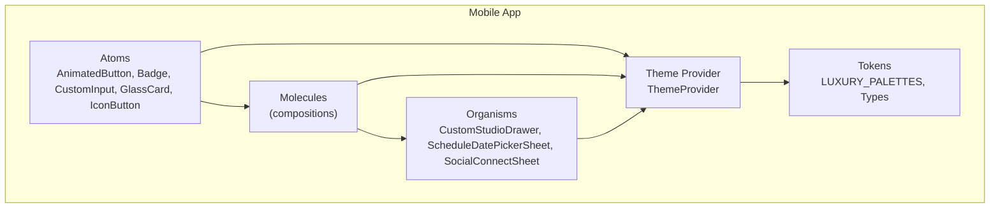
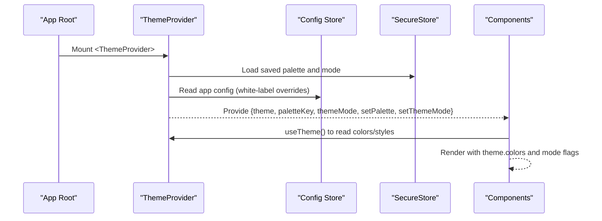
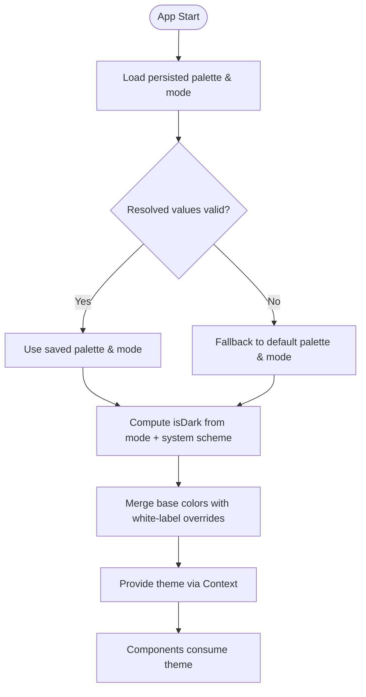
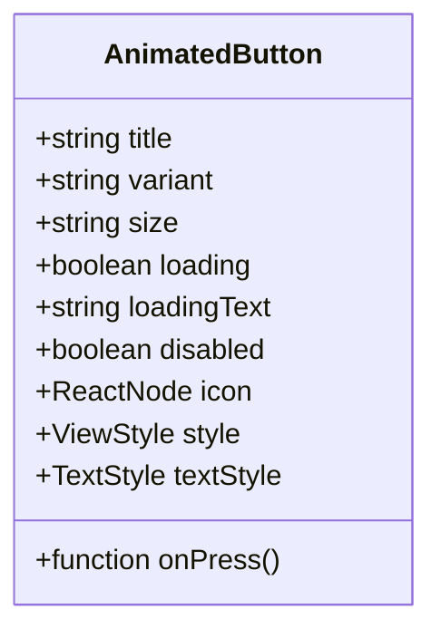
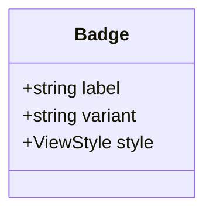
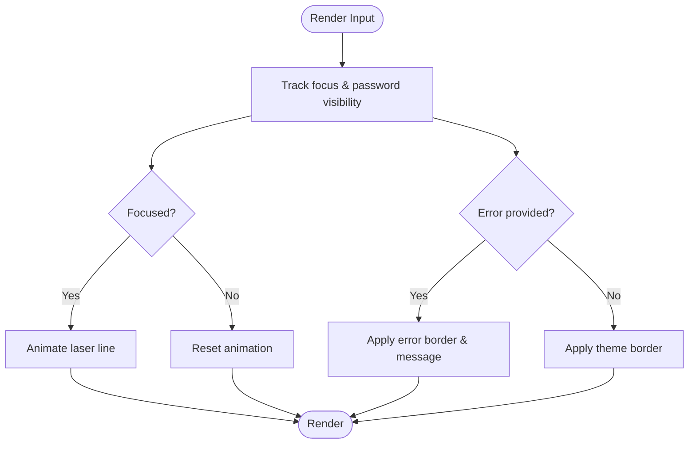
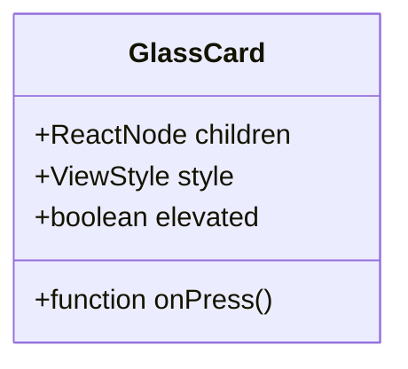
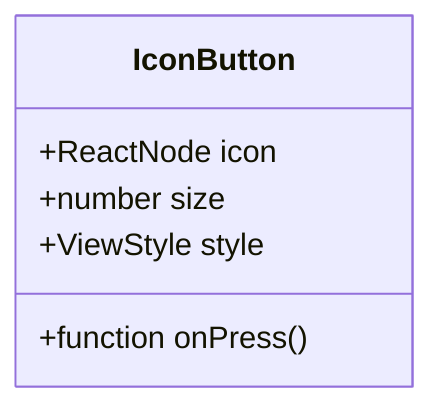
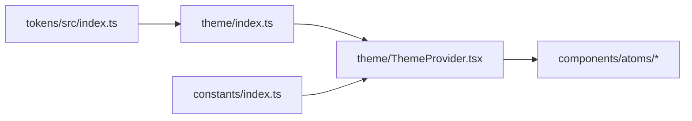

# UI Components & Design System

<cite>
**Referenced Files in This Document**
- [index.ts](file://apps/mobile/src/theme/index.ts)
- [ThemeProvider.tsx](file://apps/mobile/src/theme/ThemeProvider.tsx)
- [index.ts](file://packages/tokens/src/index.ts)
- [Badge.tsx](file://apps/mobile/src/components/atoms/Badge.tsx)
- [GlassCard.tsx](file://apps/mobile/src/components/atoms/GlassCard.tsx)
- [CustomInput.tsx](file://apps/mobile/src/components/atoms/CustomInput.tsx)
- [AnimatedButton.tsx](file://apps/mobile/src/components/atoms/AnimatedButton.tsx)
- [IconButton.tsx](file://apps/mobile/src/components/atoms/IconButton.tsx)
- [index.ts](file://apps/mobile/src/components/atoms/index.ts)
- [CustomStudioDrawer.tsx](file://apps/mobile/src/components/organisms/CustomStudioDrawer.tsx)
- [ScheduleDatePickerSheet.tsx](file://apps/mobile/src/components/organisms/ScheduleDatePickerSheet.tsx)
- [SocialConnectSheet.tsx](file://apps/mobile/src/components/organisms/SocialConnectSheet.tsx)
- [index.ts](file://apps/mobile/src/constants/index.ts)
</cite>

## Table of Contents
1. Introduction
2. Project Structure
3. Core Components
4. Architecture Overview
5. Detailed Component Analysis
6. Dependency Analysis
7. Performance Considerations
8. Troubleshooting Guide
9. Conclusion

## Introduction
This document describes the atomic design component system and theming approach used in the mobile application. It explains how atoms (such as BasicInput, Badge, GlassCard) compose into molecules and organisms, how the theme system is powered by shared design tokens, and how to create reusable, accessible, and consistent components across platforms. It also covers responsive patterns, custom styling approaches, composition strategies, prop validation, and testing guidance.

## Project Structure
The mobile app organizes UI code using an atomic design structure:
- Atoms: small, single-purpose components like AnimatedButton, Badge, CustomInput, GlassCard, IconButton
- Molecules: combinations of atoms (directory present; specific implementations not analyzed here)
- Organisms: complex UI sections such as CustomStudioDrawer, ScheduleDatePickerSheet, SocialConnectSheet
- Theme: centralized theme provider and token exports for palettes and modes
- Tokens: shared design tokens package providing color palettes and types

**Diagram sources**
- [ThemeProvider.tsx:1-97](file://apps/mobile/src/theme/ThemeProvider.tsx#L1-L97)
- [index.ts:1-284](file://packages/tokens/src/index.ts#L1-L284)
- [AnimatedButton.tsx:1-195](file://apps/mobile/src/components/atoms/AnimatedButton.tsx#L1-L195)
- [Badge.tsx:1-78](file://apps/mobile/src/components/atoms/Badge.tsx#L1-L78)
- [CustomInput.tsx:1-165](file://apps/mobile/src/components/atoms/CustomInput.tsx#L1-L165)
- [GlassCard.tsx:1-81](file://apps/mobile/src/components/atoms/GlassCard.tsx#L1-L81)
- [IconButton.tsx:1-70](file://apps/mobile/src/components/atoms/IconButton.tsx#L1-L70)
- [CustomStudioDrawer.tsx](file://apps/mobile/src/components/organisms/CustomStudioDrawer.tsx)
- [ScheduleDatePickerSheet.tsx](file://apps/mobile/src/components/organisms/ScheduleDatePickerSheet.tsx)
- [SocialConnectSheet.tsx](file://apps/mobile/src/components/organisms/SocialConnectSheet.tsx)

**Section sources**
- [index.ts:1-12](file://apps/mobile/src/theme/index.ts#L1-L12)
- [index.ts:1-6](file://apps/mobile/src/components/atoms/index.ts#L1-L6)

## Core Components
This section summarizes the core atoms and their responsibilities, highlighting how they consume the theme and maintain consistency.

- AnimatedButton: Provides interactive buttons with variants, sizes, gradients, loading states, haptic feedback, and animations. Uses theme colors for gradients, text, borders, and shadows.
- Badge: Displays status or category labels with variants and theme-aware colors. Supports neutral and semantic variants.
- CustomInput: Accessible input field with label, error state, optional password visibility toggle, focus animation, and gradient laser line driven by theme tokens.
- GlassCard: Glassmorphic container with optional elevation, press animations, and theme-driven glass colors and borders.
- IconButton: Circular or square icon button with press animation and haptics, themed background and border.

All atoms derive visual properties from the theme context, ensuring consistent appearance across palettes and modes.

**Section sources**
- [AnimatedButton.tsx:1-195](file://apps/mobile/src/components/atoms/AnimatedButton.tsx#L1-L195)
- [Badge.tsx:1-78](file://apps/mobile/src/components/atoms/Badge.tsx#L1-L78)
- [CustomInput.tsx:1-165](file://apps/mobile/src/components/atoms/CustomInput.tsx#L1-L165)
- [GlassCard.tsx:1-81](file://apps/mobile/src/components/atoms/GlassCard.tsx#L1-L81)
- [IconButton.tsx:1-70](file://apps/mobile/src/components/atoms/IconButton.tsx#L1-L70)

## Architecture Overview
The theme architecture centers on a provider that computes the active theme based on palette selection, mode (dark/light/system), and runtime overrides from app configuration. The provider exposes a unified theme object consumed by all components.

**Diagram sources**
- [ThemeProvider.tsx:1-97](file://apps/mobile/src/theme/ThemeProvider.tsx#L1-L97)
- [index.ts:1-23](file://apps/mobile/src/constants/index.ts#L1-L23)

## Detailed Component Analysis

### Theme System and Design Tokens
- Token definitions: Palette keys, theme modes, and a comprehensive ThemeColors interface define the shape of the theme.
- Palettes: LUXURY_PALETTES provides multiple themes (e.g., sunset, emerald, violet, azure, stealth) with dark and light variants.
- Dynamic theme computation: ThemeProvider resolves the active theme by combining selected palette, mode, and optional white-label overrides (primary, secondary, accent).
- Persistence: Palette and mode are persisted via SecureStore and restored on app start.
- Consumption: Components access theme via useTheme(), which returns a DynamicTheme including colors and metadata (paletteKey, paletteName, mode, isDark).

**Diagram sources**
- [ThemeProvider.tsx:1-97](file://apps/mobile/src/theme/ThemeProvider.tsx#L1-L97)
- [index.ts:1-284](file://packages/tokens/src/index.ts#L1-L284)
- [index.ts:1-23](file://apps/mobile/src/constants/index.ts#L1-L23)

**Section sources**
- [index.ts:1-12](file://apps/mobile/src/theme/index.ts#L1-L12)
- [ThemeProvider.tsx:1-97](file://apps/mobile/src/theme/ThemeProvider.tsx#L1-L97)
- [index.ts:1-284](file://packages/tokens/src/index.ts#L1-L284)

### Atom: AnimatedButton
- Purpose: Primary call-to-action with variants (primary, secondary, outline, ghost), sizes (sm, md, lg), loading state, and optional icon.
- Theming: Uses theme gradients, text color, borders, and glow/shadow colors. Disabled state uses muted opacity and background.
- Interaction: Press animations scale via Reanimated; haptic feedback on press; debounced onPress to prevent double-taps.
- Accessibility considerations: Ensure sufficient contrast for text over gradients; provide meaningful labels for icon-only usage.

**Diagram sources**
- [AnimatedButton.tsx:1-195](file://apps/mobile/src/components/atoms/AnimatedButton.tsx#L1-L195)

**Section sources**
- [AnimatedButton.tsx:1-195](file://apps/mobile/src/components/atoms/AnimatedButton.tsx#L1-L195)

### Atom: Badge
- Purpose: Compact label for status or categorization.
- Variants: primary, secondary, accent, neutral. Each variant maps to theme-aware colors.
- Theming: Background, border, and text colors derived from theme; neutral variant uses surface and border tokens.

**Diagram sources**
- [Badge.tsx:1-78](file://apps/mobile/src/components/atoms/Badge.tsx#L1-L78)

**Section sources**
- [Badge.tsx:1-78](file://apps/mobile/src/components/atoms/Badge.tsx#L1-L78)

### Atom: CustomInput
- Purpose: Form input with label, error messaging, optional left icon, and password visibility toggle.
- Theming: Focus state changes border color; error state uses a distinct error color; placeholder and text colors come from theme; gradient laser line uses theme.laserGlow.
- Animation: Laser line scales on focus using Reanimated.
- Accessibility: Label associates with input; error text is visually distinct; ensure keyboard navigation and screen reader support.

**Diagram sources**
- [CustomInput.tsx:1-165](file://apps/mobile/src/components/atoms/CustomInput.tsx#L1-L165)

**Section sources**
- [CustomInput.tsx:1-165](file://apps/mobile/src/components/atoms/CustomInput.tsx#L1-L165)

### Atom: GlassCard
- Purpose: Glassmorphic container with optional elevation and press interaction.
- Theming: Background and border colors from theme.cardGlass and theme.cardGlassBorder.
- Interaction: Scale animation on press; haptic feedback when onPress is provided.

**Diagram sources**
- [GlassCard.tsx:1-81](file://apps/mobile/src/components/atoms/GlassCard.tsx#L1-L81)

**Section sources**
- [GlassCard.tsx:1-81](file://apps/mobile/src/components/atoms/GlassCard.tsx#L1-L81)

### Atom: IconButton
- Purpose: Tappable icon container with press animation and haptics.
- Theming: Background and border from theme.surfaceSubtle and theme.border; size is configurable.

**Diagram sources**
- [IconButton.tsx:1-70](file://apps/mobile/src/components/atoms/IconButton.tsx#L1-L70)

**Section sources**
- [IconButton.tsx:1-70](file://apps/mobile/src/components/atoms/IconButton.tsx#L1-L70)

### Organisms
- CustomStudioDrawer: Complex UI assembly likely composed of atoms/molecules for navigation and content panels.
- ScheduleDatePickerSheet: Sheet-based date picker integration, likely composing inputs and buttons.
- SocialConnectSheet: Sheet for connecting social accounts, likely composing inputs and actions.

These organisms demonstrate composition patterns where atoms and molecules are combined to build feature-specific screens.

**Section sources**
- [CustomStudioDrawer.tsx](file://apps/mobile/src/components/organisms/CustomStudioDrawer.tsx)
- [ScheduleDatePickerSheet.tsx](file://apps/mobile/src/components/organisms/ScheduleDatePickerSheet.tsx)
- [SocialConnectSheet.tsx](file://apps/mobile/src/components/organisms/SocialConnectSheet.tsx)

## Dependency Analysis
- Theme consumption: All atoms import and use the theme via useTheme().
- Token source: Theme colors and types originate from the shared tokens package.
- Persistence: Theme settings rely on constants for storage keys and SecureStore for persistence.

**Diagram sources**
- [index.ts:1-284](file://packages/tokens/src/index.ts#L1-L284)
- [index.ts:1-12](file://apps/mobile/src/theme/index.ts#L1-L12)
- [ThemeProvider.tsx:1-97](file://apps/mobile/src/theme/ThemeProvider.tsx#L1-L97)
- [index.ts:1-23](file://apps/mobile/src/constants/index.ts#L1-L23)

**Section sources**
- [index.ts:1-284](file://packages/tokens/src/index.ts#L1-L284)
- [index.ts:1-12](file://apps/mobile/src/theme/index.ts#L1-L12)
- [ThemeProvider.tsx:1-97](file://apps/mobile/src/theme/ThemeProvider.tsx#L1-L97)
- [index.ts:1-23](file://apps/mobile/src/constants/index.ts#L1-L23)

## Performance Considerations
- Animations: Prefer Reanimated shared values and animated styles for smooth interactions; avoid heavy layout recalculations inside animations.
- Haptics: Keep haptic calls lightweight; wrap in try/catch to avoid blocking UI.
- Memoization: Atoms use memo to prevent unnecessary re-renders when props do not change.
- Gradients: Limit gradient layers; reuse theme gradients rather than computing inline frequently.
- Storage: Persist theme preferences asynchronously; avoid synchronous reads during render.

[No sources needed since this section provides general guidance]

## Troubleshooting Guide
- Missing ThemeProvider: Using theme hooks outside ThemeProvider will throw an error. Ensure the app root wraps content with ThemeProvider.
- Invalid palette or mode: If persisted values are invalid, fallback logic should be in place; verify STORAGE_KEYS and SecureStore usage.
- White-label overrides: If primary/secondary/accent colors appear unexpected, check app config merging in ThemeProvider.
- Contrast issues: Verify text vs. background contrast, especially for gradient buttons and badges; adjust variants or add outlines if needed.
- Input errors: Ensure error messages are visible and distinguishable; confirm error color usage aligns with accessibility guidelines.

**Section sources**
- [ThemeProvider.tsx:1-97](file://apps/mobile/src/theme/ThemeProvider.tsx#L1-L97)
- [index.ts:1-23](file://apps/mobile/src/constants/index.ts#L1-L23)

## Conclusion
The mobile application implements a robust atomic design system backed by a centralized theme provider and shared design tokens. Atoms like AnimatedButton, Badge, CustomInput, GlassCard, and IconButton provide consistent, theme-aware building blocks. Organisms compose these atoms into feature-rich interfaces. The theme system supports multiple palettes, dynamic mode switching, and white-label customization while persisting user preferences. Following the guidelines for composition, accessibility, and performance ensures a cohesive and scalable UI across platforms.

[No sources needed since this section summarizes without analyzing specific files]