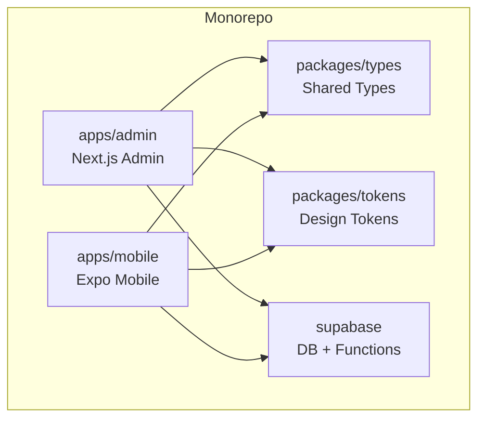
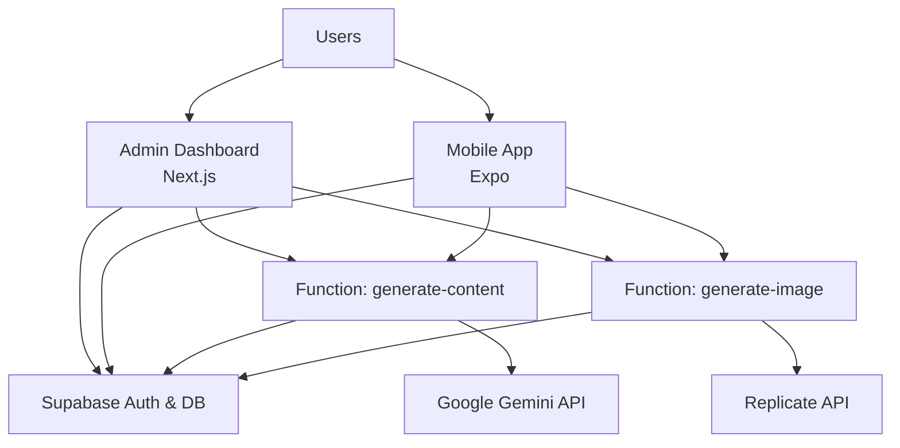
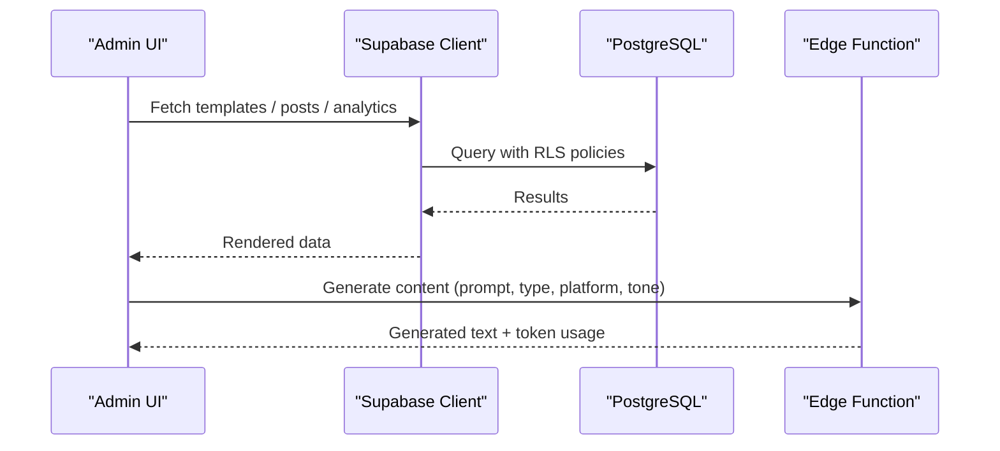
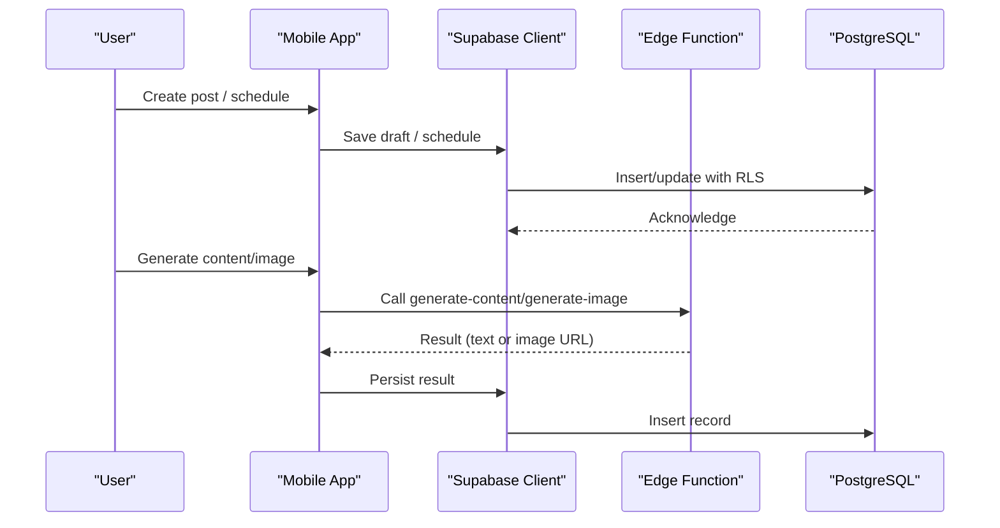
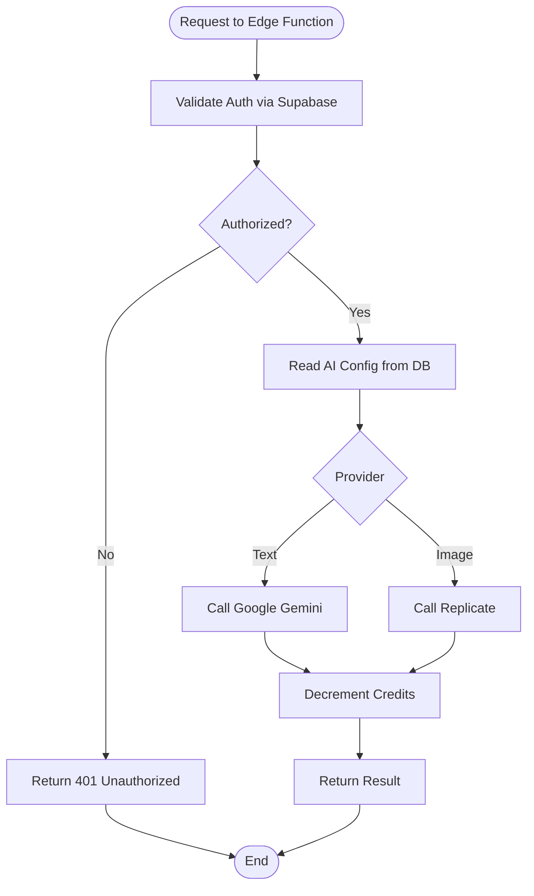
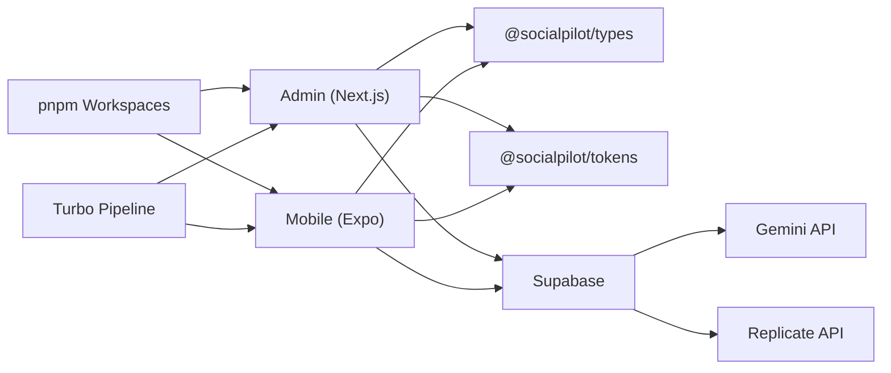

# Project Overview

<cite>
**Referenced Files in This Document**
- [README.md](file://README.md)
- [package.json](file://package.json)
- [turbo.json](file://turbo.json)
- [pnpm-workspace.yaml](file://pnpm-workspace.yaml)
- [PROJECT_STATE.md](file://PROJECT_STATE.md)
- [apps/admin/package.json](file://apps/admin/package.json)
- [apps/mobile/package.json](file://apps/mobile/package.json)
- [supabase/config.toml](file://supabase/config.toml)
- [supabase/functions/generate-content/index.ts](file://supabase/functions/generate-content/index.ts)
- [supabase/functions/generate-image/index.ts](file://supabase/functions/generate-image/index.ts)
- [supabase/migrations/20240001000000_initial_schema.sql](file://supabase/migrations/20240001000000_initial_schema.sql)
- [apps/admin/src/lib/supabase.ts](file://apps/admin/src/lib/supabase.ts)
- [apps/mobile/src/services/supabase.ts](file://apps/mobile/src/services/supabase.ts)
- [packages/types/package.json](file://packages/types/package.json)
</cite>

## Table of Contents
1. [Introduction](#introduction)
2. [Project Structure](#project-structure)
3. [Core Components](#core-components)
4. [Architecture Overview](#architecture-overview)
5. [Detailed Component Analysis](#detailed-component-analysis)
6. [Dependency Analysis](#dependency-analysis)
7. [Performance Considerations](#performance-considerations)
8. [Troubleshooting Guide](#troubleshooting-guide)
9. [Conclusion](#conclusion)

## Introduction
SocialPilot AI Pro is an AI-powered social media management suite designed to help social media managers, content creators, and administrators streamline their workflows. It provides AI-assisted content generation, multi-platform scheduling, analytics, and team collaboration features through a modern monorepo architecture. The system includes:
- A Next.js admin dashboard for configuration, moderation, and analytics
- An Expo mobile app for on-the-go creation, scheduling, and insights
- A Supabase backend with PostgreSQL, Row-Level Security, and serverless functions
- AI integrations for text and image generation via Google Gemini and Replicate

The project’s purpose is to centralize social media operations into a single, scalable platform that leverages AI to accelerate content creation while maintaining control over quality, compliance, and performance.

## Project Structure
The repository follows a monorepo layout managed by pnpm workspaces and Turbo for task orchestration. Key areas include:
- apps/admin: Next.js 14+ App Router-based admin interface
- apps/mobile: Expo-based mobile application (iOS, Android, Web)
- packages/types and packages/tokens: Shared TypeScript types and design tokens
- supabase: Database schema, migrations, serverless functions, and configuration
- scripts and root configs: Workspace and build orchestration

**Diagram sources**
- [package.json:5-8](file://package.json#L5-L8)
- [pnpm-workspace.yaml:1-4](file://pnpm-workspace.yaml#L1-L4)
- [turbo.json:6-24](file://turbo.json#L6-L24)

**Section sources**
- [README.md:1-4](file://README.md#L1-L4)
- [package.json:1-21](file://package.json#L1-L21)
- [turbo.json:1-26](file://turbo.json#L1-L26)
- [pnpm-workspace.yaml:1-4](file://pnpm-workspace.yaml#L1-L4)
- [PROJECT_STATE.md:3-9](file://PROJECT_STATE.md#L3-L9)

## Core Components
- Admin Dashboard (Next.js): Role-based access, templates CRUD, white-label settings, AI configuration, subscriptions, notifications, analytics, and user management.
- Mobile App (Expo): Authentication and onboarding, AI Studio generator, calendar scheduler, analytics, profile, and connected accounts.
- Backend (Supabase): PostgreSQL database with RLS policies, real-time publications, triggers, and serverless functions for AI tasks.
- AI Integrations: Text generation via Google Gemini; image generation via Replicate (SDXL/Flux). Credits are decremented per use.

Key technology stack highlights:
- Next.js 14+ App Router, React 18, Tailwind CSS, Recharts, Zustand, TanStack Query/Table, Zod
- Expo SDK 57, React Native 0.86, React 19, Reanimated 4.5, Gesture Handler, Secure Store
- Supabase JS client with session persistence and auto-refresh
- Serverless Deno functions for AI calls and credit accounting

**Section sources**
- [apps/admin/package.json:11-31](file://apps/admin/package.json#L11-L31)
- [apps/mobile/package.json:13-45](file://apps/mobile/package.json#L13-L45)
- [supabase/functions/generate-content/index.ts:1-99](file://supabase/functions/generate-content/index.ts#L1-L99)
- [supabase/functions/generate-image/index.ts:1-87](file://supabase/functions/generate-image/index.ts#L1-L87)
- [supabase/migrations/20240001000000_initial_schema.sql:1-232](file://supabase/migrations/20240001000000_initial_schema.sql#L1-L232)

## Architecture Overview
High-level flow:
- Clients (Admin and Mobile) authenticate via Supabase Auth and interact with the database using Supabase JS clients.
- AI features are exposed as Supabase Edge Functions that validate requests, call external AI providers, persist results, and update user credits.
- Data models enforce ownership and roles via Row-Level Security policies. Realtime channels enable live updates for posts, notifications, templates, and app config.

**Diagram sources**
- [apps/admin/src/lib/supabase.ts:1-14](file://apps/admin/src/lib/supabase.ts#L1-L14)
- [apps/mobile/src/services/supabase.ts:1-41](file://apps/mobile/src/services/supabase.ts#L1-L41)
- [supabase/functions/generate-content/index.ts:1-99](file://supabase/functions/generate-content/index.ts#L1-L99)
- [supabase/functions/generate-image/index.ts:1-87](file://supabase/functions/generate-image/index.ts#L1-L87)
- [supabase/migrations/20240001000000_initial_schema.sql:155-232](file://supabase/migrations/20240001000000_initial_schema.sql#L155-L232)

## Detailed Component Analysis

### Admin Dashboard (Next.js)
- Purpose: Centralized control plane for managing users, templates, AI settings, subscriptions, white-label branding, and analytics.
- Tech: Next.js App Router, Tailwind CSS, Recharts for charts, Zustand for state, TanStack Query/Table for data handling, Zod for validation.
- Integration: Connects to Supabase for auth, data, and realtime; uses shared types and tokens from packages.

**Diagram sources**
- [apps/admin/package.json:11-31](file://apps/admin/package.json#L11-L31)
- [apps/admin/src/lib/supabase.ts:1-14](file://apps/admin/src/lib/supabase.ts#L1-L14)
- [supabase/functions/generate-content/index.ts:1-99](file://supabase/functions/generate-content/index.ts#L1-L99)

**Section sources**
- [apps/admin/package.json:1-41](file://apps/admin/package.json#L1-L41)
- [apps/admin/src/lib/supabase.ts:1-14](file://apps/admin/src/lib/supabase.ts#L1-L14)

### Mobile App (Expo)
- Purpose: On-the-go creation and scheduling, AI-powered content generation, analytics, profile management, and connected accounts.
- Tech: Expo SDK 57, React Native 0.86, Reanimated, Gesture Handler, Secure Store for sessions, TanStack Query, Zustand, Zod.
- Integration: Uses Supabase JS client with secure storage adapter; shares types and tokens with admin.

**Diagram sources**
- [apps/mobile/package.json:13-45](file://apps/mobile/package.json#L13-L45)
- [apps/mobile/src/services/supabase.ts:1-41](file://apps/mobile/src/services/supabase.ts#L1-L41)
- [supabase/functions/generate-content/index.ts:1-99](file://supabase/functions/generate-content/index.ts#L1-L99)
- [supabase/functions/generate-image/index.ts:1-87](file://supabase/functions/generate-image/index.ts#L1-L87)

**Section sources**
- [apps/mobile/package.json:1-53](file://apps/mobile/package.json#L1-L53)
- [apps/mobile/src/services/supabase.ts:1-41](file://apps/mobile/src/services/supabase.ts#L1-L41)

### Supabase Backend and AI Functions
- Database: Defines core entities (profiles, posts, folders, templates, generated_images, analytics, notifications), enums, and RLS policies. Includes triggers for new user profiles and realtime publications.
- Functions: 
  - generate-content: Validates auth, reads AI config, calls Google Gemini, returns generated text, decrements credits.
  - generate-image: Validates auth, calls Replicate (SDXL/Flux), stores image metadata, decrements credits.

**Diagram sources**
- [supabase/functions/generate-content/index.ts:1-99](file://supabase/functions/generate-content/index.ts#L1-L99)
- [supabase/functions/generate-image/index.ts:1-87](file://supabase/functions/generate-image/index.ts#L1-L87)
- [supabase/migrations/20240001000000_initial_schema.sql:31-42](file://supabase/migrations/20240001000000_initial_schema.sql#L31-L42)

**Section sources**
- [supabase/migrations/20240001000000_initial_schema.sql:1-232](file://supabase/migrations/20240001000000_initial_schema.sql#L1-L232)
- [supabase/functions/generate-content/index.ts:1-99](file://supabase/functions/generate-content/index.ts#L1-L99)
- [supabase/functions/generate-image/index.ts:1-87](file://supabase/functions/generate-image/index.ts#L1-L87)

### Shared Packages
- @socialpilot/types: Centralized TypeScript definitions for auth, database models, and API payloads used across apps.
- @socialpilot/tokens: Shared design tokens and theme palettes ensuring consistent UI across platforms.

**Section sources**
- [packages/types/package.json:1-9](file://packages/types/package.json#L1-L9)

## Dependency Analysis
- Monorepo orchestration: pnpm workspaces define apps/* and packages/*; Turbo pipelines coordinate build, lint, and dev tasks with caching and persistent dev servers.
- Cross-app sharing: Both admin and mobile depend on shared types and tokens, reducing duplication and improving consistency.
- External integrations: Supabase JS clients in both apps; Edge Functions integrate with Google Gemini and Replicate.

**Diagram sources**
- [package.json:5-20](file://package.json#L5-L20)
- [turbo.json:6-24](file://turbo.json#L6-L24)
- [pnpm-workspace.yaml:1-4](file://pnpm-workspace.yaml#L1-L4)
- [apps/admin/package.json:11-31](file://apps/admin/package.json#L11-L31)
- [apps/mobile/package.json:13-45](file://apps/mobile/package.json#L13-L45)

**Section sources**
- [package.json:1-21](file://package.json#L1-L21)
- [turbo.json:1-26](file://turbo.json#L1-L26)
- [pnpm-workspace.yaml:1-4](file://pnpm-workspace.yaml#L1-L4)

## Performance Considerations
- Caching and queries: Use TanStack Query for efficient data fetching and caching in both apps; leverage Supabase realtime for live updates without polling.
- AI function efficiency: Cache AI configurations and reuse prompts/templates where possible; batch operations when feasible.
- Media handling: Optimize image sizes and consider CDN delivery for generated images stored in Supabase Storage.
- Build optimization: Turbo caches outputs (.next/**, dist/**); ensure minimal rebuilds by isolating dependencies and leveraging workspace scoping.

[No sources needed since this section provides general guidance]

## Troubleshooting Guide
Common issues and checks:
- Placeholder credentials: Ensure Supabase URLs and keys are not placeholders in environment variables for both admin and mobile.
- Edge function errors: Verify environment secrets (e.g., GEMINI_API_KEY, REPLICATE_API_TOKEN) are set in Supabase; check CORS headers and authorization headers.
- RLS policy violations: Confirm user roles and ownership; review policies for posts, templates, and analytics.
- Session persistence: On mobile, confirm SecureStore integration is working; on web, verify localStorage behavior.

**Section sources**
- [apps/admin/src/lib/supabase.ts:3-13](file://apps/admin/src/lib/supabase.ts#L3-L13)
- [apps/mobile/src/services/supabase.ts:5-40](file://apps/mobile/src/services/supabase.ts#L5-L40)
- [supabase/functions/generate-content/index.ts:14-36](file://supabase/functions/generate-content/index.ts#L14-L36)
- [supabase/functions/generate-image/index.ts:14-36](file://supabase/functions/generate-image/index.ts#L14-L36)
- [supabase/migrations/20240001000000_initial_schema.sql:155-202](file://supabase/migrations/20240001000000_initial_schema.sql#L155-L202)

## Conclusion
SocialPilot AI Pro delivers a cohesive, AI-enhanced social media management platform through a well-structured monorepo. The Next.js admin dashboard and Expo mobile app provide complementary experiences for power users and on-the-go creators, backed by a robust Supabase backend with secure, role-based data access and serverless AI capabilities. This architecture supports scalability, maintainability, and rapid iteration, making it suitable for teams managing multi-platform social media strategies at scale.

[No sources needed since this section summarizes without analyzing specific files]