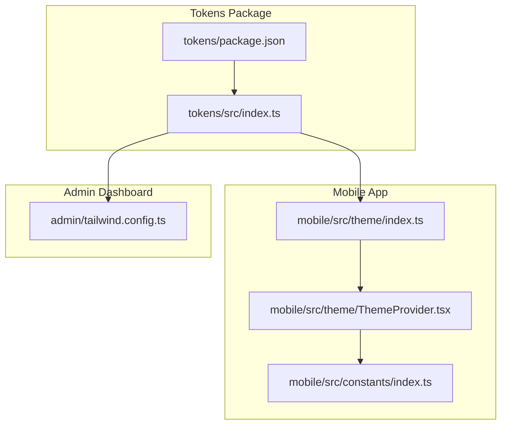
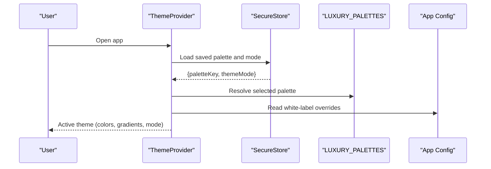
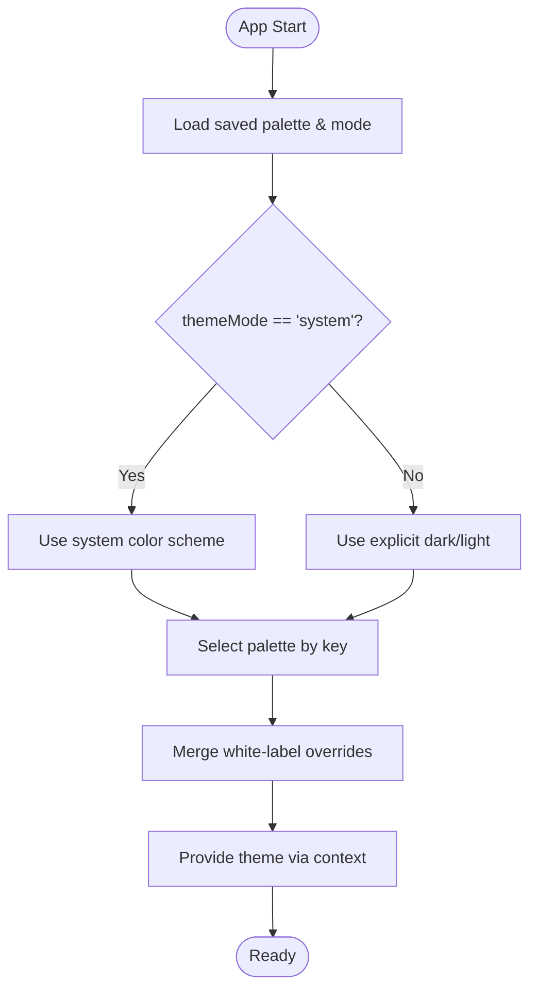
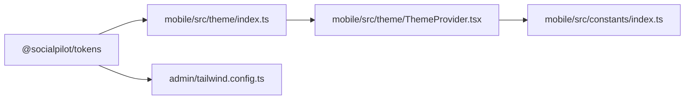

# Design Tokens Package

<cite>
**Referenced Files in This Document**
- [index.ts](file://packages/tokens/src/index.ts)
- [package.json](file://packages/tokens/package.json)
- [index.ts](file://apps/mobile/src/theme/index.ts)
- [ThemeProvider.tsx](file://apps/mobile/src/theme/ThemeProvider.tsx)
- [index.ts](file://apps/mobile/src/constants/index.ts)
- [tailwind.config.ts](file://apps/admin/tailwind.config.ts)
</cite>

## Table of Contents
1. Introduction
2. Project Structure
3. Core Components
4. Architecture Overview
5. Detailed Component Analysis
6. Dependency Analysis
7. Performance Considerations
8. Troubleshooting Guide
9. Conclusion
10. Appendices

## Introduction
This document describes the design tokens package that centralizes visual styling across applications. It defines a color palette system with semantic colors and theme variants, and explains how these tokens are consumed by both the admin dashboard (web) and the mobile app (React Native). The focus is on token structure, export strategy, consumption patterns, naming conventions, and guidance for extending and maintaining the design system consistently.

## Project Structure
The design tokens live in a dedicated package and are consumed by:
- Mobile app: via React context and theme provider to supply dynamic themes at runtime.
- Admin dashboard: via Tailwind configuration for web-specific color extensions.



**Diagram sources**
- [index.ts:1-284](file://packages/tokens/src/index.ts#L1-L284)
- [package.json:1-9](file://packages/tokens/package.json#L1-L9)
- [index.ts:1-12](file://apps/mobile/src/theme/index.ts#L1-L12)
- [ThemeProvider.tsx:1-97](file://apps/mobile/src/theme/ThemeProvider.tsx#L1-L97)
- [index.ts:1-23](file://apps/mobile/src/constants/index.ts#L1-L23)
- [tailwind.config.ts:1-35](file://apps/admin/tailwind.config.ts#L1-L35)

**Section sources**
- [index.ts:1-284](file://packages/tokens/src/index.ts#L1-L284)
- [package.json:1-9](file://packages/tokens/package.json#L1-L9)
- [index.ts:1-12](file://apps/mobile/src/theme/index.ts#L1-L12)
- [ThemeProvider.tsx:1-97](file://apps/mobile/src/theme/ThemeProvider.tsx#L1-L97)
- [index.ts:1-23](file://apps/mobile/src/constants/index.ts#L1-L23)
- [tailwind.config.ts:1-35](file://apps/admin/tailwind.config.ts#L1-L35)

## Core Components
- Token types and palette registry:
  - Palette keys define available themes.
  - Theme mode supports dark, light, and system-aware modes.
  - ThemeColors interface standardizes semantic tokens such as background, surface, text, borders, gradients, badges, and glass effects.
  - LUXURY_PALETTES maps each palette key to light and dark ThemeColors.

- Mobile theme integration:
  - Re-exports token types and palettes for type safety.
  - ThemeProvider manages active palette and mode, persists selections, computes isDark based on system preference or user choice, and merges white-label overrides from app config.

- Admin dashboard integration:
  - Tailwind configuration extends brand and obsidian color scales for web components.

Key responsibilities:
- Centralize color semantics and theme variants.
- Provide consistent tokens to UI components.
- Allow runtime theme switching and persistence.
- Support white-label customization through configuration overrides.

**Section sources**
- [index.ts:1-284](file://packages/tokens/src/index.ts#L1-L284)
- [index.ts:1-12](file://apps/mobile/src/theme/index.ts#L1-L12)
- [ThemeProvider.tsx:1-97](file://apps/mobile/src/theme/ThemeProvider.tsx#L1-L97)
- [tailwind.config.ts:1-35](file://apps/admin/tailwind.config.ts#L1-L35)

## Architecture Overview
The tokens package is the single source of truth for color semantics and theme variants. The mobile app composes a dynamic theme using the tokens and persists user preferences. The admin dashboard uses Tailwind to extend its theme with brand tokens.



**Diagram sources**
- [ThemeProvider.tsx:1-97](file://apps/mobile/src/theme/ThemeProvider.tsx#L1-L97)
- [index.ts:1-284](file://packages/tokens/src/index.ts#L1-L284)
- [index.ts:1-23](file://apps/mobile/src/constants/index.ts#L1-L23)

## Detailed Component Analysis

### Tokens Package: Types and Palettes
- PaletteKey enum-like union restricts theme selection to predefined values.
- ThemeMode supports explicit dark/light or automatic system detection.
- ThemeColors defines semantic tokens for surfaces, text, borders, gradients, badges, and glass effects.
- LUXURY_PALETTES provides paired light/dark ThemeColors per palette key.

```mermaid
classDiagram
class ThemeColors {
+string background
+string surface
+string surfaceSubtle
+string inputBg
+string border
+string borderActive
+string textPrimary
+string textSecondary
+string textMuted
+string primary
+readonly primaryGradient
+readonly secondaryGradient
+readonly accentGradient
+readonly laserGlow
+string glowColor
+string btnTextColor
+string badgeBg
+string badgeBorder
+string badgeText
+string cardGlass
+string cardGlassBorder
}
class LUXURY_PALETTES {
+Record~PaletteKey, { name : string; dark : ThemeColors; light : ThemeColors }~
}
LUXURY_PALETTES --> ThemeColors : "provides light/dark"
```

**Diagram sources**
- [index.ts:1-284](file://packages/tokens/src/index.ts#L1-L284)

**Section sources**
- [index.ts:1-284](file://packages/tokens/src/index.ts#L1-L284)

### Mobile Theme Provider
- Loads persisted palette and mode from secure storage.
- Computes isDark based on themeMode and system color scheme.
- Selects base colors from the chosen palette and applies white-label overrides when present.
- Exposes setters to change palette and mode, persisting changes.



**Diagram sources**
- [ThemeProvider.tsx:1-97](file://apps/mobile/src/theme/ThemeProvider.tsx#L1-L97)
- [index.ts:1-284](file://packages/tokens/src/index.ts#L1-L284)
- [index.ts:1-23](file://apps/mobile/src/constants/index.ts#L1-L23)

**Section sources**
- [ThemeProvider.tsx:1-97](file://apps/mobile/src/theme/ThemeProvider.tsx#L1-L97)
- [index.ts:1-23](file://apps/mobile/src/constants/index.ts#L1-L23)

### Admin Dashboard Integration
- Extends Tailwind theme with brand and obsidian color scales for consistent web styling.
- Uses semantic color names aligned with the broader design language.

**Section sources**
- [tailwind.config.ts:1-35](file://apps/admin/tailwind.config.ts#L1-L35)

## Dependency Analysis
- Mobile theme depends on tokens package for types and palettes.
- ThemeProvider depends on secure storage keys defined in constants.
- Admin dashboard depends on Tailwind configuration for web color extensions.



**Diagram sources**
- [index.ts:1-284](file://packages/tokens/src/index.ts#L1-L284)
- [index.ts:1-12](file://apps/mobile/src/theme/index.ts#L1-L12)
- [ThemeProvider.tsx:1-97](file://apps/mobile/src/theme/ThemeProvider.tsx#L1-L97)
- [index.ts:1-23](file://apps/mobile/src/constants/index.ts#L1-L23)
- [tailwind.config.ts:1-35](file://apps/admin/tailwind.config.ts#L1-L35)

**Section sources**
- [index.ts:1-284](file://packages/tokens/src/index.ts#L1-L284)
- [index.ts:1-12](file://apps/mobile/src/theme/index.ts#L1-L12)
- [ThemeProvider.tsx:1-97](file://apps/mobile/src/theme/ThemeProvider.tsx#L1-L97)
- [index.ts:1-23](file://apps/mobile/src/constants/index.ts#L1-L23)
- [tailwind.config.ts:1-35](file://apps/admin/tailwind.config.ts#L1-L35)

## Performance Considerations
- Theme computation is memoized to avoid unnecessary recalculations when palette or mode changes.
- Persisted settings are loaded once at startup to minimize re-renders.
- Gradients and glass effects rely on token arrays; keep palette sizes reasonable to prevent heavy style computations.

[No sources needed since this section provides general guidance]

## Troubleshooting Guide
- Invalid palette key: If a saved palette key is not recognized, the provider falls back to a default palette. Ensure only valid keys are stored.
- Missing theme mode: If no mode is persisted, defaults apply; verify storage keys and permissions.
- White-label overrides: If overrides are missing or malformed, base palette colors are used; validate configuration shape before applying.

**Section sources**
- [ThemeProvider.tsx:25-50](file://apps/mobile/src/theme/ThemeProvider.tsx#L25-L50)
- [index.ts:15-20](file://apps/mobile/src/constants/index.ts#L15-L20)

## Conclusion
The design tokens package centralizes color semantics and theme variants, enabling consistent styling across platforms. The mobile app composes a dynamic theme with persistence and white-label support, while the admin dashboard integrates tokens via Tailwind. Following the guidelines below ensures scalable, maintainable, and consistent design updates.

[No sources needed since this section summarizes without analyzing specific files]

## Appendices

### Token Naming Conventions
- Palette keys: lowercase, descriptive names (e.g., sunset, emerald, violet, azure, stealth).
- Theme mode: dark, light, system.
- Semantic tokens: use purpose-driven names (background, surface, textPrimary, border, primary, gradients, badges, glass).

**Section sources**
- [index.ts:1-284](file://packages/tokens/src/index.ts#L1-L284)

### Adding New Tokens
- Extend ThemeColors if new semantic tokens are required.
- Add a new palette entry to LUXURY_PALETTES with both light and dark ThemeColors.
- Update mobile theme re-exports if exposing new types.
- For web, add corresponding Tailwind color extensions if needed.

**Section sources**
- [index.ts:1-284](file://packages/tokens/src/index.ts#L1-L284)
- [index.ts:1-12](file://apps/mobile/src/theme/index.ts#L1-L12)
- [tailwind.config.ts:1-35](file://apps/admin/tailwind.config.ts#L1-L35)

### Creating Theme Variations
- Define a new PaletteKey and corresponding entries in LUXURY_PALETTES.
- Ensure both light and dark variants provide complete ThemeColors.
- Validate contrast and accessibility across all tokens.

**Section sources**
- [index.ts:1-284](file://packages/tokens/src/index.ts#L1-L284)

### Export Strategy and Consumption
- Tokens package exports types and palettes for TypeScript consumers.
- Mobile app consumes tokens via theme index and provider to supply runtime themes.
- Admin dashboard consumes tokens via Tailwind configuration for static web styles.

**Section sources**
- [package.json:1-9](file://packages/tokens/package.json#L1-L9)
- [index.ts:1-12](file://apps/mobile/src/theme/index.ts#L1-L12)
- [tailwind.config.ts:1-35](file://apps/admin/tailwind.config.ts#L1-L35)

### Versioning and Migration Strategies
- Treat the tokens package as a versioned dependency; update versions when introducing breaking changes to ThemeColors or PaletteKey.
- When migrating:
  - Introduce new tokens alongside existing ones to avoid immediate breakage.
  - Deprecate old tokens gradually with clear migration notes.
  - Update consumers incrementally, starting with non-critical screens.
  - Validate mobile theme provider fallback behavior during transitions.

[No sources needed since this section provides general guidance]