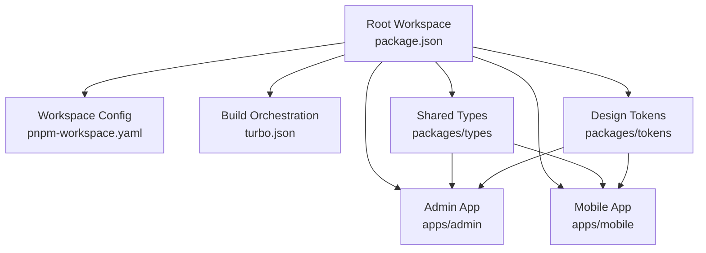
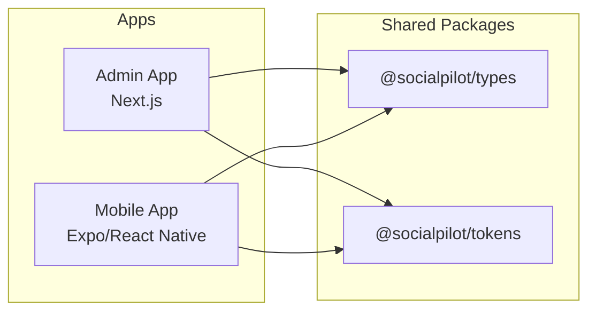
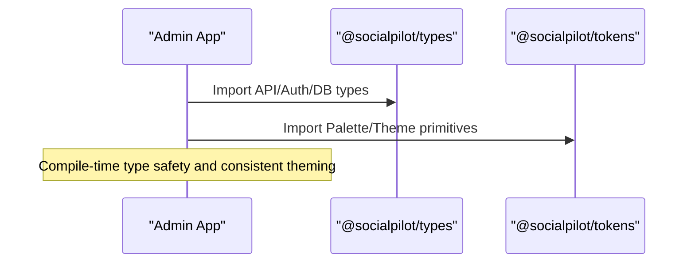
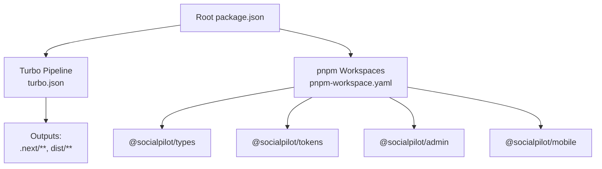

# Shared Packages

<cite>
**Referenced Files in This Document**
- [package.json](file://package.json)
- [pnpm-workspace.yaml](file://pnpm-workspace.yaml)
- [turbo.json](file://turbo.json)
- [tsconfig.base.json](file://tsconfig.base.json)
- [packages/types/package.json](file://packages/types/package.json)
- [packages/tokens/package.json](file://packages/tokens/package.json)
- [packages/types/src/index.ts](file://packages/types/src/index.ts)
- [packages/types/src/api.ts](file://packages/types/src/api.ts)
- [packages/types/src/auth.ts](file://packages/types/src/auth.ts)
- [packages/types/src/database.ts](file://packages/types/src/database.ts)
- [packages/tokens/src/index.ts](file://packages/tokens/src/index.ts)
- [apps/admin/package.json](file://apps/admin/package.json)
- [apps/mobile/package.json](file://apps/mobile/package.json)
</cite>

## Table of Contents
1. Introduction
2. Project Structure
3. Core Components
4. Architecture Overview
5. Detailed Component Analysis
6. Dependency Analysis
7. Performance Considerations
8. Troubleshooting Guide
9. Conclusion
10. Appendices

## Introduction
This document describes the shared packages in the monorepo: a TypeScript type definitions package and a design tokens package. It explains their structure, versioning, consumption by the admin and mobile applications, guidelines for extending types and tokens, build processes, dependency management, and contribution practices to maintain consistency across the codebase.

## Project Structure
The repository is a pnpm workspace with two apps (admin and mobile) and two shared packages under packages/. The root configuration defines workspaces and orchestrates builds via Turbo.

**Diagram sources**
- [package.json:1-21](file://package.json#L1-L21)
- [pnpm-workspace.yaml:1-4](file://pnpm-workspace.yaml#L1-L4)
- [turbo.json:1-26](file://turbo.json#L1-L26)

Key points:
- Workspaces include apps/* and packages/*.
- Root scripts delegate to Turbo for build, dev, lint, and clean tasks.
- Both apps depend on @socialpilot/types and @socialpilot/tokens via workspace protocol.

**Section sources**
- [package.json:1-21](file://package.json#L1-L21)
- [pnpm-workspace.yaml:1-4](file://pnpm-workspace.yaml#L1-L4)
- [turbo.json:1-26](file://turbo.json#L1-L26)

## Core Components
- Type Definitions Package (@socialpilot/types): Centralized TypeScript interfaces and types for API contracts, database models, authentication state, and configuration schemas.
- Design Tokens Package (@socialpilot/tokens): Centralized color palettes and theme primitives used across admin and mobile apps to ensure consistent visual language.

Both packages are published as TypeScript source modules with main and types pointing to src/index.ts, enabling direct TS usage without additional bundling steps.

**Section sources**
- [packages/types/package.json:1-9](file://packages/types/package.json#L1-L9)
- [packages/tokens/package.json:1-9](file://packages/tokens/package.json#L1-L9)

## Architecture Overview
The shared packages act as single sources of truth for types and theming. Apps import these packages directly; no runtime transformation is required beyond standard TS compilation.

**Diagram sources**
- [apps/admin/package.json:11-15](file://apps/admin/package.json#L11-L15)
- [apps/mobile/package.json:13-16](file://apps/mobile/package.json#L13-L16)
- [packages/types/package.json:1-9](file://packages/types/package.json#L1-L9)
- [packages/tokens/package.json:1-9](file://packages/tokens/package.json#L1-L9)

## Detailed Component Analysis

### Type Definitions Package (@socialpilot/types)
Purpose:
- Provide a unified contract for API requests/responses, database entities, authentication state, and configuration objects consumed by both apps.

Structure:
- Barrel export at index re-exports auth, database, and api modules.
- api.ts defines request/response shapes for AI generation endpoints and a generic ApiResponse wrapper.
- auth.ts defines user roles, subscription tiers, user profile shape, and session state.
- database.ts defines platform enums, post lifecycle statuses, content types, and core data models like Post, PostTemplate, AppConfig, AIConfig, and AnalyticsMetric.

Consumption:
- Admin app imports types for form validation, API calls, and UI state.
- Mobile app uses the same types for network layer and local stores.

Guidelines for extension:
- Add new API contracts in api.ts; keep request/response pairs together.
- Extend database models in database.ts when schema evolves; update related types consistently.
- Introduce new auth-related enums or states in auth.ts; avoid ad-hoc string literals.
- Keep barrel exports explicit to control public surface.

Versioning and compatibility:
- Maintain semantic versioning for breaking changes to shared types.
- Prefer additive changes (new fields) over destructive ones to minimize app churn.

Build and distribution:
- Uses TypeScript source entry; apps compile against .ts files directly.
- No separate dist folder; rely on workspace resolution.

**Section sources**
- [packages/types/src/index.ts:1-4](file://packages/types/src/index.ts#L1-L4)
- [packages/types/src/api.ts:1-34](file://packages/types/src/api.ts#L1-L34)
- [packages/types/src/auth.ts:1-25](file://packages/types/src/auth.ts#L1-L25)
- [packages/types/src/database.ts:1-73](file://packages/types/src/database.ts#L1-L73)
- [packages/types/package.json:1-9](file://packages/types/package.json#L1-L9)

### Design Tokens Package (@socialpilot/tokens)
Purpose:
- Provide consistent color palettes and theme primitives for dark/light modes across apps.

Structure:
- Exposes palette keys, theme mode type, and ThemeColors interface describing background, surfaces, borders, text, gradients, glows, badges, and glass effects.
- Provides LUXURY_PALETTES mapping each palette key to name, dark, and light ThemeColors.

Consumption:
- Admin app consumes tokens for Tailwind integration and component styling.
- Mobile app consumes tokens for React Native themes and components.

Guidelines for extension:
- Add new palette entries to LUXURY_PALETTES with both dark and light variants.
- Ensure all ThemeColors fields are present for each palette to maintain consistency.
- Avoid hardcoding colors in components; always reference tokens.

Versioning and compatibility:
- Treat token changes as potentially breaking if they alter existing keys or semantics.
- Use additive changes (new palettes or fields) where possible.

Build and distribution:
- Source-based package; apps consume TS directly.

**Section sources**
- [packages/tokens/src/index.ts:1-284](file://packages/tokens/src/index.ts#L1-L284)
- [packages/tokens/package.json:1-9](file://packages/tokens/package.json#L1-L9)

### Consumption by Applications
- Admin app declares dependencies on @socialpilot/types and @socialpilot/tokens using workspace protocol.
- Mobile app also depends on both shared packages via workspace protocol.
- This ensures both apps stay synchronized with shared contracts and tokens.

**Diagram sources**
- [apps/admin/package.json:11-15](file://apps/admin/package.json#L11-L15)
- [packages/types/package.json:1-9](file://packages/types/package.json#L1-L9)
- [packages/tokens/package.json:1-9](file://packages/tokens/package.json#L1-L9)

**Section sources**
- [apps/admin/package.json:11-15](file://apps/admin/package.json#L11-L15)
- [apps/mobile/package.json:13-16](file://apps/mobile/package.json#L13-L16)

## Dependency Analysis
Workspace and build orchestration:
- pnpm workspace includes apps/* and packages/*.
- Root package.json defines scripts that run via Turbo.
- Turbo pipeline configures build outputs and caching behavior.

TypeScript configuration:
- Base tsconfig sets strict mode, modern targets, and module resolution suitable for shared packages and apps.

**Diagram sources**
- [package.json:1-21](file://package.json#L1-L21)
- [pnpm-workspace.yaml:1-4](file://pnpm-workspace.yaml#L1-L4)
- [turbo.json:1-26](file://turbo.json#L1-L26)

**Section sources**
- [package.json:1-21](file://package.json#L1-L21)
- [pnpm-workspace.yaml:1-4](file://pnpm-workspace.yaml#L1-L4)
- [turbo.json:1-26](file://turbo.json#L1-L26)
- [tsconfig.base.json:1-30](file://tsconfig.base.json#L1-L30)

## Performance Considerations
- Shared types are lightweight and compiled at consumer apps; no runtime overhead.
- Design tokens are static objects; minimal memory footprint.
- Prefer importing only what you need from barrels to reduce bundle size in apps.
- Avoid deep nesting of conditional logic around tokens; centralize theme selection in app-level providers.

[No sources needed since this section provides general guidance]

## Troubleshooting Guide
Common issues and resolutions:
- Type mismatches after schema updates:
  - Update corresponding types in @socialpilot/types and propagate changes to apps.
  - Run type checks in apps to catch incompatibilities early.
- Token inconsistencies:
  - Ensure all palette entries include both dark and light ThemeColors.
  - Validate that apps reference tokens rather than hardcoded values.
- Build errors due to workspace resolution:
  - Verify pnpm workspace configuration and that apps declare dependencies on shared packages.
  - Reinstall dependencies and clear caches if necessary.

Operational tips:
- Use root scripts (build, lint, dev) to ensure consistent execution across packages.
- Leverage Turbo’s caching to speed up iterative development.

**Section sources**
- [turbo.json:1-26](file://turbo.json#L1-L26)
- [package.json:1-21](file://package.json#L1-L21)

## Conclusion
The shared packages provide a robust foundation for type safety and visual consistency across the monorepo. By centralizing API and database contracts in @socialpilot/types and theming primitives in @socialpilot/tokens, both admin and mobile applications can evolve independently while maintaining alignment. Follow the extension guidelines and build practices outlined here to preserve consistency and performance.

[No sources needed since this section summarizes without analyzing specific files]

## Appendices

### Build and Versioning Guidelines
- Versioning:
  - Use semantic versioning for shared packages; coordinate major/minor releases with apps.
  - Prefer non-breaking additions to types and tokens to reduce app churn.
- Build process:
  - Use root scripts to run Turbo tasks; apps inherit workspace resolution.
  - Outputs are configured for Next.js (.next) and generic dist folders.
- Dependency management:
  - Pin versions in apps to workspace protocol to ensure local development parity.
  - Keep shared packages free of heavy runtime dependencies.

**Section sources**
- [turbo.json:1-26](file://turbo.json#L1-L26)
- [package.json:1-21](file://package.json#L1-L21)
- [apps/admin/package.json:11-15](file://apps/admin/package.json#L11-L15)
- [apps/mobile/package.json:13-16](file://apps/mobile/package.json#L13-L16)

### Contribution Guidelines for Shared Packages
- Adding new types:
  - Place new interfaces in the appropriate module (api, auth, database).
  - Export via the barrel to make them discoverable.
- Adding new design tokens:
  - Extend LUXURY_PALETTES with a new key and full dark/light ThemeColors.
  - Update any app-specific theme integrations to support the new palette.
- Testing and validation:
  - Ensure type checks pass in apps consuming the updated shared packages.
  - Validate token contrast and accessibility in both dark and light modes.

**Section sources**
- [packages/types/src/index.ts:1-4](file://packages/types/src/index.ts#L1-L4)
- [packages/tokens/src/index.ts:1-284](file://packages/tokens/src/index.ts#L1-L284)