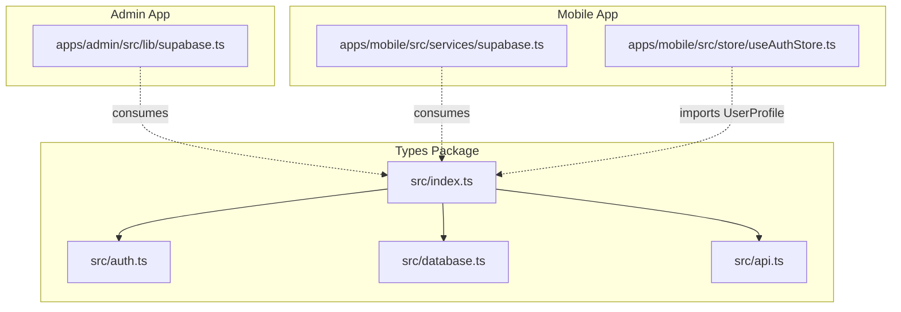
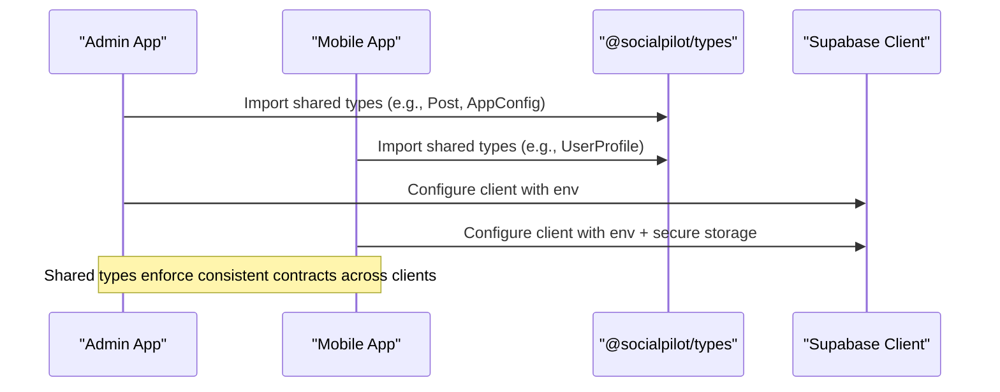
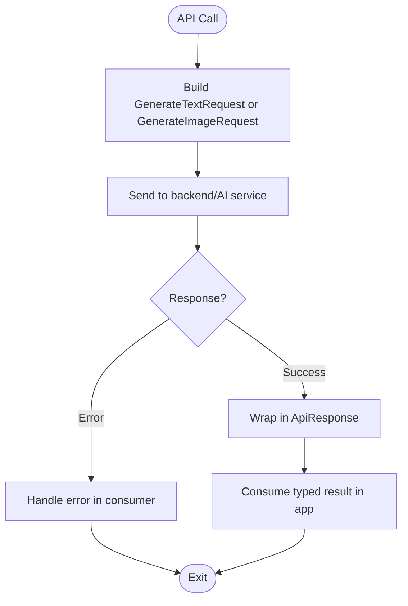
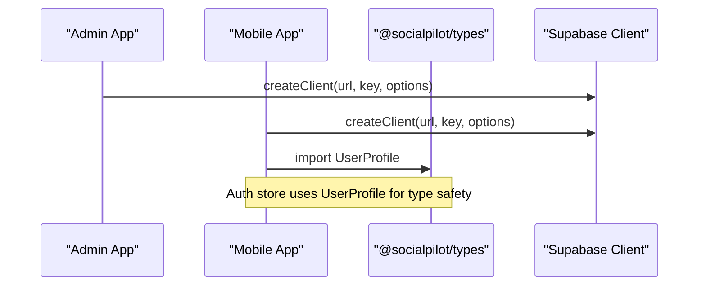
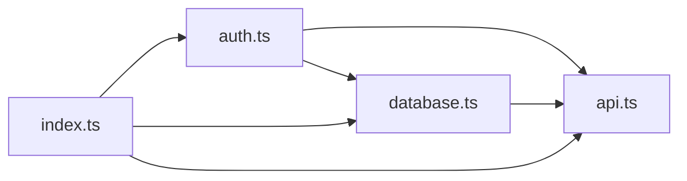

# Type Definitions Package

<cite>
**Referenced Files in This Document**
- [packages/types/src/index.ts](file://packages/types/src/index.ts)
- [packages/types/src/auth.ts](file://packages/types/src/auth.ts)
- [packages/types/src/database.ts](file://packages/types/src/database.ts)
- [packages/types/src/api.ts](file://packages/types/src/api.ts)
- [packages/types/package.json](file://packages/types/package.json)
- [packages/types/tsconfig.json](file://packages/types/tsconfig.json)
- [apps/admin/src/lib/supabase.ts](file://apps/admin/src/lib/supabase.ts)
- [apps/mobile/src/services/supabase.ts](file://apps/mobile/src/services/supabase.ts)
- [apps/mobile/src/store/useAuthStore.ts](file://apps/mobile/src/store/useAuthStore.ts)
- [supabase/migrations/20240001000000_initial_schema.sql](file://supabase/migrations/20240001000000_initial_schema.sql)
</cite>

## Table of Contents
1. Introduction
2. Project Structure
3. Core Components
4. Architecture Overview
5. Detailed Component Analysis
6. Dependency Analysis
7. Performance Considerations
8. Troubleshooting Guide
9. Conclusion
10. Appendices

## Introduction
This document describes the TypeScript type definitions package that centralizes shared types across the admin and mobile applications. It covers request/response schemas, authentication models, database entities, configuration schemas, and how these types are consumed by both apps. It also explains extension patterns, versioning strategies, backward compatibility considerations, and contribution guidelines for extending the type system safely.

## Project Structure
The type definitions live in a dedicated package and are re-exported from a single entry point. The package is consumed by both the Next.js admin app and the React Native mobile app to ensure consistent contracts for data, API payloads, and configuration.



**Diagram sources**
- [packages/types/src/index.ts:1-3](file://packages/types/src/index.ts#L1-L3)
- [packages/types/src/auth.ts:1-24](file://packages/types/src/auth.ts#L1-L24)
- [packages/types/src/database.ts:1-73](file://packages/types/src/database.ts#L1-L73)
- [packages/types/src/api.ts:1-33](file://packages/types/src/api.ts#L1-L33)
- [apps/admin/src/lib/supabase.ts:1-14](file://apps/admin/src/lib/supabase.ts#L1-L14)
- [apps/mobile/src/services/supabase.ts:1-41](file://apps/mobile/src/services/supabase.ts#L1-L41)
- [apps/mobile/src/store/useAuthStore.ts:1-49](file://apps/mobile/src/store/useAuthStore.ts#L1-L49)

**Section sources**
- [packages/types/src/index.ts:1-3](file://packages/types/src/index.ts#L1-L3)
- [packages/types/package.json:1-9](file://packages/types/package.json#L1-L9)
- [packages/types/tsconfig.json:1-11](file://packages/types/tsconfig.json#L1-L11)

## Core Components
The package organizes types by domain:

- Authentication and user session
  - User roles, subscription tiers, user profile, and auth session state
- Database models and enums
  - Platform types, post status, AI content types, posts, templates, app config, AI config, analytics metrics
- API request/response schemas
  - Text generation request/response, image generation request/response, generic API response wrapper

These domains are exported via a single barrel file so consumers can import exactly what they need.

**Section sources**
- [packages/types/src/auth.ts:1-24](file://packages/types/src/auth.ts#L1-L24)
- [packages/types/src/database.ts:1-73](file://packages/types/src/database.ts#L1-L73)
- [packages/types/src/api.ts:1-33](file://packages/types/src/api.ts#L1-L33)
- [packages/types/src/index.ts:1-3](file://packages/types/src/index.ts#L1-L3)

## Architecture Overview
The type package defines a single source of truth for contracts used by both apps. The admin app uses Supabase client configuration, while the mobile app adapts storage for secure sessions. Both rely on the same types for data consistency.



**Diagram sources**
- [packages/types/src/index.ts:1-3](file://packages/types/src/index.ts#L1-L3)
- [apps/admin/src/lib/supabase.ts:1-14](file://apps/admin/src/lib/supabase.ts#L1-L14)
- [apps/mobile/src/services/supabase.ts:1-41](file://apps/mobile/src/services/supabase.ts#L1-L41)

## Detailed Component Analysis

### Authentication Types
- Roles and tiers define access and billing boundaries.
- UserProfile mirrors the profiles table schema and includes account state fields.
- AuthSessionState represents local auth store shape used by UI logic.

```mermaid
classDiagram
class UserRole {
<<enum>>
"user | admin | super_admin"
}
class SubscriptionTier {
<<enum>>
"free | starter | pro | agency"
}
class UserProfile {
+string id
+string email
+string full_name
+string avatar_url
+UserRole role
+SubscriptionTier subscription_tier
+number credits_remaining
+number credits_limit
+boolean is_suspended
+boolean onboarding_completed
+string created_at
+string updated_at
}
class AuthSessionState {
+UserProfile user
+boolean isLoading
+boolean isAuthenticated
}
UserProfile --> UserRole : "uses"
UserProfile --> SubscriptionTier : "uses"
```

**Diagram sources**
- [packages/types/src/auth.ts:1-24](file://packages/types/src/auth.ts#L1-L24)

**Section sources**
- [packages/types/src/auth.ts:1-24](file://packages/types/src/auth.ts#L1-L24)
- [supabase/migrations/20240001000000_initial_schema.sql:44-58](file://supabase/migrations/20240001000000_initial_schema.sql#L44-L58)

### Database Models and Enums
- Enumerations align with PostgreSQL ENUMs for platform, post status, and AI content types.
- Entities include Post, PostTemplate, AppConfig, AIConfig, AnalyticsMetric.
- These mirror the database schema and RLS policies.

```mermaid
classDiagram
class PlatformType {
<<enum>>
"instagram | twitter | linkedin | facebook | tiktok | threads"
}
class PostStatus {
<<enum>>
"draft | scheduled | publishing | published | failed"
}
class AIContentType {
<<enum>>
"caption | hashtags | post_ideas | thread | image"
}
class Post {
+string id
+string user_id
+string folder_id
+string title
+string content
+string[] hashtags
+string[] media_urls
+PlatformType[] platforms
+PostStatus status
+string scheduled_at
+string published_at
+string error_message
+string created_at
+string updated_at
}
class PostTemplate {
+string id
+string title
+string category
+string prompt_template
+string[] default_hashtags
+PlatformType suggested_platform
+boolean is_premium
+boolean is_active
+string created_at
}
class AppConfig {
+string id
+string app_name
+string logo_url
+string primary_color
+string secondary_color
+string accent_color
+string support_email
+string terms_url
+string privacy_url
+boolean enable_revenuecat
+boolean enable_social_login
+boolean maintenance_mode
+string updated_at
}
class AIConfig {
+string id
+string text_provider
+string text_model
+string image_provider
+string image_model
+number max_tokens
+number temperature
+string system_prompt
+string updated_at
}
class AnalyticsMetric {
+string id
+string user_id
+number total_posts_created
+number total_posts_scheduled
+number total_ai_generations
+number credits_used
+string date
}
Post --> PlatformType : "uses"
Post --> PostStatus : "uses"
PostTemplate --> PlatformType : "uses"
```

**Diagram sources**
- [packages/types/src/database.ts:1-73](file://packages/types/src/database.ts#L1-L73)

**Section sources**
- [packages/types/src/database.ts:1-73](file://packages/types/src/database.ts#L1-L73)
- [supabase/migrations/20240001000000_initial_schema.sql:8-12](file://supabase/migrations/20240001000000_initial_schema.sql#L8-L12)
- [supabase/migrations/20240001000000_initial_schema.sql:14-132](file://supabase/migrations/20240001000000_initial_schema.sql#L14-L132)

### API Request/Response Schemas
- Text generation request/response with typed tone, audience, language, and token usage.
- Image generation request/response with aspect ratio and style constraints.
- Generic ApiResponse<T> wraps responses with data, error, and status.



**Diagram sources**
- [packages/types/src/api.ts:1-33](file://packages/types/src/api.ts#L1-L33)

**Section sources**
- [packages/types/src/api.ts:1-33](file://packages/types/src/api.ts#L1-L33)

### Consumption Across Apps
- Admin app initializes Supabase client using environment variables; it relies on shared types for data modeling.
- Mobile app initializes Supabase client with secure storage adapter and uses UserProfile from the types package in its auth store.



**Diagram sources**
- [apps/admin/src/lib/supabase.ts:1-14](file://apps/admin/src/lib/supabase.ts#L1-L14)
- [apps/mobile/src/services/supabase.ts:1-41](file://apps/mobile/src/services/supabase.ts#L1-L41)
- [apps/mobile/src/store/useAuthStore.ts:1-49](file://apps/mobile/src/store/useAuthStore.ts#L1-L49)

**Section sources**
- [apps/admin/src/lib/supabase.ts:1-14](file://apps/admin/src/lib/supabase.ts#L1-L14)
- [apps/mobile/src/services/supabase.ts:1-41](file://apps/mobile/src/services/supabase.ts#L1-L41)
- [apps/mobile/src/store/useAuthStore.ts:1-49](file://apps/mobile/src/store/useAuthStore.ts#L1-L49)

## Dependency Analysis
- Barrel export centralizes all public types.
- Database types depend on auth enums to keep roles and tiers consistent.
- API types depend on database enums to constrain payload values.
- Apps consume only the needed exports from the barrel.



**Diagram sources**
- [packages/types/src/index.ts:1-3](file://packages/types/src/index.ts#L1-L3)
- [packages/types/src/auth.ts:1-24](file://packages/types/src/auth.ts#L1-L24)
- [packages/types/src/database.ts:1-73](file://packages/types/src/database.ts#L1-L73)
- [packages/types/src/api.ts:1-33](file://packages/types/src/api.ts#L1-L33)

**Section sources**
- [packages/types/src/index.ts:1-3](file://packages/types/src/index.ts#L1-L3)
- [packages/types/src/auth.ts:1-24](file://packages/types/src/auth.ts#L1-L24)
- [packages/types/src/database.ts:1-73](file://packages/types/src/database.ts#L1-L73)
- [packages/types/src/api.ts:1-33](file://packages/types/src/api.ts#L1-L33)

## Performance Considerations
- Keep the types package small and focused to minimize bundle impact in consumers.
- Prefer narrow imports from the barrel to avoid unused code paths.
- Use discriminated unions and literal types to reduce runtime checks.
- Avoid heavy computations in type files; keep them declarative.

[No sources needed since this section provides general guidance]

## Troubleshooting Guide
- If your app cannot find types, ensure you import from the package’s barrel index rather than internal files.
- If Supabase integration fails, verify environment variables and client initialization in each app.
- For auth-related type mismatches, confirm that UserProfile matches the server-side profile schema and that roles/tiers align with database ENUMs.

**Section sources**
- [packages/types/src/index.ts:1-3](file://packages/types/src/index.ts#L1-L3)
- [apps/admin/src/lib/supabase.ts:1-14](file://apps/admin/src/lib/supabase.ts#L1-L14)
- [apps/mobile/src/services/supabase.ts:1-41](file://apps/mobile/src/services/supabase.ts#L1-L41)
- [supabase/migrations/20240001000000_initial_schema.sql:44-58](file://supabase/migrations/20240001000000_initial_schema.sql#L44-L58)

## Conclusion
The type definitions package provides a unified contract layer for authentication, database models, configuration, and API payloads. By organizing types by domain and exporting them through a single barrel, both admin and mobile apps maintain strong type safety and consistency. Following the extension and versioning guidelines below will help evolve the system safely.

[No sources needed since this section summarizes without analyzing specific files]

## Appendices

### How to Add New Interfaces
- Choose the correct domain file:
  - Authentication: packages/types/src/auth.ts
  - Database models/enums: packages/types/src/database.ts
  - API requests/responses: packages/types/src/api.ts
- Define new interfaces or enums aligned with the database schema and API contracts.
- Re-export automatically via the barrel file if not already included.
- Update consumers in admin and mobile apps to use the new types where appropriate.

**Section sources**
- [packages/types/src/index.ts:1-3](file://packages/types/src/index.ts#L1-L3)
- [packages/types/src/auth.ts:1-24](file://packages/types/src/auth.ts#L1-L24)
- [packages/types/src/database.ts:1-73](file://packages/types/src/database.ts#L1-L73)
- [packages/types/src/api.ts:1-33](file://packages/types/src/api.ts#L1-L33)

### Common Usage Patterns
- Import only what you need from the barrel to keep bundles lean.
- Use enum-like string literal types for platform, status, and content types to catch invalid values at compile time.
- Wrap API results with the generic ApiResponse<T> to standardize success/error handling.

**Section sources**
- [packages/types/src/index.ts:1-3](file://packages/types/src/index.ts#L1-L3)
- [packages/types/src/api.ts:1-33](file://packages/types/src/api.ts#L1-L33)

### Versioning and Backward Compatibility
- Maintain semantic versioning for the types package to signal breaking changes.
- When adding fields, prefer optional properties to preserve backward compatibility.
- When removing or renaming fields, introduce deprecation notices and provide migration steps for consumers.
- Coordinate changes with both admin and mobile apps before publishing a major version.

**Section sources**
- [packages/types/package.json:1-9](file://packages/types/package.json#L1-L9)

### Contribution Guidelines
- Align new types with the database schema and existing enums.
- Keep types minimal and expressive; avoid duplicating logic.
- Ensure both apps can consume the new types without breaking changes.
- Test type correctness by importing into both admin and mobile apps during development.

**Section sources**
- [supabase/migrations/20240001000000_initial_schema.sql:8-12](file://supabase/migrations/20240001000000_initial_schema.sql#L8-L12)
- [packages/types/src/database.ts:1-73](file://packages/types/src/database.ts#L1-L73)
- [apps/admin/src/lib/supabase.ts:1-14](file://apps/admin/src/lib/supabase.ts#L1-L14)
- [apps/mobile/src/services/supabase.ts:1-41](file://apps/mobile/src/services/supabase.ts#L1-L41)