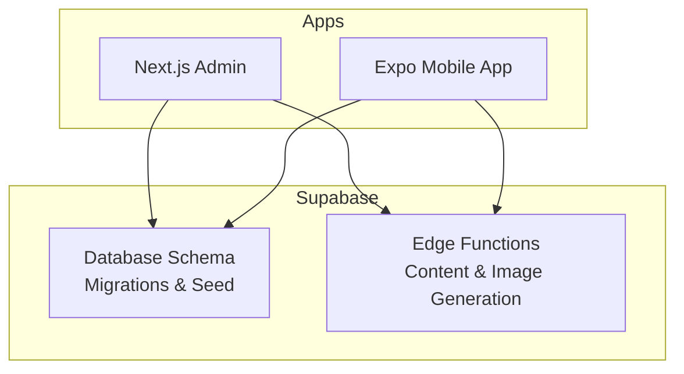
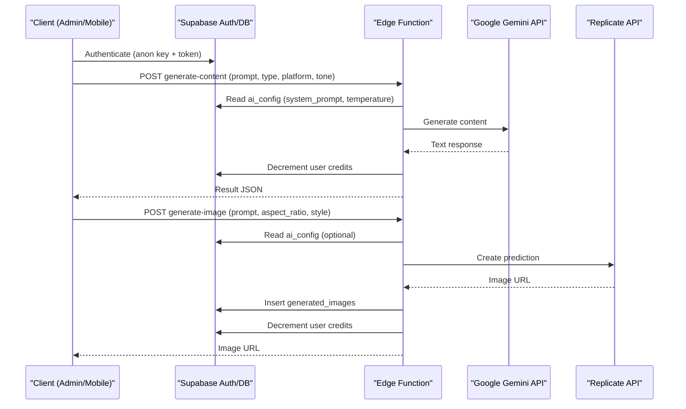
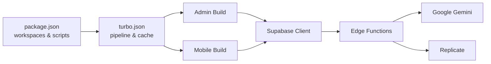

# Deployment & Production Issues

<cite>
**Referenced Files in This Document**
- [TROUBLESHOOTING.md](file://TROUBLESHOOTING.md)
- [INSTALLATION.md](file://INSTALLATION.md)
- [supabase\migrations\20240001000000_initial_schema.sql](file://supabase/migrations/20240001000000_initial_schema.sql)
- [supabase\seed.sql](file://supabase/seed.sql)
- [supabase\functions\generate-content\index.ts](file://supabase/functions/generate-content/index.ts)
- [supabase\functions\generate-image\index.ts](file://supabase/functions/generate-image/index.ts)
- [apps\mobile\app.config.ts](file://apps/mobile/app.config.ts)
- [apps\mobile\eas.json](file://apps/mobile/eas.json)
- [apps\mobile\src\services\supabase.ts](file://apps/mobile/src/services/supabase.ts)
- [apps\admin\next.config.js](file://apps/admin/next.config.js)
- [apps\admin\src\lib\supabase.ts](file://apps/admin/src/lib/supabase.ts)
- [turbo.json](file://turbo.json)
- [package.json](file://package.json)
</cite>

## Table of Contents
1. Introduction
2. Project Structure
3. Core Components
4. Architecture Overview
5. Detailed Component Analysis
6. Dependency Analysis
7. Performance Considerations
8. Troubleshooting Guide
9. Conclusion
10. Appendices

## Introduction
This document provides comprehensive troubleshooting guidance for deployment and production issues in SocialPilot AI Pro. It focuses on CI/CD pipeline failures, environment variable configuration problems, platform-specific deployment challenges (Expo/EAS), Supabase migration and Edge Function errors, mobile app store submission issues, production monitoring and diagnostics, rollback strategies, emergency recovery procedures, disaster recovery plans, and scaling considerations including resource constraints and load balancing.

## Project Structure
SocialPilot AI Pro is a monorepo with:
- apps/admin: Next.js admin panel
- apps/mobile: Expo-based mobile app
- supabase: Database schema, seed data, and Edge Functions
- packages: Shared types and tokens
- Build orchestration via Turborepo and pnpm workspaces

**Diagram sources**
- [apps\admin\next.config.js:1-8](file://apps/admin/next.config.js#L1-L8)
- [apps\mobile\app.config.ts:1-42](file://apps/mobile/app.config.ts#L1-L42)
- [supabase\migrations\20240001000000_initial_schema.sql:1-232](file://supabase/migrations/20240001000000_initial_schema.sql#L1-L232)
- [supabase\functions\generate-content\index.ts:1-99](file://supabase/functions/generate-content/index.ts#L1-L99)
- [supabase\functions\generate-image\index.ts:1-87](file://supabase/functions/generate-image/index.ts#L1-L87)

**Section sources**
- [package.json:1-21](file://package.json#L1-L21)
- [turbo.json:1-26](file://turbo.json#L1-L26)

## Core Components
- Supabase database schema and Row Level Security policies define access control and data model integrity.
- Edge Functions handle AI content generation and image generation, calling external APIs and updating credits.
- Mobile app configures Expo build profiles and SecureStore-backed session persistence.
- Admin app uses Next.js with transpiled shared packages and Supabase client initialization.

Key operational concerns:
- Environment variables must be correctly set per platform (mobile .env, admin .env.local, Supabase secrets).
- Migrations and seed data must be applied to the correct Supabase project before runtime.
- RLS policies must be enabled and consistent across environments.

**Section sources**
- [supabase\migrations\20240001000000_initial_schema.sql:15-232](file://supabase/migrations/20240001000000_initial_schema.sql#L15-L232)
- [supabase\functions\generate-content\index.ts:14-98](file://supabase/functions/generate-content/index.ts#L14-L98)
- [supabase\functions\generate-image\index.ts:14-86](file://supabase/functions/generate-image/index.ts#L14-L86)
- [apps\mobile\src\services\supabase.ts:28-40](file://apps/mobile/src/services/supabase.ts#L28-L40)
- [apps\admin\src\lib\supabase.ts:3-13](file://apps/admin/src/lib/supabase.ts#L3-L13)

## Architecture Overview
The runtime flow involves clients (Admin and Mobile) authenticating via Supabase Auth, reading/writing data through Supabase REST/Realtime, and invoking Edge Functions for AI tasks. External services include Google Gemini for text and Replicate for images.

**Diagram sources**
- [supabase\functions\generate-content\index.ts:14-98](file://supabase/functions/generate-content/index.ts#L14-L98)
- [supabase\functions\generate-image\index.ts:14-86](file://supabase/functions/generate-image/index.ts#L14-L86)
- [supabase\migrations\20240001000000_initial_schema.sql:31-42](file://supabase/migrations/20240001000000_initial_schema.sql#L31-L42)

## Detailed Component Analysis

### Supabase Migration and RLS Issues
Symptoms:
- Empty query results or permission denied errors.
- Realtime not updating theme or posts on mobile.

Root causes:
- Migrations not executed or executed against wrong project.
- RLS policies missing or misconfigured.
- Realtime publication not enabled for required tables.

Resolution steps:
- Run the initial schema migration in the Supabase SQL Editor.
- Apply seed data to populate default configurations and templates.
- Verify RLS policies are enabled for all relevant tables.
- Ensure realtime publications include app_config, posts, notifications, and templates.

Diagnostics:
- Use Supabase Dashboard → Database → Tables to confirm rows exist.
- Check Policies tab for each table to ensure correct roles.
- Confirm realtime status under Publications.

**Section sources**
- [TROUBLESHOOTING.md:9-23](file://TROUBLESHOOTING.md#L9-L23)
- [supabase\migrations\20240001000000_initial_schema.sql:159-232](file://supabase/migrations/20240001000000_initial_schema.sql#L159-L232)
- [supabase\seed.sql:1-17](file://supabase/seed.sql#L1-L17)

### Edge Function Deployment Errors
Symptoms:
- 401 Unauthorized when calling Edge Functions.
- 400 Bad Request for missing prompt fields.
- 500 Internal Server Error from function execution.

Root causes:
- Missing or incorrect Authorization header.
- Missing environment variables (SUPABASE_URL, SUPABASE_ANON_KEY, GEMINI_API_KEY, REPLICATE_API_TOKEN).
- External API failures or malformed responses.

Resolution steps:
- Ensure client sends Authorization header with valid Supabase JWT.
- Set Supabase secrets for external API keys in the Supabase dashboard.
- Validate request payloads match expected fields.
- Inspect function logs in Supabase dashboard for stack traces.

Diagnostics:
- Test functions via Supabase UI or curl with proper headers.
- Verify environment variables are present in Secrets.
- Check external API rate limits and quotas.

**Section sources**
- [supabase\functions\generate-content\index.ts:14-98](file://supabase/functions/generate-content/index.ts#L14-L98)
- [supabase\functions\generate-image\index.ts:14-86](file://supabase/functions/generate-image/index.ts#L14-L86)

### Mobile App Store Submission Issues
Symptoms:
- Build fails during EAS submit or archive creation.
- Metadata mismatches between app config and store submissions.
- Bundle identifier or package name conflicts.

Root causes:
- Incorrect or missing environment variables in build profile.
- EAS CLI version mismatch or outdated configuration.
- Inconsistent identifiers across iOS and Android configs.

Resolution steps:
- Align EXPO_PUBLIC_APP_NAME and bundle identifiers in app.config.ts.
- Ensure eas.json defines appropriate build and submit profiles.
- Use latest EAS CLI version and verify workspace dependencies.
- For iOS, confirm provisioning profiles and certificates; for Android, verify keystore and signing.

Diagnostics:
- Run local builds with development and preview profiles to validate artifacts.
- Review EAS build logs for specific error messages.
- Validate manifest entries and permissions.

**Section sources**
- [apps\mobile\app.config.ts:1-42](file://apps/mobile/app.config.ts#L1-L42)
- [apps\mobile\eas.json:1-18](file://apps/mobile/eas.json#L1-L18)
- [INSTALLATION.md:33-46](file://INSTALLATION.md#L33-L46)

### Environment Variable Configuration Problems
Symptoms:
- Placeholder URLs or keys used at runtime.
- Admin login fails due to misconfigured Supabase connection.
- Mobile app cannot authenticate or fetch data.

Root causes:
- Missing or incorrect environment files (.env for mobile, .env.local for admin).
- Using placeholder values in production builds.
- Not rebuilding after changing environment variables.

Resolution steps:
- Set EXPO_PUBLIC_SUPABASE_URL and EXPO_PUBLIC_SUPABASE_ANON_KEY in apps/mobile/.env.
- Set NEXT_PUBLIC_SUPABASE_URL and NEXT_PUBLIC_SUPABASE_ANON_KEY in apps/admin/.env.local.
- Rebuild applications after changes to ensure variables are baked into artifacts.

Diagnostics:
- Check isPlaceholderUrl flags in client code to detect misconfiguration.
- Verify runtime environment variables in CI/CD secrets and deployment platforms.

**Section sources**
- [apps\mobile\src\services\supabase.ts:28-31](file://apps/mobile/src/services/supabase.ts#L28-L31)
- [apps\admin\src\lib\supabase.ts:3-6](file://apps/admin/src/lib/supabase.ts#L3-L6)
- [INSTALLATION.md:33-46](file://INSTALLATION.md#L33-L46)

### CI/CD Pipeline Failures
Symptoms:
- Monorepo dependency resolution errors.
- Build cache misses or inconsistent outputs.
- Lint or type checks failing in CI.

Root causes:
- Running installs outside root folder.
- Turbo caching based on globalDependencies not invalidated.
- Missing workspace setup or pnpm lockfile drift.

Resolution steps:
- Always run pnpm install from the repository root.
- Ensure turbo.json globalDependencies include environment files if needed.
- Keep pnpm-lock.yaml in sync and avoid manual edits.
- Add lint and type checks to CI pipeline stages.

Diagnostics:
- Inspect CI logs for module resolution errors.
- Clear caches and rerun builds if necessary.
- Validate workspace structure and package names.

**Section sources**
- [TROUBLESHOOTING.md:3-6](file://TROUBLESHOOTING.md#L3-L6)
- [turbo.json:1-26](file://turbo.json#L1-L26)
- [package.json:1-21](file://package.json#L1-L21)

### Platform-Specific Deployment Challenges
- Next.js Admin: Ensure transpilePackages includes shared packages; configure port and strict mode appropriately.
- Expo Mobile: Configure plugins and experiments; ensure secure storage adapter works on web vs native.

Resolution steps:
- Update next.config.js to include any new shared packages.
- Verify Expo plugins and experiments align with SDK version.
- Test both web and native builds for parity.

**Section sources**
- [apps\admin\next.config.js:1-8](file://apps/admin/next.config.js#L1-L8)
- [apps\mobile\app.config.ts:28-40](file://apps/mobile/app.config.ts#L28-L40)

## Dependency Analysis
The system relies on:
- pnpm workspaces for monorepo management
- Turborepo for task orchestration and caching
- Supabase for auth, database, realtime, and edge functions
- External AI providers (Gemini, Replicate)

**Diagram sources**
- [package.json:1-21](file://package.json#L1-L21)
- [turbo.json:1-26](file://turbo.json#L1-L26)
- [supabase\functions\generate-content\index.ts:14-98](file://supabase/functions/generate-content/index.ts#L14-L98)
- [supabase\functions\generate-image\index.ts:14-86](file://supabase/functions/generate-image/index.ts#L14-L86)

**Section sources**
- [package.json:1-21](file://package.json#L1-L21)
- [turbo.json:1-26](file://turbo.json#L1-L26)

## Performance Considerations
- Edge Functions should minimize cold starts by avoiding heavy initialization and leveraging Supabase caching where possible.
- Rate-limit external API calls to Gemini and Replicate to prevent throttling.
- Monitor credit deduction logic to ensure accurate accounting under high concurrency.
- Use Supabase Realtime judiciously; enable only for tables that require live updates.
- Cache static assets and shared packages via CDN in production deployments.

[No sources needed since this section provides general guidance]

## Troubleshooting Guide

### Common Deployment Problems
- Module resolution in monorepo: Install from root using pnpm to resolve hoisted dependencies.
- Supabase queries returning empty arrays or permission denied: Execute migrations and verify RLS policies.
- Admin login access denied: Update role in profiles table to super_admin or admin.
- Realtime theme colors not updating on mobile: Enable realtime replication for app_config.

**Section sources**
- [TROUBLESHOOTING.md:3-23](file://TROUBLESHOOTING.md#L3-L23)

### Supabase Migration Problems
- Ensure migrations are run against the correct project and environment.
- Apply seed data to initialize default configurations and templates.
- Confirm realtime publications include required tables.

**Section sources**
- [supabase\migrations\20240001000000_initial_schema.sql:159-232](file://supabase/migrations/20240001000000_initial_schema.sql#L159-L232)
- [supabase\seed.sql:1-17](file://supabase/seed.sql#L1-L17)

### Edge Function Deployment Errors
- Validate Authorization header presence and correctness.
- Set Supabase secrets for external API keys.
- Inspect function logs for detailed error messages.

**Section sources**
- [supabase\functions\generate-content\index.ts:14-98](file://supabase/functions/generate-content/index.ts#L14-L98)
- [supabase\functions\generate-image\index.ts:14-86](file://supabase/functions/generate-image/index.ts#L14-L86)

### Mobile App Store Submission Issues
- Align bundle identifiers and app metadata across platforms.
- Use correct EAS CLI version and build profiles.
- Validate signing configurations for iOS and Android.

**Section sources**
- [apps\mobile\app.config.ts:1-42](file://apps/mobile/app.config.ts#L1-L42)
- [apps\mobile\eas.json:1-18](file://apps/mobile/eas.json#L1-L18)

### Production Monitoring and Diagnostics
- Monitor Supabase Edge Function logs for errors and performance metrics.
- Track credit deductions and analytics tables for anomalies.
- Use Supabase Dashboard to inspect realtime connections and query performance.
- Implement application-level logging around critical paths (auth, AI generation, image generation).

[No sources needed since this section provides general guidance]

### Error Tracking and Performance Profiling
- Centralize error reporting to a service capable of aggregating frontend and backend errors.
- Profile Edge Functions to identify slow external API calls and optimize payloads.
- Use Supabase analytics tables to monitor usage patterns and detect spikes.

[No sources needed since this section provides general guidance]

### Rollback Strategies
- Maintain tagged versions of migrations and seed data; revert by applying previous migration state.
- Pin Edge Function versions and redeploy previous stable versions when issues arise.
- Keep environment variable snapshots per environment to restore exact configurations.

[No sources needed since this section provides general guidance]

### Emergency Recovery Procedures
- If database corruption occurs, restore from backups and reapply migrations sequentially.
- If Edge Functions fail broadly, disable external integrations temporarily and serve fallback responses.
- Temporarily enable maintenance mode via app_config to inform users while resolving issues.

**Section sources**
- [supabase\migrations\20240001000000_initial_schema.sql:15-29](file://supabase/migrations/20240001000000_initial_schema.sql#L15-L29)

### Disaster Recovery Plans
- Regularly back up Supabase projects and store artifacts securely.
- Document recovery runbooks for common failure scenarios (auth outage, external API downtime).
- Conduct periodic drills to validate backup restoration and recovery time objectives.

[No sources needed since this section provides general guidance]

### Scaling Issues, Resource Constraints, and Load Balancing
- Scale horizontally by distributing requests across multiple instances of your app servers.
- Offload heavy AI tasks to Edge Functions with retries and circuit breakers for external APIs.
- Use caching layers to reduce repeated requests to external services and database.
- Monitor resource utilization and adjust quotas or timeouts accordingly.

[No sources needed since this section provides general guidance]

## Conclusion
This guide consolidates known deployment and production troubleshooting steps for SocialPilot AI Pro, focusing on environment configuration, Supabase migrations and Edge Functions, mobile app store submissions, and operational best practices. By following the diagnostic procedures and remediation steps outlined here, teams can quickly identify and resolve issues, maintain stability, and scale effectively in production.

[No sources needed since this section summarizes without analyzing specific files]

## Appendices

### Environment Variables Reference
- Mobile: EXPO_PUBLIC_SUPABASE_URL, EXPO_PUBLIC_SUPABASE_ANON_KEY, EXPO_PUBLIC_APP_NAME
- Admin: NEXT_PUBLIC_SUPABASE_URL, NEXT_PUBLIC_SUPABASE_ANON_KEY
- Supabase Secrets: SUPABASE_URL, SUPABASE_ANON_KEY, GEMINI_API_KEY, REPLICATE_API_TOKEN

**Section sources**
- [INSTALLATION.md:33-46](file://INSTALLATION.md#L33-L46)
- [supabase\functions\generate-content\index.ts:14-19](file://supabase/functions/generate-content/index.ts#L14-L19)
- [supabase\functions\generate-image\index.ts:14-19](file://supabase/functions/generate-image/index.ts#L14-L19)

### Build and Deploy Commands
- Root scripts: build, dev, lint, clean via Turborepo
- Admin dev server: npx next dev apps/admin -p 3001
- Mobile development: npx expo run:android --no-install or npx expo start

**Section sources**
- [package.json:9-15](file://package.json#L9-L15)
- [INSTALLATION.md:50-63](file://INSTALLATION.md#L50-L63)