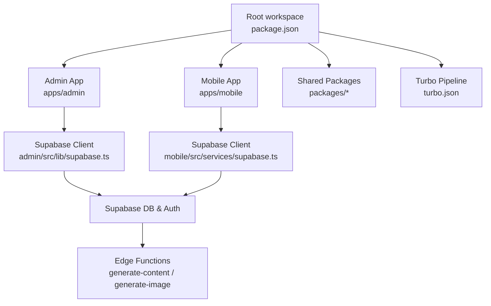
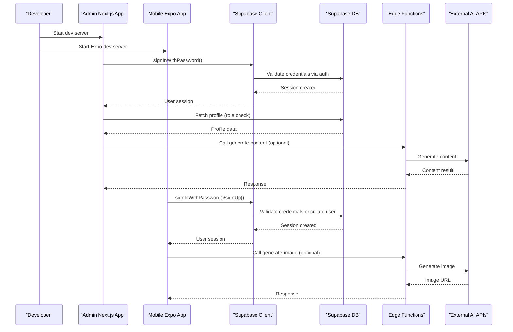
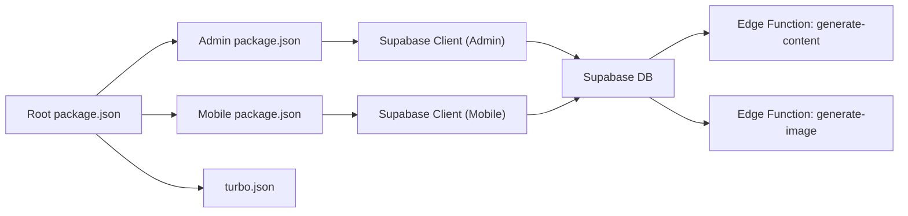

# Development Issues & Solutions

<cite>
**Referenced Files in This Document**
- [package.json](file://package.json)
- [pnpm-workspace.yaml](file://pnpm-workspace.yaml)
- [turbo.json](file://turbo.json)
- [TROUBLESHOOTING.md](file://TROUBLESHOOTING.md)
- [apps/admin/package.json](file://apps/admin/package.json)
- [apps/mobile/package.json](file://apps/mobile/package.json)
- [apps/admin/src/lib/supabase.ts](file://apps/admin/src/lib/supabase.ts)
- [apps/mobile/src/services/supabase.ts](file://apps/mobile/src/services/supabase.ts)
- [supabase/migrations/20240001000000_initial_schema.sql](file://supabase/migrations/20240001000000_initial_schema.sql)
- [supabase/functions/generate-content/index.ts](file://supabase/functions/generate-content/index.ts)
- [supabase/functions/generate-image/index.ts](file://supabase/functions/generate-image/index.ts)
- [apps/admin/src/app/(auth)/login/page.tsx](file://apps/admin/src/app/(auth)/login/page.tsx)
- [apps/mobile/src/app/(auth)/login.tsx](file://apps/mobile/src/app/(auth)/login.tsx)
</cite>

## Table of Contents
1. [Introduction](#introduction)
2. [Project Structure](#project-structure)
3. [Core Components](#core-components)
4. [Architecture Overview](#architecture-overview)
5. [Detailed Component Analysis](#detailed-component-analysis)
6. [Dependency Analysis](#dependency-analysis)
7. [Performance Considerations](#performance-considerations)
8. [Troubleshooting Guide](#troubleshooting-guide)
9. [Conclusion](#conclusion)
10. [Appendices](#appendices)

## Introduction
This document provides comprehensive troubleshooting guidance for development-related issues in SocialPilot AI Pro. It focuses on monorepo setup, dependency conflicts, TypeScript compilation errors, build pipeline failures, Supabase connectivity, Edge Function deployment, mobile app development challenges, authentication flows, API integration problems, state management issues, and performance optimization strategies for both web and mobile apps.

## Project Structure
SocialPilot AI Pro is a pnpm-based monorepo with Turborepo orchestration. The root package defines workspaces for apps and shared packages, while Turbo manages cross-app tasks like build, lint, and dev. The admin app is a Next.js application; the mobile app is an Expo/React Native application. Supabase is used for auth, database, real-time features, and Edge Functions.

**Diagram sources**
- [package.json:1-21](file://package.json#L1-L21)
- [turbo.json:1-26](file://turbo.json#L1-L26)
- [apps/admin/src/lib/supabase.ts:1-14](file://apps/admin/src/lib/supabase.ts#L1-L14)
- [apps/mobile/src/services/supabase.ts:1-41](file://apps/mobile/src/services/supabase.ts#L1-L41)
- [supabase/functions/generate-content/index.ts:1-99](file://supabase/functions/generate-content/index.ts#L1-L99)
- [supabase/functions/generate-image/index.ts:1-87](file://supabase/functions/generate-image/index.ts#L1-L87)

**Section sources**
- [package.json:1-21](file://package.json#L1-L21)
- [pnpm-workspace.yaml:1-4](file://pnpm-workspace.yaml#L1-L4)
- [turbo.json:1-26](file://turbo.json#L1-L26)

## Core Components
- Monorepo and Build Orchestration
  - pnpm workspaces define apps and packages.
  - Turboreho pipeline configures build outputs, dependencies, and persistent dev tasks.
- Admin Web App (Next.js)
  - Uses Supabase client with session persistence and auto-refresh token.
  - Login page enforces admin role checks and supports placeholder-mode bypass for local dev.
- Mobile App (Expo/React Native)
  - Supabase client configured with secure storage adapter for sessions across platforms.
  - Login screen supports sign-in/sign-up flows and placeholder-mode bypass.
- Supabase Backend
  - Database schema includes profiles, posts, templates, analytics, notifications, and RLS policies.
  - Realtime enabled for key tables.
  - Edge Functions handle content generation and image generation, calling external AI services and updating credits.

**Section sources**
- [apps/admin/src/lib/supabase.ts:1-14](file://apps/admin/src/lib/supabase.ts#L1-L14)
- [apps/admin/src/app/(auth)/login/page.tsx:1-167](file://apps/admin/src/app/(auth)/login/page.tsx#L1-L167)
- [apps/mobile/src/services/supabase.ts:1-41](file://apps/mobile/src/services/supabase.ts#L1-L41)
- [apps/mobile/src/app/(auth)/login.tsx:1-424](file://apps/mobile/src/app/(auth)/login.tsx#L1-L424)
- [supabase/migrations/20240001000000_initial_schema.sql:1-232](file://supabase/migrations/20240001000000_initial_schema.sql#L1-L232)
- [supabase/functions/generate-content/index.ts:1-99](file://supabase/functions/generate-content/index.ts#L1-L99)
- [supabase/functions/generate-image/index.ts:1-87](file://supabase/functions/generate-image/index.ts#L1-L87)

## Architecture Overview
The system integrates client apps with Supabase services and Edge Functions to provide authentication, data access, real-time updates, and AI-powered content/image generation.

**Diagram sources**
- [apps/admin/src/app/(auth)/login/page.tsx:15-78](file://apps/admin/src/app/(auth)/login/page.tsx#L15-L78)
- [apps/mobile/src/app/(auth)/login.tsx:76-142](file://apps/mobile/src/app/(auth)/login.tsx#L76-L142)
- [supabase/functions/generate-content/index.ts:14-98](file://supabase/functions/generate-content/index.ts#L14-L98)
- [supabase/functions/generate-image/index.ts:14-86](file://supabase/functions/generate-image/index.ts#L14-L86)

## Detailed Component Analysis

### Monorepo Setup and Dependency Conflicts
- Ensure pnpm is used from the repository root so workspace linking resolves correctly.
- Verify that all apps declare shared dependencies consistently to avoid duplicate versions.
- Use Turborepo pipelines to standardize build and lint tasks across apps.

Common symptoms and fixes:
- Module resolution errors in mobile/web due to hoisting/linker issues: run install from root and confirm workspace configuration.
- Duplicate React or Next versions causing runtime errors: align versions in each app’s package.json.
- TypeScript errors across apps: ensure consistent tsconfig settings and shared types.

**Section sources**
- [pnpm-workspace.yaml:1-4](file://pnpm-workspace.yaml#L1-L4)
- [package.json:1-21](file://package.json#L1-L21)
- [apps/admin/package.json:1-41](file://apps/admin/package.json#L1-L41)
- [apps/mobile/package.json:1-53](file://apps/mobile/package.json#L1-L53)

### TypeScript Compilation Errors
- Confirm TypeScript version alignment across apps and shared packages.
- Check for missing type definitions for libraries used in admin and mobile apps.
- Validate that environment variables are typed if consumed by TS code.

Typical resolutions:
- Pin TypeScript versions in devDependencies for consistency.
- Add missing @types packages for third-party libraries.
- Ensure tsconfig paths and module resolution match project structure.

**Section sources**
- [apps/admin/package.json:32-41](file://apps/admin/package.json#L32-L41)
- [apps/mobile/package.json:46-53](file://apps/mobile/package.json#L46-L53)

### Build Pipeline Failures (Turborepo)
- Review turbo.json pipeline outputs and dependencies to ensure correct caching and task ordering.
- Confirm that global dependencies (like .env.*local) are included where needed.
- Validate per-app scripts for build/start/lint commands.

Resolution steps:
- Clear caches and rerun builds to eliminate stale artifacts.
- Align output directories with turbo outputs configuration.
- Ensure environment variables are available during builds.

**Section sources**
- [turbo.json:1-26](file://turbo.json#L1-L26)
- [package.json:9-15](file://package.json#L9-L15)

### Supabase Connection Problems
- Verify environment variables for Supabase URL and anon key in both admin and mobile apps.
- Confirm placeholder detection logic and ensure it is not active in production.
- Apply migrations and enable Row Level Security policies.

Symptoms:
- Empty arrays or permission denied errors.
- Authentication failures or session persistence issues on mobile.

Fixes:
- Run initial schema migration to apply RLS policies and realtime publications.
- For mobile, ensure SecureStore adapter is configured for session persistence.
- Enable realtime replication for required tables.

**Section sources**
- [apps/admin/src/lib/supabase.ts:1-14](file://apps/admin/src/lib/supabase.ts#L1-L14)
- [apps/mobile/src/services/supabase.ts:1-41](file://apps/mobile/src/services/supabase.ts#L1-L41)
- [supabase/migrations/20240001000000_initial_schema.sql:155-232](file://supabase/migrations/20240001000000_initial_schema.sql#L155-L232)
- [TROUBLESHOOTING.md:9-23](file://TROUBLESHOOTING.md#L9-L23)

### Edge Function Deployment Issues
- Ensure required secrets (e.g., Gemini API key, Replicate token) are set in Supabase Edge Functions environment.
- Validate CORS headers and authorization propagation to Supabase client within functions.
- Confirm function endpoints return expected JSON responses and handle errors gracefully.

Common issues:
- Unauthorized errors due to missing Authorization header.
- Missing API keys leading to mock responses or failures.
- Network timeouts when calling external AI APIs.

Resolutions:
- Set environment variables in Supabase dashboard for each function.
- Inspect logs for error messages and adjust request payloads.
- Test locally using Supabase CLI before deploying.

**Section sources**
- [supabase/functions/generate-content/index.ts:14-98](file://supabase/functions/generate-content/index.ts#L14-L98)
- [supabase/functions/generate-image/index.ts:14-86](file://supabase/functions/generate-image/index.ts#L14-L86)

### Mobile App Development Challenges
- Expo/Metro module resolution in monorepo: always install from root and use workspace linking.
- Platform-specific behavior differences (web vs native) for storage and networking.
- Debugging auth flows and navigation in Expo Router.

Tips:
- Use platform guards for storage adapters and network calls.
- Leverage Expo dev tools for logging and debugging.
- Validate environment variables for Supabase in mobile builds.

**Section sources**
- [apps/mobile/package.json:1-53](file://apps/mobile/package.json#L1-L53)
- [apps/mobile/src/services/supabase.ts:5-26](file://apps/mobile/src/services/supabase.ts#L5-L26)
- [apps/mobile/src/app/(auth)/login.tsx:76-142](file://apps/mobile/src/app/(auth)/login.tsx#L76-L142)

### Authentication Flows
- Admin login validates credentials and checks profile role; placeholder mode allows quick local testing.
- Mobile login supports sign-in and sign-up; placeholder mode bypasses backend for rapid iteration.
- Ensure RLS policies allow appropriate reads/writes based on roles.

Debugging techniques:
- Log session creation and profile fetch results.
- Verify role values in profiles table.
- Confirm placeholder URL detection is disabled in production.

**Section sources**
- [apps/admin/src/app/(auth)/login/page.tsx:15-78](file://apps/admin/src/app/(auth)/login/page.tsx#L15-L78)
- [apps/mobile/src/app/(auth)/login.tsx:76-142](file://apps/mobile/src/app/(auth)/login.tsx#L76-L142)
- [supabase/migrations/20240001000000_initial_schema.sql:178-202](file://supabase/migrations/20240001000000_initial_schema.sql#L178-L202)

### API Integration Problems
- Edge Functions call external AI services; ensure proper headers and payload formats.
- Handle rate limits and retries for external API calls.
- Validate response structures and map them to application models.

Best practices:
- Centralize API configuration and secrets management.
- Implement robust error handling and fallbacks.
- Monitor latency and error rates for external integrations.

**Section sources**
- [supabase/functions/generate-content/index.ts:48-80](file://supabase/functions/generate-content/index.ts#L48-L80)
- [supabase/functions/generate-image/index.ts:38-62](file://supabase/functions/generate-image/index.ts#L38-L62)

### State Management Issues
- Both apps use Zustand for state; ensure stores are initialized correctly and persist necessary data.
- Avoid over-fetching by leveraging React Query for data synchronization.
- Keep UI state separate from server state.

Recommendations:
- Normalize store shapes and avoid circular references.
- Use selectors to minimize re-renders.
- Persist only essential state securely (especially on mobile).

**Section sources**
- [apps/admin/package.json:11-31](file://apps/admin/package.json#L11-L31)
- [apps/mobile/package.json:13-45](file://apps/mobile/package.json#L13-L45)

## Dependency Analysis
The monorepo relies on pnpm workspaces and Turboreho to coordinate builds and tasks. Shared packages can be referenced via workspace protocol. Consistent dependency versions reduce conflicts and improve reproducibility.

**Diagram sources**
- [package.json:1-21](file://package.json#L1-L21)
- [apps/admin/package.json:1-41](file://apps/admin/package.json#L1-L41)
- [apps/mobile/package.json:1-53](file://apps/mobile/package.json#L1-L53)
- [turbo.json:1-26](file://turbo.json#L1-L26)

**Section sources**
- [package.json:1-21](file://package.json#L1-L21)
- [apps/admin/package.json:1-41](file://apps/admin/package.json#L1-L41)
- [apps/mobile/package.json:1-53](file://apps/mobile/package.json#L1-L53)
- [turbo.json:1-26](file://turbo.json#L1-L26)

## Performance Considerations
- Minimize unnecessary re-renders by memoizing components and using efficient selectors in Zustand stores.
- Cache API responses with React Query and invalidate selectively.
- Optimize images and assets; leverage CDN for media generated by Edge Functions.
- Reduce bundle size by tree-shaking unused dependencies and avoiding heavy libraries.
- Use platform-specific optimizations for mobile (e.g., lazy loading screens, efficient animations).

[No sources needed since this section provides general guidance]

## Troubleshooting Guide

### Monorepo Setup Issues
- Symptom: Module resolution errors in Expo/Metro.
- Resolution: Install dependencies from the repository root to ensure workspace linking works correctly.

**Section sources**
- [TROUBLESHOOTING.md:3-6](file://TROUBLESHOOTING.md#L3-L6)
- [pnpm-workspace.yaml:1-4](file://pnpm-workspace.yaml#L1-L4)

### Dependency Conflicts
- Symptom: Duplicate React/Next versions causing runtime errors.
- Resolution: Align versions across apps and remove duplicates; rely on workspace protocol for shared packages.

**Section sources**
- [apps/admin/package.json:11-41](file://apps/admin/package.json#L11-L41)
- [apps/mobile/package.json:13-53](file://apps/mobile/package.json#L13-L53)

### TypeScript Compilation Errors
- Symptom: Type errors across apps or missing type definitions.
- Resolution: Standardize TypeScript versions; add missing @types packages; verify tsconfig paths.

**Section sources**
- [apps/admin/package.json:32-41](file://apps/admin/package.json#L32-L41)
- [apps/mobile/package.json:46-53](file://apps/mobile/package.json#L46-L53)

### Build Pipeline Failures
- Symptom: Turborepo cache misses or incorrect outputs.
- Resolution: Adjust turbo.json outputs and dependsOn; clear caches; ensure environment variables are present.

**Section sources**
- [turbo.json:1-26](file://turbo.json#L1-L26)
- [package.json:9-15](file://package.json#L9-L15)

### Supabase Connection Problems
- Symptom: Empty arrays or permission denied errors.
- Resolution: Apply initial schema migration to enable RLS policies; ensure realtime publications are enabled.

**Section sources**
- [TROUBLESHOOTING.md:9-12](file://TROUBLESHOOTING.md#L9-L12)
- [supabase/migrations/20240001000000_initial_schema.sql:155-232](file://supabase/migrations/20240001000000_initial_schema.sql#L155-L232)

### Admin Login Access Denied
- Symptom: “Access Denied: Admin privileges required”.
- Resolution: Update user role in profiles table to admin or super_admin.

**Section sources**
- [TROUBLESHOOTING.md:15-18](file://TROUBLESHOOTING.md#L15-L18)
- [apps/admin/src/app/(auth)/login/page.tsx:44-70](file://apps/admin/src/app/(auth)/login/page.tsx#L44-L70)

### Realtime Theme Colors Not Updating on Mobile
- Symptom: Theme changes do not reflect in mobile app.
- Resolution: Enable realtime replication for app_config table.

**Section sources**
- [TROUBLESHOOTING.md:21-23](file://TROUBLESHOOTING.md#L21-L23)
- [supabase/migrations/20240001000000_initial_schema.sql:227-232](file://supabase/migrations/20240001000000_initial_schema.sql#L227-L232)

### Edge Function Deployment Issues
- Symptom: Unauthorized or missing API key errors.
- Resolution: Set SUPABASE_URL, SUPABASE_ANON_KEY, and provider-specific secrets in Supabase Edge Functions environment.

**Section sources**
- [supabase/functions/generate-content/index.ts:14-27](file://supabase/functions/generate-content/index.ts#L14-L27)
- [supabase/functions/generate-image/index.ts:14-27](file://supabase/functions/generate-image/index.ts#L14-L27)

### Mobile App Development Challenges
- Symptom: Metro module resolution or platform-specific storage issues.
- Resolution: Use workspace installs; configure SecureStore adapter for session persistence; validate environment variables.

**Section sources**
- [apps/mobile/src/services/supabase.ts:5-26](file://apps/mobile/src/services/supabase.ts#L5-L26)
- [apps/mobile/package.json:1-53](file://apps/mobile/package.json#L1-L53)

### Authentication Flow Debugging
- Technique: Log session creation and profile fetch; verify placeholder URL detection; ensure RLS policies permit access.

**Section sources**
- [apps/admin/src/app/(auth)/login/page.tsx:15-78](file://apps/admin/src/app/(auth)/login/page.tsx#L15-L78)
- [apps/mobile/src/app/(auth)/login.tsx:76-142](file://apps/mobile/src/app/(auth)/login.tsx#L76-L142)

### API Integration Debugging
- Technique: Inspect Edge Function logs; validate request payloads and headers; handle external API rate limits and errors.

**Section sources**
- [supabase/functions/generate-content/index.ts:48-98](file://supabase/functions/generate-content/index.ts#L48-L98)
- [supabase/functions/generate-image/index.ts:38-86](file://supabase/functions/generate-image/index.ts#L38-L86)

### State Management Debugging
- Technique: Use Zustand selectors to isolate state changes; log store updates; avoid unnecessary re-renders.

**Section sources**
- [apps/admin/package.json:11-31](file://apps/admin/package.json#L11-L31)
- [apps/mobile/package.json:13-45](file://apps/mobile/package.json#L13-L45)

## Conclusion
By following the structured troubleshooting steps and understanding the architecture outlined here, developers can efficiently resolve common development blockers in SocialPilot AI Pro. Focus on monorepo setup, consistent dependencies, proper Supabase configuration, robust Edge Functions, and optimized state management to maintain a smooth development experience across web and mobile platforms.

## Appendices

### Step-by-Step Guides

#### Setting Up Proper Debugging Environments
- Install dependencies from the repository root using pnpm.
- Configure environment variables for Supabase in both admin and mobile apps.
- Apply database migrations and enable realtime publications.
- Set Edge Function secrets in Supabase dashboard.
- Use Turborepo to run dev servers for admin and mobile apps concurrently.

**Section sources**
- [package.json:9-15](file://package.json#L9-L15)
- [apps/admin/src/lib/supabase.ts:1-14](file://apps/admin/src/lib/supabase.ts#L1-L14)
- [apps/mobile/src/services/supabase.ts:1-41](file://apps/mobile/src/services/supabase.ts#L1-L41)
- [supabase/migrations/20240001000000_initial_schema.sql:155-232](file://supabase/migrations/20240001000000_initial_schema.sql#L155-L232)
- [supabase/functions/generate-content/index.ts:14-27](file://supabase/functions/generate-content/index.ts#L14-L27)
- [supabase/functions/generate-image/index.ts:14-27](file://supabase/functions/generate-image/index.ts#L14-L27)