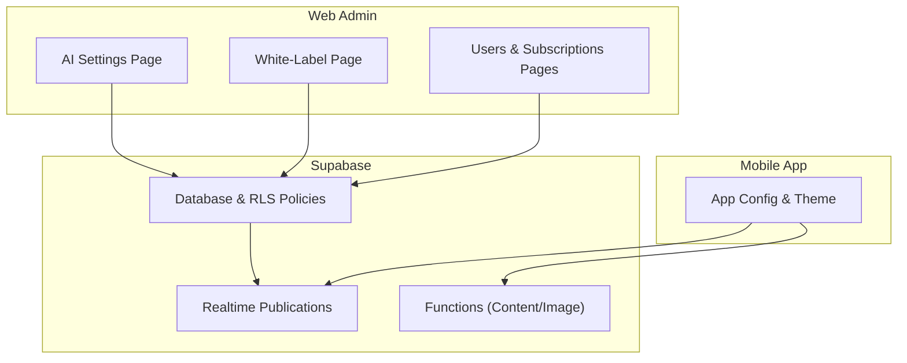
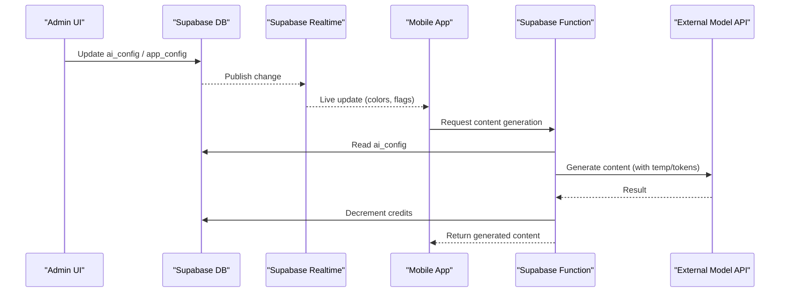
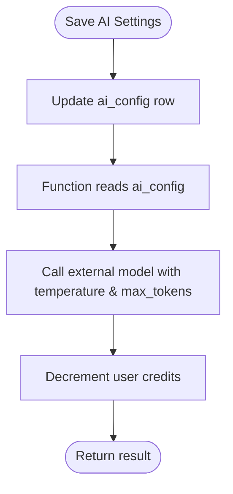
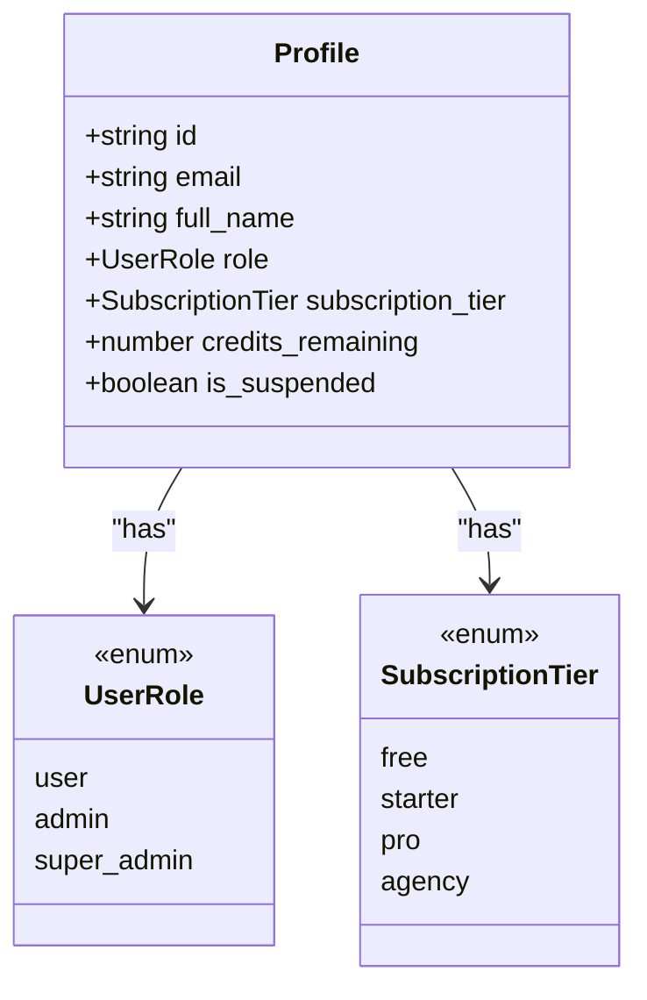
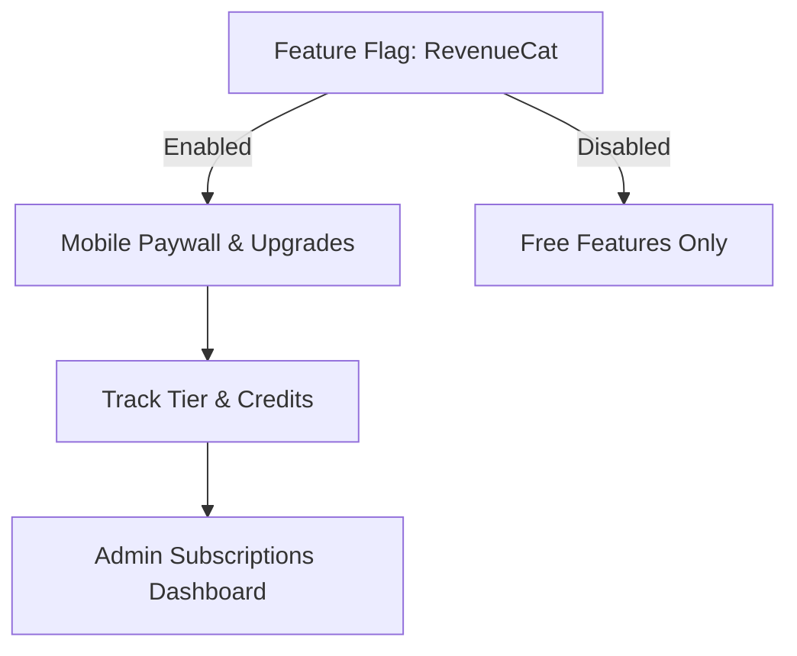
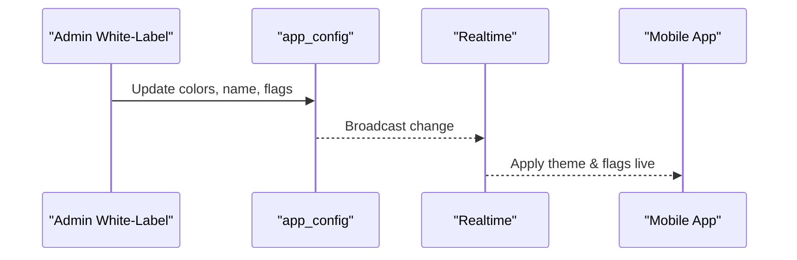
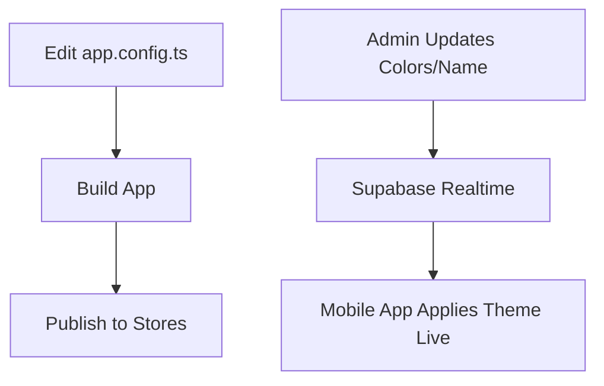
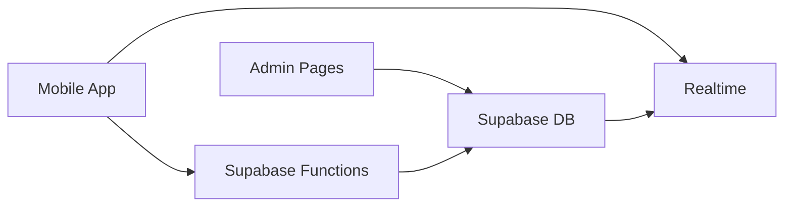

# Frequently Asked Questions

<cite>
**Referenced Files in This Document**
- [README.md](file://README.md)
- [INSTALLATION.md](file://INSTALLATION.md)
- [ADMIN_GUIDE.md](file://ADMIN_GUIDE.md)
- [MOBILE_CUSTOMIZATION.md](file://MOBILE_CUSTOMIZATION.md)
- [TROUBLESHOOTING.md](file://TROUBLESHOOTING.md)
- [20240001000000_initial_schema.sql](file://supabase/migrations/20240001000000_initial_schema.sql)
- [seed.sql](file://supabase/seed.sql)
- [generate-content/index.ts](file://supabase/functions/generate-content/index.ts)
- [ai-settings/page.tsx](file://apps/admin/src/app/(dashboard)/ai-settings/page.tsx)
- [white-label/page.tsx](file://apps/admin/src/app/(dashboard)/white-label/page.tsx)
- [users/page.tsx](file://apps/admin/src/app/(dashboard)/users/page.tsx)
- [subscriptions/page.tsx](file://apps/admin/src/app/(dashboard)/subscriptions/page.tsx)
- [app.config.ts](file://apps/mobile/app.config.ts)
- [theme/index.ts](file://apps/mobile/src/theme/index.ts)
</cite>

## Table of Contents
1. [Introduction](#introduction)
2. [Project Structure](#project-structure)
3. [Core Components](#core-components)
4. [Architecture Overview](#architecture-overview)
5. [Detailed Component Analysis](#detailed-component-analysis)
6. [Dependency Analysis](#dependency-analysis)
7. [Performance Considerations](#performance-considerations)
8. [Troubleshooting Guide](#troubleshooting-guide)
9. [Conclusion](#conclusion)
10. [Appendices](#appendices)

## Introduction
This FAQ provides clear, actionable answers to common questions about configuring and customizing SocialPilot AI Pro, including AI content generation settings, user roles and subscriptions, white-label branding, mobile app customization, performance tuning, security best practices, scalability, data migration, backups, and maintenance. It references the relevant documentation sections and code locations for quick navigation.

## Project Structure
SocialPilot AI Pro is a monorepo with:
- Web Admin Panel (Next.js): Central control for AI engine configuration, white-label branding, users, subscriptions, and notifications.
- Mobile App (Expo/React Native): Branded client that consumes runtime config from Supabase and integrates with AI services via Supabase Functions.
- Backend (Supabase): Database schema, Row Level Security policies, Realtime publications, and serverless functions for AI content generation.

**Diagram sources**
- [ai-settings/page.tsx:23-85](file://apps/admin/src/app/(dashboard)/ai-settings/page.tsx#L23-L85)
- [white-label/page.tsx:25-91](file://apps/admin/src/app/(dashboard)/white-label/page.tsx#L25-L91)
- [20240001000000_initial_schema.sql:15-42](file://supabase/migrations/20240001000000_initial_schema.sql#L15-L42)
- [20240001000000_initial_schema.sql:159-232](file://supabase/migrations/20240001000000_initial_schema.sql#L159-L232)
- [generate-content/index.ts:38-83](file://supabase/functions/generate-content/index.ts#L38-L83)

**Section sources**
- [README.md:1-4](file://README.md#L1-L4)
- [INSTALLATION.md:22-46](file://INSTALLATION.md#L22-L46)

## Core Components
- AI Engine Configuration: Manage text/image providers, model slugs, temperature, max tokens, and system prompt.
- White-Label Branding: Control app name, logo, colors, support email, and feature flags (RevenueCat, social login, maintenance mode).
- User Management: View roles, subscription tiers, credits, and suspension status; adjust credits and suspend/reactivate users.
- Subscription Billing: Monitor MRR, active subscribers, and plan configurations; integrate with RevenueCat via feature flag.
- Mobile Customization: Configure app name, bundle identifiers, icons, splash screen, and theme tokens.

**Section sources**
- [ADMIN_GUIDE.md:7-30](file://ADMIN_GUIDE.md#L7-L30)
- [ai-settings/page.tsx:14-85](file://apps/admin/src/app/(dashboard)/ai-settings/page.tsx#L14-L85)
- [white-label/page.tsx:14-91](file://apps/admin/src/app/(dashboard)/white-label/page.tsx#L14-L91)
- [users/page.tsx:48-76](file://apps/admin/src/app/(dashboard)/users/page.tsx#L48-L76)
- [subscriptions/page.tsx:66-99](file://apps/admin/src/app/(dashboard)/subscriptions/page.tsx#L66-L99)
- [MOBILE_CUSTOMIZATION.md:5-27](file://MOBILE_CUSTOMIZATION.md#L5-L27)

## Architecture Overview
The admin panel updates centralized configuration tables in Supabase. The mobile app subscribes to Realtime channels to receive live updates for branding and features. AI content generation flows through Supabase Functions, which read AI configuration and call external models while decrementing user credits.

**Diagram sources**
- [ai-settings/page.tsx:23-85](file://apps/admin/src/app/(dashboard)/ai-settings/page.tsx#L23-L85)
- [white-label/page.tsx:25-91](file://apps/admin/src/app/(dashboard)/white-label/page.tsx#L25-L91)
- [20240001000000_initial_schema.sql:227-232](file://supabase/migrations/20240001000000_initial_schema.sql#L227-L232)
- [generate-content/index.ts:38-83](file://supabase/functions/generate-content/index.ts#L38-L83)

## Detailed Component Analysis

### AI Content Generation Settings
- What can I configure?
  - Text provider and model slug (e.g., Gemini or OpenAI).
  - Image provider and model slug (e.g., Replicate SDXL/Flux, Stability AI, DALL·E 3).
  - Inference parameters: temperature and max output tokens.
  - Master system prompt used across all generations.
- How are changes applied?
  - Admin saves to ai_config table; mobile clients read current config at runtime.
  - Supabase Functions read ai_config before calling external APIs.
- Where to find it?
  - Admin page for AI settings.
  - Database schema defines fields and defaults.
  - Function uses these values to call the model and enforce token limits.

**Diagram sources**
- [ai-settings/page.tsx:54-85](file://apps/admin/src/app/(dashboard)/ai-settings/page.tsx#L54-L85)
- [20240001000000_initial_schema.sql:31-42](file://supabase/migrations/20240001000000_initial_schema.sql#L31-L42)
- [generate-content/index.ts:38-83](file://supabase/functions/generate-content/index.ts#L38-L83)

**Section sources**
- [ADMIN_GUIDE.md:14-18](file://ADMIN_GUIDE.md#L14-L18)
- [ai-settings/page.tsx:14-85](file://apps/admin/src/app/(dashboard)/ai-settings/page.tsx#L14-L85)
- [20240001000000_initial_schema.sql:31-42](file://supabase/migrations/20240001000000_initial_schema.sql#L31-L42)
- [generate-content/index.ts:38-83](file://supabase/functions/generate-content/index.ts#L38-L83)

### User Role Management
- Roles and permissions:
  - Roles include user, admin, super_admin.
  - Row Level Security restricts access based on role and ownership.
- Administrative tasks:
  - Suspend/reactivate users instantly.
  - Adjust user credits (+50/-50).
  - View roles, subscription tier, and status.
- First-time admin setup:
  - Promote your profile role to super_admin in Supabase to access admin routes.

**Diagram sources**
- [20240001000000_initial_schema.sql:8-12](file://supabase/migrations/20240001000000_initial_schema.sql#L8-L12)
- [20240001000000_initial_schema.sql:44-58](file://supabase/migrations/20240001000000_initial_schema.sql#L44-L58)
- [users/page.tsx:48-76](file://apps/admin/src/app/(dashboard)/users/page.tsx#L48-L76)

**Section sources**
- [INSTALLATION.md:67-71](file://INSTALLATION.md#L67-L71)
- [20240001000000_initial_schema.sql:8-12](file://supabase/migrations/20240001000000_initial_schema.sql#L8-L12)
- [20240001000000_initial_schema.sql:178-186](file://supabase/migrations/20240001000000_initial_schema.sql#L178-L186)
- [users/page.tsx:48-76](file://apps/admin/src/app/(dashboard)/users/page.tsx#L48-L76)

### Subscription Billing and Feature Flags
- Revenue integration:
  - Toggle RevenueCat in-app purchases via feature flag.
  - Plan tiers are displayed and tracked in the admin dashboard.
- Monitoring:
  - View MRR, active subscribers, and free-tier accounts.
  - Plans define credit allowances and premium features.

**Diagram sources**
- [white-label/page.tsx:234-280](file://apps/admin/src/app/(dashboard)/white-label/page.tsx#L234-L280)
- [subscriptions/page.tsx:66-99](file://apps/admin/src/app/(dashboard)/subscriptions/page.tsx#L66-L99)

**Section sources**
- [ADMIN_GUIDE.md:7-11](file://ADMIN_GUIDE.md#L7-L11)
- [white-label/page.tsx:234-280](file://apps/admin/src/app/(dashboard)/white-label/page.tsx#L234-L280)
- [subscriptions/page.tsx:66-99](file://apps/admin/src/app/(dashboard)/subscriptions/page.tsx#L66-L99)

### White-Label Customization
- Brand identity:
  - Set product name, logo URL, and support email.
- Dynamic theme tokens:
  - Primary, secondary, and accent colors push to mobile apps in real time.
- Runtime feature flags:
  - Enable/disable RevenueCat, social login, and maintenance mode.

**Diagram sources**
- [white-label/page.tsx:25-91](file://apps/admin/src/app/(dashboard)/white-label/page.tsx#L25-L91)
- [20240001000000_initial_schema.sql:15-29](file://supabase/migrations/20240001000000_initial_schema.sql#L15-L29)
- [20240001000000_initial_schema.sql:227-232](file://supabase/migrations/20240001000000_initial_schema.sql#L227-L232)

**Section sources**
- [ADMIN_GUIDE.md:7-11](file://ADMIN_GUIDE.md#L7-L11)
- [white-label/page.tsx:14-91](file://apps/admin/src/app/(dashboard)/white-label/page.tsx#L14-L91)
- [20240001000000_initial_schema.sql:15-29](file://supabase/migrations/20240001000000_initial_schema.sql#L15-L29)

### Mobile App Customization, Themes, and Branding
- App identity:
  - Change app name and bundle identifiers in the Expo config.
- Assets:
  - Replace icon, adaptive icon, and splash assets.
- Theme:
  - Use dynamic theme tokens exported by the theme module; colors sync from admin via Realtime.

**Diagram sources**
- [app.config.ts:3-27](file://apps/mobile/app.config.ts#L3-L27)
- [MOBILE_CUSTOMIZATION.md:5-27](file://MOBILE_CUSTOMIZATION.md#L5-L27)
- [theme/index.ts:1-12](file://apps/mobile/src/theme/index.ts#L1-L12)

**Section sources**
- [MOBILE_CUSTOMIZATION.md:5-27](file://MOBILE_CUSTOMIZATION.md#L5-L27)
- [app.config.ts:3-27](file://apps/mobile/app.config.ts#L3-L27)
- [theme/index.ts:1-12](file://apps/mobile/src/theme/index.ts#L1-L12)

## Dependency Analysis
- Admin pages depend on Supabase client to read/write configuration and user data.
- Mobile app depends on Expo config for build-time identity and theme tokens for runtime styling.
- Supabase Functions depend on environment variables for API keys and use database to fetch AI configuration and manage credits.
- Database enforces security via Row Level Security policies and exposes Realtime publications for live updates.

**Diagram sources**
- [ai-settings/page.tsx:23-85](file://apps/admin/src/app/(dashboard)/ai-settings/page.tsx#L23-L85)
- [white-label/page.tsx:25-91](file://apps/admin/src/app/(dashboard)/white-label/page.tsx#L25-L91)
- [generate-content/index.ts:38-83](file://supabase/functions/generate-content/index.ts#L38-L83)
- [20240001000000_initial_schema.sql:159-232](file://supabase/migrations/20240001000000_initial_schema.sql#L159-L232)

**Section sources**
- [20240001000000_initial_schema.sql:159-232](file://supabase/migrations/20240001000000_initial_schema.sql#L159-L232)
- [generate-content/index.ts:38-83](file://supabase/functions/generate-content/index.ts#L38-L83)

## Performance Considerations
- AI generation:
  - Tune temperature and max tokens to balance creativity and cost.
  - Ensure appropriate model selection per workload.
- Realtime updates:
  - Confirm Realtime publications are enabled for tables you need live updates on.
- Database queries:
  - Use targeted selects and leverage RLS to minimize payload size.
- Mobile builds:
  - Keep asset sizes optimized; use platform-specific resources.

[No sources needed since this section provides general guidance]

## Troubleshooting Guide
- Module resolution issues in monorepo:
  - Run install from the root folder so workspace dependencies resolve correctly.
- Empty arrays or permission denied on Supabase queries:
  - Execute the initial schema migration to apply Row Level Security policies.
- Admin login says “Access Denied”:
  - Update your profile role to super_admin or admin in the profiles table.
- Realtime theme colors not updating on mobile:
  - Ensure Realtime replication is enabled for the app_config table.

**Section sources**
- [TROUBLESHOOTING.md:3-24](file://TROUBLESHOOTING.md#L3-L24)
- [20240001000000_initial_schema.sql:159-232](file://supabase/migrations/20240001000000_initial_schema.sql#L159-L232)

## Conclusion
This FAQ consolidates essential operational knowledge for SocialPilot AI Pro: configuring AI engines, managing users and subscriptions, applying white-label branding, customizing the mobile app, and maintaining secure, scalable operations. Refer to the linked sections and files for step-by-step procedures and code-level details.

[No sources needed since this section summarizes without analyzing specific files]

## Appendices

### Data Migration, Backup Procedures, and System Maintenance
- Initial setup and seeding:
  - Run the initial schema migration and seed SQL to create tables, policies, and default configs.
- Backups:
  - Use Supabase’s built-in backup and restore capabilities in the project dashboard.
- Maintenance:
  - Toggle maintenance mode to temporarily lock the mobile client during updates.
  - Periodically review AI configuration and model choices for performance and cost optimization.

**Section sources**
- [INSTALLATION.md:22-46](file://INSTALLATION.md#L22-L46)
- [seed.sql:1-17](file://supabase/seed.sql#L1-L17)
- [white-label/page.tsx:268-280](file://apps/admin/src/app/(dashboard)/white-label/page.tsx#L268-L280)