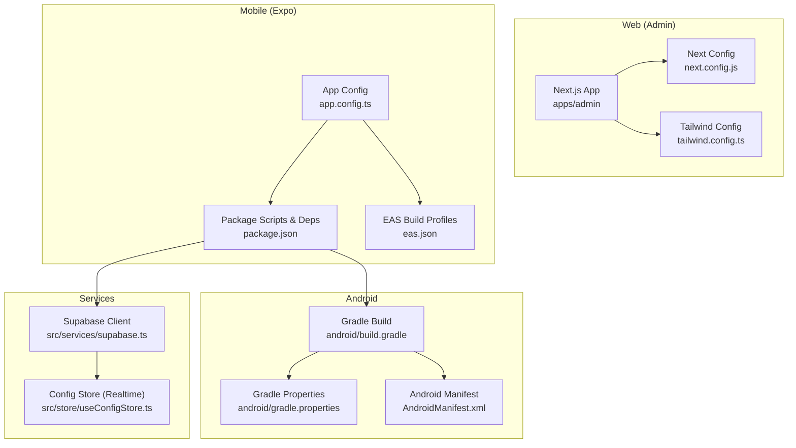
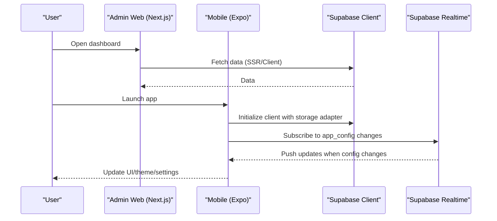
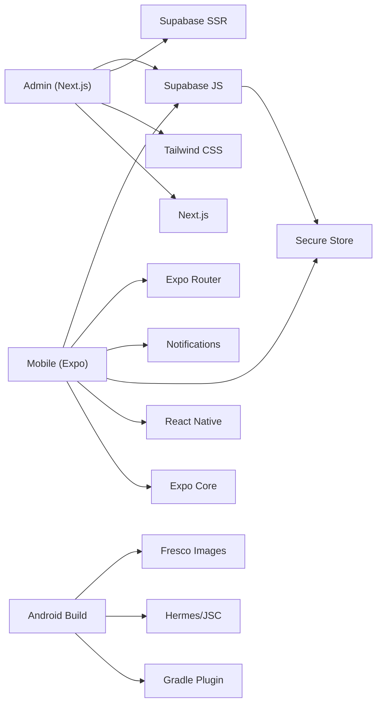

# Platform-Specific Troubleshooting

<cite>
**Referenced Files in This Document**
- [TROUBLESHOOTING.md](file://TROUBLESHOOTING.md)
- [apps/mobile/package.json](file://apps/mobile/package.json)
- [apps/mobile/app.config.ts](file://apps/mobile/app.config.ts)
- [apps/mobile/eas.json](file://apps/mobile/eas.json)
- [apps/mobile/android/build.gradle](file://apps/mobile/android/build.gradle)
- [apps/mobile/android/gradle.properties](file://apps/mobile/android/gradle.properties)
- [apps/mobile/android/app/src/main/AndroidManifest.xml](file://apps/mobile/android/app/src/main/AndroidManifest.xml)
- [apps/admin/package.json](file://apps/admin/package.json)
- [apps/admin/next.config.js](file://apps/admin/next.config.js)
- [apps/admin/tailwind.config.ts](file://apps/admin/tailwind.config.ts)
- [apps/mobile/src/services/supabase.ts](file://apps/mobile/src/services/supabase.ts)
- [apps/mobile/src/store/useConfigStore.ts](file://apps/mobile/src/store/useConfigStore.ts)
- [apps/mobile/src/constants/index.ts](file://apps/mobile/src/constants/index.ts)
</cite>

## Table of Contents
1. Introduction
2. Project Structure
3. Core Components
4. Architecture Overview
5. Detailed Component Analysis
6. Dependency Analysis
7. Performance Considerations
8. Troubleshooting Guide
9. Conclusion
10. Appendices

## Introduction
This document provides platform-specific troubleshooting for SocialPilot AI Pro across Web (Admin), iOS, and Android. It focuses on common issues such as browser compatibility, build failures, signing problems, responsive design, mobile features (push notifications, camera access, offline behavior), debugging techniques, performance optimizations, testing strategies, security considerations, and permission handling. The guidance is grounded in the repository’s configuration and source files to ensure accuracy and actionability.

## Project Structure
SocialPilot AI Pro is a monorepo with:
- Admin web app (Next.js) under apps/admin
- Mobile app (Expo + React Native) under apps/mobile with native Android project under apps/mobile/android
- Shared packages under packages
- Supabase backend functions and migrations under supabase

**Diagram sources**
- [apps/admin/next.config.js:1-8](file://apps/admin/next.config.js#L1-L8)
- [apps/admin/tailwind.config.ts:1-29](file://apps/admin/tailwind.config.ts#L1-L29)
- [apps/mobile/app.config.ts:1-42](file://apps/mobile/app.config.ts#L1-L42)
- [apps/mobile/package.json:1-53](file://apps/mobile/package.json#L1-L53)
- [apps/mobile/eas.json:1-18](file://apps/mobile/eas.json#L1-L18)
- [apps/mobile/android/build.gradle:1-183](file://apps/mobile/android/build.gradle#L1-L183)
- [apps/mobile/android/gradle.properties:1-63](file://apps/mobile/android/gradle.properties#L1-L63)
- [apps/mobile/android/app/src/main/AndroidManifest.xml:1-32](file://apps/mobile/android/app/src/main/AndroidManifest.xml#L1-L32)
- [apps/mobile/src/services/supabase.ts:1-41](file://apps/mobile/src/services/supabase.ts#L1-L41)
- [apps/mobile/src/store/useConfigStore.ts:1-66](file://apps/mobile/src/store/useConfigStore.ts#L1-L66)

**Section sources**
- [apps/admin/package.json:1-41](file://apps/admin/package.json#L1-L41)
- [apps/mobile/package.json:1-53](file://apps/mobile/package.json#L1-L53)
- [apps/mobile/app.config.ts:1-42](file://apps/mobile/app.config.ts#L1-L42)
- [apps/mobile/android/build.gradle:1-183](file://apps/mobile/android/build.gradle#L1-L183)
- [apps/mobile/android/gradle.properties:1-63](file://apps/mobile/android/gradle.properties#L1-L63)
- [apps/mobile/android/app/src/main/AndroidManifest.xml:1-32](file://apps/mobile/android/app/src/main/AndroidManifest.xml#L1-L32)

## Core Components
- Admin Web (Next.js): Uses Tailwind CSS for styling and Next.js config for transpiling shared packages.
- Mobile (Expo): Uses Expo Router, Secure Store, Notifications, Fonts, Image, Linking, and other Expo modules; builds via Gradle for Android.
- Supabase Integration: Cross-platform storage adapter for auth persistence; realtime config subscription with placeholder URL guard.

Key responsibilities:
- Web: Admin UI, charts, tables, forms, theme, and data fetching via Supabase SSR/JS client.
- Mobile: Navigation, theming, secure storage, push notification preferences, realtime config updates, and native integrations through Expo.
- Backend: Supabase functions and migrations for content generation and schema.

**Section sources**
- [apps/admin/next.config.js:1-8](file://apps/admin/next.config.js#L1-L8)
- [apps/admin/tailwind.config.ts:1-29](file://apps/admin/tailwind.config.ts#L1-L29)
- [apps/mobile/package.json:13-44](file://apps/mobile/package.json#L13-L44)
- [apps/mobile/src/services/supabase.ts:1-41](file://apps/mobile/src/services/supabase.ts#L1-L41)
- [apps/mobile/src/store/useConfigStore.ts:1-66](file://apps/mobile/src/store/useConfigStore.ts#L1-L66)

## Architecture Overview
The system integrates a Next.js admin panel and an Expo-based mobile app with Supabase services. The mobile app uses a cross-platform storage adapter to persist sessions and supports realtime configuration updates. Android builds are configured via Gradle with Hermes enabled and specific packaging options.

**Diagram sources**
- [apps/mobile/src/services/supabase.ts:1-41](file://apps/mobile/src/services/supabase.ts#L1-L41)
- [apps/mobile/src/store/useConfigStore.ts:39-66](file://apps/mobile/src/store/useConfigStore.ts#L39-L66)

## Detailed Component Analysis

### Web (Admin) Troubleshooting
Common issues and resolutions:
- Module resolution in monorepo: Ensure dependencies are installed from the root using the workspace manager so hoisted linking resolves correctly.
- Browser compatibility: Tailwind dark mode and strict React settings are configured; verify browser targets if polyfills are needed.
- Transpilation of shared packages: Next.js config includes transpilePackages for shared types and tokens.

Actions:
- Run install from the repository root to resolve workspace dependencies.
- Validate Tailwind content paths and dark mode class strategy.
- Confirm Next.js strict mode and transpilation settings for shared packages.

**Section sources**
- [TROUBLESHOOTING.md:3-11](file://TROUBLESHOOTING.md#L3-L11)
- [apps/admin/next.config.js:1-8](file://apps/admin/next.config.js#L1-L8)
- [apps/admin/tailwind.config.ts:1-29](file://apps/admin/tailwind.config.ts#L1-L29)

### iOS Troubleshooting
Build and runtime considerations:
- New architecture: Enabled in Expo config; ensure compatible versions of native modules and toolchains.
- Bundle identifier and scheme: Defined in Expo config; verify consistency with provisioning profiles and entitlements during EAS builds.
- Tablet support: Disabled by default; enable if required for your use case.

Actions:
- Verify Expo config values for bundleIdentifier and scheme match Apple developer account settings.
- Use EAS build profiles for development, preview, and production; confirm CLI version constraints.
- If encountering native module issues, update or align versions with new architecture requirements.

**Section sources**
- [apps/mobile/app.config.ts:17-20](file://apps/mobile/app.config.ts#L17-L20)
- [apps/mobile/eas.json:1-18](file://apps/mobile/eas.json#L1-L18)

### Android Troubleshooting
Build, signing, and permissions:
- Gradle properties: Hermes enabled, edge-to-edge display, image format toggles, and multi-arch support configured.
- Signing: Debug keystore configured; release builds should use a proper keystore and signing config.
- Permissions: Internet, storage (legacy), system alert window, and vibration permissions declared; deep link scheme configured.

Actions:
- For release builds, replace debug signing with a secure keystore and configure signingConfigs accordingly.
- Adjust minSdk/targetSdk and NDK/build tools versions as needed for device compatibility.
- Review permissions and queries for intent handling; ensure deep links work with the configured scheme.

**Section sources**
- [apps/mobile/android/gradle.properties:40-58](file://apps/mobile/android/gradle.properties#L40-L58)
- [apps/mobile/android/build.gradle:100-123](file://apps/mobile/android/build.gradle#L100-L123)
- [apps/mobile/android/app/src/main/AndroidManifest.xml:1-32](file://apps/mobile/android/app/src/main/AndroidManifest.xml#L1-L32)

### Responsive Design and Cross-Platform Differences
- Tailwind dark mode and brand colors are centralized; ensure components adapt to screen sizes and orientation.
- Mobile app uses Expo Router and safe area context; verify layout behavior across devices and orientations.
- Web vs. mobile storage: Supabase client uses a platform-aware storage adapter to persist sessions on web (localStorage) and mobile (Secure Store).

Actions:
- Test layouts on various breakpoints and device orientations.
- Validate session persistence differences between web and mobile environments.
- Use platform checks where necessary to handle feature availability.

**Section sources**
- [apps/admin/tailwind.config.ts:1-29](file://apps/admin/tailwind.config.ts#L1-L29)
- [apps/mobile/src/services/supabase.ts:5-26](file://apps/mobile/src/services/supabase.ts#L5-L26)

### Mobile Features: Push Notifications, Camera Access, Offline Functionality
- Push notifications: Preferences are persisted securely; integrate with expo-notations at runtime to request permissions and handle notifications.
- Camera access: UI elements indicate camera usage; ensure appropriate permissions and media picker integration are implemented in your flows.
- Offline functionality: Realtime config subscription guards against placeholder URLs to avoid network timeouts; cache configuration locally when possible.

Actions:
- Request notification permissions before sending or receiving notifications; store user preferences securely.
- Implement camera/media permissions and handle denied states gracefully.
- Detect placeholder environment and skip realtime subscriptions; provide fallback UI when offline.

**Section sources**
- [apps/mobile/src/store/useConfigStore.ts:15-20](file://apps/mobile/src/store/useConfigStore.ts#L15-L20)
- [apps/mobile/src/store/useConfigStore.ts:39-66](file://apps/mobile/src/store/useConfigStore.ts#L39-L66)
- [apps/mobile/src/constants/index.ts:15-20](file://apps/mobile/src/constants/index.ts#L15-L20)

## Dependency Analysis
Key dependencies and their roles:
- Admin Web: Next.js, React, Tailwind, TanStack Query/Table, Supabase SSR/JS client, form libraries.
- Mobile: Expo ecosystem (Router, Secure Store, Notifications, Fonts, Image, Linking, Splash Screen), React Native core, gesture handler, reanimated, safe area, screens, SVG, web support, Zustand state management.
- Android: Gradle plugin, Hermes/JSC selection, Fresco image support toggles, packaging options.

**Diagram sources**
- [apps/admin/package.json:11-30](file://apps/admin/package.json#L11-L30)
- [apps/mobile/package.json:13-44](file://apps/mobile/package.json#L13-L44)
- [apps/mobile/android/build.gradle:155-182](file://apps/mobile/android/build.gradle#L155-L182)

**Section sources**
- [apps/admin/package.json:11-30](file://apps/admin/package.json#L11-L30)
- [apps/mobile/package.json:13-44](file://apps/mobile/package.json#L13-L44)
- [apps/mobile/android/build.gradle:155-182](file://apps/mobile/android/build.gradle#L155-L182)

## Performance Considerations
- Enable Hermes for improved JS execution on Android; toggle via gradle properties.
- Minify and shrink resources in release builds; configure proguard rules and resource crunching.
- Use efficient image formats (GIF/WebP toggles) and consider disabling animated WebP on iOS due to lack of support.
- Avoid unnecessary realtime subscriptions on placeholder environments to prevent timeouts.

Recommendations:
- Profile startup times and bundle sizes; leverage code splitting and lazy loading where applicable.
- Cache configuration and frequently accessed data; invalidate caches appropriately.
- Monitor memory usage and GC events on mobile; optimize animations and heavy computations.

**Section sources**
- [apps/mobile/android/gradle.properties:40-58](file://apps/mobile/android/gradle.properties#L40-L58)
- [apps/mobile/android/build.gradle:108-123](file://apps/mobile/android/build.gradle#L108-L123)
- [apps/mobile/src/store/useConfigStore.ts:15-20](file://apps/mobile/src/store/useConfigStore.ts#L15-L20)

## Troubleshooting Guide

### Web (Admin)
- Monorepo module resolution errors: Install dependencies from the repository root to ensure workspace linking resolves correctly.
- Theme not updating in real-time: Ensure realtime replication is enabled for the relevant table in Supabase.

Steps:
- Reinstall dependencies from the root directory.
- Verify Supabase publications for realtime updates.

**Section sources**
- [TROUBLESHOOTING.md:3-11](file://TROUBLESHOOTING.md#L3-L11)
- [TROUBLESHOOTING.md:21-24](file://TROUBLESHOOTING.md#L21-L24)

### iOS
- Build failures related to new architecture: Confirm that all native modules support the new architecture and align versions.
- Provisioning/profile mismatches: Ensure bundleIdentifier and scheme match Apple Developer settings; validate EAS build profile configurations.

Steps:
- Check Expo config for bundleIdentifier and scheme.
- Use EAS build profiles for consistent builds; verify CLI version constraints.

**Section sources**
- [apps/mobile/app.config.ts:17-20](file://apps/mobile/app.config.ts#L17-L20)
- [apps/mobile/eas.json:1-18](file://apps/mobile/eas.json#L1-L18)

### Android
- Signing issues in release builds: Replace debug keystore with a secure keystore and configure signingConfigs for release builds.
- Permission-related crashes: Review declared permissions and ensure runtime requests are handled; verify deep link scheme.

Steps:
- Generate and configure a release keystore; update signingConfigs.
- Audit AndroidManifest permissions and queries; test deep links with the configured scheme.

**Section sources**
- [apps/mobile/android/build.gradle:100-123](file://apps/mobile/android/build.gradle#L100-L123)
- [apps/mobile/android/app/src/main/AndroidManifest.xml:1-32](file://apps/mobile/android/app/src/main/AndroidManifest.xml#L1-L32)

### Responsive Design
- Layout issues across devices: Validate Tailwind breakpoints and mobile safe areas; test in multiple orientations.
- Platform differences: Use platform checks for features like storage and APIs; ensure graceful fallbacks.

Steps:
- Test on various screen sizes and orientations.
- Implement platform-specific logic where necessary.

**Section sources**
- [apps/admin/tailwind.config.ts:1-29](file://apps/admin/tailwind.config.ts#L1-L29)
- [apps/mobile/src/services/supabase.ts:5-26](file://apps/mobile/src/services/supabase.ts#L5-L26)

### Mobile Features
- Push notifications: Persist preferences securely; request permissions and handle delivery.
- Camera access: Ensure permissions are requested and handled; integrate media pickers safely.
- Offline behavior: Guard realtime subscriptions against placeholder URLs; cache data locally.

Steps:
- Integrate notification permission flows and preference persistence.
- Implement camera/media permissions and error handling.
- Detect placeholder environments and disable realtime subscriptions; provide offline UI.

**Section sources**
- [apps/mobile/src/store/useConfigStore.ts:15-20](file://apps/mobile/src/store/useConfigStore.ts#L15-L20)
- [apps/mobile/src/store/useConfigStore.ts:39-66](file://apps/mobile/src/store/useConfigStore.ts#L39-L66)
- [apps/mobile/src/constants/index.ts:15-20](file://apps/mobile/src/constants/index.ts#L15-L20)

### Security and Permissions
- Session storage: Use platform-aware storage adapter to persist sessions securely on web and mobile.
- Permissions: Declare only necessary permissions; handle denial gracefully; ensure deep links are properly configured.

Steps:
- Validate storage adapter behavior across platforms.
- Review and minimize permissions; implement robust permission flows.

**Section sources**
- [apps/mobile/src/services/supabase.ts:5-26](file://apps/mobile/src/services/supabase.ts#L5-L26)
- [apps/mobile/android/app/src/main/AndroidManifest.xml:1-32](file://apps/mobile/android/app/src/main/AndroidManifest.xml#L1-L32)

## Conclusion
This guide consolidates platform-specific troubleshooting for SocialPilot AI Pro across Web, iOS, and Android. By addressing build configurations, permissions, responsive design, mobile features, and performance optimizations, teams can diagnose and resolve issues efficiently. Use the provided references to locate exact configuration points and apply targeted fixes aligned with the repository’s setup.

## Appendices

### Testing Strategies
- Web: Test across browsers and screen sizes; validate Tailwind breakpoints and dark mode behavior.
- iOS/Android: Test on multiple OS versions and device configurations; verify native module compatibility and performance.
- Cross-platform: Validate session persistence differences and feature availability; ensure graceful fallbacks.

[No sources needed since this section provides general guidance]

### Debugging Techniques
- Network inspector: Enable network inspector for development builds to inspect API calls and realtime connections.
- Logging: Centralize logs for critical flows (auth, realtime config, permissions); capture platform-specific errors.
- Profiling: Use platform profilers (browser devtools, Xcode Instruments, Android Studio Profiler) to identify bottlenecks.

[No sources needed since this section provides general guidance]