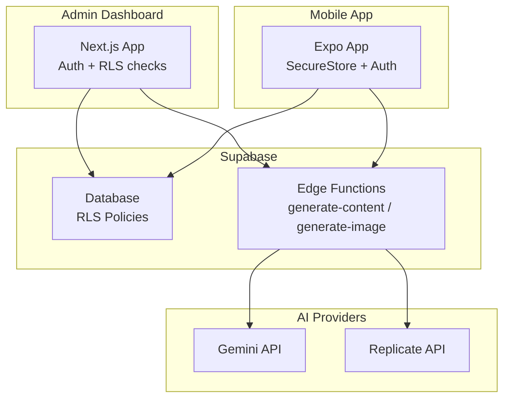
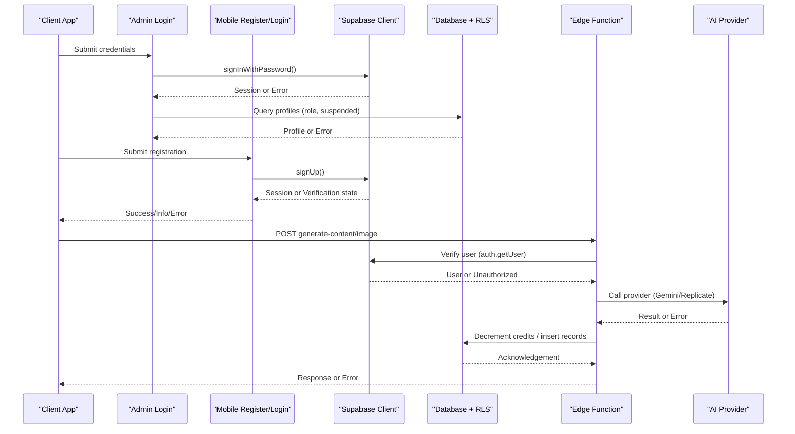
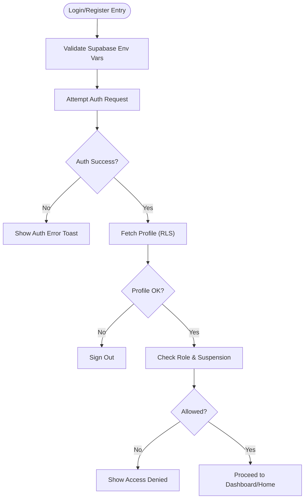
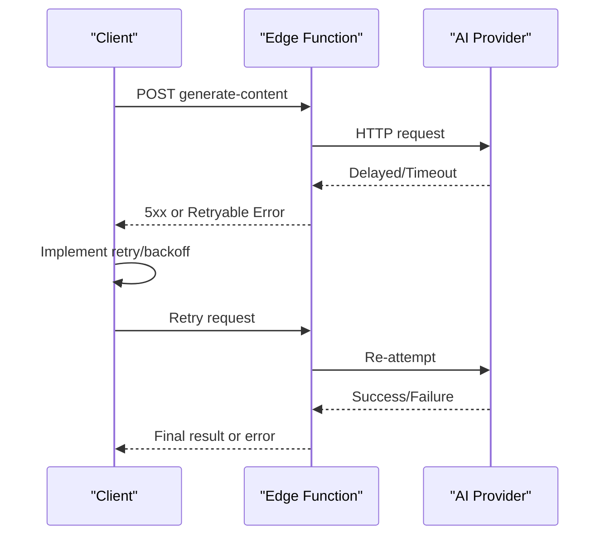
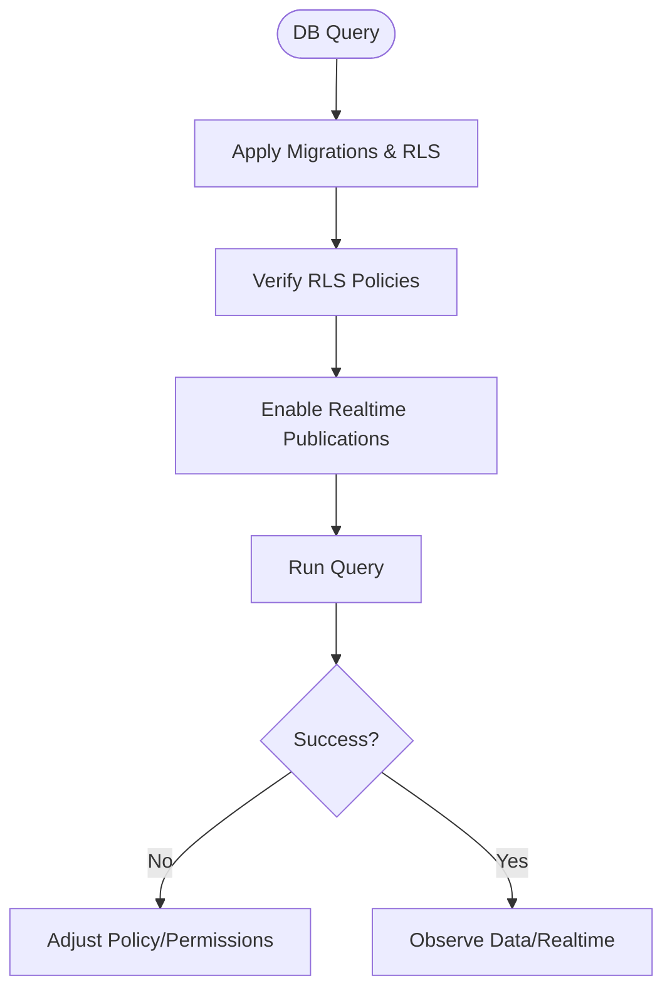
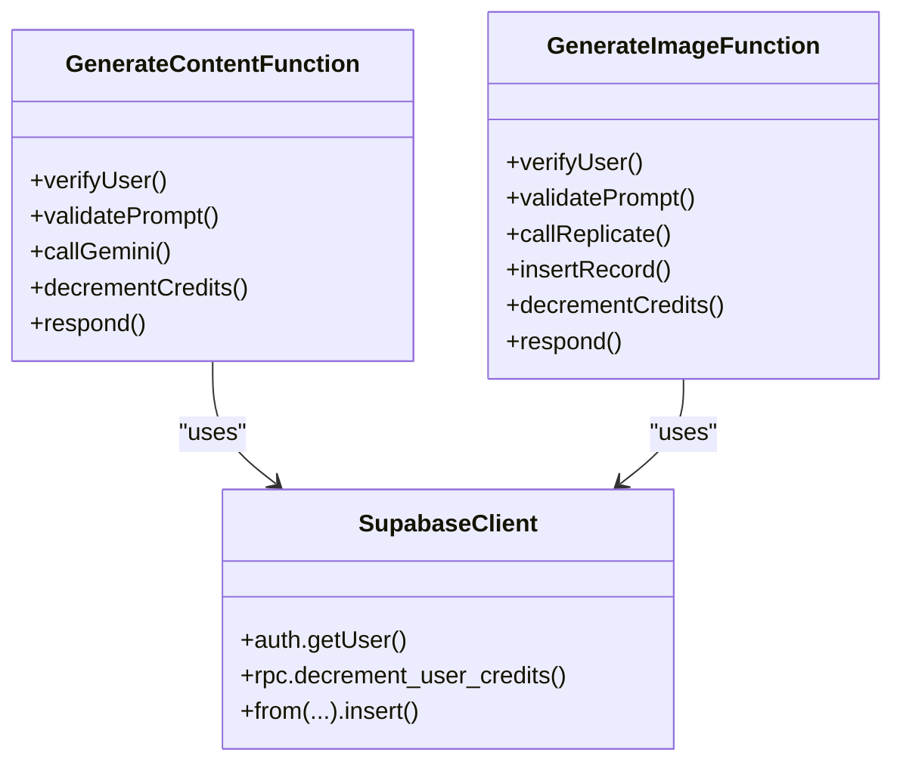
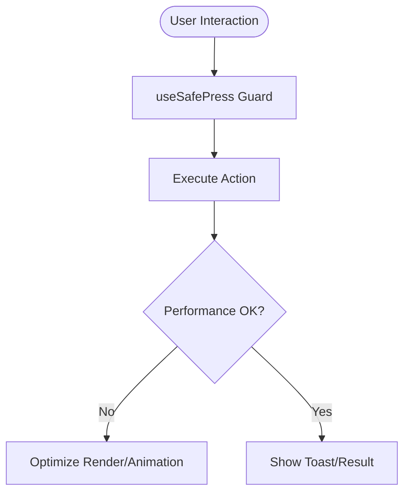
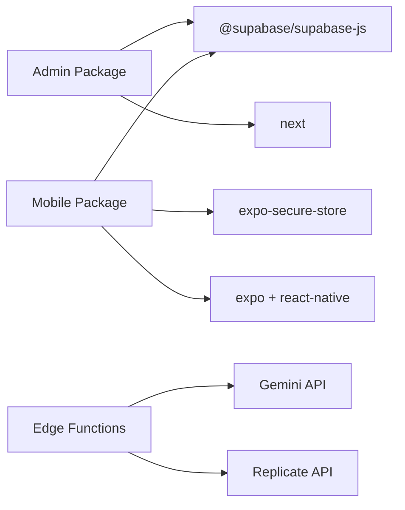

# Runtime Errors & Debugging

<cite>
**Referenced Files in This Document**
- [TROUBLESHOOTING.md](file://TROUBLESHOOTING.md)
- [apps/admin/src/lib/supabase.ts](file://apps/admin/src/lib/supabase.ts)
- [apps/mobile/src/services/supabase.ts](file://apps/mobile/src/services/supabase.ts)
- [apps/admin/src/app/(auth)/login/page.tsx](file://apps/admin/src/app/(auth)/login/page.tsx)
- [apps/mobile/src/app/(auth)/register.tsx](file://apps/mobile/src/app/(auth)/register.tsx)
- [supabase/functions/generate-content/index.ts](file://supabase/functions/generate-content/index.ts)
- [supabase/functions/generate-image/index.ts](file://supabase/functions/generate-image/index.ts)
- [supabase/migrations/20240001000000_initial_schema.sql](file://supabase/migrations/20240001000000_initial_schema.sql)
- [apps/mobile/src/hooks/useSafePress.ts](file://apps/mobile/src/hooks/useSafePress.ts)
- [apps/mobile/src/components/atoms/CustomToast.tsx](file://apps/mobile/src/components/atoms/CustomToast.tsx)
- [apps/admin/package.json](file://apps/admin/package.json)
- [apps/mobile/package.json](file://apps/mobile/package.json)
</cite>

## Table of Contents
1. Introduction
2. Project Structure
3. Core Components
4. Architecture Overview
5. Detailed Component Analysis
6. Dependency Analysis
7. Performance Considerations
8. Troubleshooting Guide
9. Conclusion
10. Appendices

## Introduction
This document provides comprehensive runtime error troubleshooting for SocialPilot AI Pro across the admin dashboard, mobile app, and backend services. It covers authentication failures, API timeouts, database connectivity issues, and AI service integration errors. It also includes debugging techniques for memory leaks, performance bottlenecks, and network connectivity problems, along with diagnostic tools, logging strategies, error handling patterns, retry mechanisms, fallback strategies, and step-by-step procedures for multi-service interactions.

## Project Structure
SocialPilot AI Pro is a monorepo with:
- Admin dashboard (Next.js) for administrative operations
- Mobile app (Expo/React Native) for end-user features
- Supabase Edge Functions for AI content and image generation
- Supabase database schema and Row Level Security policies

**Diagram sources**
- [apps/admin/src/lib/supabase.ts:1-14](file://apps/admin/src/lib/supabase.ts#L1-L14)
- [apps/mobile/src/services/supabase.ts:1-41](file://apps/mobile/src/services/supabase.ts#L1-L41)
- [supabase/functions/generate-content/index.ts:1-99](file://supabase/functions/generate-content/index.ts#L1-L99)
- [supabase/functions/generate-image/index.ts:1-87](file://supabase/functions/generate-image/index.ts#L1-L87)
- [supabase/migrations/20240001000000_initial_schema.sql:15-232](file://supabase/migrations/20240001000000_initial_schema.sql#L15-L232)

**Section sources**
- [apps/admin/package.json:1-41](file://apps/admin/package.json#L1-L41)
- [apps/mobile/package.json:1-53](file://apps/mobile/package.json#L1-L53)

## Core Components
- Authentication and session management via Supabase client in both apps
- Role-based access control enforced by database Row Level Security policies
- AI generation flows through Supabase Edge Functions with external provider calls
- User feedback via toast notifications and safe press guards to prevent duplicate submissions

Key responsibilities:
- Admin login flow validates credentials and role permissions before granting access
- Mobile registration/login handles network errors and user states
- Edge functions authenticate requests, call AI providers, update credits, and return results or errors
- Database schema defines tables, roles, and security policies

**Section sources**
- [apps/admin/src/app/(auth)/login/page.tsx:38-78](file://apps/admin/src/app/(auth)/login/page.tsx#L38-L78)
- [apps/mobile/src/app/(auth)/register.tsx:62-105](file://apps/mobile/src/app/(auth)/register.tsx#L62-L105)
- [supabase/functions/generate-content/index.ts:14-99](file://supabase/functions/generate-content/index.ts#L14-L99)
- [supabase/functions/generate-image/index.ts:14-87](file://supabase/functions/generate-image/index.ts#L14-L87)
- [supabase/migrations/20240001000000_initial_schema.sql:44-232](file://supabase/migrations/20240001000000_initial_schema.sql#L44-L232)

## Architecture Overview
The runtime architecture spans client apps, Supabase services, and external AI providers. Requests are authenticated, authorized via RLS, processed by Edge Functions, and may invoke Gemini or Replicate APIs. Responses include data or structured errors.

**Diagram sources**
- [apps/admin/src/app/(auth)/login/page.tsx:38-78](file://apps/admin/src/app/(auth)/login/page.tsx#L38-L78)
- [apps/mobile/src/app/(auth)/register.tsx:62-105](file://apps/mobile/src/app/(auth)/register.tsx#L62-L105)
- [supabase/functions/generate-content/index.ts:14-99](file://supabase/functions/generate-content/index.ts#L14-L99)
- [supabase/functions/generate-image/index.ts:14-87](file://supabase/functions/generate-image/index.ts#L14-L87)
- [supabase/migrations/20240001000000_initial_schema.sql:159-202](file://supabase/migrations/20240001000000_initial_schema.sql#L159-L202)

## Detailed Component Analysis

### Authentication Failures
Symptoms:
- Invalid credentials
- Access denied due to insufficient role
- Account suspended
- Network errors during auth

Debugging steps:
- Verify environment variables for Supabase URL and anon key in both apps
- Confirm RLS policies allow reading profiles and enforcing roles
- Check that admin role is set correctly in profiles table
- Inspect toast messages and error responses from auth endpoints

Error handling patterns:
- Admin login shows specific errors for invalid credentials, profile verification failure, suspension, and missing privileges
- Mobile registration handles network errors and displays appropriate toasts

**Diagram sources**
- [apps/admin/src/app/(auth)/login/page.tsx:38-78](file://apps/admin/src/app/(auth)/login/page.tsx#L38-L78)
- [apps/mobile/src/app/(auth)/register.tsx:62-105](file://apps/mobile/src/app/(auth)/register.tsx#L62-L105)
- [supabase/migrations/20240001000000_initial_schema.sql:178-186](file://supabase/migrations/20240001000000_initial_schema.sql#L178-L186)

**Section sources**
- [apps/admin/src/lib/supabase.ts:1-14](file://apps/admin/src/lib/supabase.ts#L1-L14)
- [apps/mobile/src/services/supabase.ts:1-41](file://apps/mobile/src/services/supabase.ts#L1-L41)
- [apps/admin/src/app/(auth)/login/page.tsx:38-78](file://apps/admin/src/app/(auth)/login/page.tsx#L38-L78)
- [apps/mobile/src/app/(auth)/register.tsx:62-105](file://apps/mobile/src/app/(auth)/register.tsx#L62-L105)
- [TROUBLESHOOTING.md:9-17](file://TROUBLESHOOTING.md#L9-L17)

### API Timeout Issues
Symptoms:
- Slow or failing AI generation requests
- Timeouts when calling external AI providers
- Intermittent network errors

Debugging steps:
- Inspect Edge Function logs for request duration and provider response times
- Validate provider API keys and quotas
- Add retries with exponential backoff at the client or function level
- Use circuit breaker patterns to fail fast on repeated provider failures

Error handling patterns:
- Edge functions return structured errors with status codes
- Clients display toasts for network errors and provide retry options

**Diagram sources**
- [supabase/functions/generate-content/index.ts:48-99](file://supabase/functions/generate-content/index.ts#L48-L99)
- [supabase/functions/generate-image/index.ts:38-87](file://supabase/functions/generate-image/index.ts#L38-L87)

**Section sources**
- [supabase/functions/generate-content/index.ts:48-99](file://supabase/functions/generate-content/index.ts#L48-L99)
- [supabase/functions/generate-image/index.ts:38-87](file://supabase/functions/generate-image/index.ts#L38-L87)

### Database Connection Problems
Symptoms:
- Empty query results
- Permission denied errors
- Realtime updates not reflecting

Debugging steps:
- Ensure migrations are applied and RLS policies exist
- Verify realtime publications for relevant tables
- Confirm Supabase URL and anon key are correct in both apps
- Test queries directly in the Supabase SQL editor

Error handling patterns:
- RLS policies restrict access based on roles and ownership
- Misconfigured policies lead to permission denied errors

**Diagram sources**
- [supabase/migrations/20240001000000_initial_schema.sql:159-232](file://supabase/migrations/20240001000000_initial_schema.sql#L159-L232)
- [TROUBLESHOOTING.md:9-11](file://TROUBLESHOOTING.md#L9-L11)

**Section sources**
- [supabase/migrations/20240001000000_initial_schema.sql:159-232](file://supabase/migrations/20240001000000_initial_schema.sql#L159-L232)
- [TROUBLESHOOTING.md:9-11](file://TROUBLESHOOTING.md#L9-L11)

### AI Service Integration Errors
Symptoms:
- Unauthorized responses from Edge Functions
- Missing prompts or invalid parameters
- Provider-specific failures (e.g., missing API keys)

Debugging steps:
- Validate Authorization header propagation in Edge Functions
- Ensure required environment variables (API keys) are configured
- Check input validation and default behaviors when keys are missing
- Review credit deduction and record insertion outcomes

Error handling patterns:
- Edge functions validate user identity and inputs
- Fallback behavior returns mock data when provider keys are absent
- Errors are returned with JSON payloads and appropriate status codes

**Diagram sources**
- [supabase/functions/generate-content/index.ts:14-99](file://supabase/functions/generate-content/index.ts#L14-L99)
- [supabase/functions/generate-image/index.ts:14-87](file://supabase/functions/generate-image/index.ts#L14-L87)

**Section sources**
- [supabase/functions/generate-content/index.ts:14-99](file://supabase/functions/generate-content/index.ts#L14-L99)
- [supabase/functions/generate-image/index.ts:14-87](file://supabase/functions/generate-image/index.ts#L14-L87)

### Memory Leaks and Performance Bottlenecks
Symptoms:
- UI freezes or unresponsive interactions
- Excessive re-renders or animations causing jank
- Long-running tasks blocking the main thread

Debugging steps:
- Use React DevTools Profiler to identify expensive components and unnecessary re-renders
- Monitor animation performance in mobile app; ensure animations use shared values and run on native thread where possible
- Debounce or throttle frequent actions; use safe press guards to prevent rapid taps
- Profile network requests and database queries; add caching where appropriate

Error handling patterns:
- Safe press hook prevents duplicate submissions and reduces redundant work
- Toast system provides immediate feedback without blocking UI

**Diagram sources**
- [apps/mobile/src/hooks/useSafePress.ts:1-33](file://apps/mobile/src/hooks/useSafePress.ts#L1-L33)
- [apps/mobile/src/components/atoms/CustomToast.tsx:1-197](file://apps/mobile/src/components/atoms/CustomToast.tsx#L1-L197)

**Section sources**
- [apps/mobile/src/hooks/useSafePress.ts:1-33](file://apps/mobile/src/hooks/useSafePress.ts#L1-L33)
- [apps/mobile/src/components/atoms/CustomToast.tsx:1-197](file://apps/mobile/src/components/atoms/CustomToast.tsx#L1-L197)

### Network Connectivity Issues
Symptoms:
- Unable to reach authentication server
- Intermittent failures in AI generation
- CORS or origin mismatches

Debugging steps:
- Verify environment URLs and keys for Supabase in both apps
- Check CORS headers in Edge Functions
- Use browser/network inspector to inspect failed requests and responses
- Implement retry logic with backoff and circuit breaking for resilient connections

Error handling patterns:
- Mobile registration catches network errors and shows informative toasts
- Edge functions return consistent error structures for clients to handle

**Section sources**
- [apps/mobile/src/app/(auth)/register.tsx:62-105](file://apps/mobile/src/app/(auth)/register.tsx#L62-L105)
- [supabase/functions/generate-content/index.ts:4-99](file://supabase/functions/generate-content/index.ts#L4-L99)
- [supabase/functions/generate-image/index.ts:4-87](file://supabase/functions/generate-image/index.ts#L4-L87)

## Dependency Analysis
Key dependencies and their roles:
- Supabase JS client for auth and database access in both apps
- Expo Secure Store for secure session persistence on mobile
- Next.js and React ecosystem for admin dashboard
- Expo and React Native for mobile app runtime
- External AI providers (Gemini, Replicate) invoked via Edge Functions

**Diagram sources**
- [apps/admin/package.json:11-31](file://apps/admin/package.json#L11-L31)
- [apps/mobile/package.json:13-45](file://apps/mobile/package.json#L13-L45)
- [supabase/functions/generate-content/index.ts:48-79](file://supabase/functions/generate-content/index.ts#L48-L79)
- [supabase/functions/generate-image/index.ts:38-62](file://supabase/functions/generate-image/index.ts#L38-L62)

**Section sources**
- [apps/admin/package.json:11-31](file://apps/admin/package.json#L11-L31)
- [apps/mobile/package.json:13-45](file://apps/mobile/package.json#L13-L45)

## Performance Considerations
- Prefer client-side caching for frequently accessed data
- Minimize re-renders using memoization and efficient state management
- Use animations judiciously; leverage shared values and native-driven animations
- Implement retries with exponential backoff for flaky network calls
- Monitor Edge Function execution time and optimize provider calls

[No sources needed since this section provides general guidance]

## Troubleshooting Guide
Common issues and resolutions:
- Module resolution issues in monorepo: Install dependencies from root folder to ensure proper hoisting
- Supabase queries returning empty arrays or permission denied: Apply migrations and verify RLS policies
- Admin login access denied: Update user role in profiles table to admin or super_admin
- Realtime theme colors not updating on mobile: Enable realtime replication for relevant tables

Logging strategies:
- Log request IDs and timestamps in Edge Functions for traceability
- Capture error stacks and context in client apps
- Use toast notifications to surface actionable errors to users

Retry mechanisms and fallbacks:
- Implement retry with backoff for transient network errors
- Provide fallback responses when provider keys are missing or services are down
- Gracefully degrade functionality while preserving user experience

Step-by-step debugging for multi-service interactions:
1. Verify environment configuration in both apps
2. Confirm Supabase connection and RLS policies
3. Authenticate and check role permissions
4. Trigger AI generation and observe Edge Function logs
5. Validate provider responses and credit deductions
6. Inspect client-side toasts and error messages
7. Iterate on fixes and retest end-to-end

**Section sources**
- [TROUBLESHOOTING.md:3-23](file://TROUBLESHOOTING.md#L3-L23)
- [apps/admin/src/app/(auth)/login/page.tsx:38-78](file://apps/admin/src/app/(auth)/login/page.tsx#L38-L78)
- [apps/mobile/src/app/(auth)/register.tsx:62-105](file://apps/mobile/src/app/(auth)/register.tsx#L62-L105)
- [supabase/migrations/20240001000000_initial_schema.sql:159-232](file://supabase/migrations/20240001000000_initial_schema.sql#L159-L232)

## Conclusion
This guide consolidates runtime error diagnosis and debugging practices across SocialPilot AI Pro’s admin dashboard, mobile app, and backend services. By following the outlined steps, leveraging provided error handling patterns, and applying robust retry and fallback strategies, teams can quickly identify root causes and maintain reliable multi-service interactions.

[No sources needed since this section summarizes without analyzing specific files]

## Appendices
- Environment variables checklist:
  - NEXT_PUBLIC_SUPABASE_URL and NEXT_PUBLIC_SUPABASE_ANON_KEY for admin
  - EXPO_PUBLIC_SUPABASE_URL and EXPO_PUBLIC_SUPABASE_ANON_KEY for mobile
  - GEMINI_API_KEY and REPLICATE_API_TOKEN for Edge Functions
- Recommended monitoring:
  - Edge Function execution metrics
  - Database query performance
  - Client-side error tracking and analytics

[No sources needed since this section provides general guidance]