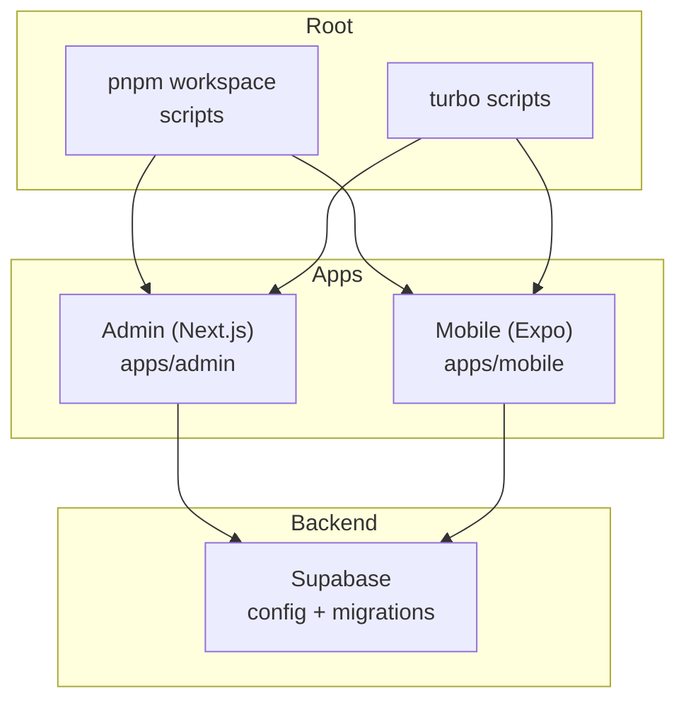
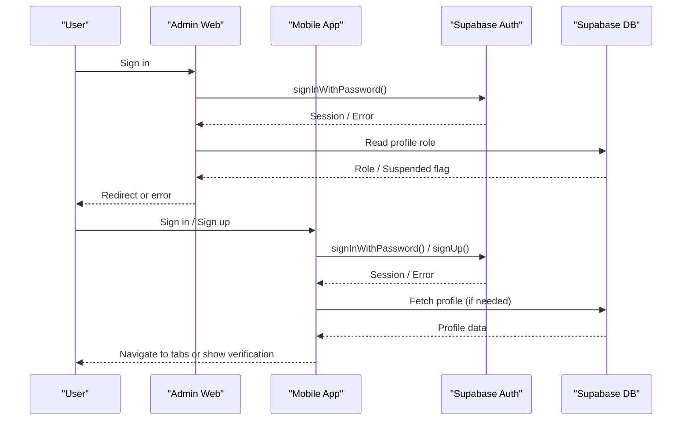
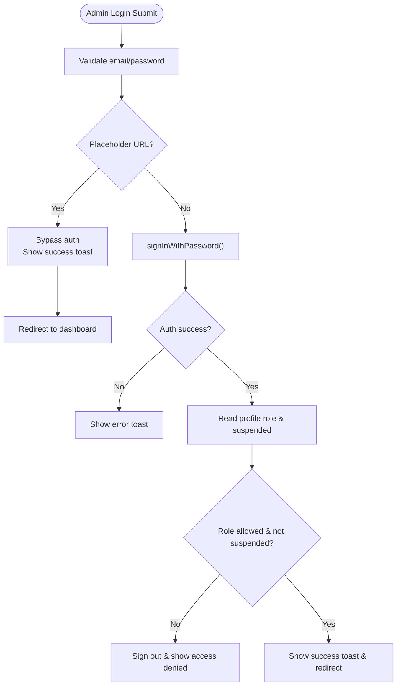
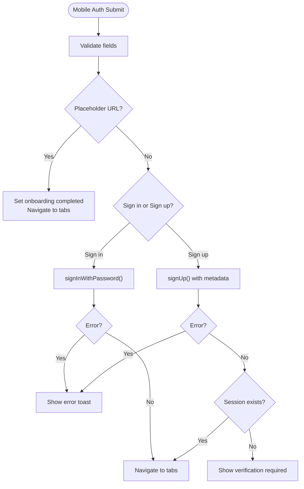
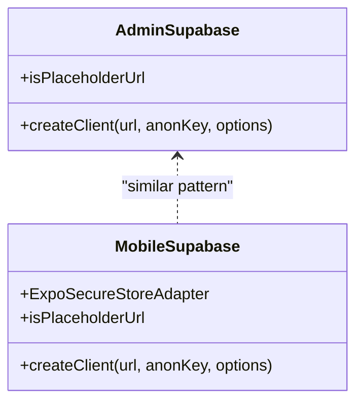
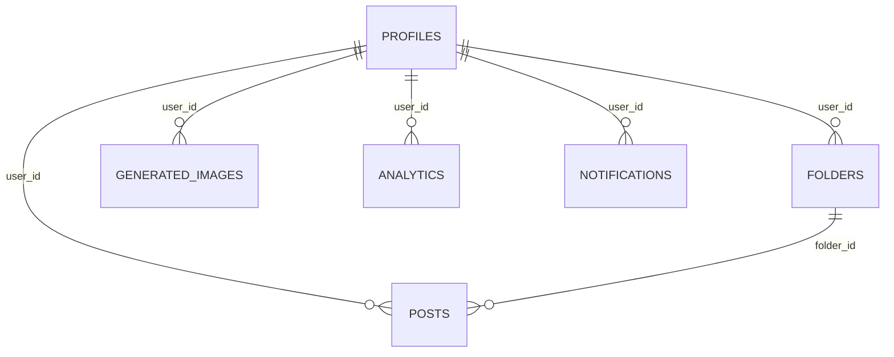
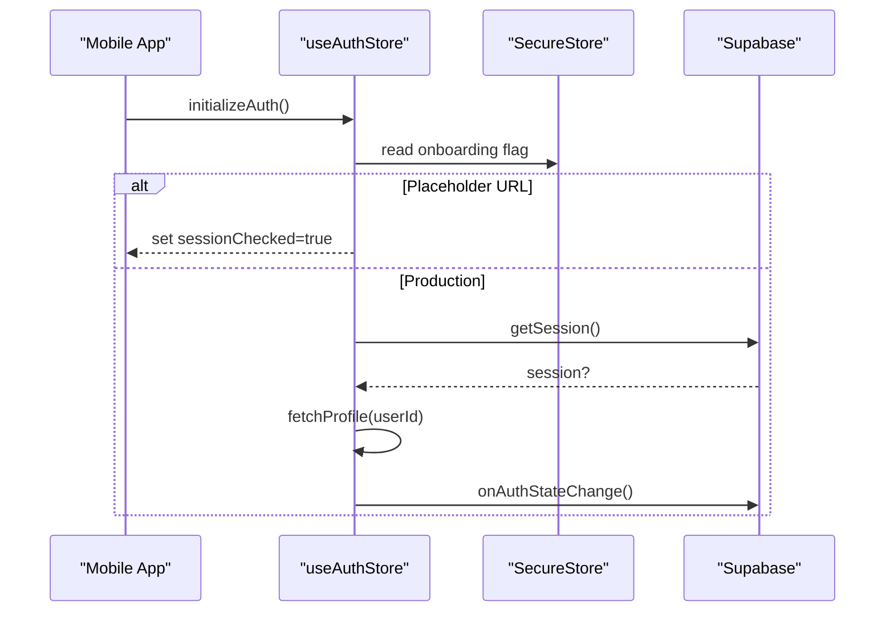
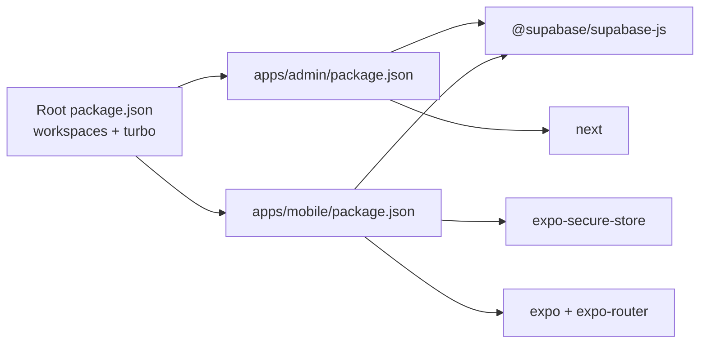

# Troubleshooting & FAQ

<cite>
**Referenced Files in This Document**
- [TROUBLESHOOTING.md](file://TROUBLESHOOTING.md)
- [README.md](file://README.md)
- [package.json](file://package.json)
- [apps/admin/package.json](file://apps/admin/package.json)
- [apps/mobile/package.json](file://apps/mobile/package.json)
- [supabase/config.toml](file://supabase/config.toml)
- [apps/admin/src/lib/supabase.ts](file://apps/admin/src/lib/supabase.ts)
- [apps/mobile/src/services/supabase.ts](file://apps/mobile/src/services/supabase.ts)
- [supabase/migrations/20240001000000_initial_schema.sql](file://supabase/migrations/20240001000000_initial_schema.sql)
- [apps/admin/src/app/(auth)/login/page.tsx](file://apps/admin/src/app/(auth)/login/page.tsx)
- [apps/mobile/src/app/(auth)/login.tsx](file://apps/mobile/src/app/(auth)/login.tsx)
- [apps/mobile/src/store/useAuthStore.ts](file://apps/mobile/src/store/useAuthStore.ts)
- [apps/mobile/app.config.ts](file://apps/mobile/app.config.ts)
- [apps/admin/next.config.js](file://apps/admin/next.config.js)
</cite>

## Table of Contents
1. Introduction
2. Project Structure
3. Core Components
4. Architecture Overview
5. Detailed Component Analysis
6. Dependency Analysis
7. Performance Considerations
8. Troubleshooting Guide
9. Conclusion
10. Appendices

## Introduction
This document provides comprehensive troubleshooting and FAQ guidance for SocialPilot AI Pro across development, deployment, and production. It covers authentication problems, API integration issues, database connectivity, mobile-specific errors, performance diagnostics, rollback strategies, and emergency recovery procedures for both web (Admin) and mobile apps.

## Project Structure
SocialPilot AI Pro is a monorepo with:
- Admin web app (Next.js) under apps/admin
- Mobile app (Expo/React Native) under apps/mobile
- Shared packages under packages/*
- Supabase backend configuration and migrations under supabase/*
- Root orchestration via pnpm workspaces and Turbo scripts

**Diagram sources**
- [package.json:5-15](file://package.json#L5-L15)
- [apps/admin/package.json:1-10](file://apps/admin/package.json#L1-L10)
- [apps/mobile/package.json:1-12](file://apps/mobile/package.json#L1-L12)
- [supabase/config.toml:1-2](file://supabase/config.toml#L1-L2)

**Section sources**
- [package.json:5-15](file://package.json#L5-L15)
- [apps/admin/package.json:1-10](file://apps/admin/package.json#L1-L10)
- [apps/mobile/package.json:1-12](file://apps/mobile/package.json#L1-L12)
- [supabase/config.toml:1-2](file://supabase/config.toml#L1-L2)

## Core Components
- Supabase client initialization for Admin and Mobile
- Authentication flows (sign-in/sign-up) in Admin and Mobile
- Database schema and Row Level Security policies
- Realtime subscriptions for live updates
- Environment-driven placeholder mode for local development

Key implementation points:
- Admin Supabase client uses environment variables and enables session persistence and token refresh.
- Mobile Supabase client adapts storage to SecureStore on native and localStorage on web, with session detection disabled by design.
- Login pages implement placeholder bypass for rapid local testing and validate roles or onboarding state accordingly.
- Schema defines RLS policies and realtime publications for key tables.

**Section sources**
- [apps/admin/src/lib/supabase.ts:1-14](file://apps/admin/src/lib/supabase.ts#L1-L14)
- [apps/mobile/src/services/supabase.ts:1-41](file://apps/mobile/src/services/supabase.ts#L1-L41)
- [apps/admin/src/app/(auth)/login/page.tsx:15-78](file://apps/admin/src/app/(auth)/login/page.tsx#L15-L78)
- [apps/mobile/src/app/(auth)/login.tsx:76-142](file://apps/mobile/src/app/(auth)/login.tsx#L76-L142)
- [supabase/migrations/20240001000000_initial_schema.sql:155-232](file://supabase/migrations/20240001000000_initial_schema.sql#L155-L232)

## Architecture Overview
The system integrates Next.js admin and Expo mobile clients with Supabase for auth, database, and realtime features. Placeholder URLs enable offline/local development without network dependencies.

**Diagram sources**
- [apps/admin/src/app/(auth)/login/page.tsx:22-78](file://apps/admin/src/app/(auth)/login/page.tsx#L22-L78)
- [apps/mobile/src/app/(auth)/login.tsx:92-142](file://apps/mobile/src/app/(auth)/login.tsx#L92-L142)
- [apps/admin/src/lib/supabase.ts:1-14](file://apps/admin/src/lib/supabase.ts#L1-L14)
- [apps/mobile/src/services/supabase.ts:1-41](file://apps/mobile/src/services/supabase.ts#L1-L41)

## Detailed Component Analysis

### Authentication Flow (Admin Web)
- Validates inputs, supports placeholder bypass for local dev
- Authenticates via Supabase
- Checks profile role and suspension status
- Navigates or shows errors

**Diagram sources**
- [apps/admin/src/app/(auth)/login/page.tsx:15-78](file://apps/admin/src/app/(auth)/login/page.tsx#L15-L78)

**Section sources**
- [apps/admin/src/app/(auth)/login/page.tsx:15-78](file://apps/admin/src/app/(auth)/login/page.tsx#L15-L78)

### Authentication Flow (Mobile)
- Validates inputs using schema
- Supports placeholder bypass for instant local flow
- Handles sign-in and sign-up with appropriate user feedback
- Persists onboarding state locally

**Diagram sources**
- [apps/mobile/src/app/(auth)/login.tsx:76-142](file://apps/mobile/src/app/(auth)/login.tsx#L76-L142)

**Section sources**
- [apps/mobile/src/app/(auth)/login.tsx:76-142](file://apps/mobile/src/app/(auth)/login.tsx#L76-L142)

### Supabase Client Configuration
- Admin: Uses NEXT_PUBLIC env vars; enables session persistence and auto-refresh
- Mobile: Uses EXPO_PUBLIC env vars; custom storage adapter for SecureStore/localStorage; disables session detection in URL

**Diagram sources**
- [apps/admin/src/lib/supabase.ts:1-14](file://apps/admin/src/lib/supabase.ts#L1-L14)
- [apps/mobile/src/services/supabase.ts:1-41](file://apps/mobile/src/services/supabase.ts#L1-L41)

**Section sources**
- [apps/admin/src/lib/supabase.ts:1-14](file://apps/admin/src/lib/supabase.ts#L1-L14)
- [apps/mobile/src/services/supabase.ts:1-41](file://apps/mobile/src/services/supabase.ts#L1-L41)

### Database Schema and Security
- Defines core tables: app_config, ai_config, profiles, folders, posts, templates, generated_images, analytics, notifications, admin_logs
- Enables Row Level Security (RLS) with policies per table
- Auto-creates profile on user signup via trigger
- Publishes selected tables for realtime

**Diagram sources**
- [supabase/migrations/20240001000000_initial_schema.sql:15-153](file://supabase/migrations/20240001000000_initial_schema.sql#L15-L153)

**Section sources**
- [supabase/migrations/20240001000000_initial_schema.sql:155-232](file://supabase/migrations/20240001000000_initial_schema.sql#L155-L232)

### Mobile Auth Store and Onboarding
- Initializes auth state and listens for session changes
- Bypasses network calls when placeholder URL is used
- Stores onboarding completion securely

**Diagram sources**
- [apps/mobile/src/store/useAuthStore.ts:24-61](file://apps/mobile/src/store/useAuthStore.ts#L24-L61)

**Section sources**
- [apps/mobile/src/store/useAuthStore.ts:24-61](file://apps/mobile/src/store/useAuthStore.ts#L24-L61)

## Dependency Analysis
- Monorepo uses pnpm workspaces and Turbo for orchestration
- Admin depends on Next.js, React, Supabase JS, UI libraries
- Mobile depends on Expo, React Native, Supabase JS, secure storage
- Supabase config file present for local setup

**Diagram sources**
- [package.json:5-15](file://package.json#L5-L15)
- [apps/admin/package.json:11-31](file://apps/admin/package.json#L11-L31)
- [apps/mobile/package.json:13-44](file://apps/mobile/package.json#L13-L44)

**Section sources**
- [package.json:5-15](file://package.json#L5-L15)
- [apps/admin/package.json:11-31](file://apps/admin/package.json#L11-L31)
- [apps/mobile/package.json:13-44](file://apps/mobile/package.json#L13-L44)

## Performance Considerations
- Use placeholder URL mode during local development to avoid network latency and speed up iteration
- Ensure Supabase RLS policies are correctly applied to prevent unnecessary query failures
- Prefer minimal queries and leverage realtime only where necessary
- Monitor mobile storage usage for sessions and onboarding flags

[No sources needed since this section provides general guidance]

## Troubleshooting Guide

### Common Issues and Solutions

- Expo/Metro module resolution in monorepo
  - Cause: Dependencies not hoisted due to incorrect install location
  - Solution: Run pnpm install from the repository root so .npmrc resolves workspace dependencies
  - Reference: [TROUBLESHOOTING.md:3-6](file://TROUBLESHOOTING.md#L3-L6)

- Supabase queries return empty arrays or permission denied
  - Cause: Missing or incorrect Row Level Security policies
  - Solution: Apply initial schema migration in Supabase SQL editor to create policies
  - Reference: [TROUBLESHOOTING.md:9-12](file://TROUBLESHOOTING.md#L9-L12), [supabase/migrations/..._initial_schema.sql:155-203](file://supabase/migrations/20240001000000_initial_schema.sql#L155-L203)

- Admin login says “Access Denied: Admin privileges required”
  - Cause: User role not set to admin or super_admin
  - Solution: Update profiles.role to admin or super_admin in Supabase Table Editor
  - Reference: [TROUBLESHOOTING.md:15-18](file://TROUBLESHOOTING.md#L15-L18)

- Realtime theme colors do not update on mobile
  - Cause: Realtime publication missing for app_config
  - Solution: Enable realtime replication for app_config in Supabase dashboard
  - Reference: [TROUBLESHOOTING.md:21-24](file://TROUBLESHOOTING.md#L21-L24), [supabase/migrations/..._initial_schema.sql:227-232](file://supabase/migrations/20240001000000_initial_schema.sql#L227-L232)

### Debugging Authentication Problems

- Symptoms
  - Sign-in fails or redirects unexpectedly
  - Placeholder mode behaves differently than expected
  - Mobile shows “Connection Error”

- Diagnostic steps
  - Verify environment variables for Supabase URL and anon key in both Admin and Mobile
  - Confirm placeholder URL detection logic is active during local development
  - Check that Supabase auth is enabled and credentials are correct
  - For mobile, ensure SecureStore is available and platform-specific storage works

- Resolution
  - Set correct NEXT_PUBLIC_SUPABASE_URL and NEXT_PUBLIC_SUPABASE_ANON_KEY for Admin
  - Set correct EXPO_PUBLIC_SUPABASE_URL and EXPO_PUBLIC_SUPABASE_ANON_KEY for Mobile
  - If placeholder URL is used, expect bypass behavior and no network calls
  - Review login flows for proper error handling and navigation

**Section sources**
- [apps/admin/src/lib/supabase.ts:1-14](file://apps/admin/src/lib/supabase.ts#L1-L14)
- [apps/mobile/src/services/supabase.ts:1-41](file://apps/mobile/src/services/supabase.ts#L1-L41)
- [apps/admin/src/app/(auth)/login/page.tsx:22-78](file://apps/admin/src/app/(auth)/login/page.tsx#L22-L78)
- [apps/mobile/src/app/(auth)/login.tsx:92-142](file://apps/mobile/src/app/(auth)/login.tsx#L92-L142)

### API Integration Issues

- Symptoms
  - Queries return empty results
  - Realtime events not received
  - Policies block writes

- Diagnostic steps
  - Confirm RLS policies exist and match intended access model
  - Validate that realtime publications include required tables
  - Test queries with authenticated user context and verify user_id matches policy constraints

- Resolution
  - Re-run initial schema migration to ensure policies and functions are created
  - Add missing realtime publications if needed
  - Adjust policies to allow intended operations while maintaining security

**Section sources**
- [supabase/migrations/20240001000000_initial_schema.sql:155-232](file://supabase/migrations/20240001000000_initial_schema.sql#L155-L232)

### Database Connectivity Problems

- Symptoms
  - Cannot connect to Supabase
  - Placeholder mode still attempts network calls
  - Errors related to environment variables

- Diagnostic steps
  - Check that placeholder URL detection is working in both Admin and Mobile
  - Verify environment variables are loaded at runtime
  - Ensure Supabase project is reachable and keys are valid

- Resolution
  - Correct environment variable names and values
  - Temporarily use placeholder URL to isolate network issues
  - Validate Supabase project settings and network firewall rules

**Section sources**
- [apps/admin/src/lib/supabase.ts:1-14](file://apps/admin/src/lib/supabase.ts#L1-L14)
- [apps/mobile/src/services/supabase.ts:1-41](file://apps/mobile/src/services/supabase.ts#L1-L41)

### Mobile-Specific Errors

- Symptoms
  - SecureStore errors on iOS/Android
  - Web build does not persist sessions
  - Splash screen or app name mismatch

- Diagnostic steps
  - Confirm expo-secure-store plugin is included in app config
  - Validate platform-specific storage adapter behavior
  - Check app config for name, scheme, and bundle identifiers

- Resolution
  - Ensure plugins array includes expo-secure-store
  - Use SecureStore on native and localStorage on web as implemented
  - Align app config with branding and platform requirements

**Section sources**
- [apps/mobile/src/services/supabase.ts:1-41](file://apps/mobile/src/services/supabase.ts#L1-L41)
- [apps/mobile/app.config.ts:1-42](file://apps/mobile/app.config.ts#L1-L42)

### Frequently Asked Questions

- How do I run the monorepo locally?
  - Install dependencies from the root folder using pnpm to ensure workspace linking
  - Use provided scripts to start Admin and Mobile apps

- Why does Admin login bypass authentication locally?
  - Placeholder URL triggers a fast dev bypass to test UI without network overhead

- How do I grant admin access to a user?
  - Update the profiles.role column to admin or super_admin in Supabase

- How do I enable realtime updates for theme colors?
  - Ensure realtime publication includes app_config and other relevant tables

**Section sources**
- [package.json:9-15](file://package.json#L9-L15)
- [apps/admin/src/app/(auth)/login/page.tsx:22-31](file://apps/admin/src/app/(auth)/login/page.tsx#L22-L31)
- [TROUBLESHOOTING.md:9-24](file://TROUBLESHOOTING.md#L9-L24)

### Step-by-Step Resolution Procedures

- Fixing RLS-related query failures
  1. Open Supabase SQL editor
  2. Execute the initial schema migration to create policies and functions
  3. Verify realtime publications for required tables
  4. Re-test queries with authenticated user context

- Resolving admin access denied
  1. In Supabase Table Editor, locate your user’s profile
  2. Update role to admin or super_admin
  3. Re-login to Admin and confirm access

- Enabling realtime theme updates on mobile
  1. Go to Supabase Dashboard → Database → Publications
  2. Ensure supabase_realtime includes app_config
  3. Restart mobile app to pick up realtime changes

**Section sources**
- [supabase/migrations/20240001000000_initial_schema.sql:155-232](file://supabase/migrations/20240001000000_initial_schema.sql#L155-L232)
- [TROUBLESHOOTING.md:9-24](file://TROUBLESHOOTING.md#L9-L24)

### Rollback Strategies

- Database rollbacks
  - Use Supabase versioned migrations to revert to a previous state
  - Before rolling back, export current data if needed
  - Reapply dependent migrations after rollback

- Application rollbacks
  - Revert code changes to the last known good commit
  - Rebuild and redeploy Admin and Mobile artifacts
  - Validate environment variables remain consistent

- Emergency recovery
  - Restore database from backup if corruption occurs
  - Re-run essential migrations to re-establish schema and policies
  - Verify realtime publications and RLS policies post-recovery

[No sources needed since this section provides general guidance]

### Platform-Specific Troubleshooting

- Web (Admin)
  - Ensure Next.js environment variables are set
  - Confirm placeholder URL detection and dev bypass behavior
  - Validate Supabase client configuration and session persistence

- Mobile (iOS/Android/Web)
  - Ensure expo-secure-store plugin is configured
  - Validate SecureStore vs localStorage behavior based on platform
  - Check app config for correct name, scheme, and bundle identifiers

**Section sources**
- [apps/admin/next.config.js:1-8](file://apps/admin/next.config.js#L1-L8)
- [apps/mobile/app.config.ts:1-42](file://apps/mobile/app.config.ts#L1-L42)

## Conclusion
This guide consolidates common issues and resolutions for SocialPilot AI Pro across its web and mobile applications, focusing on authentication, API integration, database connectivity, and mobile-specific concerns. By following the diagnostic steps and procedures outlined here, teams can quickly identify and resolve problems, maintain stable deployments, and recover efficiently in emergencies.

## Appendices

### Quick Reference: Key Files and Roles
- Admin Supabase client: [apps/admin/src/lib/supabase.ts](file://apps/admin/src/lib/supabase.ts)
- Mobile Supabase client: [apps/mobile/src/services/supabase.ts](file://apps/mobile/src/services/supabase.ts)
- Admin login flow: [apps/admin/src/app/(auth)/login/page.tsx](file://apps/admin/src/app/(auth)/login/page.tsx)
- Mobile login flow: [apps/mobile/src/app/(auth)/login.tsx](file://apps/mobile/src/app/(auth)/login.tsx)
- Database schema and policies: [supabase/migrations/20240001000000_initial_schema.sql](file://supabase/migrations/20240001000000_initial_schema.sql)
- Monorepo scripts and workspaces: [package.json](file://package.json)

[No sources needed since this section lists references without analysis]